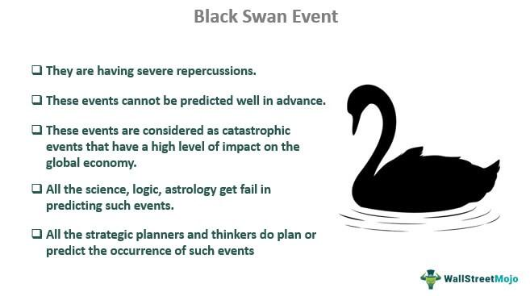

The global demographic landscape is witnessing a significant transformation as the 'grey wave'—a notable increase in the aging population—begins to exert substantial influence on economic and financial markets worldwide. This demographic shift is characterized by a rising proportion of elderly individuals, driven by increased life expectancy and declining birth rates in many countries. As a result, a growing segment of the population is transitioning into retirement, which has palpable effects on market behavior and overall economic dynamics.

Simultaneously, algorithmic trading, often referred to as algo trading, is redefining the frontier of investment strategies. Utilizing advanced algorithms and high-speed computing, algo trading enables the rapid execution of trades and enhances decision-making accuracy by analyzing vast datasets. This technological evolution facilitates not only increased market efficiency but also the reduction of transaction costs, offering a competitive edge to market participants.



This article aims to explore the intersection of these two transformative trends: the aging population and algorithmic trading, and how they jointly influence the financial markets. While demographic changes alter market behavior by shifting investment priorities and consumer spending patterns, algo trading offers the agility to adapt to these evolving market conditions, presenting both challenges and opportunities for investors and financial institutions.

Understanding these dynamics is crucial for stakeholders such as policymakers, financial institutions, and individual investors who seek to capitalize on future market conditions. By acknowledging the interplay between demographic shifts and technological advancements in trading, stakeholders can better position themselves to navigate the changing landscape of financial markets. This understanding not only aids in the development of strategic foresight but also in the creation of robust, adaptable, and inclusive financial systems capable of sustained growth.

## Table of Contents

## The Grey Wave: Demographic Trends and Impacts

The world's aging population presents significant challenges and opportunities for financial markets. A key aspect of this demographic shift is the increase in healthcare costs and the demand for sustainable pension systems. As life expectancy rises, governments and private sectors face mounting pressure to ensure that healthcare systems can sustain the growing elderly population. This translates to increased public and private expenditure on healthcare resources, creating an urgent need for innovative financing strategies.

Older populations often change consumption habits, reducing discretionary spending and increasing savings. This tendency stems from a need for financial security during retirement, as older individuals typically have a fixed income. Subsequently, economies experience shifts in spending patterns, impacting industries reliant on younger, more consumption-oriented demographics. Businesses and financial entities need to reassess their market strategies to accommodate this transition.

The financial sector must adapt its products and services to meet the evolving needs of older, risk-averse investors. Traditional financial instruments may not align with the preferences of these individuals, who often prioritize stability over high returns. As a result, there is a rising demand for financial products such as annuities and conservative investment vehicles that offer lower risks, predictable returns, and [liquidity](/wiki/liquidity-risk-premium) options.

As the proportion of elderly individuals rises, economic growth and market [volatility](/wiki/volatility-trading-strategies) are increasingly influenced by demographic dynamics. A growing elderly population can slow economic growth due to reduced labor force participation and productivity declines. Moreover, market volatility may intensify as older investors, who are generally more risk-averse, shift from equities to fixed-income securities, affecting capital allocation and market stability.

For financial markets to remain resilient, understanding and adapting to these demographic trends is essential. By developing products and services that cater to the specific needs of the aging population, financial institutions can maintain market stability and capitalize on emerging opportunities. Emphasizing innovation and inclusivity will ensure that financial systems are equipped to handle the challenges posed by the global "grey wave."

## Algo Trading: Revolutionizing Financial Markets

Algorithmic trading, commonly known as algo trading, utilizes cutting-edge algorithms for executing trades with remarkable speed and precision. This technological approach enhances market efficiency by reducing the time and cost associated with traditional trading methods. At its core, algo trading leverages advanced computing power to process vast datasets, allowing traders to make more informed decisions. By analyzing historical trends and real-time data, algorithms can optimize returns while minimizing associated risks.

One of the principal advantages of algo trading is its ability to handle complex calculations and execute trades faster than humanly possible. For example, algo trading can exploit opportunities in [arbitrage](/wiki/arbitrage), where slight price differences in different markets can be turned into profit. Programs are written to automatically initiate trades when these conditions are met, ensuring traders capitalize on fleeting opportunities without delay.

Nonetheless, the inherent high-speed nature and automation of algo trading introduce certain risks—such as system failures, which could lead to significant financial losses in a matter of seconds. Moreover, without adequate oversight, algorithms might be exploited for market manipulation, impacting market stability. Flash crashes, where the market plummets rapidly due to algorithmic errors or anomalies, have highlighted the need for stringent regulatory frameworks and advanced risk management strategies.

In today’s dynamically changing demographic context, particularly with the aging global population, integrating algo trading with these trends becomes crucial. Adapting algorithms to current market dynamics involves understanding the shifting behaviors of older populations, who might prioritize safer investments. Algorithms must incorporate variables and constraints that reflect these demographic preferences to better align with market supply and demand.

Regulatory measures and robust risk management frameworks are imperative to safeguard market integrity and ensure ethical practices in algo trading. Regulatory bodies need to establish guidelines that oversee the [algorithmic trading](/wiki/algorithmic-trading) environment, making provisions for situations of unexpected volatility or irregular trading patterns. Moreover, embedding ethical standards within algorithmic strategies ensures protection against manipulations and fosters trust in the financial system.

Advanced algorithmic methods such as [machine learning](/wiki/machine-learning) and [artificial intelligence](/wiki/ai-artificial-intelligence) are also being employed to continually enhance the efficacy and reliability of algo trading. This evolution requires continual adaptation by traders and regulatory mechanisms alike to harness the potential of these technologies, especially in light of demographic shifts impacting global markets.

## Challenges at the Intersection of Aging and Algo Trading

Demographic shifts, particularly the aging population, are influencing market dynamics in ways that increase volatility. As older individuals alter their investment strategies, often moving away from riskier assets to safer ones, this transition can lead to significant fluctuations in market behavior. This change mandates adaptability within algorithmic trading (algo trading) models, requiring these systems to recognize and respond to the more unpredictable nature of markets shaped by aging demographics.

One of the critical challenges in this context is the digital divide between older, generally less tech-savvy individuals and younger investors more accustomed to digital tools. This disparity poses accessibility challenges, potentially limiting the participation of older investors in modern financial markets dominated by sophisticated trading technologies. Financial institutions and technology developers must prioritize creating interfaces and tools that are more intuitive and easier for older generations to navigate.

Algo trading algorithms are designed to capitalize on speed and efficiency, but the aging demographic trend compels these algorithms to incorporate a balance between agility and risk aversion. Older investors typically have different priorities, such as stability and income generation, over high returns with considerable risk. Reflecting these preferences in algorithmic models is crucial. By doing so, trading systems can better meet the market's needs by tailoring strategies that are not only reactive but also preemptively structured around the shifting investment outlook of an aging population.

Integrating demographic data into trading algorithms is a promising approach to addressing these complex challenges. By leveraging big data analytics, financial institutions can gain insights into demographic trends and adjust their trading strategies accordingly. This integration could enhance market inclusivity, ensuring that the needs and preferences of an aging population are adequately reflected in market activities. Algorithms could be designed to incorporate demographic insights, leading to more personalized investment decisions and potentially driving greater participation from older age groups in algo trading environments.

Overall, addressing the intersection of aging populations and algorithmic trading involves a multi-faceted approach. It necessitates technological innovation, regulatory support, and market education to ensure that demographic shifts do not undermine market stability but instead provide opportunities for growth and inclusivity. By understanding and preparing for these shifts, stakeholders in the financial markets can help maintain resilience and foster sustainable economic development.

## Opportunities for Financial Markets and Investors

The aging population presents promising opportunities for financial markets and investors, as the demand for financial products tailored to older individuals, such as annuities and retirement plans, continues to grow. These preferences require innovative approaches to portfolio management and investment strategy.

Algorithmic trading (algo trading) plays a pivotal role in this context by enabling the creation of customized portfolios that align with the risk profiles of older investors. Traditional investment strategies often rely heavily on equities and other high-risk assets, which may not suit the preferences of a risk-averse, aging demographic. Algo trading can optimize asset allocation by using algorithms that consider factors such as expected returns, volatility, and demographic shifts. For example, a Python-based algorithm might evaluate historical returns and predict future performance, adjusting portfolios dynamically to mitigate risk for elderly investors:

```python
import numpy as np

# Sample data for historical returns and covariances
returns = np.array([0.05, 0.03, 0.04])  # Expected returns for assets
cov_matrix = np.array([[0.1, 0.02, 0.03], [0.02, 0.08, 0.01], [0.03, 0.01, 0.12]])  # Covariance matrix

# Portfolio optimization to match risk profiles
weights = np.linalg.inv(cov_matrix).dot(returns) / np.dot(np.linalg.inv(cov_matrix).dot(returns), returns)
weights /= weights.sum()

print("Optimized weights:", weights)
```

Further, collaboration between technology companies and financial institutions promises innovative solutions for inclusive financial services, ensuring broader accessibility and adaptability to the evolving financial landscape. This collaboration can drive the development of platforms tailored to the needs of older investors, offering user-friendly interfaces and personalized advice.

Demographic-driven investment strategies are vital for capturing the changing consumption patterns and sustainability priorities of older populations. As the elderly become more environmentally and socially conscious, integrating Environmental, Social, and Governance ([ESG](/wiki/esg-investing)) factors into algo trading models can meet this growing demand for socially responsible investments. This integration can help asset managers align their strategies with broader societal values, potentially enhancing long-term investment performance.

Algorithmic trading can incorporate ESG criteria by scoring assets based on established metrics and adjusting portfolios to favor those meeting desired thresholds. The potential utility of this approach lies not only in enhancing investor satisfaction but also in contributing to sustainable economic growth.

In summary, the convergence of an aging population and advancements in algo trading offers a fertile ground for developing products and strategies that cater to the unique needs of older investors, ultimately contributing to a more inclusive and resilient financial market.

## Future Outlook: Navigating Challenges and Opportunities

The future landscape of financial markets is significantly influenced by the convergence of aging demographics and algorithmic trading (algo trading). This intersection necessitates the development of robust regulatory frameworks to keep pace with rapid technological advancements. Given the increasing reliance on digital platforms for trade execution, it is imperative to create policies that ensure market stability, protect investors, and prevent systemic risks associated with algorithmic processes.

To fully integrate aging populations into digital financial markets, education and digital literacy programs should be prioritized. Programs targeting older adults can facilitate their understanding and participation in increasingly complex financial ecosystems. By enhancing digital skills, these programs can empower senior citizens to manage investments effectively, avoid fraud, and improve their overall financial well-being.

Investment in technology infrastructure is another critical component. As financial markets continue to evolve, ensuring the resilience and inclusivity of these systems is crucial. Upgraded infrastructure can support higher data transaction volumes, improve cybersecurity, and provide reliable access even in the face of significant market shifts. This kind of robustness in infrastructure is key to maintaining investor confidence and market integrity.

Strategic planning and foresight are essential in aligning algo trading practices with demographic trends. Such planning involves adjusting trading algorithms to account for shifts in market behavior driven by an aging investor base. This requires ongoing analysis and adjustment to ensure that financial products meet the evolving risk appetites and investment goals of older adults. By leveraging demographic insights, financial institutions can tailor their offerings to better serve this growing market segment.

Finally, the future success of navigating these challenges lies in collaborative efforts among a variety of stakeholders. Financial institutions, technology firms, policymakers, and educational organizations must work together to create innovative solutions that address the needs of an aging population. By fostering partnerships and sharing insights, stakeholders can produce sustainable economic growth while promoting inclusivity within the financial markets.

Through these comprehensive actions—regulatory development, digital education, technological investment, strategic planning, and collaborative efforts— we can effectively navigate the convergence of aging demographics and algo trading, capitalizing on the opportunities it presents for a more resilient financial future.

## Conclusion

An aging population and the rise of algorithmic trading significantly impact the financial sector, posing both challenges and potential benefits. Strategic foresight and adaptability are essential tools for financial professionals to address the evolving requirements of aging investors within a technologically advancing marketplace. As shifting demographics influence how markets behave and how investors choose their strategies, algorithmic trading models must evolve to integrate these demographic realities.

Innovation and inclusivity are cornerstones for maintaining resilient financial markets capable of sustainable growth. By incorporating demographic data into algorithmic models and embracing emerging technologies, the financial sector can develop products and services that meet the unique demands of older investors. Such adaptiveness would facilitate the creation of tailored portfolios that resonate with the risk-averse nature of aging investors, balancing agility with conservative investment preferences.

Stakeholders who understand these dynamics will be well-positioned to navigate the shifting financial landscape. They can seize emerging opportunities by developing cohesive strategies that align algorithmic trading with demographic shifts, thereby ensuring that financial markets remain robust and inclusive. By doing so, the financial sector can achieve a delicate balance between embracing technological innovation and catering to the evolving needs of an aging population, ultimately supporting sustainable economic growth.

## References & Further Reading

[1]: ["The Retreat of Global Democracy Stopped in 2020, but the Pandemic Made It Sick"](https://www.politico.eu/article/democracy-in-retreat-globally-report-warns/) by Freedom House.

[2]: Pring, M. J. (2002). ["Technical Analysis Explained"](https://www.amazon.com/Technical-Analysis-Explained-Fifth-Successful/dp/0071825177). McGraw Hill Professional.

[3]: Vecchiato, R., & Roveda, C. (2010). ["Strategic foresight in corporate organizations: Handling the effect and response uncertainty of technology and social drivers of change."](https://www.sciencedirect.com/science/article/abs/pii/S0040162509002091) Technological Forecasting and Social Change.

[4]: Brown, J. R., & Immervoll, H. (2017). ["Flexible retirement in a globalising world: An overview."](https://onlinelibrary.wiley.com/doi/10.1111/ijmr.12152) Journal of Social Policy, 46(4).

[5]: Griffin, J. M., & Shams, A. (2018). ["Manipulation in the VIX?"](https://papers.ssrn.com/sol3/papers.cfm?abstract_id=2972979) Review of Financial Studies, 31(4).