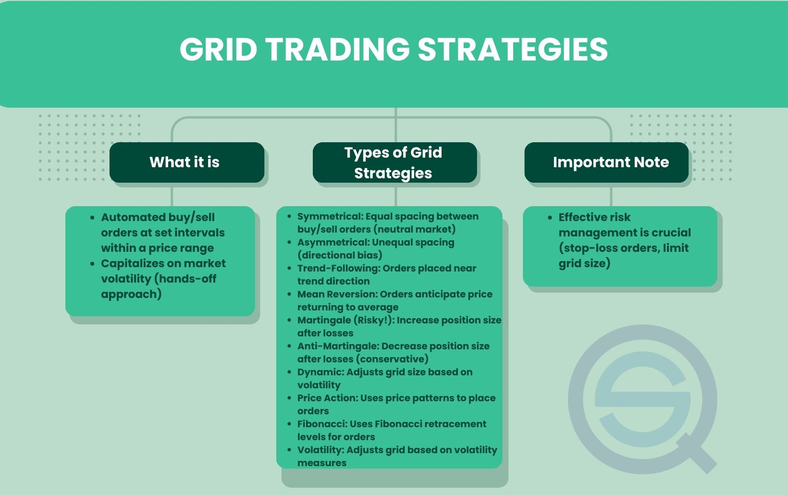

In the world of finance trading, strategies are critical for capturing market opportunities, while simultaneously managing risk. Grid trading is one such strategy that is widely used in finance markets, including forex and crypto markets. As an algorithm-based strategy, grid trading capitalizes on market volatility by systematically placing buy and sell orders at set intervals, both above and below a chosen base price. This approach forms a 'grid' pattern, facilitating profits from market fluctuations without relying on predictions about market direction.

Grid trading is particularly appealing due to its versatility and potential for automation, allowing traders with varying levels of experience to implement it effectively. The strategy thrives in volatile environments, offering structured methods for positioning trades in both trending and ranging market conditions. As such, it is crucial to understand grid trading's structural components, the benefits and limitations it presents, and the options for automating the process.



This article aims to provide a comprehensive overview of grid trading as a financial trading strategy. We will explore its structure, the advantages and disadvantages it carries, and the various ways in which it can be automated for enhanced efficiency. By the end of this article, you will gain insights into how grid trading can be applied and optimized to suit different market scenarios, equipping you with the knowledge necessary to leverage its potential in achieving financial trading goals.

## Table of Contents

## What is Grid Trading?

Grid trading is a financial market strategy designed to exploit price volatility through systematic placement of buy and sell orders at predetermined intervals. This technique generates a grid structure, with each order strategically positioned above and below a base price, facilitating profit opportunities amid both rising and falling market conditions.

The essence of grid trading lies in its capacity to capitalize on market fluctuations rather than relying on precise predictions of market direction. By establishing a framework where orders are automatically triggered when price levels intersect with grid points, traders can benefit from natural market oscillations. This approach presumes that prices tend to fluctuate within a certain range, even when trending, allowing for consistent profit opportunities as each grid level is triggered.

In practical terms, grid trading involves placing buy orders at regular intervals below a base price and sell orders at regular intervals above it. For instance, if a base price is set at $100 and grid steps are defined at $5 increments, buy orders would be placed at $95, $90, $85, etc., while sell orders would be positioned at $105, $110, $115, etc. The effectiveness of this strategy depends on calibrating grid spacing to match market dynamics, thereby optimizing the likelihood of order execution and subsequent profitability.

The adaptability of grid trading makes it applicable in both trending and ranging markets. In ranging markets, the strategy profits from frequent price reversals, whereas in trending markets, careful management of grid levels and risk controls can mitigate potential drawdowns caused by sustained price movements in a single direction.

Overall, grid trading provides a probabilistic framework for engaging with financial markets, leveraging market movements to systematically capture profits without the necessity for directional forecasts. This characteristic makes it an attractive strategy for traders seeking to automate their trading processes and reduce reliance on market predictions.

## How Grid Trading Works

A grid trading strategy entails setting buy and sell orders at predefined intervals around a chosen base price, known as grid steps. The successful execution of this strategy begins with selecting a price range within which the trader expects the asset to fluctuate. This range, along with the chosen grid size, determines both the number of grid levels and the spacing between the orders.

The core concept of grid trading relies on predefined price levels where actions are triggered as market prices reach certain thresholds. A trader defines the grid size as either fixed or variable, placing buy orders at intervals below and sell orders above the base price. These intervals can be equidistant or strategically set to adapt to changing market conditions. For example, a trader might set a grid with a base price of $100, with buy and sell orders placed at every $10 increment. This would create buy orders at $90, $80, $70, etc., and sell orders at $110, $120, $130, etc.

Execution is often enhanced by incorporating buy and sell stops, where orders are activated only once the market hits specified price levels, thus capitalizing on dynamic market movements. For instance, a buy stop order might be placed above the current market price, becoming active and converted into a market order if the price rises to that level. Conversely, a sell stop order might be placed below the current market price.

Automation significantly boosts the efficacy of grid trading strategies, mitigating human error and enabling rapid response times. By automating trade executions, traders eliminate emotional biases and human handling errors. Trading platforms like MetaTrader or [algorithmic trading](/wiki/algorithmic-trading) tools such as Python-based bots facilitate automated trading, where scripts execute defined rules without manual intervention.

A simple Python script illustrating an automated grid trading setup might look like this:

```python
def grid_trading(base_price, grid_size, num_levels):
    buy_prices = [base_price - i * grid_size for i in range(1, num_levels + 1)]
    sell_prices = [base_price + i * grid_size for i in range(1, num_levels + 1)]

    for price in buy_prices:
        print(f"Place buy order at {price}")

    for price in sell_prices:
        print(f"Place sell order at {price}")

# Example usage
grid_trading(base_price=100, grid_size=10, num_levels=3)
```

This script demonstrates setting up a grid with a base price, grid size, and number of levels, automatically positioning buy and sell orders at the calculated intervals. Despite the automated nature of this strategy, consistent monitoring remains crucial to adapt to evolving market conditions and optimize trade performance.

## Pros and Cons of Grid Trading

Grid trading offers several advantages for traders looking to capitalize on market [volatility](/wiki/volatility-trading-strategies). One of the primary pros of this strategy is its ability to automate trades. Automation allows for the execution of predefined trading rules without the need for constant human intervention, making it easier to manage multiple trades simultaneously. This is particularly beneficial in fast-moving markets where manual order execution can lead to significant delays and missed opportunities.

Another advantage is the minimization of directional bias. Grid trading does not require accurate market predictions regarding whether the price will rise or fall. Instead, it focuses on capturing profits from market fluctuations, making it accessible to traders with varying levels of experience. This feature of grid trading ensures that even those who are not skilled in predicting market directions can participate effectively.

Grid trading also takes advantage of market volatility. By placing buy and sell orders at predefined intervals, traders create a grid that can capture profits from price movements within a defined range. This approach is particularly useful in markets where prices frequently oscillate, allowing traders to earn profits as the price moves up and down.

Despite its benefits, grid trading has its drawbacks. One of the main challenges is its complexity, especially when applied in strong trending markets. In such environments, the strategy could result in significant losses if not carefully monitored. Since the grid is designed to profit from fluctuating prices, a persistent trend in one direction can lead to a continuous series of losses, as orders on the opposite side of the trend accumulate without being offset by profits.

To mitigate these risks, effective risk management measures are crucial. Implementing stop-loss orders is one way traders can protect themselves from large drawdowns. These orders automatically close a position once the price reaches a certain level, limiting potential losses. Additionally, constant monitoring and adjusting of grid parameters, such as grid size and the distance between grid levels, can help adapt the strategy to current market conditions and reduce exposure to adverse price movements.

In summary, while grid trading provides a systematic and automated approach to capturing market volatility, it requires careful implementation and diligent risk management to safeguard against potential losses, particularly in strongly trending markets.

## Grid Trading Strategy Variations

Grid trading offers various strategy variations that cater to different market conditions and trader goals. Understanding these variations can help traders tailor their approach to maximize profitability while managing risks effectively.

Symmetrical grids represent one common strategy variation, characterized by equal spacing and position sizing for both buy and sell orders. This approach is particularly effective in volatile, range-bound markets where prices oscillate within a set range. The idea is to take advantage of the repeated price reversals within the boundaries of the grid, capturing incremental gains as the market moves back and forth:

$$
P_n = P_0 + n \cdot \Delta P
$$

Where $P_0$ is the base price, $\Delta P$ is the grid interval, and $n$ is the integer representing the grid level.

Asymmetrical grids, on the other hand, employ uneven spacing and/or position sizing for buy and sell orders. This modification can help traders adapt to markets with directional bias or asymmetrical volatility, allowing for flexibility in grid design to capture more potential profit on the dominant side of the market.

Trend-following grids are designed to capitalize on emerging trends by gradually scaling into positions as the price continues in one direction. This strategy reduces the need for timing perfect entries and instead builds a position as the trend strengthens, often using tighter spacing and larger orders in the direction of the trend.

Mean reversion grids, conversely, are deployed to profit when prices revert to their long-term average or mean after deviations. This involves setting grid levels that anticipate price corrections, allowing traders to sell when prices are perceived as high and buy when they are perceived as low, thus exploiting pattern-based reversals.

Each of these grid trading strategy variations can be fine-tuned with parameters like step size, position size, and leverage to fit specific market scenarios and trader risk profiles. By selecting the appropriate grid strategy, traders can effectively align their trading activities with market conditions, enhancing their potential for consistent returns.

## Automation of Grid Trading

Automating a grid trading strategy involves employing algorithmic trading tools that execute trades based on predetermined rules without manual intervention. This automation enhances operational efficiency by swiftly executing orders according to pre-set market conditions. It also mitigates emotional biases, which often affect manual trading decisions. Traders can achieve higher trading frequencies as the system continuously monitors market dynamics and performs trades at optimal moments.

Trading platforms like MetaTrader and specialized custom trading bots are commonly used for implementing automated grid trading systems. MetaTrader, for instance, permits the use of Expert Advisors (EAs), specific algorithms that can manage multiple trades and adjust parameters as per the grid strategy. Alternatively, traders may opt to develop custom trading bots using programming languages such as Python. These bots can utilize libraries like ccxt for interacting with [cryptocurrency](/wiki/cryptocurrency) exchanges, enabling a high degree of customization and automation.

Here is a simple example of how one might start setting up an automated grid trading bot in Python:

```python
import ccxt

def setup_grid_trading(api_key, secret, symbol, base_price, grid_size, interval):
    exchange = ccxt.binance({
        'apiKey': api_key,
        'secret': secret,
    })

    grid_orders = []
    for i in range(-grid_size, grid_size + 1):
        price = base_price + i * interval
        if i < 0:
            # Place buy order
            grid_orders.append(exchange.create_limit_buy_order(symbol, 1, price))
        elif i > 0:
            # Place sell order
            grid_orders.append(exchange.create_limit_sell_order(symbol, 1, price))
    return grid_orders

# Example call to setup function:
# setup_grid_trading('your_api_key', 'your_secret', 'BTC/USDT', 50000, 5, 1000)
```

While automation provides numerous advantages, consistent monitoring remains crucial. Market conditions can change rapidly, and a rigid application of predefined rules without adjustment could lead to suboptimal trading outcomes. Traders must be vigilant in reviewing their strategies and making necessary alterations to accommodate evolving market dynamics, ensuring that grid spacing and position sizes remain aligned with current market conditions. This balance allows traders to leverage the benefits of automation while maintaining the flexibility needed to respond to market changes effectively.

## Risk Management in Grid Trading

Risk management is pivotal in grid trading strategies to protect against unforeseen losses. An essential aspect involves aligning stop-loss and take-profit levels within the grid setups. This alignment helps control risk exposure by automatically closing positions when the market moves favorably or unfavorably, thereby limiting potential losses or securing profits without the need for manual intervention.

Stop-loss orders are crucial for preventing excessive drawdowns. When determining the placement of a stop-loss, traders typically consider the volatility of the asset and its historical price behavior. A well-placed stop-loss ensures that losses on individual trades remain manageable and proportionate to the trader's overall risk tolerance. In grid trading, where multiple positions operate simultaneously, stop-loss orders can be systematically set at logical intervals, linked to the grid’s architecture.

Take-profit levels function similarly, allowing traders to [exit](/wiki/exit-strategy) positions once specific profitability targets are met. These levels should be carefully calibrated to ensure they align with the strategy's risk-reward ratio and the trader’s financial goals. For instance, setting take-profit orders at points where the market has shown prior resistance or support can be an effective method for capitalizing on predictable price reversals or breakouts.

Successfully managing leverage is another critical component of risk management within grid trading. Excessive leverage can lead to amplified gains but also significantly increases the risk of substantial losses. Therefore, traders should employ leverage cautiously, proportionate to their capital size and risk appetite. To mitigate risks, many professionals recommend using only a fraction of the available leverage, thereby maintaining a buffer against sharp market fluctuations.

Regularly reviewing market positions and performance metrics is essential for maintaining an optimized grid trading strategy. By analyzing the performance of existing trades, traders can identify patterns, errors, or inefficiencies in their approach. Adjustments to position sizes and the spacing of the grid can be made based on these observations. For instance, if a particular grid interval is consistently yielding poor results, it may require modification in terms of spacing or the size of positions taken at those levels.

In practice, this dynamic adjustment process can be facilitated through algorithmic tools or trading software capable of analyzing large data sets and providing insights into optimal strategy configurations. By continuously refining the grid setup, traders can enhance their strategy’s resilience against market volatility and improve overall profitability.

In summary, effective risk management in grid trading encompasses the strategic placement of stop-loss and take-profit levels, prudent leverage usage, and systematic evaluation of trading performance. These practices collectively work to safeguard traders from significant risks and foster the potential for achieving sustainable returns.

## Conclusion

Grid trading offers a flexible and methodical approach for traders aiming to capitalize on market volatility. By structuring a grid of buy and sell orders, traders can systematically engage with the market, capitalizing on price fluctuations without heavily relying on precise market predictions. When market conditions align with the grid strategy—typically, when the market exhibits significant volatility—this method can yield substantial returns. These setups can excel in scenarios where prices move back and forth within the defined grid range, allowing traders to profit from each oscillation.

Despite its potential, grid trading demands attentive risk management and continuous performance evaluation to attain lasting success. The built-in complexity of the strategy necessitates vigilance; neglecting market trends and unexpected shifts in volatility can expose traders to significant drawdowns. To offset potential risks, stringent implementation of stop-loss orders, prudent leverage utilization, and regular assessment of trading performance are indispensable. This approach ensures that any adverse market movement can be mitigated, and positions are dynamically adjusted to sustain or enhance profitability.

Choosing between manual execution or automation of grid trading depends on the trader's preference and expertise. Automation, typically achieved through trading platforms or custom-developed bots, can enhance the grid strategy by eliminating human emotional biases and enabling a [high frequency](/wiki/high-frequency-trading) of trades. Nevertheless, whether employing manual or automated methods, a comprehensive understanding of the mechanics and variations of grid trading is imperative. Grasping the intricacies of different grid setups—be it symmetrical, asymmetrical, trend-following, or mean-reversion grids—empowers traders to adapt strategies to different market environments optimally, unlocking the full potential of grid trading in the financial markets.

## References & Further Reading

[1]: ["Grid Trading Strategy: Step by Step Complete Guide."](https://learnpriceaction.com/grid-trading-strategy/) CurrencyPairs.com

[2]: ["Building Reliable Trading Algorithms: A Guide to Developing Robust Strategies."](https://www.wiley.com/en-us/Building+Reliable+Trading+Systems%3A+Tradable+Strategies+That+Perform+As+They+Backtest+and+Meet+Your+Risk-Reward+Goals-p-9781118528747) Journal of Trading

[3]: ["MetaTrader 4 Programming for Automated Trading Projects"](https://www.metatrader4.com/en/automated-trading) by Andrew R. Young

[4]: Kane, D. (2017). ["Exploring the Benefits and Risks of Automated Trading in Financial Markets."](https://www.mdpi.com/1911-8074/16/10/434) CFA Institute Financial Analysts Journal

[5]: Elder, A. (2002). ["Trading for a Living: Psychology, Trading Tactics, Money Management."](https://www.amazon.com/Trading-Living-Psychology-Tactics-Management/dp/0471592242) John Wiley & Sons Inc.