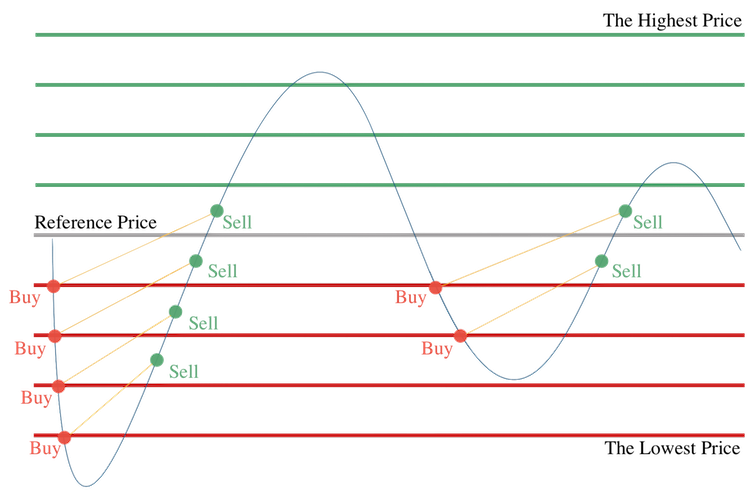

## Table of Contents

## What is grid trading in finance?

Grid trading is a trading strategy used in finance where you set up a series of buy and sell orders at different price levels. Imagine drawing a grid on a price chart; each line on the grid represents a price where you want to buy or sell. The idea is to make small profits from the price moving up and down within a range. For example, if the price goes up, you sell at a higher price, and if it goes down, you buy at a lower price. This way, you can make money no matter which way the price moves, as long as it stays within your grid.

This strategy is popular among traders who believe that the market will move sideways, meaning it won't go up or down a lot but will stay within a certain range. Grid trading can be automated, which means a computer program can place the buy and sell orders for you. However, it's important to set the grid correctly and monitor it because if the market moves outside your grid, you could lose money. It's a bit like playing a game where you need to adjust your strategy based on how the market behaves.

## How does grid trading work?

Grid trading is a way to trade where you set up a bunch of buy and sell orders at different prices. Imagine you draw lines on a price chart, and each line is where you want to buy or sell. The goal is to make small profits as the price goes up and down within these lines. For example, if the price goes up, you sell at a higher price, and if it goes down, you buy at a lower price. This way, you can make money no matter if the price goes up or down, as long as it stays within your lines.

This strategy works best when the market moves sideways, meaning it doesn't go up or down a lot but stays within a certain range. You can use a computer program to do grid trading for you, which makes it easier because the program can place the buy and sell orders automatically. But you need to be careful and set up the grid right. If the market moves outside your grid, you might lose money. So, it's important to keep an eye on it and adjust your strategy if needed.

## What are the basic components of a grid trading strategy?

Grid trading is all about setting up a bunch of buy and sell orders at different prices. Imagine you draw lines on a price chart, and each line is where you want to buy or sell. The space between these lines is called the grid interval, and it's really important because it decides how much you can make or lose. You also need to pick the highest and lowest prices for your grid, which are called the upper and lower bounds. These bounds are like the edges of your playing field, and you want the price to stay within them.

Once you have your grid set up, you place buy orders at the lower prices and sell orders at the higher prices. When the price goes up and hits one of your sell orders, you make a little profit. When it goes down and hits one of your buy orders, you buy at a lower price, hoping to sell it later at a higher price. The key is to keep making these small trades and profits as the price moves up and down within your grid. But you need to watch out because if the price moves outside your grid, you might lose money. So, it's important to keep an eye on things and be ready to adjust your grid if the market changes.

## What are the advantages of using grid trading?

Grid trading can be a good way to make money when the market is moving up and down but not going too far in one direction. It lets you make small profits from these little movements. You set up buy and sell orders at different prices, and as the price moves, you can make money from both buying low and selling high within your grid. This can be especially helpful if you believe the market will stay within a certain range, because you can keep making small profits over and over again.

Another advantage is that grid trading can be automated. This means you can use a computer program to set up and manage your trades for you. This can save you a lot of time and effort, because the program will place the buy and sell orders automatically based on your grid. It also helps you stay disciplined and stick to your strategy, because the computer will follow your plan without getting emotional or making mistakes.

## What are the potential risks associated with grid trading?

Grid trading can be risky if the market moves a lot outside of your grid. If the price goes above your highest sell order or below your lowest buy order, you could lose money. This is because you might end up buying at a high price and then the price keeps falling, or selling at a low price and then the price keeps rising. It's important to set your grid carefully and watch the market closely so you can adjust your grid if the market changes a lot.

Another risk is that grid trading can lead to overtrading. Because you're making lots of small trades, you might end up paying a lot in trading fees and commissions. These costs can add up and eat into your profits, making it harder to make money. It's important to think about these costs when you're setting up your grid and deciding how often to trade.

Lastly, grid trading relies on the market staying within a certain range. If the market starts trending strongly in one direction, your grid strategy might not work well. You could miss out on big profits if the market moves a lot in one direction, because your grid is set up to make money from small ups and downs. So, it's important to know when to switch to a different trading strategy if the market conditions change.

## How can a beginner set up a simple grid trading system?

To set up a simple grid trading system, you first need to choose a trading platform that supports grid trading. Many platforms offer this feature and even have tools to help you set it up automatically. Once you have picked your platform, you need to decide on the price range for your grid. This means choosing the highest price (upper bound) and the lowest price (lower bound) where you want to trade. For example, if you're trading a stock that usually moves between $50 and $60, you might set your upper bound at $60 and your lower bound at $50.

Next, you need to decide on the grid interval, which is the space between each buy and sell order. If you want to make small trades, you might set a smaller interval, like $1. So, you would place buy orders at $50, $51, $52, and so on, up to $59, and sell orders at $51, $52, $53, and so on, up to $60. Once your grid is set up, you can let the platform place the orders automatically. Remember to keep an eye on the market, because if the price moves outside your grid, you might need to adjust your strategy to avoid losing money.

## What markets are most suitable for grid trading?

Grid trading works best in markets that move up and down but stay within a certain range. This means it's good for markets that don't have big, sudden changes in price. For example, [forex](/wiki/forex-system) markets, where currencies are traded, can be good for grid trading because they often move sideways. Stocks that are stable and don't change a lot in price can also be good choices. The key is to find a market where the price stays within your grid, so you can keep making small profits from the little ups and downs.

Another market that can be suitable for grid trading is the [cryptocurrency](/wiki/cryptocurrency) market, but you need to be careful. Cryptocurrencies can be very volatile, meaning their prices can change a lot and quickly. If you choose a cryptocurrency that usually stays within a certain range, grid trading can work well. But if the price moves outside your grid, you could lose money. So, it's important to pick the right cryptocurrency and keep an eye on the market to make sure your grid is still working.

## How do you adjust grid trading parameters for different market conditions?

When the market is moving up and down but staying within a certain range, you can set up your grid with a smaller interval between buy and sell orders. This helps you make small profits from these little movements. For example, if the price of a stock usually moves between $50 and $60, you might set your grid to buy at $50, $51, $52, and so on, and sell at $51, $52, $53, and so on. This way, you can make money from the small ups and downs within that range.

If the market starts to trend strongly in one direction, you need to adjust your grid. If the price is going up a lot, you might want to move your upper bound higher and make the grid interval bigger. This way, you can still make money as the price keeps rising. On the other hand, if the price is going down a lot, you should move your lower bound lower and also make the grid interval bigger. This helps you avoid losing money if the price keeps falling outside your original grid. Always keep an eye on the market and be ready to change your grid to match the new conditions.

## What advanced techniques can enhance a grid trading strategy?

One advanced technique to enhance a grid trading strategy is to use dynamic grids. Instead of keeping your grid fixed, you can adjust it based on how the market is moving. For example, if the market starts trending up, you can move your upper bound higher and make the grid intervals bigger. This way, you can keep making money as the price rises. On the other hand, if the market starts going down, you can move your lower bound lower and also make the grid intervals bigger. This helps you avoid big losses if the price falls outside your original grid. By using a dynamic grid, you can adapt to changing market conditions and improve your chances of making a profit.

Another technique is to combine grid trading with other trading strategies, like [trend following](/wiki/trend-following) or [breakout](/wiki/breakout-trading) trading. For example, you can use grid trading when the market is moving sideways, but switch to a trend-following strategy if the market starts to move strongly in one direction. This way, you can take advantage of both small price movements and bigger trends. You can also use technical indicators, like moving averages or the Relative Strength Index (RSI), to help you decide when to adjust your grid or switch strategies. By combining different strategies, you can make your trading more flexible and potentially increase your profits.

## How does grid trading compare to other trading strategies like trend following or mean reversion?

Grid trading is different from other trading strategies like trend following and mean reversion. Grid trading works best when the market is moving up and down but staying within a certain range. You set up a bunch of buy and sell orders at different prices, and you make small profits from these little movements. This strategy is good for markets that don't change a lot, like some forex markets or stable stocks. But if the market moves a lot outside your grid, you could lose money. So, you need to watch the market and be ready to adjust your grid if things change.

Trend following is another strategy, but it's different because it tries to make money from big moves in one direction. Instead of setting up a grid, you look for signs that the market is starting to trend up or down, and then you buy or sell to follow that trend. This can be good for markets that are moving a lot, like some cryptocurrencies or stocks during big news events. But if the market doesn't move as expected, you could lose money. So, you need to be good at spotting trends and knowing when to get in and out of trades.

Mean reversion is another strategy that's different from grid trading. With mean reversion, you believe that prices will go back to their average after moving away from it. You buy when the price is low and sell when it's high, expecting it to come back to the middle. This can work well in markets that have clear patterns of moving away from and then back to their average price. But if the price keeps moving away from the average, you could lose money. So, you need to be good at figuring out when the price is likely to revert and when it might keep moving.

## What are some common mistakes to avoid in grid trading?

One common mistake in grid trading is not adjusting the grid when the market changes. If the market starts moving a lot outside your grid, you could lose money. It's important to keep an eye on the market and be ready to move your upper and lower bounds or change the space between your buy and sell orders. Another mistake is setting the grid interval too small. If your buy and sell orders are too close together, you might end up making a lot of trades and paying a lot in fees and commissions. This can eat into your profits and make it harder to make money.

Another mistake is not considering the costs of trading. Grid trading can lead to overtrading because you're making lots of small trades. These costs can add up and make it harder to make a profit. It's important to think about these costs when you're setting up your grid and deciding how often to trade. Also, some people forget to combine grid trading with other strategies. Using grid trading all the time, even when the market is trending strongly, can lead to missed opportunities. It's good to switch to other strategies like trend following or mean reversion when the market conditions change.

## How can one backtest and optimize a grid trading strategy?

To backtest a grid trading strategy, you need to use a computer program that lets you see how your strategy would have worked in the past. You can set up your grid with different upper and lower bounds and different intervals between buy and sell orders. Then, you run the program with old market data to see if your strategy would have made money. This helps you figure out what works best and what doesn't. You might find that certain grid intervals or price ranges work better for certain markets. By trying different settings, you can learn how to set up your grid to make the most profit.

After [backtesting](/wiki/backtesting), you can optimize your grid trading strategy. This means making small changes to see if you can make more money. You might try different grid intervals or move your upper and lower bounds to see if it helps. You can also test your strategy in different market conditions to see how it holds up. For example, you might find that your grid works well in a stable market but not so well when the market is moving a lot. By tweaking your strategy based on what you learn from backtesting, you can make it better and increase your chances of making a profit.

## What are the variations of the Grid Trading Strategy?

Grid trading offers various strategy variations that cater to different market conditions and trader goals. Understanding these variations can help traders tailor their approach to maximize profitability while managing risks effectively.

Symmetrical grids represent one common strategy variation, characterized by equal spacing and position sizing for both buy and sell orders. This approach is particularly effective in volatile, range-bound markets where prices oscillate within a set range. The idea is to take advantage of the repeated price reversals within the boundaries of the grid, capturing incremental gains as the market moves back and forth:

$$
P_n = P_0 + n \cdot \Delta P
$$

Where $P_0$ is the base price, $\Delta P$ is the grid interval, and $n$ is the integer representing the grid level.

Asymmetrical grids, on the other hand, employ uneven spacing and/or position sizing for buy and sell orders. This modification can help traders adapt to markets with directional bias or asymmetrical [volatility](/wiki/volatility-trading-strategies), allowing for flexibility in grid design to capture more potential profit on the dominant side of the market.

Trend-following grids are designed to capitalize on emerging trends by gradually scaling into positions as the price continues in one direction. This strategy reduces the need for timing perfect entries and instead builds a position as the trend strengthens, often using tighter spacing and larger orders in the direction of the trend.

Mean reversion grids, conversely, are deployed to profit when prices revert to their long-term average or mean after deviations. This involves setting grid levels that anticipate price corrections, allowing traders to sell when prices are perceived as high and buy when they are perceived as low, thus exploiting pattern-based reversals.

Each of these grid trading strategy variations can be fine-tuned with parameters like step size, position size, and leverage to fit specific market scenarios and trader risk profiles. By selecting the appropriate grid strategy, traders can effectively align their trading activities with market conditions, enhancing their potential for consistent returns.

## References & Further Reading

[1]: ["Grid Trading Strategy: Step by Step Complete Guide."](https://learnpriceaction.com/grid-trading-strategy/) CurrencyPairs.com

[2]: ["Building Reliable Trading Algorithms: A Guide to Developing Robust Strategies."](https://www.wiley.com/en-us/Building+Reliable+Trading+Systems%3A+Tradable+Strategies+That+Perform+As+They+Backtest+and+Meet+Your+Risk-Reward+Goals-p-9781118528747) Journal of Trading

[3]: ["MetaTrader 4 Programming for Automated Trading Projects"](https://www.metatrader4.com/en/automated-trading) by Andrew R. Young

[4]: Kane, D. (2017). ["Exploring the Benefits and Risks of Automated Trading in Financial Markets."](https://www.mdpi.com/1911-8074/16/10/434) CFA Institute Financial Analysts Journal

[5]: Elder, A. (2002). ["Trading for a Living: Psychology, Trading Tactics, Money Management."](https://www.amazon.com/Trading-Living-Psychology-Tactics-Management/dp/0471592242) John Wiley & Sons Inc.