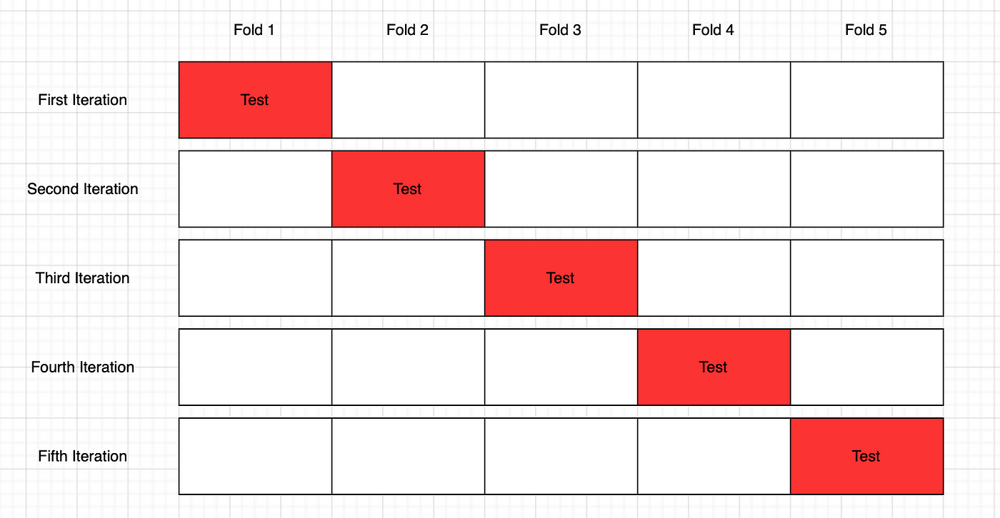

In the rapidly evolving field of algorithmic trading, optimizing trading strategies is a critical factor for achieving and maintaining a competitive edge. As technology and financial markets grow increasingly sophisticated, traders and institutions must constantly refine their methodologies to outperform competitors. One of the most effective ways to enhance the performance of trading algorithms is through cross-validation techniques. These statistical methods allow traders to assess the robustness and reliability of their strategies when subjected to unseen data, thereby minimizing the risk of overfitting and ensuring greater predictive accuracy.

This article focuses specifically on the role of gridsearch cross-validation in algorithmic trading. Gridsearch cross-validation serves as an essential tool for hyperparameter optimization, which involves fine-tuning the parameters of a model to achieve the best possible performance. Unlike traditional parameter tuning methods that can be arbitrary or based on trial-and-error, grid search methodically evaluates a predefined parameter space to identify the optimal set of parameters. This systematic approach enables traders to optimize their algorithms more efficiently and effectively, ultimately leading to more robust trading strategies.



Cross-validation strategies play a significant role in this optimization process, validating the performance of models on different data subsets to avoid any bias towards a particular portion of data. The significance of grid search in this context cannot be understated, as it integrates cross-validation into the parameter tuning process. This ensures that the evaluation is comprehensive and that the model's performance is tested rigorously across various potential scenarios.

We will explore various cross-validation strategies tailored for algorithmic trading, elucidate the benefits and fundamentals of grid search, and examine its practical applications in trading. By understanding these concepts, traders can better leverage gridsearch cross-validation to enhance their trading strategy outcomes.

## Table of Contents

## Understanding Cross-Validation in Algorithmic Trading

Cross-validation is a fundamental statistical technique used to assess a model's predictive performance on unseen data, crucial for preventing overfitting and ensuring model generalizability. In [algorithmic trading](/wiki/algorithmic-trading), it serves a similar purpose but focuses on evaluating trading strategies for robustness before deployment in live markets. Given the financial stakes involved, a rigorous evaluation through cross-validation can mean the difference between profitable strategies and significant financial losses.

Traditional k-fold cross-validation, while effective for independent and identically distributed data, falls short for time series data commonly encountered in trading. This is because time series data are sequential, and using traditional k-fold methods could lead to training the model on future data, violating the time-order principle critical in financial contexts.

**Adapted Cross-Validation Strategies:**

1. **Time Series Split:**

   This method maintains the temporal order of data, splitting the dataset into training and validation sets without shuffling. Suppose we have data points $X_1, X_2, ..., X_T$. Time Series Split utilizes the first $t_1$ data points for training and the subsequent $t_2 - t_1$ for testing. It then iteratively expands the training set to include more recent data, forming multiple training/validation splits. This method allows the testing of the model's ability to generalize on progressively more recent data, which better replicates the conditions of real-time trading environments.

   **Python example:**
   ```python
   from sklearn.model_selection import TimeSeriesSplit

   tscv = TimeSeriesSplit(n_splits=5)
   for train_index, val_index in tscv.split(data):
       X_train, X_val = data[train_index], data[val_index]
       # model training and evaluation
   ```

2. **Blocked Cross-Validation:**

   In blocking strategies, the data sequence is divided into blocks that maintain the temporal structure within each segment. This prevents leakage of information across time bases, ensuring that the model is evaluated similarly to how it would encounter new, unseen data in a trading scenario. For volatile markets, this blocking helps capture the repetitive patterns while guarding against data snooping bias.

These adapted strategies align with the sequential nature of financial data, making them indispensable for algorithmic trading strategy evaluation. Employing these methods helps algorithm developers ensure that their models not only perform well in historical tests but are also robust enough to perform when deployed in a live trading environment.

## Grid Search Cross-Validation: Basics and Benefits

Grid Search Cross-Validation is a pivotal method in the field of hyperparameter optimization, particularly beneficial for algorithmic trading strategies. It automates the exhaustive search for the optimal combination of hyperparameters by traversing through a predefined set of values within a parameter grid. This systematic approach ensures that each combination of parameters is assessed for its performance across various data subsets, thereby integrating cross-validation into the hyperparameter tuning process.

The core advantage of Grid Search Cross-Validation lies in its thoroughness. By evaluating each parameter combination in the grid, it systematically determines the best set of hyperparameters that maximize the model's predictive accuracy. This is especially vital in trading, where the accuracy of predictions can significantly impact financial outcomes. The grid search method can be implemented using tools like SciKit Learn's `GridSearchCV`, which structures the process of parameter optimization within a cross-validation framework.

Despite its robustness, a key consideration when employing grid search is its computational demand. The process can be resource-intensive, as it evaluates all possible combinations of specified hyperparameters. If a model has multiple parameters with extensive ranges of possible values, the computational load can grow exponentially. For instance, if you have a trading model with three hyperparameters, each with ten potential values, the grid search would need to train and validate the model on $10^3 = 1,000$ different combinations.

Balancing this computational complexity involves strategic compromises. One approach might be to reduce the range of values for certain parameters or employ heuristics to limit the number of potential combinations. Despite these challenges, the efficacy of grid search in identifying an optimal configuration that enhances the algorithm's performance makes it an invaluable tool in developing successful trading strategies. Therefore, adopting grid search cross-validation helps traders rigorously validate their models, ensuring that the chosen hyperparameters yield the most reliable and profitable outcomes in both [backtesting](/wiki/backtesting) and live trading scenarios.

## Application in Trading Strategies

Grid search is an essential method for optimizing the hyperparameters of trading algorithms, particularly in algorithmic trading strategies. It systematically searches for the best parameter values from a predefined set, thus helping traders enhance the overall performance of their strategies in both backtesting and live trading environments.

In trading algorithms, hyperparameters such as moving averages and window sizes play a crucial role in the strategy's success. Grid search allows traders to explore various combinations of these parameters, assessing their impact on the trading strategy's performance. By optimizing these parameters, traders can ensure that their strategies are finely tuned to achieve better predictability and profitability.

### Practical Use Cases

1. **Moving Average Crossover Strategy:**

   A popular strategy in algorithmic trading involves using moving averages to identify potential buy and sell signals. For example, a simple moving average (SMA) crossover strategy might involve a short-term SMA (e.g., 10 days) crossing above a long-term SMA (e.g., 50 days) as a buy signal, and crossing below as a sell signal. The hyperparameters here are the window sizes of the short-term and long-term moving averages.

   ```python
   from sklearn.model_selection import GridSearchCV
   import numpy as np

   # Define parameter grid
   param_grid = {
       'short_window': np.arange(1, 50, 1),
       'long_window': np.arange(10, 200, 5),
   }

   # Mock scoring function, replace with actual backtest result
   def strat_score(params):
       short_window, long_window = params['short_window'], params['long_window']
       # Implement trading logic here
       # Example: run backtest and return performance metric
       # return backtest_strategy(short_window, long_window)
       return -np.random.rand()  # Placeholder for illustration

   # Implement Grid Search
   grid_search = GridSearchCV(estimator=None, param_grid=param_grid, scoring=strat_score)
   grid_search_result = grid_search.fit(X=None, y=None)
   best_params = grid_search_result.best_params_
   ```

   By using grid search, the trader can identify the most effective combination of short and long window sizes, maximizing the strategy's returns while minimizing risk.

2. **Volatility-based Trading Strategies:**

   Volatility trading strategies often depend on rolling window calculations to adjust trading decisions dynamically. Grid search helps in choosing optimal window lengths that best capture the [volatility](/wiki/volatility-trading-strategies) structure of the market and adjust the strategy's parameters accordingly.

   For instance, a Bollinger Bands strategy, which involves standard deviation calculations, can benefit from grid search by optimizing the look-back period and the number of standard deviations used to set the bands. This fine-tuning helps in better signal generation and improved risk management.

In these cases, grid search helps in systematically navigating through possible parameter spaces, enabling traders to realize strategies that are not only theoretically optimal but also empirically validated through exhaustive backtesting. This approach mitigates overfitting and adapts to market conditions, thus enhancing the robustness and reliability of trading strategies.

## Challenges and Considerations

Implementing grid search cross-validation in algorithmic trading involves handling computational and resource-intensive challenges, particularly when working with large datasets. The exhaustive nature of grid search, where every potential combination of hyperparameters is tested to identify the optimal set, requires substantial computational power. This process can become prohibitively expensive, especially as the algorithmic models grow in complexity and the dataset size increases.

Balancing precision in hyperparameter tuning with available computational resources is crucial. Precise tuning ensures that the algorithm adapts optimally to the data, enhancing prediction accuracy and trading performance. However, as the parameter grid expands, the computational cost can grow exponentially. This necessitates a strategic approach to hyperparameter selection, considering not only the range of parameters but also their potential impact on the model’s performance. One helpful strategy is employing randomized grid search, which randomly samples the parameter space, reducing computational load while still maintaining a degree of thoroughness in the search process.

Time management and data handling are also key considerations. The time required for grid search cross-validation can be significant, potentially delaying strategic decisions in the fast-paced trading environment. Efficient data handling practices, such as using optimized data structures and parallel processing, can mitigate this issue. Additionally, utilizing high-performance computing resources or cloud-based solutions can further alleviate time constraints and expedite the hyperparameter tuning process.

Moreover, effective data handling is essential to leverage grid search fully. Preprocessing techniques that reduce data size without sacrificing informational content can aid in managing computational demands. Techniques such as feature selection, where irrelevant or redundant features are removed, help streamline the dataset, thereby reducing the time required for each validation pass and allowing grid search to focus on optimizing meaningful aspects of the trading strategy.

Ultimately, the successful implementation of grid search cross-validation in algorithmic trading relies on a considered approach to balancing precision, computational resources, time management, and data handling. By addressing these challenges, traders can optimize their strategies effectively, ensuring robust and profitable performance in dynamic market conditions.

## Conclusion

Gridsearch cross-validation is a robust approach for hyperparameter tuning in algorithmic trading strategies, significantly enhancing the accuracy and reliability of predictive models. By systematically searching through a predefined parameter space, gridsearch ensures that every combination of hyperparameters is assessed, thus identifying the set that maximizes the model's performance. Despite its computational demands, which can be resource-intensive when dealing with extensive datasets and complex algorithms, the thorough evaluation it provides is invaluable. This exhaustive analysis allows traders to precisely adjust parameters like moving averages and window sizes, enhancing the strategy's predictive accuracy and adaptability to market conditions.

The comprehensive nature of gridsearch cross-validation also facilitates an understanding of how different configurations affect the model's output, reducing the risk of overfitting—a common challenge in [machine learning](/wiki/machine-learning) where a model performs well on training data but poorly on unseen data. By integrating cross-validation in the grid search process, traders can ensure a balanced evaluation, thus leading to more reliable, generalizable, and profitable trading strategies.

Proper implementation is essential to harness the full potential of gridsearch cross-validation. Traders must carefully manage computational resources and optimize their time management to fully explore the parameter space without compromising on performance. With strategic use, gridsearch cross-validation becomes an indispensable tool, empowering traders to refine their algorithmic strategies and achieve superior trading outcomes.

## Further Reading and Resources

For readers seeking a deeper understanding of algorithmic trading and hyperparameter optimization techniques, the book "Advances in Financial Machine Learning" by Marcos Lopez de Prado is highly recommended. This comprehensive resource covers a range of topics crucial to the field, with particular attention to time series analysis—a pivotal aspect of developing trading strategies. The book offers insights into advanced concepts, such as machine learning applications in finance, providing a solid foundation for practitioners and researchers looking to enhance their algorithmic trading models.

In addition to theoretical knowledge, practical tools are essential for implementing these concepts effectively. SciKit Learn’s `GridSearchCV` is a powerful library tool designed to automate the tuning of hyperparameters. It facilitates grid search cross-validation by evaluating different parameter combinations and selecting the best-performing model based on cross-validated data subsets. This practical framework is particularly beneficial for traders who need to optimize numerous parameters in their trading algorithms to achieve better performance during backtesting and real-time trading.

Using the `GridSearchCV` functionality within Python involves defining a parameter grid, initializing the grid search, and fitting it to the data. Here is a simple example of how one might implement it:

```python
from sklearn.model_selection import GridSearchCV
from sklearn.ensemble import RandomForestClassifier

# Sample parameter grid
param_grid = {
    'n_estimators': [100, 200, 300],
    'max_features': ['auto', 'sqrt'],
    'max_depth': [10, 20, None]
}

# Initialize the model
rf = RandomForestClassifier()

# Configure GridSearchCV
grid_search = GridSearchCV(estimator=rf, param_grid=param_grid, cv=5, scoring='accuracy')

# Fit the model
grid_search.fit(X_train, y_train)

# Best parameters and model performance
print(grid_search.best_params_)
print(grid_search.best_score_)
```

Employing resources like Lopez de Prado's book in conjunction with tools such as SciKit Learn’s `GridSearchCV` can significantly contribute to building and refining effective algorithmic trading strategies. These resources provide both the theoretical and practical frameworks necessary for traders to navigate the complexities of financial markets efficiently.

## References & Further Reading

[1]: Bergstra, J., Bardenet, R., Bengio, Y., & Kégl, B. (2011). ["Algorithms for Hyper-Parameter Optimization."](https://papers.nips.cc/paper/4443-algorithms-for-hyper-parameter-optimization) Advances in Neural Information Processing Systems 24.

[2]: ["Advances in Financial Machine Learning"](https://www.amazon.com/Advances-Financial-Machine-Learning-Marcos/dp/1119482089) by Marcos Lopez de Prado

[3]: ["Evidence-Based Technical Analysis: Applying the Scientific Method and Statistical Inference to Trading Signals"](https://www.amazon.com/Evidence-Based-Technical-Analysis-Scientific-Statistical/dp/0470008741) by David Aronson

[4]: ["Machine Learning for Algorithmic Trading"](https://github.com/stefan-jansen/machine-learning-for-trading) by Stefan Jansen

[5]: ["Quantitative Trading: How to Build Your Own Algorithmic Trading Business"](https://books.google.com/books/about/Quantitative_Trading.html?id=j70yEAAAQBAJ) by Ernest P. Chan