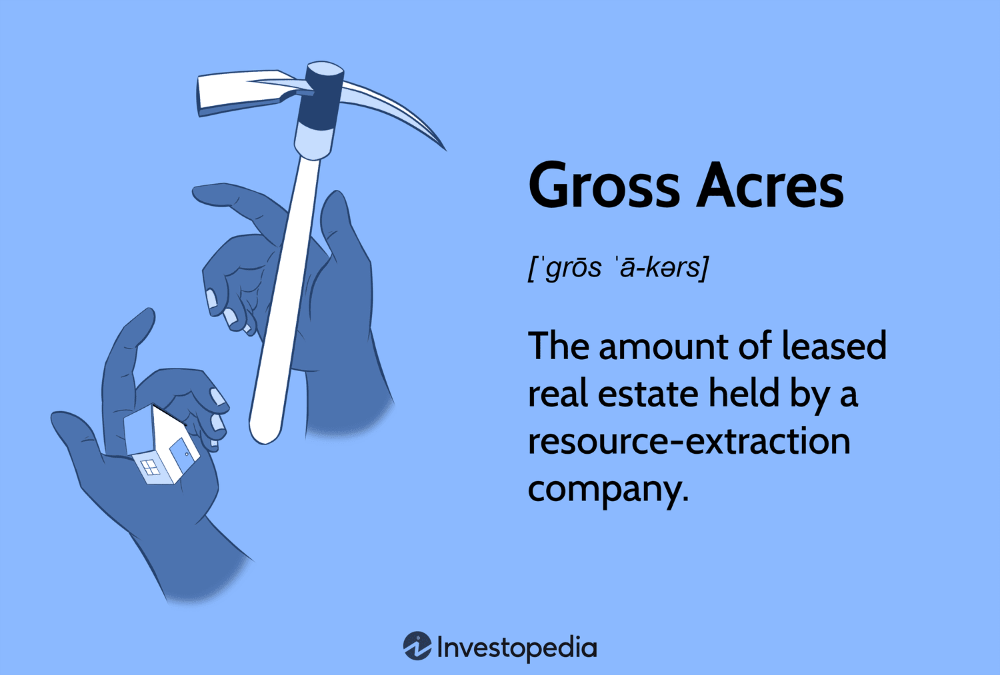

In an era characterized by the fusion of technology and investment, grasping the subtleties of real estate metrics alongside modern trading strategies is becoming increasingly crucial. This article examines the complex relationship between real estate measurements—particularly gross acres—and algorithmic trading within the financial markets. Gross acres, a fundamental metric, represents the total land area of a property inclusive of all non-developed and undeveloped land segments. It provides a comprehensive gauge of a property's potential and value. Understanding this metric is instrumental for investors looking to maximize the utility and profitability of real estate assets.

Meanwhile, the rapid ascension of algorithmic trading is transforming how investment portfolios are managed. Algorithms leverage big data and advanced analytics to predict market trends and optimize trading strategies. They enable investors to implement informed decisions and accommodate market dynamics in real-time. In this context, real estate metrics like gross acres can enhance the predictive accuracy and applicability of these algorithmic models.



By exploring the concept of gross acres, this article aims to highlight its significance in real estate valuation and its impact when integrated with algorithmic trading. The insights drawn from these intersections empower investors with the tools and knowledge to navigate the evolving landscape of tech-driven real estate investments effectively. This synthesis of real estate valuation techniques and innovative trading methodologies presents a new frontier for investors seeking to gain a competitive edge in portfolio expansion.

## Table of Contents

## Understanding Gross Acres in Real Estate

Gross acres represent the total area of a land parcel and include all parts of the property, regardless of their development or usability. This comprehensive metric is pivotal for evaluating a property's full value and its designated uses. Unlike net acres, gross acres do not subtract portions that may be unutilized, such as easements, environmental buffers, or other non-developable areas. 

Gross acres serve as a fundamental metric for investors and property developers. By understanding the entirety of a land parcel's size, investors can better assess its potential uses, particularly in settings where land is a critical factor, such as agriculture, urban development, or conservation. 

For instance, in agricultural real estate, the gross acreage of a property can directly correlate with its potential yield or livestock capacity. Similarly, in residential or commercial development, knowing the gross acreage helps developers outline the possible scope of the project, from infrastructure design to landscape planning. This metric allows for a holistic view, facilitating decisions that maximize land utility and value return.

Moreover, understanding gross acres is instrumental in land valuation and planning. By accounting for the total land area, stakeholders can apply accurate zoning laws, tax assessments, and development guidelines tailored to the property's full potential. This ensures compliance with regulations and maximizes economic benefits.

In summary, comprehending the measurement of gross acres is essential for anyone involved in land transactions or development. It provides a clear depiction of what the property encompasses and opens avenues for strategic planning and utilization, fostering more informed investment decisions in various sectors.

## Importance of Accurate Gross Acre Calculations

Accurate measurement of gross acres is vital for assessing property value, determining potential investments, and calculating tax assessments. Correctly quantifying gross acres influences every aspect of a property's evaluation from its purchase price and development potential to its tax obligations. Miscalculations can result in significant financial repercussions due to either overvaluation or undervaluation. For instance, overvaluing a property can lead to paying an excessive purchase price or property taxes, while undervaluation might result in lost rental income or missed investment opportunities.

To ensure precision, investors should utilize reliable tools and methods such as Geographic Information Systems (GIS) and professional surveying. GIS technology allows for detailed mapping and analysis of land parcels, providing accurate measurements that consider the exact boundaries and dimensions of a property. Professional surveys provide a certified measurement necessary for legal and investment decisions, which are conducted by licensed surveyors who understand various land features and potential limitations.

It is also essential to account for irregular shapes or natural features such as water bodies within the land parcel. These elements can significantly impact the total acreage. For example, a property with a large lake or river running through it may have substantial portions of land that are unusable for development. Therefore, when calculating gross acres, one must include methods to adjust for these non-usable portions to avoid skewed evaluations. 

One potential mathematical approach to handle irregular land areas is to divide the property into smaller, manageable sections that are easier to calculate individually. For practical coding applications, a Python script using libraries such as `shapely` and `geopandas` can be used to handle these calculations. Here is a simple example of how this could be approached:
```python
from shapely.geometry import Polygon
import geopandas as gpd

# Define the vertices of the property boundary
property_coords = [(0, 0), (10, 0), (10, 10), (5, 5), (0, 10)]

# Create a Polygon object
property_polygon = Polygon(property_coords)

# Calculate the area of the polygon
total_acres = property_polygon.area

# Check for water bodies or excluded areas and subtract
# Example: assume a lake is another polygon
lake_coords = [(3, 3), (5, 3), (5, 5), (3, 5)]
lake_polygon = Polygon(lake_coords)

# Adjust total acreage for the unusable area
usable_acres = total_acres - lake_polygon.area

print(f"Total gross acres: {total_acres}")
print(f"Usable gross acres: {usable_acres}")
```
This approach helps investors accurately determine the usable portions of a property, facilitating more effective financial decisions. Such precision in measuring gross acres enables investors to optimize their portfolios by accurately evaluating property values and potential returns.

## Algorithmic Trading in Real Estate Investment

Algorithmic trading refers to the utilization of automated software systems to execute transactions in financial markets, incorporating complex mathematical and statistical models. This approach is gaining traction within the real estate investment landscape, largely due to advancements in big data analytics that allow investors to predict market trends with greater accuracy and efficiency.

In the past, real estate investment strategies were predominantly driven by qualitative assessments and manual data analysis. However, with the advent of sophisticated [algorithmic trading](/wiki/algorithmic-trading) platforms, there is a significant shift towards automation and data-driven decision-making. These platforms aggregate vast amounts of data, including market prices, demographic trends, interest rates, and other economic indicators, to generate actionable insights.

One core advantage of algorithmic trading in real estate is the ability to process real-time data, enabling investors to make timely and informed decisions. This agility is crucial in a market where conditions can change rapidly. By utilizing algorithms, investors can identify potential opportunities more effectively, adjust their portfolios as needed, and optimize returns while managing risks.

A critical aspect of enhancing algorithmic trading models is integrating comprehensive real estate metrics, such as gross acres. Gross acres, which denote the total land area of a property, provide valuable context for evaluating properties, particularly in sectors like agriculture or real estate development. Understanding the scale and characteristics of a property can influence investment decisions, such as the potential for development or land use change, which in turn affects predicted market trends and asset valuations.

Modern algorithmic trading systems rely on [machine learning](/wiki/machine-learning) and [artificial intelligence](/wiki/ai-artificial-intelligence) to refine predictions and identify new patterns in the data. These systems can incorporate inputs like gross acres into their models, leading to more granular and precise analyses. For example, algorithms can weigh the impact of land size against factors like location desirability or zoning laws to better predict property value appreciation.

To illustrate, consider a simple algorithm that predicts the value increase of a real estate asset: 

```python
import numpy as np

def predict_value_increase(gross_acres, location_rating, zoning_factor):
    base_increase = gross_acres * 0.05
    location_impact = location_rating * 0.1
    zoning_impact = zoning_factor * 0.07
    total_increase = base_increase + location_impact + zoning_impact
    return total_increase

# Example usage
predicted_increase = predict_value_increase(15, 7, 5)
print(f"The predicted value increase is: {predicted_increase}")
```

This Python function estimates the value increase based on gross acres, a location rating, and a zoning [factor](/wiki/factor-investing), demonstrating the flexibility and power of algorithmic models in incorporating diverse real estate metrics for enhanced prediction accuracy.

As algorithmic trading continues to evolve, its integration with real estate metrics like gross acres will likely lead to more sophisticated investment strategies. By leveraging these technological advancements, investors can position themselves to capitalize on emerging trends and maximize their portfolio performance in an increasingly competitive market.

## Impact of Gross Acreage on Algorithmic Trading Models

Algorithmic trading models increasingly incorporate a diverse array of metrics to improve predictive accuracy, and gross acreage has emerged as a significant factor in this regime. The influence of gross acreage in these models involves several dimensions of advanced analytics and decision-making processes. 

Firstly, the inclusion of comprehensive land metrics such as gross acreage converts traditional models into more nuanced systems that recognize diverse real estate attributes. When models incorporate gross acreage, they better account for the variations in land use potential, which directly impacts market valuations and trading strategies. For example, the differential valuation of land based on size, as measured in gross acres, can alter predicted market tendencies, thus necessitating the refinement of model parameters to reflect these subtleties.

In practice, advanced algorithms may utilize differential equations and statistical modeling to gauge market repercussions based on changes in gross acreage data. For instance, employing a linear regression model could help predict market price adjustments relative to changes in gross acres available for development. Here’s a simplified Python example illustrating how gross acreage data might be incorporated into an algorithmic trading model:

```python
import numpy as np
from sklearn.linear_model import LinearRegression

# Sample dataset: Gross acres and corresponding property value (hypothetical)
X = np.array([[10], [20], [30], [40], [50]])  # Gross acres
y = np.array([100, 200, 250, 320, 500])       # Property value

# Creating a linear regression model
model = LinearRegression().fit(X, y)

# Predicting property value based on new gross acreage data
new_acres = np.array([[35]])
predicted_value = model.predict(new_acres)

print(f"Predicted Property Value for 35 Gross Acres: {predicted_value[0]}")
```

Moreover, algorithmic models leverage real-time data, including property size changes and zoning regulations, to swiftly adjust trading strategies. This adaptability is critical for optimizing investment returns, as zoning laws or sudden market shifts can significantly impact land value.

By extending the algorithmic approaches to include such comprehensive land data, models gain the robustness needed to automate trading strategies effectively. Sophisticated algorithms can detect patterns and forecast trends, updating continuously to ensure alignment with the latest market conditions and regulatory landscapes.

In conclusion, the integration of gross acreage into algorithmic trading fundamentally elevates the precision and relevance of these models in real estate markets, providing investors with more reliable tools for decision-making.

## Common Mistakes in Gross Acre and Trading Calculations

Miscalculating property boundaries and disregarding exclusions such as easements are frequent errors in calculating gross acres. These mistakes can significantly alter the perceived value and utility of real estate investments. Accurate boundary assessments are essential to ensure the entire area, including any non-usable components, is considered correctly. Gross acreage calculations must factor in easements, which are rights to cross or otherwise use someone else's land for a specified purpose. Excluding these can lead to overestimating the developable or valuable portion of a property, misleading stakeholders and investors alike.

Errors in trading algorithms can arise from not adapting to market changes or from outdated data inputs. For instance, if algorithmic models do not incorporate the latest information regarding property dimensions such as acreage, trading strategies can become obsolete or misguided. These algorithms depend on timely, accurate data; thus, failures in updating this information can lead to substantial financial setbacks. Algorithms that integrate real estate metrics must remain flexible and responsive to structural changes or allocation adjustments.

To mitigate these issues, employing advanced geospatial tools like Geographic Information Systems (GIS) is crucial for precise mapping and measurement of property boundaries. For trading algorithm reliability, maintaining an infrastructure that supports continuous updates and data validation can prevent computational inaccuracies. Investors should ensure their models and calculations are regularly audited and refined, focusing on data integrity and responsiveness to market conditions. By prioritizing accuracy and real-time adaptability, investors can minimize potential errors in both gross acre calculations and trading algorithms, thereby enhancing the robustness and success of their investment strategies.

## Conclusion

The integration of real estate metrics, such as gross acres, with algorithmic trading strategies represents a significant shift in investment tactics. Understanding gross acreage is crucial for accurately assessing property valuation. This metric offers a complete picture of a property's value by considering the total land area, inclusive of both usable and non-usable sections. Accurate knowledge of gross acreage enables investors to make more informed decisions, thereby refining the financial models used in trading.

Algorithmic trading in real estate is increasingly relying on precise data inputs to predict market trends effectively. By incorporating gross acreage data, trading algorithms can enhance their predictive accuracy, leading to smarter investment decisions. These algorithms analyze various factors, including property size and zoning regulations, enabling investors to adjust their portfolios towards more lucrative opportunities.

The proper utilization of real estate metrics within algorithmic frameworks provides a competitive advantage. Investors who integrate these insights into their strategies can optimize their investment portfolios, ensuring they are not only current with market trends but also prepared to capitalize on future opportunities. This strategic alignment between real estate metrics and trading models heralds a new era of investment, where data-driven decisions offer substantial return potential for savvy investors.

## References & Further Reading

[1]: "Gross Neighborhood Acres (GNA) Calculation." [USDA National Agricultural Statistics Service](https://data.nass.usda.gov/Newsroom/2024/12-23-2024.php).

[2]: Lopez de Prado, M. (2018). ["Advances in Financial Machine Learning"](https://www.amazon.com/Advances-Financial-Machine-Learning-Marcos/dp/1119482089). Wiley.

[3]: Jansen, S. (2020). ["Machine Learning for Algorithmic Trading"](https://github.com/stefan-jansen/machine-learning-for-trading). Packt Publishing.

[4]: Chan, E. P. (2008). ["Quantitative Trading: How to Build Your Own Algorithmic Trading Business"](https://github.com/egorpe/EPChan-QuantitativeTrading/blob/master/example7_6.m). Wiley.

[5]: Aronson, D. R. (2007). ["Evidence-Based Technical Analysis: Applying the Scientific Method and Statistical Inference to Trading Signals"](https://onlinelibrary.wiley.com/doi/book/10.1002/9781118268315). Wiley.