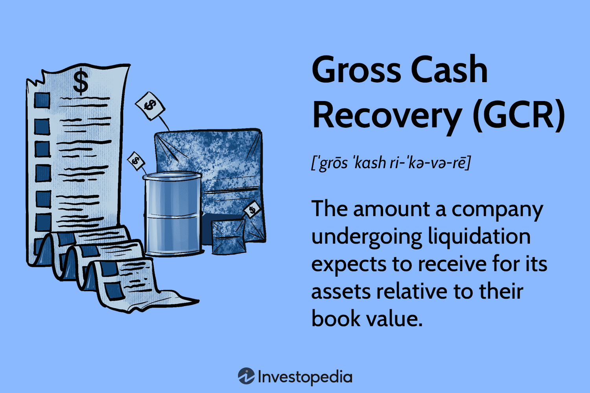

In the world of finance, recovering from losses and ensuring stability is critical for both individuals and institutions. Gross Cash Recovery (GCR) emerges as a vital financial concept, particularly in contexts involving asset liquidation. GCR represents the expected gross cash collection over the remaining life of an asset, often expressed as a percentage of the asset's book value. Its significance is particularly pronounced in scenarios requiring rapid asset liquidation, such as during the closure of failed banks.

Algorithmic trading is another component that influences financial recovery. By employing algorithms to execute trades based on predetermined criteria and real-time market conditions, this form of trading enhances the efficiency and effectiveness of financial processes. It offers a means of swiftly responding to market shifts, potentially optimizing trading strategies and minimizing losses amidst financial recovery efforts.



For investors and financial professionals, a firm grasp of GCR, alongside the capabilities of algorithmic trading, can be pivotal in formulating successful financial strategies. These concepts play a crucial role in managing asset liquidation and informing strategic decisions that facilitate recovery and stability. By examining these processes and their financial recovery implications, stakeholders can navigate economic challenges more effectively.

## Table of Contents

## Understanding Gross Cash Recovery (GCR)

Gross Cash Recovery (GCR) refers to the total expected cash collection from an asset over its remaining life. It is a crucial metric in financial recoveries, especially during asset liquidations. GCR is commonly expressed as a percentage of an asset's book value, providing insight into how much of the asset's original financial worth can be recovered.

The significance of GCR becomes pronounced in scenarios involving substantial asset liquidations. In such circumstances, understanding the potential cash recovery is essential for stakeholders, particularly when a swift liquidation process is required. This is often the case in financial institutions experiencing deterioration, prompting rapid dispositions to meet obligations or mitigate losses.

When financial institutions, like banks, fail, liquidating their assets becomes imperative to recover value and satisfy creditors. This is where GCR plays a vital role, offering a framework to estimate the cash recovery from these assets. An efficient GCR ensures that maximum value is retrieved from the liquidation process, minimizing the financial impact of the institution's failure.

GCR is a pivotal aspect of closing failed banks, as it aids regulators and financial managers in managing the liquidation procedure effectively. For instance, organizations like the Federal Deposit Insurance Corporation (FDIC) rely on GCR to assess strategies and timelines for asset dispositions. The objective is to restore stability and recover as much value as possible from the failing institutions, highlighting the acute relevance of GCR in these contexts.

## The Process of Asset Liquidation

Asset liquidation involves the systematic process of selling assets to meet liabilities, repay debts, or generate cash. This process is critical for both individual and institutional recovery strategies, particularly in situations involving insolvency or closure of operations. 

In the context of bank liquidations, financial institutions conduct thorough evaluations of assets to identify their worth and potential Gross Cash Recovery (GCR). This evaluation assesses both tangible and intangible assets, taking into account the current market value, depreciation, and potential selling price. The objective is to maximize the GCR, which represents the total expected cash collection over the remaining life of the asset.

However, the liquidation value of assets is heavily influenced by prevailing market conditions and the associated stigma of purchasing from failed organizations. The perception of risk or distress can depress asset prices, making it challenging to achieve the book value. For example, during periods of economic downturn, potential buyers may be hesitant to invest in assets from failing entities, leading to reduced bid prices.

Rapid liquidation efforts are often necessitated in such situations, particularly when organizations like the Federal Deposit Insurance Corporation (FDIC) are involved. The FDIC, for instance, may expedite the sale of bank assets through auctions or negotiations to quickly recover funds for depositors and creditors. These quick sales typically involve selling assets below their book value to ensure timely recovery, often at significant discounts. This approach prioritizes speed and [liquidity](/wiki/liquidity-risk-premium) over achieving the maximum possible price, to stabilize the financial situation promptly.

### Python Example

To illustrate a simple calculation of GCR as a percentage of book value, consider the following Python code:

```python
def calculate_gcr(current_value, book_value):
    """
    Calculate the Gross Cash Recovery (GCR) as a percentage of book value.

    Parameters:
    current_value (float): The current market value of the asset.
    book_value (float): The book value of the asset.

    Returns:
    float: The GCR percentage.
    """
    if book_value == 0:
        return 0
    return (current_value / book_value) * 100

# Example usage
current_market_value = 75000
book_value_of_asset = 100000
gcr_percentage = calculate_gcr(current_market_value, book_value_of_asset)
print(f"Gross Cash Recovery (GCR) is {gcr_percentage:.2f}% of the book value.")
```

This code snippet demonstrates how to compute the GCR, an essential metric for evaluating the recovery potential during asset liquidation. Effective management of this process is crucial for optimizing long-term financial stability and recovery outcomes.

## Algorithmic Trading and Financial Recovery

Algorithmic trading employs sophisticated algorithms to autonomously execute trades based on specific criteria and market conditions. This advanced form of trading enhances the efficiency of financial recovery processes by quickly adapting to market fluctuations and optimizing the execution of trades. 

By utilizing [algorithmic trading](/wiki/algorithmic-trading), institutions and investors can develop strategies that minimize losses and maximize the value of liquidated assets. Algorithms can be constructed to rapidly assess market data and respond with precision. For instance, an algorithm could be programmed to monitor asset prices, execute sell or buy orders when certain thresholds are met, and continuously adjust to market [volatility](/wiki/volatility-trading-strategies). This real-time adjustment capability allows for a proactive approach in managing liquidated assets, which is crucial during financial recovery phases.

Moreover, algorithmic trading provides the ability to handle large volumes of assets with speed and accuracy. This capability is particularly beneficial in situations where rapid asset liquidation is required, such as during the closure of a financial institution or the sale of distressed assets. The efficiency of algorithms in processing information and executing trades helps reduce the lag that can occur with manual trading strategies.

Integration of algorithmic trading into financial recovery efforts can significantly improve asset management outcomes. Algorithms designed for specific recovery goals can determine optimal asset selling points, manage portfolio risks, and ensure compliance with regulatory requirements. As a result, the strategic use of algorithmic trading within recovery frameworks can provide financial entities with enhanced control over their asset liquidation processes.

The use of algorithmic trading represents a transformative approach to asset management and financial recovery, enabling institutions to navigate market complexities with higher precision and efficiency. This integration is an evolving practice that continues to redefine conventional methods of financial recovery, offering a robust toolset for addressing economic challenges effectively.

## GCR and Book Value Correlation

Gross Cash Recovery (GCR) and book value are interconnected metrics often employed by analysts to evaluate the financial recovery potential of assets undergoing liquidation. GCR is generally expressed as a percentage of the asset's book value, providing a quantitative measure of the cash that can be expected to be retrieved relative to the initial accounting valuation of the asset.

The book value of an asset represents its net value on the balance sheet, calculated as the asset's original cost minus accumulated depreciation and liabilities. This metric serves as a baseline from which the potential for cash recovery can be assessed. By comparing GCR to book value, financial professionals can derive insights into how the market perceives the value of an asset, as well as gauge its attractiveness in a liquidation scenario.

The correlation between GCR and book value can reveal discrepancies driven by market conditions, buyer perceptions, and the intrinsic qualities of the asset itself. For example, a GCR significantly lower than the book value might suggest a negative market sentiment, perhaps due to asset obsolescence or unfavorable economic conditions. Conversely, a higher GCR could indicate strong recovery prospects and high demand, occasionally resulting in the asset being sold at a premium.

Analysts leverage these insights to inform strategic decisions, such as determining the timing of asset sales and the setting of reserve prices during an auction process. Understanding the factors that influence the relationship between GCR and book value can facilitate more accurate predictions regarding cash recoveries and enhance the efficacy of financial recovery strategies.

In terms of calculations, the relationship can be conceptualized through the equation:

$$
\text{GCR Percentage} = \left( \frac{\text{GCR}}{\text{Book Value}} \right) \times 100
$$

This formula allows analysts to express GCR as a percentage of the book value, simplifying the comparison across various assets and scenarios. By maintaining a clear understanding of this correlation, investors and financial professionals can navigate the complexities of asset liquidation with greater precision and confidence.

## Conclusion

Understanding the concepts of Gross Cash Recovery (GCR) and their applications is crucial for financial professionals in navigating economic challenges. GCR provides a framework for estimating the expected cash collection from asset liquidation, offering vital insights into the potential value recovery from assets that are subject to liquidation. This knowledge is essential for making informed decisions during financial distress, particularly in instances where rapid liquidation is necessary to stabilize an institution or reclaim value effectively.

Algorithmic trading introduces new opportunities to improve traditional recovery processes. Through the strategic implementation of algorithms, financial institutions can enhance their trading efficiency and responsiveness to market dynamics. Algorithmic trading systems are capable of analyzing large volumes of data at high speed, identifying trends, and executing trades based on predefined strategies. This capability allows for the swift adaptation to market conditions that could impact the recovery value of liquidated assets.

By leveraging the synergy between GCR and algorithmic trading, investors and institutions can refine their asset liquidation and recovery strategies. This integration can optimize the timing and pricing of asset sales, potentially reducing losses and maximizing recovery value. Moreover, algorithmic tools can provide the precision needed to capitalize on market fluctuations, allowing institutions to seize opportunities that manual trading might overlook.

In conclusion, the confluence of GCR with algorithmic trading has the potential to transform how financial entities approach asset management during periods of economic uncertainty. By adopting these advanced methodologies, financial professionals not only enhance their strategic planning but also position themselves more robustly against future economic disruptions. This forward-thinking approach not only strengthens operational resilience but also contributes to a more stable financial landscape overall.

## References & Further Reading

[1]: Lubke, S., & Scholz, J. H. (2020). ["Asset Liquidation and Market Impact."](https://papers.ssrn.com/sol3/cf_dev/AbsByAuth.cfm?per_id=371166) Journal of Financial Markets.

[2]: Elder, A. (2014). ["The New Trading for a Living: Psychology, Discipline, Trading Tools and Systems, Risk Control, Trade Management."](https://www.amazon.com/New-Trading-Living-Psychology-Discipline/dp/1118443926) Wiley.

[3]: Narang, R. K. (2009). ["Inside the Black Box: The Simple Truth About Quantitative Trading."](https://onlinelibrary.wiley.com/doi/book/10.1002/9781118267738) Wiley.

[4]: Dixon, M., Polson, N., & Sokolov, V. (2020). ["Machine Learning in Finance: From Theory to Practice."](http://matthew-dixon.com/publications.html) Springer.

[5]: Aldridge, I. (2013). ["High-Frequency Trading: A Practical Guide to Algorithmic Strategies and Trading Systems."](https://www.amazon.com/High-Frequency-Trading-Practical-Algorithmic-Strategies/dp/1118343506) Wiley.