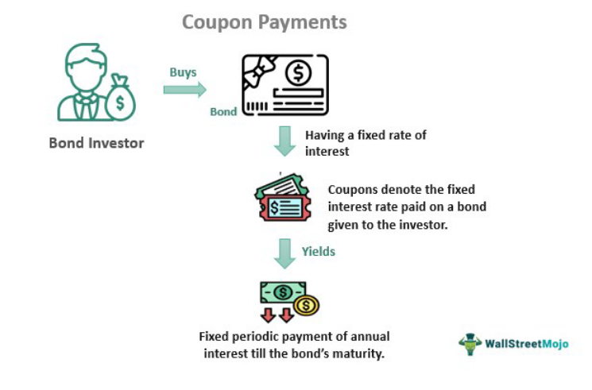

Understanding the intricate components of finance, particularly within bond markets and algorithmic trading, is pivotal for today’s investors. Bonds act as a cornerstone of financial markets, representing fixed-income investments where investors lend money to entities, such as governments or corporations, with the promise of periodic interest payments. These interest payments, known as bond coupons, play a significant role in determining the bond's yield and market valuation. The coupon rate is essentially an indicator of the income an investor can expect from a bond, usually expressed as a percentage of its face value. Higher coupon rates are a focal point for investors due to their potential to generate greater returns.

Concurrently, the rapid advancement of technology has ushered in algorithmic trading, fundamentally changing the landscape of bond trading. This involves the use of sophisticated algorithms to automate trades, thereby enhancing the speed and precision of transactions. These algorithms can process vast volumes of data, offering insights and executing trades at a pace beyond human capability. Algorithmic trading increases market efficiency and liquidity, ensuring that bond markets operate more effectively.



The synergy between bond coupons and algorithmic trading is crucial as these financial elements interlock to influence investment strategies and decisions. With the introduction of algorithmic systems, traders can leverage computational power to gain a more accurate understanding of bond yields and optimize trading outcomes. As technology continues to evolve, its integration within bond trading offers enhanced opportunities while also posing new challenges for investors to navigate in their quest for informed and profitable investment decisions.

## Table of Contents

## Understanding Bond Coupons

Bonds represent a form of debt investment where investors, by purchasing a bond, effectively lend money to a bond issuer, typically governments or corporations. In return, the issuer promises to pay periodic interest payments to the investor, known as coupons, and repay the bond's face value at maturity. These coupon payments are integral to the bond's value proposition and are calculated based on the bond's coupon rate.

The coupon rate is defined as the annual interest rate paid by the bond issuer. It is typically expressed as a percentage of the bond's face value or principal. For example, a bond with a face value of $1,000 and a coupon rate of 5% would pay $50 in interest each year until maturity. The formula to calculate the annual coupon payment (C) is:

$$
C = \frac{\text{Coupon Rate} \times \text{Face Value}}{100}
$$

For investors, coupon payments are a source of fixed income, adding a layer of predictability to their investment portfolios. This fixed income characteristic significantly influences the bond's appeal and market valuation.

Higher coupon rates are particularly attractive to investors seeking higher income. They imply greater regular returns compared to lower-coupon bonds, assuming all other factors remain constant. Consequently, bonds with higher coupon rates generally command higher prices when interest rates decrease, as they offer superior income compared to new bonds issued at the current, lower rates.

The practical application of bond coupons is evident in fixed-income portfolios, including those focusing on mortgage-backed securities (MBS). In an MBS, the bond investor receives monthly or quarterly coupon payments, which come from the pool of payments made by homeowners in the mortgage portfolio. The stability and reliability of these payments are important for income-seeking investors and can influence the overall yield and attractiveness of fixed-income portfolios.

Understanding bond coupon mechanics is essential for investors aiming to optimize their fixed-income strategies, as it directly impacts income generation and investment evaluation.

## Gross Coupon Explained

The term gross coupon refers to the average [interest rate](/wiki/interest-rate-trading-strategies) or coupon received across a portfolio of loans, such as mortgage-backed securities (MBS). This calculation entails taking the simple arithmetic mean of the interest rates offered by various loans within a portfolio, disregarding the individual loan amounts. The formula for calculating the gross coupon can be expressed as:

$$

\text{Gross Coupon Rate} = \frac{\sum_{i=1}^{n} C_i}{n} 
$$

where $C_i$ is the coupon rate of the $i^{th}$ loan, and $n$ is the total number of loans in the portfolio.

Gross coupons serve as a useful measure for assessing the relative yield of a MBS portfolio, providing a preliminary gauge of income potential before accounting for any duties such as administrative fees. When administrative costs and other fees are considered, the resultant figure is the net coupon, which represents the actual yield investors can expect to receive. Thus, the calculation of gross coupons is an initial but critical step in determining net returns from a portfolio of mortgage-backed loans. 

For investors in mortgage-backed securities, understanding gross coupons is integral to evaluating the potential yield of their investments. Such knowledge allows them to compare various investment options and understand the income-generating potential of different MBS portfolios. By not factoring in loan sizes, the gross coupon offers a straightforward means to assess interest rate conditions across a diverse set of loans, enabling broad comparison across different MBS portfolios. Through this approach, investors can make more informed decisions when managing their fixed-income investments.

## Algorithmic Trading in Bond Markets

Algorithmic trading utilizes computer algorithms to automate trading processes, significantly enhancing speed and accuracy. In bond markets, where bonds are traded over-the-counter and often involve substantial volumes and complex pricing, [algorithmic trading](/wiki/algorithmic-trading) plays a vital role. By analyzing extensive and multifaceted datasets, these algorithms can identify market trends and price inefficiencies rapidly, facilitating more efficient trade execution. This efficiency is crucial for institutional investors who manage large portfolios and require precision in timing and pricing their bond trades.

A key advantage of algorithmic trading in bonds is its ability to contribute to market [liquidity](/wiki/liquidity-risk-premium). Algorithmic systems enable continuous market monitoring and transaction execution, allowing participants to buy or sell bonds more easily without causing significant price fluctuations. This liquidity is essential for maintaining a stable bond market, especially during periods of [volatility](/wiki/volatility-trading-strategies).

Algorithmic trading systems deploy a variety of strategies, including statistical [arbitrage](/wiki/arbitrage) and [trend following](/wiki/trend-following). Statistical arbitrage leverages price discrepancies between correlated securities, identifying profitable trading opportunities by analyzing historical and real-time data. Trend-following strategies, on the other hand, explore predicted market directions based on historical patterns and market sentiments, helping traders capitalize on prolonged market movements.

Furthermore, the use of algorithmic trading is integral to processing the vast amounts of market data related to bond coupons and yields. Algorithms can evaluate these datasets, distilling essential information to optimize trading decisions. For example, algorithmic tools can calculate potential yields by integrating data on bond coupons, market interest rates, and macroeconomic indicators to forecast price movements accurately.

The complexity of these operations often necessitates sophisticated computational techniques and programming languages. Python, with its extensive libraries and modules such as NumPy, pandas, and scikit-learn, provides robust support for the data analysis and [machine learning](/wiki/machine-learning) processes inherent in algorithmic trading.

```python
import numpy as np
import pandas as pd
from sklearn.linear_model import LinearRegression

# Example of using Python in algorithmic trading
# Dataset of bond yields and market indicators
data = pd.DataFrame({
    'bond_yield': [2.5, 2.7, 2.9, 3.0, 3.2],
    'interest_rate': [0.5, 0.7, 0.9, 1.0, 1.2],
    'market_index': [100, 102, 105, 108, 110]
})

# Setup Linear Regression model
X = data[['interest_rate', 'market_index']]
y = data['bond_yield']
model = LinearRegression().fit(X, y)

# Predict future bond yields based on market index and interest rates
future_data = pd.DataFrame({
    'interest_rate': [1.3],
    'market_index': [112]
})
predicted_yield = model.predict(future_data)
```

In summary, algorithmic trading enhances the bond market's operational efficiency by providing rapid, data-driven decision-making capabilities. It supports traders in navigating complex market landscapes, thereby optimizing their investment strategies and outcomes.

## Calculating Bond Coupons in Algo Trading

Accurate bond coupon calculations are critical for the success of algorithmic trading strategies. This precision ensures traders can effectively evaluate bond yields, thereby informing and optimizing trading decisions. The fundamental concept behind bond coupon calculations involves determining the periodic interest payments that a bond issuer will make to bondholders based on the bond's stated coupon rate and face value.

Technological advancements have significantly improved the automation of these calculations, allowing traders to respond swiftly to changes in interest rates. Such automation also reduces the potential for human error, ensuring that trading strategies remain robust and adaptive to market dynamics. These technological tools analyze market data, compute yields, and generate actionable insights efficiently, helping traders capitalize on interest rate movements.

Python is one of the most widely used programming languages in financial technology, particularly for algorithmic trading. Its robust libraries, such as `pandas` for data manipulation, `numpy` for numerical computations, and `QuantLib` for quantitative finance, equip traders with the tools to integrate precise coupon data into their algorithms. This integration enhances both computational efficiency and decision-making accuracy. An example of calculating the periodic coupon payment in Python might involve the following:

```python
# Import necessary libraries
from QuantLib import SimpleQuote, YieldTermStructureHandle, FlatForward, Actual360, Date, Months, Settings

# Example bond parameters
face_value = 1000  # Face value of the bond
coupon_rate = 0.05  # 5% annual coupon rate
coupon_frequency = 2  # semi-annual coupon payments

# Calculate the periodic coupon payment
periodic_coupon_payment = face_value * (coupon_rate / coupon_frequency)

print(f"Periodic Coupon Payment: ${periodic_coupon_payment:.2f}")
```

This code snippet calculates the periodic coupon payment for a bond with a 5% annual coupon rate, paid semi-annually, on a face value of $1000. The output is a $25 coupon payment per period, illustrative of how such calculations are performed programmatically within trading algorithms.

By incorporating these calculations into their trading algorithms, traders can dynamically assess the value of bonds in relation to prevailing market conditions. Systems leverage real-time data feeds to update these values as interest rates and market conditions evolve, enabling sophisticated trading strategies that can adjust in real-time. This agility is essential given the ever-faster pace of modern financial markets.

Overall, the integration of precise coupon calculations into algorithmic trading systems exemplifies how modern finance leverages technology to enhance analytical rigor and strategic execution. This alignment of finance and technology ensures that trading strategies are not only based on sound financial principles but are also adaptive to the changing market landscape.

## Future Trends in Bond Trading and Technology

Emerging technologies are profoundly transforming the bond trading landscape, with big data and [artificial intelligence](/wiki/ai-artificial-intelligence) (AI) at the forefront of this evolution. These technologies are enabling sophisticated analytics and predictive capabilities, crucial for enhancing the accuracy of bond coupon calculations and investment strategies. By utilizing real-time data, investors can gain deeper insights into market trends and potential fluctuations, thereby making more informed decisions.

Big data analytics allows for the processing of vast amounts of data generated in the bond markets. This data-driven approach helps identify patterns and correlations that may not be apparent through traditional analysis methods. AI, particularly machine learning algorithms, can further analyze this data to forecast future market movements and assess the impact of various economic indicators on bond prices and yields.

The integration of algorithmic trading systems with these technologies is highly dependent on future regulatory developments. As the bond market becomes more automated, regulators worldwide are focusing on compliance and transparency to ensure fairness and stability. The introduction of stricter regulations could affect how algorithmic trading systems operate, emphasizing the need for these systems to adapt to new compliance standards while maintaining operational efficiency.

Advancements in technology will undeniably reshape bond trading, presenting various opportunities and challenges for investors. On one hand, enhanced analytics and automated trading systems can improve decision-making, reduce trading costs, and increase market access. On the other hand, investors must confront challenges such as adapting to new regulatory requirements and staying informed about the rapidly changing technological landscape.

For investors who wish to leverage the capabilities of big data and AI in bond trading, it is essential to implement robust technological infrastructure. For example, Python's extensive libraries for data analysis (such as Pandas and NumPy) and machine learning (such as Scikit-learn) can be employed to develop custom analytics models tailored to specific bond portfolios. Here's a simple Python snippet for calculating the moving average of bond prices, a fundamental metric in trend analysis:

```python
import pandas as pd

# Sample data: Historical bond prices
data = {'Date': pd.date_range(start='2023-01-01', periods=10, freq='D'),
        'Price': [100, 102, 101, 103, 104, 102, 105, 106, 108, 107]}

# Create a DataFrame
df = pd.DataFrame(data)

# Calculate the 3-day moving average of bond prices
df['Moving_Average'] = df['Price'].rolling(window=3).mean()

print(df)
```

Staying abreast of technological advancements and recognizing their implications for bond trading is crucial. By embracing these tools, traders and institutional investors can position themselves to take advantage of new opportunities while managing the inherent risks in a dynamic market environment.

## Conclusion

A thorough understanding of bond coupon calculations, gross coupons, and algorithmic trading is crucial for modern investors. These financial concepts form a solid foundation for making informed investment decisions and optimizing trading strategies in dynamic and fast-paced markets.

Technology plays a pivotal role in enhancing the precision of evaluating bond investments and executing trades. By leveraging sophisticated algorithms and data analytics, traders can analyze vast amounts of data to extract insights and make timely decisions. For instance, automated systems can efficiently calculate bond yields and assess market trends, reducing human error and increasing the speed of trade execution. Python and other programming languages are instrumental in integrating complex data into trading algorithms, facilitating more accurate bond coupon calculations.

Staying informed and adaptable to technological advances and market conditions is essential for succeeding in the evolving landscape of bond trading. As big data and artificial intelligence continue to transform the industry, embracing these changes will be critical. Investors who maintain a keen awareness of regulatory developments, market dynamics, and technology innovations will be well-positioned to capitalize on opportunities and mitigate risks. Overall, mastering these financial and technological concepts will enable investors to navigate the complexities of bond markets and achieve their investment goals.

## References & Further Reading

[1]: ["The Economics of Money, Banking, and Financial Markets"](https://www.pearsonhighered.com/assets/preface/0/1/3/4/0134855388.pdf) by Frederic S. Mishkin

[2]: ["Bond Markets, Analysis, and Strategies"](https://mitpress.mit.edu/9780262046275/bond-markets-analysis-and-strategies/) by Frank J. Fabozzi

[3]: Aldridge, I. (2013). ["High-Frequency Trading: A Practical Guide to Algorithmic Strategies and Trading Systems"](https://www.amazon.com/High-Frequency-Trading-Practical-Algorithmic-Strategies/dp/1118343506). 

[4]: Narang, R. (2013). ["Inside the Black Box: A Simple Guide to Quantitative and High-Frequency Trading"](https://onlinelibrary.wiley.com/doi/book/10.1002/9781118662717).

[5]: ["Fixed Income Securities: Tools for Today's Markets"](https://www.amazon.com/Fixed-Income-Securities-Markets-Finance/dp/1119835550) by Bruce Tuckman and Angel Serrat