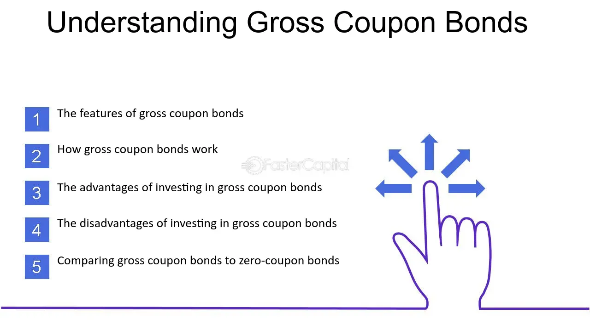

## Table of Contents

## What is a gross coupon?

A gross coupon is a term used in finance to describe the total interest payment on a bond before any taxes or fees are taken out. When you buy a bond, the issuer promises to pay you interest regularly, usually every six months or once a year. This interest payment is called the coupon. The gross coupon is the full amount of this interest payment, without any deductions.

Understanding the gross coupon is important for investors because it helps them know how much money they will get from the bond before any taxes or other costs are subtracted. This can help them compare different bonds and decide which one might be the best investment. For example, if two bonds have the same gross coupon but different tax rates, the net amount an investor receives could be different.

## How does a gross coupon differ from a net coupon?

A gross coupon is the total interest payment you get from a bond before any taxes or fees are taken out. It's like the full price you see on a product before any discounts. When you invest in a bond, the gross coupon tells you the maximum amount of interest you can expect to receive from the bond issuer.

A net coupon, on the other hand, is what you actually get to keep after taxes and fees are subtracted from the gross coupon. It's like the final price you pay after discounts. Knowing the net coupon helps you understand how much money you'll really have in your pocket after all the deductions. This is important because the difference between the gross and net coupon can be significant, depending on the taxes and fees involved.

## What is the purpose of a gross coupon in financial markets?

The purpose of a gross coupon in financial markets is to show investors the total interest they will earn from a bond before any taxes or fees are taken out. This helps investors see the full potential return they could get from their investment. By knowing the gross coupon, investors can compare different bonds and understand which ones offer the highest interest payments before any deductions.

This information is crucial because it allows investors to make informed decisions. For example, if two bonds have the same gross coupon but different tax rates, the net amount an investor receives could be different. Understanding the gross coupon helps investors calculate their expected returns more accurately and choose the bonds that best fit their financial goals.

## How is the gross coupon rate calculated?

The gross coupon rate is the percentage of the bond's face value that the issuer promises to pay as interest each year. To calculate it, you divide the annual interest payment (the gross coupon) by the bond's face value and then multiply by 100 to get a percentage. For example, if a bond has a face value of $1,000 and an annual interest payment of $50, the gross coupon rate would be ($50 / $1,000) * 100 = 5%.

This rate is important because it helps investors see how much return they can expect from a bond before any taxes or fees are taken out. By comparing the gross coupon rates of different bonds, investors can decide which bonds might offer the best potential returns. It's a key piece of information that helps in making smart investment choices.

## Can you explain the tax implications of gross coupons?

When you get interest from a bond, it's called a gross coupon. This is the total amount before any taxes are taken out. The tax you have to pay on this interest depends on where you live and your tax situation. In many places, the interest you earn from bonds is considered income, so you have to pay income tax on it. This means that the amount of money you actually get to keep, after taxes, is less than the gross coupon.

The difference between the gross coupon and what you keep after taxes is important to know. For example, if you live in a place with high taxes, a big part of your interest might go to taxes. This can make some bonds less attractive if the after-tax return isn't as good as other investments. By understanding the tax implications, you can make better choices about which bonds to buy and how much you'll really earn from them.

## What are the typical uses of gross coupons in bond investments?

Gross coupons are important for people who invest in bonds because they show the total interest payment you will get before any taxes or fees are taken out. This helps you see how much money you could earn from a bond each year. By knowing the gross coupon, you can compare different bonds and see which ones offer the best potential returns. This is useful when you are trying to decide which bonds to buy because you want to choose the ones that will give you the most money.

Understanding the gross coupon also helps you figure out how taxes will affect your investment. Since the gross coupon is the amount before taxes, you need to know how much tax you will have to pay on that interest. This way, you can calculate the net coupon, which is what you actually get to keep after taxes. Knowing both the gross and net coupons helps you make smarter choices about which bonds will be the best for your financial goals.

## How do gross coupons affect the yield of a bond?

The gross coupon of a bond is the total interest payment you get each year before any taxes or fees are taken out. It's important because it helps you see how much money you could earn from the bond. The yield of a bond is like the return on your investment, and it's calculated by comparing the interest payments to the price you paid for the bond. If the gross coupon is high, it can make the yield higher too, because you're getting more interest payments each year.

However, the gross coupon alone doesn't tell you the whole story about the yield. You also need to consider the bond's price. If you buy a bond at a discount (for less than its face value), the yield will be higher than the gross coupon rate because you're getting the same interest payments but you paid less for the bond. On the other hand, if you buy a bond at a premium (for more than its face value), the yield will be lower than the gross coupon rate because you paid more for the same interest payments. So, while the gross coupon is a key part of figuring out the yield, the price you pay for the bond also matters a lot.

## What are the risks associated with investing in securities with gross coupons?

When you invest in securities with gross coupons, you need to know about the risks. One big risk is interest rate risk. If interest rates go up, the value of your bond might go down. This happens because new bonds will have higher coupon rates, making your bond less attractive to other investors. Also, if you want to sell your bond before it matures, you might have to sell it for less than you paid for it.

Another risk is credit risk. This is the chance that the company or government that issued the bond might not be able to pay you back. If they run into financial trouble, they might miss interest payments or not pay you back at all when the bond matures. This is why it's important to check the credit rating of the bond issuer before you buy.

Inflation risk is also something to think about. If inflation goes up, the money you get from your bond might not buy as much as it used to. The gross coupon might seem good when you buy the bond, but if prices go up a lot, the real value of your interest payments could go down. This means you need to think about how inflation might affect your investment over time.

## How do changes in interest rates impact gross coupons?

When interest rates change, it doesn't change the gross coupon of a bond that you already own. The gross coupon is the interest payment you get each year, and it stays the same for the whole time you have the bond. So, if you bought a bond with a 5% gross coupon, you will keep getting 5% of the bond's face value every year until it matures, no matter what happens to interest rates.

However, changes in interest rates can affect the value of your bond if you want to sell it before it matures. If interest rates go up, new bonds will have higher gross coupons, making your bond less attractive to other investors. This means you might have to sell your bond for less than you paid for it. On the other hand, if interest rates go down, your bond with its higher gross coupon will be more attractive, and you might be able to sell it for more than you paid. So, while the gross coupon itself doesn't change, the value of your bond in the market can be impacted by interest rate changes.

## Can you compare gross coupons in different types of securities such as government and corporate bonds?

Gross coupons are the total interest payments you get from a bond before taxes or fees are taken out. Both government and corporate bonds have gross coupons, but they can be different. Government bonds, like those issued by the U.S. Treasury, usually have lower gross coupons because they are considered safer investments. People trust that the government will pay them back, so the interest rates don't have to be as high to attract investors. On the other hand, corporate bonds often have higher gross coupons. This is because companies can be riskier than governments, so they need to offer higher interest rates to make their bonds attractive to investors.

When you look at gross coupons, you need to think about the risk and the reward. Government bonds might have a lower gross coupon, but they are a safer bet. If you want to be sure you get your money back, you might choose a government bond even if the gross coupon is lower. Corporate bonds, with their higher gross coupons, can be a good choice if you're willing to take on more risk. You could earn more interest, but there's also a chance the company might not be able to pay you back. So, when choosing between government and corporate bonds, it's important to balance the gross coupon with the level of risk you're comfortable with.

## What are the regulatory considerations for issuers of securities with gross coupons?

When companies or governments issue bonds with gross coupons, they have to follow rules set by financial regulators. These rules are there to make sure that investors get clear and honest information about the bonds. For example, issuers need to tell investors about the gross coupon rate, how often they will get interest payments, and any risks involved. They also have to follow rules about how they can advertise the bonds and what they can say about them. This helps keep the bond market fair and protects investors from being misled.

Regulators also keep an eye on how issuers handle the money they get from selling bonds. They want to make sure that the money is used for what the issuer said it would be used for, like building a new factory or paying off other debts. If an issuer doesn't follow these rules, they could get in trouble with the regulators, which might mean fines or other penalties. So, it's important for issuers to be careful and follow all the rules when they offer bonds with gross coupons.

## How do global economic factors influence the attractiveness of gross coupons?

Global economic factors can make gross coupons more or less attractive to investors. When the economy is doing well and growing, people might feel confident and look for investments that offer higher returns. This can make bonds with higher gross coupons more attractive because they promise bigger interest payments. But if there's a lot of uncertainty or if the economy is not doing well, people might want safer investments. They might choose bonds with lower gross coupons if they think those bonds are safer and more likely to pay back the money they invested.

Another big [factor](/wiki/factor-investing) is inflation. If prices are going up a lot, the money you get from a bond's gross coupon might not buy as much as it used to. This can make bonds with fixed gross coupons less attractive because the real value of the interest payments goes down. On the other hand, if inflation is low, the gross coupon can seem more valuable because the interest payments keep their worth over time. So, when deciding if a bond's gross coupon is a good deal, it's important to think about what's happening in the global economy and how it might affect the value of the money you earn from the bond.

## What are bond coupons and how do they work?

Bonds represent a form of debt investment where investors, by purchasing a bond, effectively lend money to a bond issuer, typically governments or corporations. In return, the issuer promises to pay periodic interest payments to the investor, known as coupons, and repay the bond's face value at maturity. These coupon payments are integral to the bond's value proposition and are calculated based on the bond's coupon rate.

The coupon rate is defined as the annual interest rate paid by the bond issuer. It is typically expressed as a percentage of the bond's face value or principal. For example, a bond with a face value of $1,000 and a coupon rate of 5% would pay $50 in interest each year until maturity. The formula to calculate the annual coupon payment (C) is:

$$
C = \frac{\text{Coupon Rate} \times \text{Face Value}}{100}
$$

For investors, coupon payments are a source of fixed income, adding a layer of predictability to their investment portfolios. This fixed income characteristic significantly influences the bond's appeal and market valuation.

Higher coupon rates are particularly attractive to investors seeking higher income. They imply greater regular returns compared to lower-coupon bonds, assuming all other factors remain constant. Consequently, bonds with higher coupon rates generally command higher prices when interest rates decrease, as they offer superior income compared to new bonds issued at the current, lower rates.

The practical application of bond coupons is evident in fixed-income portfolios, including those focusing on mortgage-backed securities (MBS). In an MBS, the bond investor receives monthly or quarterly coupon payments, which come from the pool of payments made by homeowners in the mortgage portfolio. The stability and reliability of these payments are important for income-seeking investors and can influence the overall yield and attractiveness of fixed-income portfolios.

Understanding bond coupon mechanics is essential for investors aiming to optimize their fixed-income strategies, as it directly impacts income generation and investment evaluation.

## What is Gross Coupon Explained?

The term gross coupon refers to the average [interest rate](/wiki/interest-rate-trading-strategies) or coupon received across a portfolio of loans, such as mortgage-backed securities (MBS). This calculation entails taking the simple arithmetic mean of the interest rates offered by various loans within a portfolio, disregarding the individual loan amounts. The formula for calculating the gross coupon can be expressed as:

$$

\text{Gross Coupon Rate} = \frac{\sum_{i=1}^{n} C_i}{n} 
$$

where $C_i$ is the coupon rate of the $i^{th}$ loan, and $n$ is the total number of loans in the portfolio.

Gross coupons serve as a useful measure for assessing the relative yield of a MBS portfolio, providing a preliminary gauge of income potential before accounting for any duties such as administrative fees. When administrative costs and other fees are considered, the resultant figure is the net coupon, which represents the actual yield investors can expect to receive. Thus, the calculation of gross coupons is an initial but critical step in determining net returns from a portfolio of mortgage-backed loans. 

For investors in mortgage-backed securities, understanding gross coupons is integral to evaluating the potential yield of their investments. Such knowledge allows them to compare various investment options and understand the income-generating potential of different MBS portfolios. By not factoring in loan sizes, the gross coupon offers a straightforward means to assess interest rate conditions across a diverse set of loans, enabling broad comparison across different MBS portfolios. Through this approach, investors can make more informed decisions when managing their fixed-income investments.

## References & Further Reading

[1]: ["The Economics of Money, Banking, and Financial Markets"](https://www.pearsonhighered.com/assets/preface/0/1/3/4/0134855388.pdf) by Frederic S. Mishkin

[2]: ["Bond Markets, Analysis, and Strategies"](https://mitpress.mit.edu/9780262046275/bond-markets-analysis-and-strategies/) by Frank J. Fabozzi

[3]: Aldridge, I. (2013). ["High-Frequency Trading: A Practical Guide to Algorithmic Strategies and Trading Systems"](https://www.amazon.com/High-Frequency-Trading-Practical-Algorithmic-Strategies/dp/1118343506). 

[4]: Narang, R. (2013). ["Inside the Black Box: A Simple Guide to Quantitative and High-Frequency Trading"](https://onlinelibrary.wiley.com/doi/book/10.1002/9781118662717).

[5]: ["Fixed Income Securities: Tools for Today's Markets"](https://www.amazon.com/Fixed-Income-Securities-Markets-Finance/dp/1119835550) by Bruce Tuckman and Angel Serrat