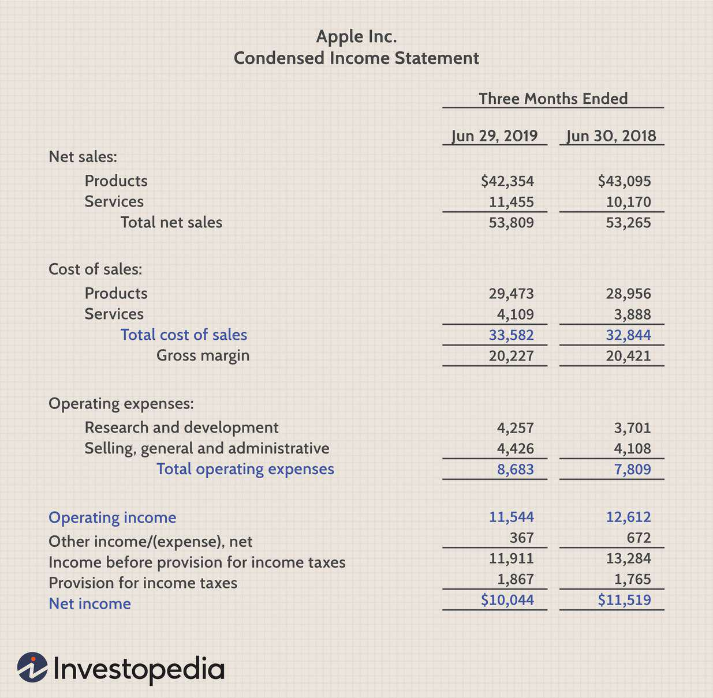

## Table of Contents

## What are gross dividends?

Gross dividends are the total amount of money a company pays out to its shareholders before any taxes or fees are taken out. When a company makes a profit, it can choose to share some of that profit with its shareholders in the form of dividends. The gross dividend is the full amount of this payment, before any deductions.

For example, if a company declares a dividend of $1 per share, and you own 100 shares, your gross dividend would be $100. This is the amount you would receive before any taxes or other charges are subtracted. Understanding gross dividends is important because it helps you know the total amount you are entitled to from the company before any other factors come into play.

## How do gross dividends differ from net dividends?

Gross dividends are the total amount of money a company pays out to its shareholders before any taxes or fees are taken out. When you get a dividend, the gross amount is what the company gives you before anything is subtracted. It's like the full price of something before any discounts.

Net dividends, on the other hand, are what you actually get to keep after taxes and fees are taken out. So, if you receive a gross dividend of $100 and have to pay $15 in taxes, your net dividend would be $85. This is the money that ends up in your pocket after all deductions are made.

## Why are gross dividends important for investors?

Gross dividends are important for investors because they show the total amount of money a company is willing to share with its shareholders before any taxes or fees are taken out. This helps investors understand how much profit the company is making and how generous it is with its shareholders. Knowing the gross dividend amount can help investors compare different companies and see which ones might give them more money over time.

Also, gross dividends are useful when planning finances. Investors need to know the gross amount to figure out how much they will actually get after taxes. This helps them plan their budgets and investments better. By understanding gross dividends, investors can make smarter choices about where to put their money to get the best returns.

## How are gross dividends calculated?

Gross dividends are calculated by multiplying the dividend per share by the number of shares an investor owns. For example, if a company declares a dividend of $1 per share and you own 100 shares, your gross dividend is $100. This is the total amount you get before any taxes or fees are taken out.

The company decides on the dividend per share based on its profits and how much it wants to share with shareholders. Once they set the dividend per share, they multiply it by the total number of outstanding shares to find out the total gross dividend the company will pay out. This helps investors know how much they can expect to receive before any deductions.

## Can you provide examples of gross dividends from different companies?

Imagine you own shares in Company A. They announce a dividend of $0.50 per share. If you have 200 shares, your gross dividend would be $100. This is the total amount you get before any taxes or fees are taken out. Company A decided to give this dividend because they made good profits and want to share some of it with their shareholders.

Now, let's look at Company B. They declare a dividend of $1.25 per share. If you own 100 shares of Company B, your gross dividend would be $125. This is the full amount you would receive before any deductions. Company B might be more generous with their dividends because they had an even better year than Company A, and they want to reward their shareholders more.

## What factors influence the amount of gross dividends a company pays?

The amount of gross dividends a company pays depends on how much profit they make. If a company does well and earns a lot of money, they might decide to share more of it with their shareholders in the form of higher dividends. On the other hand, if they don't make much profit, they might pay out less or even no dividends at all. Companies also look at how much money they need to keep for future projects or to pay off debts. If they need a lot of money for these things, they might pay smaller dividends.

Another [factor](/wiki/factor-investing) is the company's dividend policy. Some companies have a policy to always pay a certain percentage of their profits as dividends. This can mean that shareholders get a steady amount of money each time. Other companies might change their dividends based on how well they are doing or what their future plans are. Finally, what other companies in the same industry are doing can also influence a company's dividend decisions. If other companies are paying high dividends, a company might feel pressure to do the same to keep their shareholders happy.

## How do tax policies affect gross dividends?

Tax policies don't change the gross dividends that a company pays out. Gross dividends are the total amount of money a company gives to its shareholders before any taxes or fees are taken out. So, if a company decides to pay $1 per share, that's the gross dividend, no matter what the tax laws are.

But tax policies do affect how much money shareholders get to keep after taxes, which is called the net dividend. Different countries have different tax rules for dividends. Some countries might take a big chunk of the dividend as tax, while others might take less. This means that even though the gross dividend stays the same, the amount of money shareholders actually get can be different depending on where they live and the tax laws there.

## What is the impact of gross dividends on a company's financial statements?

When a company pays out gross dividends, it affects their financial statements in a big way. The main impact is seen on the company's cash flow statement. When dividends are paid, money goes out of the company, so the cash flow from financing activities will show a decrease. This means the company has less cash on hand after paying dividends. It's like taking money out of your piggy bank to share with others.

The balance sheet is also affected by gross dividends. When dividends are paid, the company's retained earnings, which is the money they have saved up from profits, go down. This is because the money used to pay dividends comes from these retained earnings. So, the equity part of the balance sheet, which shows how much money the company has from its owners and profits, will be smaller after dividends are paid out. This shows that the company has given some of its profits back to the shareholders.

## How do gross dividends relate to a company's dividend policy?

Gross dividends are the total amount of money a company pays to its shareholders before any taxes or fees. A company's dividend policy decides how much of its profits it will share as dividends. This policy can say that the company will always pay a certain percentage of its profits as dividends, or it might change the amount based on how well the company is doing or what it plans to do in the future.

The dividend policy directly affects the gross dividends because it sets the rules for how much money shareholders will get. If the policy is to pay out a lot of the profits, the gross dividends will be high. If the policy is to keep more money for the company's future needs, the gross dividends will be lower. So, the dividend policy is like a guide that tells the company how generous to be with its shareholders.

## What are the global variations in gross dividend practices?

Gross dividend practices can be different in different countries. In some places, like the United States, companies often pay dividends every three months, called quarterly dividends. This means shareholders get money four times a year. In other countries, like the United Kingdom, companies might pay dividends twice a year, called semi-annual dividends. The timing and frequency of these payments can affect how much money shareholders get and when they get it.

Another big difference is how much of their profits companies choose to pay out as dividends. In some countries, like Australia, companies often pay out a big part of their profits as dividends. This makes shareholders happy because they get more money. In other places, like Japan, companies might keep more of their profits to use for growing the business, so they pay smaller dividends. These differences can make investors choose to put their money in companies from certain countries to get the best returns.

Also, tax rules can change how gross dividends work around the world. In some countries, like Canada, there are special tax credits for dividends, which means shareholders keep more of the money after taxes. In other places, like Germany, dividends might be taxed at a higher rate, so shareholders get to keep less. These tax differences can make gross dividends more or less attractive to investors in different countries.

## How can investors use gross dividend information for investment decisions?

Investors can use gross dividend information to make smart choices about where to put their money. By looking at the gross dividends a company pays, investors can see how much money they might get back from their investment before taxes. This helps them compare different companies and choose the ones that pay higher dividends. If one company pays a lot more in dividends than another, an investor might decide to buy shares in the company with the higher dividends to get more money.

Gross dividends also tell investors about a company's health and its plans for the future. If a company is paying out big dividends, it might mean they are doing well and making good profits. But if a company is paying very small dividends or no dividends at all, it could mean they are keeping money to grow the business or they are not making much profit. By understanding these things, investors can decide if they want to invest in a company that is sharing its profits now or one that is saving money for future growth.

## What are the advanced strategies for maximizing returns from gross dividends?

One advanced strategy for maximizing returns from gross dividends is to focus on dividend reinvestment plans (DRIPs). With a DRIP, instead of taking the dividend money out, you use it to buy more shares of the company. This can help your investment grow over time because you end up owning more shares, which can lead to even more dividends in the future. It's like planting a seed that grows into a bigger plant, giving you more fruit to pick. By reinvesting dividends, you can take advantage of compound growth, where your money grows not just from the dividends but also from the increasing value of your shares.

Another strategy is to look for companies with a history of increasing their dividends, known as dividend [growth stocks](/wiki/growth-stocks). These companies might start with smaller dividends, but they raise them over time. By investing in these companies, you can get more money each year as the dividends grow. This can help protect your investment against inflation because the dividends keep getting bigger. It's like buying a tree that starts small but grows taller and gives you more apples every year. By choosing companies that consistently raise their dividends, you can build a steady stream of growing income.

## What are the calculations behind dividends?

Dividend calculations are integral for evaluating the profitability and appeal of a stock. Two primary metrics are particularly essential: the dividend yield and the dividend payout ratio. These metrics provide valuable insights into a company's financial well-being.

The **dividend yield** measures the annual dividends paid by a company relative to its stock price, indicating how much cash flow investors receive for each dollar invested in the company's equity. The formula for dividend yield is:

$$
\text{Dividend Yield} = \left( \frac{\text{Annual Dividends Per Share}}{\text{Price Per Share}} \right) \times 100\%
$$

For example, if a company pays an annual dividend of $2 per share and the current stock price is $50, the dividend yield would be:

$$
\text{Dividend Yield} = \left( \frac{2}{50} \right) \times 100\% = 4\%
$$

This metric is crucial for investors who prioritize income generation over capital gains, indicating how much return they're likely to get from dividends.

The **dividend payout ratio** is another critical calculation that reveals the proportion of earnings a company distributes to shareholders in the form of dividends. It is a reflection of a company’s dividend policy and provides insights into future dividend sustainability. The formula for the dividend payout ratio is:

$$
\text{Dividend Payout Ratio} = \left( \frac{\text{Dividends Per Share}}{\text{Earnings Per Share}} \right) \times 100\%
$$

For instance, if a company earns $5 per share and pays $2 in dividends, its payout ratio would be:

$$
\text{Dividend Payout Ratio} = \left( \frac{2}{5} \right) \times 100\% = 40\%
$$

Investors often analyze this ratio to assess whether a company is likely to continue paying dividends at current rates.

**Gross Dividend Calculation Example:** Understanding gross dividends involves computing the total dividends received by an investor before accounting for taxes or any applicable fees. The process begins by multiplying the dividend per share by the number of shares owned. Consider an investor holding 1,000 shares of a company that declares a $3 dividend per share. The gross dividends received would be:

$$
\text{Gross Dividends} = 3 \times 1,000 = \$3,000
$$

The distinction between gross and net dividends becomes significant when assessing net returns. Net dividends are what remain after taxation and fees. Assuming a withholding tax of 15%, the net dividend would be:

$$
\text{Net Dividends} = \text{Gross Dividends} - (\text{Gross Dividends} \times \text{Tax Rate})
$$

$$
\text{Net Dividends} = 3,000 - (3,000 \times 0.15) = 3,000 - 450 = \$2,550
$$

Understanding these calculations aids investors in planning their investment portfolios and tax strategies efficiently by predicting the actual cash flows they can expect from their investments.

## How can dividends be integrated with algorithmic trading?

Algorithmic systems have become pivotal in refining dividend yield strategies, enabling traders to identify and target lucrative dividend-paying stocks with heightened precision. By leveraging historical data and predictive analytics, these systems can evaluate various stock performance indicators to maximize returns. This integration involves employing specific algorithms designed to enhance the efficiency of portfolio management and execution.

### Optimizing Dividend Yields with Algorithms

The core of [algorithmic trading](/wiki/algorithmic-trading) for dividend optimization lies in creating strategies that consider dividend yield as a fundamental parameter. Algorithms analyze price trends, historical dividend patterns, payout consistency, and market [volatility](/wiki/volatility-trading-strategies) to assess the potential of stocks. Formulaically, the dividend yield can be expressed as:

$$
\text{Dividend Yield} = \frac{\text{Annual Dividends per Share}}{\text{Price per Share}} \times 100\%
$$

Algorithms can be programmed to continuously calculate and compare dividend yields across a wide array of stocks, enabling rapid decision-making and trade execution.

### Enhancing Portfolio Management

Algorithmic techniques in dividend-focused strategies facilitate dynamic portfolio adjustments. Strategies incorporate factors like reinvestment potential and the timing of dividend payouts. Algorithms can automatically rebalance portfolios in response to market fluctuations or changes in a company's declared dividends. For example, moving average crossover strategies can be adapted to include dividend announcement dates to optimize buy and sell signals.

### Case Study: Combining Strategies for Improved Performance

Traders successfully integrating algorithmic trading with dividend strategies often report enhanced portfolio performance. For instance, some hedge funds have developed proprietary algorithms to select stocks from a pool of companies with historically high and stable dividends. Such algorithms critically analyze dividend sustainability and growth potential, often outpacing traditional human analysis.

An example of a Python implementation might include a script that retrieves and processes dividend data, identifies stocks with yields above a dynamic threshold, and automatically updates the portfolio based on dividend payment schedules:

```python
import yfinance as yf  # For more datasets, visit: https://paperswithbacktest.com/datasets
import pandas as pd

stocks = ['AAPL', 'JPM', 'T', 'PG']
threshold_yield = 0.03  # 3%

def get_dividend_yield(stock):
    ticker = yf.Ticker(stock)
    price = ticker.history(period='1d')['Close'][-1]
    dividends = ticker.dividends
    annual_dividends = dividends[-4:].sum()
    return annual_dividends / price

dividend_stocks = [stock for stock in stocks if get_dividend_yield(stock) > threshold_yield]

# Allocate portfolio based on selected stocks
# Further implementation of portfolio management functions
```

### Predicting Dividend Growth and Optimizing Returns

Advanced algorithms leverage [machine learning](/wiki/machine-learning) to predict dividend growth by analyzing corporate earnings reports, cash flow statements, and industry trends. Predictive models often include feature engineering and data normalization to improve forecast accuracy. By anticipating potential dividend increases, algorithms aid in capitalizing on share price appreciations before public announcements.

Furthermore, by implementing [backtesting](/wiki/backtesting) frameworks, traders can simulate various scenarios to refine their strategies. This blend of predictive analytics with dividend-focused trading ensures that investment returns are not only optimized but also entail a higher degree of risk management.

In conclusion, the integration of dividends with algorithmic trading provides a sophisticated approach to exploiting dividend yields and maximizing investment returns. As technology advances, these methods will likely see increased adoption among investors seeking to enhance their market strategies.

## References & Further Reading

[1]: Bergstra, J., Bardenet, R., Bengio, Y., & Kégl, B. (2011). ["Algorithms for Hyper-Parameter Optimization."](https://dl.acm.org/doi/10.5555/2986459.2986743) Advances in Neural Information Processing Systems 24.

[2]: ["Advances in Financial Machine Learning"](https://www.amazon.com/Advances-Financial-Machine-Learning-Marcos/dp/1119482089) by Marcos Lopez de Prado

[3]: ["Evidence-Based Technical Analysis: Applying the Scientific Method and Statistical Inference to Trading Signals"](https://www.amazon.com/Evidence-Based-Technical-Analysis-Scientific-Statistical/dp/0470008741) by David Aronson

[4]: ["Machine Learning for Algorithmic Trading"](https://github.com/stefan-jansen/machine-learning-for-trading) by Stefan Jansen

[5]: ["Quantitative Trading: How to Build Your Own Algorithmic Trading Business"](https://www.amazon.com/Quantitative-Trading-Build-Algorithmic-Business/dp/1119800064) by Ernest P. Chan