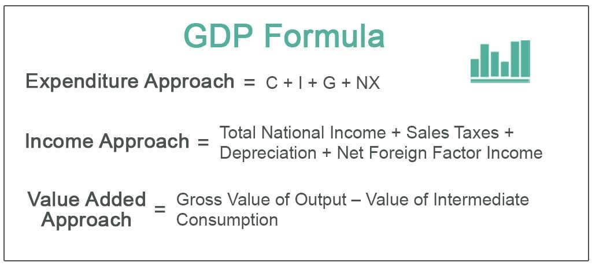

## Table of Contents

## What is Gross Domestic Income (GDI)?

Gross Domestic Income (GDI) is a measure of the total income earned by everyone in a country during a specific period, usually a year. It includes wages, profits, rent, and taxes minus subsidies. GDI is another way to look at the size of a country's economy, similar to Gross Domestic Product (GDP). While GDP focuses on the total value of all goods and services produced, GDI looks at the income received from producing those goods and services.

In theory, GDI should be equal to GDP because they are two sides of the same economic coin. However, due to different data sources and measurement methods, there can be small differences between the two figures. Economists use GDI to get a more complete picture of the economy, especially when trying to understand income distribution and economic health. By comparing GDI and GDP, analysts can better assess the accuracy of economic data and make more informed decisions.

## How does GDI differ from Gross Domestic Product (GDP)?

Gross Domestic Income (GDI) and Gross Domestic Product (GDP) are two ways to measure the size of a country's economy, but they look at it from different angles. GDP is all about the total value of everything that's made or done in a country during a year. It counts up all the goods and services produced, like cars, haircuts, and software. On the other hand, GDI focuses on the income side of things. It adds up all the money people earn from working, running businesses, renting out property, and other sources of income.

Even though GDI and GDP should be the same in theory, they often show slightly different numbers in real life. This happens because they use different ways to collect and calculate data. For example, GDP might use surveys of businesses to estimate production, while GDI might use tax records to figure out income. Economists find it useful to look at both GDI and GDP because it gives them a fuller picture of the economy. By comparing the two, they can check the accuracy of their data and understand things like how income is distributed among people.

## What are the main components of GDI?

Gross Domestic Income (GDI) is made up of several main parts that together show all the money earned in a country. The first big part is wages and salaries, which is the money people get for working. This includes regular pay, bonuses, and other benefits. The second part is the money that businesses make, called profits. This comes from selling goods and services after paying all the costs. Another part is rent, which is the money people get from letting others use their land or buildings.

The next part of GDI is interest, which is the money earned from lending money to others, like when banks lend to people or businesses. There are also taxes that businesses have to pay, minus any subsidies they get from the government. Subsidies are like discounts or help from the government. When you add up all these parts—wages, profits, rent, interest, and taxes minus subsidies—you get the total GDI. This shows how much income is flowing through the economy.

## Can you explain the basic formula for calculating GDI?

The basic formula for calculating Gross Domestic Income (GDI) is pretty straightforward. You add up all the money people earn in a country during a year. This includes wages and salaries, which is what people get paid for working. It also includes profits, which is the money businesses make after paying their costs. Then you add rent, which is what people get for letting others use their land or buildings. Don't forget interest, which is the money earned from lending money to others. Finally, you add taxes that businesses pay, but you subtract any subsidies they get from the government.

So, the formula looks like this: GDI = Wages and Salaries + Profits + Rent + Interest + (Taxes - Subsidies). This formula helps us see all the income flowing through the economy. It's a different way of looking at the economy compared to Gross Domestic Product (GDP), which focuses on what's produced rather than what's earned. Even though GDI and GDP should be the same in theory, they can be a bit different in real life because they use different data to calculate them.

## How is income from self-employment included in GDI?

Income from self-employment is an important part of Gross Domestic Income (GDI). When someone is self-employed, they earn money from running their own business or doing freelance work. This income is included in GDI as part of the "profits" category. It's the money left over after the self-employed person pays for all their business costs, like supplies, rent, and other expenses. So, if you're a self-employed person, the profit you make from your work is counted in the total GDI.

Including self-employment income in GDI helps give a complete picture of all the money earned in a country. It's important because a lot of people work for themselves and their income is a big part of the economy. By adding this income to wages, salaries, rent, interest, and other sources, we get a better understanding of how much money is flowing through the economy. This way, GDI shows not just the income from traditional jobs, but also from people who are their own bosses.

## What role do taxes on production and imports play in GDI?

Taxes on production and imports are a part of Gross Domestic Income (GDI). These taxes are the money that businesses have to pay to the government for making things or bringing goods into the country. When we calculate GDI, we add these taxes because they are a type of income for the government, which is part of the total income earned in the country. So, these taxes help show how much money is coming into the economy from different sources.

However, when we include taxes on production and imports in GDI, we also need to subtract any subsidies that the government gives to businesses. Subsidies are like discounts or help from the government to make it easier for businesses to produce things. By subtracting subsidies from taxes, we get a clearer picture of the net income from these taxes. This way, GDI shows a more accurate total of all the income earned in the country, including what the government gets from taxes on production and imports.

## How are subsidies treated in the GDI calculation?

Subsidies are treated as a deduction in the Gross Domestic Income (GDI) calculation. When figuring out GDI, we add up all the money earned in a country, including taxes that businesses pay. But, if the government gives money back to businesses through subsidies, we need to take that money away from the total. Subsidies are like discounts or help from the government, so they reduce the amount of income that businesses actually keep.

By subtracting subsidies from the taxes on production and imports, we get a clearer picture of the real income in the economy. This helps us see how much money is really flowing through the country, after taking into account the help that businesses get from the government. So, when calculating GDI, we add taxes but then subtract subsidies to make sure the total income is accurate.

## What adjustments are made for depreciation in GDI?

When calculating Gross Domestic Income (GDI), we need to think about depreciation. Depreciation is the wear and tear on things like machines, buildings, and equipment that businesses use to make stuff. Over time, these things lose value and need to be replaced. So, to get a true picture of income, we need to subtract the cost of this depreciation from the total income.

In the GDI calculation, depreciation is taken out from the profits that businesses report. This is because the profits include the money made from using these assets, but we want to see how much real income is left after accounting for the cost of using them up. By making this adjustment, GDI shows a more accurate total of the income earned in the country, reflecting the true economic value after considering the wear and tear on business assets.

## How does statistical discrepancy affect GDI figures?

Statistical discrepancy can make GDI figures a bit different from what they should be. This happens because GDI and GDP are supposed to be the same, but they use different ways to collect data. GDI looks at all the income earned in a country, while GDP looks at all the stuff made and services done. Because they use different sources and methods, there can be small differences between them. These differences are called statistical discrepancies, and they can make GDI numbers a bit off from what they would be if everything was measured perfectly.

Even though these discrepancies are usually small, they can still affect how we see the economy. Economists and analysts pay attention to these differences to check how accurate their data is. If the discrepancy is big, it might mean there's a problem with how the data is collected or calculated. By understanding these discrepancies, economists can make better guesses about the real size and health of the economy. This helps them give better advice to people who make decisions about money and business.

## What data sources are typically used to calculate GDI?

To calculate Gross Domestic Income (GDI), economists use a bunch of different data sources. They look at things like tax records to see how much money people and businesses are [earning](/wiki/earning-announcement). They also use surveys that ask businesses about their profits and costs. Another important source is data from the government about how much they get in taxes and how much they give out in subsidies. All these different pieces of information help put together a full picture of all the income in the country.

Sometimes, they also use data from banks to see how much interest is being earned. And they might look at records of rent payments to figure out how much money people are making from renting out property. By putting all this data together, economists can calculate GDI and get a good idea of how much money is flowing through the economy. This helps them understand how well the country is doing and where the money is coming from.

## How often is GDI data published and by which organizations?

GDI data is usually published every three months, or quarterly. This means you can see new numbers about every three months. The main organization that puts out this data in the United States is the Bureau of Economic Analysis (BEA), which is part of the U.S. Department of Commerce. They work hard to collect all the information and make sure it's right before sharing it with everyone.

In other countries, different groups handle GDI data. For example, in the United Kingdom, it's the Office for National Statistics (ONS) that publishes this information. No matter where you are, these organizations try to give out GDI numbers on a regular schedule so people can keep track of how the economy is doing.

## What are the limitations and potential inaccuracies in GDI calculations?

GDI calculations can have some problems because they use a lot of different information from places like tax records, business surveys, and government data. If any of these sources have mistakes or if the information is not complete, it can make the GDI numbers a bit off. Also, since GDI and GDP are supposed to be the same but use different ways to collect data, there can be small differences between them, called statistical discrepancies. These discrepancies can make it hard to know which number is more accurate.

Another issue is that GDI might not show the whole picture of the economy. For example, it doesn't always count things like the money people make from selling stuff online or doing odd jobs that they don't report to the government. Also, the way GDI is calculated can change over time, which can make it hard to compare numbers from different years. Economists try their best to fix these problems, but it's important to remember that GDI is just an estimate and might not be perfect.

## What is the GDI Formula and how does it relate to Economic Calculations?

Gross Domestic Income (GDI) is a critical economic indicator that provides a comprehensive view of income generated within a nation. The mathematical representation of GDI is:

$$
\text{GDI} = \text{Wages} + \text{Profits} + \text{Rents} + \text{Taxes} - \text{Subsidies}
$$

Each element of this formula reflects a unique aspect of the income distribution within an economy, making it crucial for holistic economic assessments.

**Wages:** This component represents the total compensation paid to employees, including salaries, wages, and benefits. Wages are a substantial part of GDI as they reflect consumer purchasing power and labor market health.

**Profits:** Profits encompass the earnings of businesses after deducting expenses. This measure indicates the overall financial performance of companies and their contribution to the economy. Profits are vital for understanding business cycles and investment potential.

**Rents:** Rents detail the income derived from renting out property assets. This part of GDI gauges the real estate sector's performance and its impact on the broader economy. Variations in rents can signal shifts in property values and demand.

**Taxes:** Taxes compiled in the GDI calculation refer to all levies collected by the government from economic activities within the country. Taxes provide resources for public spending and signal the government's fiscal health.

**Subsidies:** Subsidies are financial support provided by the government to reduce the costs of goods and services. The subtraction of subsidies in the GDI formula adjusts for government intervention that reduces the actual income generated within the economy.

**Example Python Code for GDI Calculation:**
Below is a simplified Python function for calculating GDI, which can be adapted for more complex scenarios using real-world data:

```python
def calculate_gdi(wages, profits, rents, taxes, subsidies):
    gdi = wages + profits + rents + taxes - subsidies
    return gdi

wages = 5000000  # Example figure for wages
profits = 3000000  # Example figure for profits
rents = 1000000  # Example figure for rents
taxes = 2000000  # Example figure for taxes
subsidies = 500000  # Example figure for subsidies

gdi = calculate_gdi(wages, profits, rents, taxes, subsidies)
print(f"The calculated GDI is: {gdi}")
```

Mastering these calculations is essential for professionals seeking to make accurate economic assessments and forecasts. By accurately assessing GDI, analysts can gain insights into economic trends and make informed predictions about future economic conditions.

## References & Further Reading

[1]: ["GDP and GDI: What's the Difference?"](https://www.vox.com/2014/6/20/17587390/gdp-gdi-difference) by Chris B. Murphy, Investopedia.

[2]: ["Advances in Financial Machine Learning"](https://www.amazon.com/Advances-Financial-Machine-Learning-Marcos/dp/1119482089) by Marcos Lopez de Prado

[3]: ["Quantitative Trading: How to Build Your Own Algorithmic Trading Business"](https://www.amazon.com/Quantitative-Trading-Build-Algorithmic-Business/dp/1119800064) by Ernest P. Chan

[4]: ["Economic Indicators for Dummies"](https://www.wiley.com/en-us/Economic+Indicators+For+Dummies-p-9781118163894) by Michael Griffis

[5]: ["Measuring the Economy: A Primer on GDP and the National Income and Product Accounts"](https://www.bea.gov/resources/methodologies/measuring-the-economy) by the Bureau of Economic Analysis

[6]: ["The Little Book of Economics: How the Economy Works in the Real World"](https://archive.org/details/littlebookofecon0000ipgr) by Greg Ip

[7]: ["Algorithmic Trading and DMA: An introduction to direct access trading strategies"](https://archive.org/details/algorithmictradi0000john) by Barry Johnson