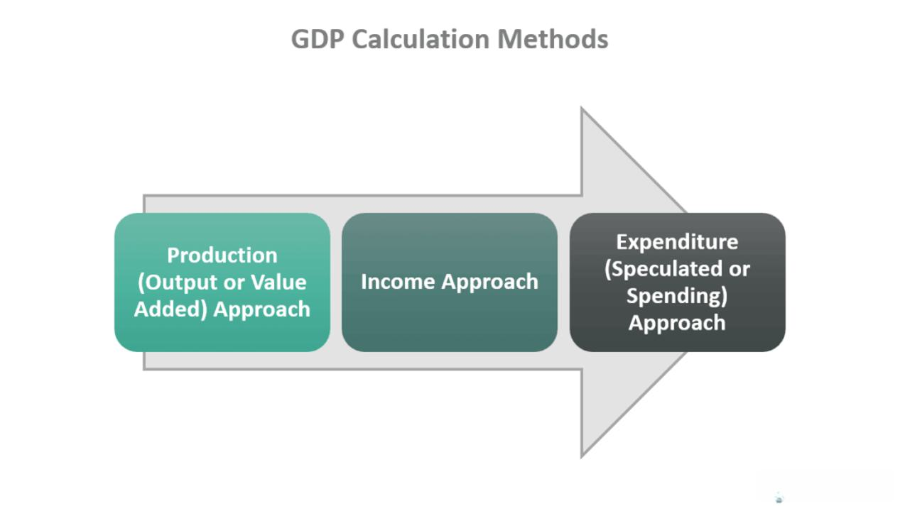

Gross Domestic Product (GDP) is a fundamental economic indicator that quantifies the total monetary value of all finished goods and services produced within a country's borders in a specific time period. It serves as a comprehensive metric to gauge the economic health and performance of a nation, providing insights into the size and growth rate of an economy. Policymakers, investors, and economists rely on GDP as it reflects economic activity and informs decisions related to fiscal policy, investment strategies, and economic development initiatives.

Among the methods for calculating GDP, the Income Approach stands out as a principal strategy. This method calculates GDP by aggregating the incomes earned by factors of production in an economy, namely wages, rents, interest, and profits. By focusing on the income generated by economic activities, the Income Approach offers a perspective on how economic productivity translates into national income.



Algorithmic trading, a prevalent practice in modern financial markets, involves using computer algorithms to automatically execute trading decisions at speeds and frequencies that outperform human traders. These algorithms rely heavily on complex mathematical models and real-time data to identify trading opportunities and optimize investment strategies. Economic calculations, including GDP figures, play a crucial role in these models as they provide essential data points that influence market variables.

The intersection of the Income Approach to GDP and algorithmic trading occurs when traders incorporate GDP data derived from the Income Approach into their trading algorithms. This integration allows traders to evaluate economic conditions through income streams and adjust their trading strategies accordingly. By understanding trends in income components, algorithmic trading systems can anticipate market movements and enhance decision-making processes.

In summary, while GDP serves as a vital tool for assessing economic performance, the Income Approach provides a specific lens through which national productivity can be analyzed. When this approach is combined with the advanced capabilities of algorithmic trading, it creates a powerful synergy that can potentially enhance the accuracy of market predictions and the effectiveness of trading strategies. This evolving interplay highlights the importance of sophisticated economic analysis within contemporary trading systems, inviting further exploration at the convergence of economic theory and financial technology.

## Table of Contents

## Understanding the Income Approach to GDP

The Income Approach is one of the three primary methods utilized for calculating Gross Domestic Product (GDP), fundamentally focusing on summing up the total national income. This method considers the income generated from production within a country during a specific period and includes several key components: wages, rents, interest, and profits.

### Components of the Income Approach

1. **Wages**: This component represents all compensation to employees, including salaries, wages, bonuses, and benefits. Wages are a substantial part of the GDP, as they directly correlate with labor contribution to the economy's productivity.

2. **Rents**: Rents include income earned from leasing land and other properties. It reflects the utilization of natural resources and real estate in economic activities. Rents contribute to GDP by showing the capital's return from fixed assets.

3. **Interest**: This is the income derived from financial assets, such as bonds and savings accounts. Interest represents the cost of borrowing and is crucial for accounting the income from capital employed in production.

4. **Profits**: Profits encompass the earnings of businesses after all expenses have been subtracted from revenue. This includes corporate profits, small business income, and dividends paid to shareholders, indicating the efficiency and effectiveness of businesses in the economy.

### Contribution to Economic Productivity and GDP Calculation

Each component of the Income Approach reflects a different aspect of economic activity, but together, they provide a comprehensive view of the income created through production processes. By aggregating these components, the Income Approach calculates GDP, representing the economy's total income, an essential measure for assessing economic growth and prosperity.

### Differences from Other GDP Calculation Methods

In contrast to the Expenditure Approach and the Production Approach, the Income Approach focuses on income instead of spending or output. The Expenditure Approach calculates GDP by adding up consumption, investment, government spending, and net exports (exports minus imports). Alternatively, the Production Approach estimates GDP by valuating the output of goods and services at market prices.

### Pros and Cons of the Income Approach

The Income Approach offers specific advantages and drawbacks:

**Pros**:
- **Accuracy in Income Measurement**: It provides an accurate account of income distribution within an economy, particularly relevant for income tax analysis and policy-making.
- **Insight into Economic Structure**: By delineating different income sources, it helps analyze the contributions of labor, capital, and entrepreneurship.

**Cons**:
- **Challenges in Data Collection**: Accurately capturing all income types, especially informal or unreported income, can be difficult, impacting the reliability of GDP calculations.
- **Complexity**: The method involves intricate data gathering from numerous sources, necessitating robust statistical infrastructure and methodology.

Overall, while the Income Approach provides detailed insights into the income generation aspect of GDP, its complexity and data accuracy challenges require careful consideration. It complements the other methods to give a holistic understanding of an economy's performance.

## Algorithmic Trading and Economic Indicators

Algorithmic trading, often referred to as algo trading, involves using computer algorithms to automate trading decisions in financial markets. These algorithms can swiftly analyze multiple market variables and execute trades at speeds and frequencies unachievable by human traders. As a result, [algorithmic trading](/wiki/algorithmic-trading) has become increasingly dominant in financial markets, reportedly accounting for over 60% of trading [volume](/wiki/volume-trading-strategy) in major markets like the U.S. stock exchange.

Economic indicators, such as the Gross Domestic Product (GDP), are crucial to shaping algorithmic trading strategies. GDP measures the total economic output of a country and provides a comprehensive indicator of economic health. Fluctuations in GDP can significantly influence market sentiment and asset prices. For instance, a growing GDP might signal a healthy economy, prompting algorithms to prioritize equities, while a contracting GDP might lead them to favor bonds or other low-risk assets.

The success of algorithmic trading heavily relies on the availability and accuracy of real-time economic data. As financial markets react to economic conditions almost instantaneously, traders need access to the latest data to capitalize on emerging trends. For example, when GDP figures are released, they can cause abrupt market movements. Algorithms equipped with real-time GDP data can react almost instantaneously, minimizing latency to exploit these fluctuations.

Big data and [machine learning](/wiki/machine-learning) techniques are increasingly used to enhance GDP-based trading algorithms. Big data allows traders to analyze vast amounts of economic information from various sources, providing a more nuanced understanding of GDP's potential trajectory. Machine learning models can process this data to identify complex, non-linear patterns that might be indicative of future economic performance. These systems can learn from past trading outcomes and refine their strategies, improving the accuracy and efficiency of trading decisions over time.

Python, a popular language for data analysis and algorithmic trading, supports libraries like NumPy and pandas, which are helpful for handling data. For instance, one can use Python to backtest a GDP-based strategy:

```python
import pandas as pd
import numpy as np

# Load GDP data
gdp_data = pd.read_csv('gdp_data.csv')
market_data = pd.read_csv('market_data.csv')

# Simple trading strategy example
def trading_signal(gdp_growth):
    if gdp_growth > 0.03:  # If GDP growth is more than 3%
        return 'buy'
    else:
        return 'sell'

# Apply strategy
gdp_data['Signal'] = gdp_data['GDP_Growth'].apply(trading_signal)

# Backtest:
portfolio_returns = market_data['Returns'] * np.where(gdp_data['Signal'] == 'buy', 1, -1)
cumulative_returns = np.exp(np.log1p(portfolio_returns).cumsum())

print(cumulative_returns.tail())
```

This code exemplifies a simplistic approach where GDP growth rates dictate buy or sell signals, providing a foundational understanding upon which more sophisticated models can be developed. Efforts in this field continue to evolve, leveraging advancements in AI to innovate the integration of GDP and other economic indicators into trading algorithms.

## Connecting Income Approach GDP with Algo Trading

Traders can effectively incorporate Income Approach GDP data into trading models by analyzing how various income components predict economic trends. The Income Approach calculates GDP as the sum of all incomes earned by individuals and businesses in an economy, including wages, rents, interests, and business profits. By focusing on these components, traders can tailor their strategies to anticipate economic shifts.

Historical data analysis reveals that GDP data, particularly when broken down into income components, has influenced market movements significantly. For instance, strong profit figures often correlate with rising stock markets, as they suggest robust corporate health. Conversely, rising interest payments may signal potential inflationary pressures, affecting bond markets negatively. Historical patterns thus provide a backdrop against which traders assess current and future economic conditions.

Automated trading systems leverage GDP growth rates in their decision-making algorithms by employing big data and machine learning models. These systems aim to detect patterns and anomalies in GDP data that may not be immediately apparent through traditional analysis. For example, a machine learning model might use inputs such as changes in wage growth or shifts in rental income to forecast stock performance. Python code utilizing libraries such as pandas for data manipulation and scikit-learn for building predictive models could be deployed to refine these predictions.

```python
import pandas as pd
from sklearn.linear_model import LinearRegression

# Sample code for GDP component analysis
# Data is assumed to be loaded into a pandas DataFrame
def predict_stock_trend(gdp_data):
    model = LinearRegression()

    # Assume 'GDP Growth', 'Wages', 'Profits' are columns in the gdp_data DataFrame
    X = gdp_data[['GDP Growth', 'Wages', 'Profits']]
    y = gdp_data['Stock Market Index']

    model.fit(X, y)
    predictions = model.predict(X)

    return predictions

# Example usage
# stock_trend_pred = predict_stock_trend(your_dataframe)
```

There are several advantages of incorporating the Income Approach into trading strategies. Primarily, it provides a comprehensive view of the economy by considering income sources, allowing traders to predict how money flows within the economy. Additionally, by understanding the connection between income and expenditure, traders can make more informed decisions about future market conditions.

Furthermore, incorporating diverse income streams, such as wages and rents, provides a more nuanced picture of economic activity beyond what overall GDP figures might suggest. For instance, an increase in wage income could indicate higher consumer spending potential, making retail stocks attractive. Likewise, rising business profits might signal increased corporate reinvestment, impacting industrial sector stocks.

In summary, the detailed examination of GDP data through the Income Approach enables traders to construct more robust and flexible trading models. By leveraging historical patterns, machine learning, and component-specific insights, traders can enhance their predictive accuracy and capitalize on emerging economic trends.

## Challenges and Considerations

Using GDP data for algorithmic trading presents several challenges, primarily due to delays in data release and potential revisions. GDP figures are typically released on a quarterly basis and may undergo subsequent revisions as more accurate information becomes available. These revisions can create uncertainty for traders relying on this data to make real-time decisions. For instance, an initial GDP estimate might lead traders to adjust their portfolios, only to face adjustments when the revised data presents a different economic reality.

The accuracy and reliability of GDP data are paramount in algorithmic trading. High-frequency trading algorithms depend on precise and timely information to execute trades effectively. Any discrepancy or error in the data can lead to significant financial losses. Given the complexities involved in collecting comprehensive economic data, inconsistencies can arise, potentially skewing the outputs of trading algorithms.

Market [volatility](/wiki/volatility-trading-strategies) is another critical [factor](/wiki/factor-investing) associated with GDP announcements. The release of GDP data often coincides with increased price fluctuations as traders react to the information. For algorithmic trading systems, which execute trades rapidly based on predefined criteria, this volatility can lead to unexpected outcomes. Algorithms designed to capitalize on slight market movements might trigger a series of trades that exacerbate market swings, resulting in losses.

Mitigating risks in algorithm-based GDP trading requires several strategies. First, traders should implement robust [backtesting](/wiki/backtesting) procedures to understand how their algorithms perform under various market conditions, including periods of high volatility following GDP announcements. Backtesting involves running an algorithm on historical data to evaluate its performance, which helps identify potential weaknesses or unexpected behaviors in the trading model.

Additionally, incorporating machine learning techniques can enhance the resilience of trading systems. Machine learning algorithms can adapt to new data patterns, helping improve predictive accuracy and making strategies more robust against unexpected data shifts. Trading systems can be designed to incorporate a wider array of economic indicators alongside GDP data, such as employment rates or consumer confidence indices, to provide a more comprehensive picture of economic health and reduce reliance on a single metric.

To address potential delays and revisions in GDP data, traders might opt for nowcasting techniques, which predict current economic conditions using real-time data sources and statistical models. Nowcasting updates GDP estimates before official numbers are released, offering a more timely input for trading strategies.

In conclusion, while GDP data is a valuable component for algorithmic trading, traders must navigate delays, revisions, and market volatility associated with its use. By prioritizing data accuracy, employing robust testing practices, and integrating adaptive technologies, traders can mitigate these challenges, leveraging GDP insights for more informed trading decisions.

## Future Prospects and Innovations

As we look to the future, the integration of GDP data into algorithmic trading holds significant promise. Artificial Intelligence (AI) is poised to play a pivotal role in enhancing GDP-based trading algorithms. AI's capabilities in pattern recognition and data processing can be leveraged to analyze GDP data more effectively, offering traders deeper insights and more nuanced strategies. By employing machine learning models, traders can uncover complex relationships between GDP trends and market movements that were previously undetectable. These AI-driven tools are expected to not only improve predictive accuracy but also reduce the cognitive load on human analysts, allowing for more efficient decision-making processes.

Emerging technologies, such as blockchain and advanced data analytics platforms, have the potential to revolutionize GDP data analysis and application. Blockchain offers a decentralized and secure method for GDP data collection and distribution, ensuring data integrity and transparency. This can address issues related to data accuracy and latency, which are crucial for time-sensitive trading decisions. Additionally, the development of advanced analytics platforms enables the handling of vast amounts of economic data. These platforms make use of big data technologies to provide real-time insights and identify correlations at an unprecedented scale, allowing traders to respond swiftly to economic shifts.

The landscape of economic calculations in trading is thus set to evolve significantly. As more sophisticated tools become available, traders will be able to incorporate a richer set of economic data into their models, going beyond traditional metrics to include environmental, social, and governance ([ESG](/wiki/esg-investing)) indicators as part of their decision-making processes. The move towards integrating diverse datasets will offer a more comprehensive view of economic health and market potential.

In summary, the future of GDP data integration with algorithmic trading looks promising, with AI and emerging technologies at the forefront of this transformation. As the tools and methodologies continue to advance, traders will increasingly rely on sophisticated economic analysis to drive their strategies, transforming the landscape of financial markets. This evolution calls for continuous adaptation and innovation from both traders and technologists, ensuring that algorithmic trading remains relevant and robust in an ever-changing economic environment.

## Conclusion

This article has explored the intricate relationship between the Income Approach to Gross Domestic Product (GDP) and algorithmic trading. By dissecting the components of the Income Approach—wages, rents, interest, and profits—our discussion highlighted its unique contributions to understanding economic productivity. The significance of this approach becomes evident when contrasted with other GDP calculation methods, offering distinctive advantages that can be leveraged in trading systems.

Algorithmic trading, with its reliance on real-time data and sophisticated algorithms, benefits immensely from the nuanced insights provided by the Income Approach to GDP. This synergy between economic indicators and trading algorithms exemplifies a modern intersection where economic theory can meet practical market strategy. As traders harness GDP data, particularly from the Income Approach, the potential for nuanced, data-driven trading strategies increases.

The importance of accurate, timely data cannot be overstated as it impacts the efficacy of trading strategies and also mitigates risks associated with algorithmic models during volatile economic announcements. As such, there is a clear imperative for both traders and economists to engage deeply with these concepts, advocating for an interdisciplinary approach that blends economic insights with advanced technological capabilities.

Future advancements in [artificial intelligence](/wiki/ai-artificial-intelligence) and big data analytics promise to further enhance algorithmic trading models, providing even more refined tools for integrating GDP data into market strategies. As the landscape of economic calculations continues to evolve, there is a compelling call to action for professionals in finance and economics alike to deepen their understanding and actively integrate sophisticated economic analysis within trading systems. This proactive engagement is essential for staying ahead in an increasingly complex and data-driven economic environment.

## References & Further Reading

[1]: ["GDP: A Brief but Affectionate History"](https://www.amazon.com/GDP-Affectionate-History-Revised-expanded/dp/0691169853) by Diane Coyle

[2]: Chang, R., & Taylor, A. M. (2019). ["Big Data and Machine Learning in Economics."](https://www.sciencedirect.com/science/article/pii/S0957417421009672) Journal of Economic Perspectives, 33(3), 3-30.

[3]: ["Algorithmic Trading and DMA: An Introduction to Direct Access Trading Strategies"](https://archive.org/details/algorithmictradi0000john) by Barry Johnson

[4]: ["Gross Domestic Product by Income."](https://www.investopedia.com/terms/g/gdp.asp) Bureau of Economic Analysis, U.S. Department of Commerce.

[5]: Dzielinski, M., & Hassler, U. (2012). ["Economic News and the Fast Reaction of Algorithmic Traders"](https://michaldzielinski.com/research/measuring-economic-uncertainty-and-its-impact-on-the-stock-market/). Journal of Banking & Finance, 36(9), 2582-2597.