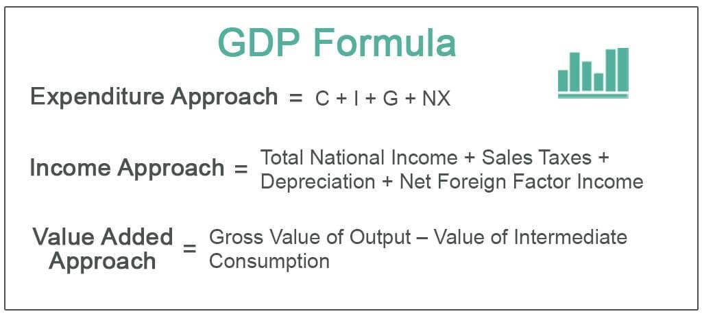

## Table of Contents

## What is Gross Domestic Product (GDP)?

Gross Domestic Product, or GDP, is the total value of all goods and services produced within a country's borders during a specific time period, usually a year. It's like adding up everything that a country makes and does to see how much the whole economy is worth. GDP helps us understand how well a country's economy is doing. If the GDP goes up, it usually means the economy is growing and people are producing more.

There are different ways to calculate GDP, but one common method is to add up all the spending in the economy. This includes what consumers spend on things like food and clothes, what businesses spend on equipment and buildings, what the government spends on services like schools and roads, and the difference between what a country exports and imports. Another way to look at GDP is by adding up all the incomes earned by everyone in the country, including wages, profits, and taxes minus subsidies. Both methods should give you the same total GDP number.

## What is the income approach to calculating GDP?

The income approach to calculating GDP is like adding up all the money everyone in the country earns. This includes wages that people get from their jobs, profits that businesses make, and other incomes like rent and interest. It also includes taxes that businesses pay to the government minus any subsidies they receive. By adding all these up, you get the total income earned in the country, which should equal the GDP.

This method makes sense because all the goods and services produced in the country are made by people and businesses, and they get paid for their work. So, the total income they earn should match the total value of what they produce. It's like looking at the economy from the side of the people who are making things rather than the side of the people who are buying things. Both ways should give you the same number for GDP, showing that what's produced is equal to what's earned.

## What are the main components of GDP under the income approach?

The income approach to calculating GDP involves adding up all the money earned by everyone in the country. This includes the wages that people get from their jobs. Wages are what you earn for working, like your salary or hourly pay. Another big part is the profits that businesses make. When a business sells its products or services for more than it costs to make them, the extra money is called profit. Businesses also pay rent for using land or buildings, and this rent is part of GDP too. Interest earned from loans or savings is another piece of the puzzle. 

Taxes that businesses pay to the government are also included in GDP under the income approach. But we have to subtract any subsidies the government gives to businesses because subsidies are like a discount that reduces the total income. When you add up all these parts—wages, profits, rent, interest, and taxes minus subsidies—you get the total income earned in the country. This total should be the same as the GDP calculated by adding up all the spending on goods and services. It's like looking at the economy from the side of the people who are making things rather than the side of the people who are buying things.

## How is compensation of employees calculated in GDP?

Compensation of employees is a big part of GDP when we use the income approach. It's all the money that workers get paid for their work. This includes their wages and salaries, which is the money they get in their paychecks. But it's not just the money they take home. It also includes things like bonuses, tips, and any extra payments they might get. If a worker gets paid hourly or has a yearly salary, all of that counts as compensation.

There's another part of compensation that's a bit trickier. It's called employer contributions to social security and other benefits. This is the money that employers pay for things like health insurance, retirement plans, and other benefits for their workers. Even though the worker doesn't see this money directly, it's still part of their total compensation. So, when we add up all the wages, salaries, bonuses, tips, and employer contributions, we get the total compensation of employees, which is a key part of figuring out GDP using the income approach.

## What role do gross operating surplus and mixed income play in GDP calculation?

Gross operating surplus and mixed income are important parts of GDP when we use the income approach. Gross operating surplus is the money that businesses make after they pay their workers but before they pay taxes or get any money back from the government. It's like the profit that businesses keep for themselves. This includes money made by both big companies and smaller businesses. When we add up all this surplus from all the businesses in the country, it helps us see how much money businesses are making, which is a big piece of the GDP puzzle.

Mixed income is a bit different. It's used for businesses where it's hard to tell the difference between the money the owner makes as a worker and the money they make as a business owner. This often happens with small businesses or self-employed people. For example, if you run a small shop, the money you make might be a mix of your salary for working in the shop and the profit the shop makes. When we add up all this mixed income, it helps us understand how much money these kinds of businesses are adding to the GDP. Together, gross operating surplus and mixed income give us a full picture of how much money businesses and self-employed people are making, which is key to figuring out the total GDP.

## How are taxes on production and imports accounted for in the income approach?

Taxes on production and imports are included in the income approach to calculating GDP. These taxes are the money that businesses pay to the government for making things or bringing goods into the country. When we add up all these taxes, we see how much money the government is getting from businesses. This helps us understand the total income earned in the country because the taxes are part of what businesses pay out.

But we also have to subtract any subsidies that the government gives to businesses. Subsidies are like discounts that the government gives to help businesses. When we take away these subsidies from the taxes, we get a clearer picture of the net income that businesses are contributing to the GDP. So, taxes on production and imports minus subsidies give us an important part of the total income that makes up the GDP.

## What are subsidies on production and how do they affect GDP?

Subsidies on production are money that the government gives to businesses to help them. It's like a discount or a gift that makes it cheaper for businesses to make things or do their work. The government might give these subsidies to help certain industries, like farming, or to support businesses that are important for the country. When businesses get these subsidies, they don't have to pay as much out of their own pockets, which can help them grow or stay in business.

Subsidies affect GDP because they are subtracted from the taxes that businesses pay. When we calculate GDP using the income approach, we add up all the money earned in the country, including taxes on production and imports. But we also need to subtract the subsidies because they reduce the total amount of money that businesses actually pay to the government. So, if subsidies go up, the GDP might go down a bit because we're taking away more money from the total income. But subsidies can also help the economy grow by supporting businesses, which can lead to more production and higher GDP in the long run.

## How do you adjust for statistical discrepancies when using the income approach?

When we calculate GDP using the income approach, we add up all the money earned in the country. But sometimes, the total we get doesn't exactly match the GDP we get from adding up all the spending. This difference is called a statistical discrepancy. To fix this, we add or subtract a small amount to make the numbers match. It's like balancing a scale to make sure both sides are equal.

This adjustment is important because it helps make our GDP number as accurate as possible. Even though we try to count everything carefully, there can be small mistakes or things we miss. By adjusting for these discrepancies, we get a better idea of how much the whole economy is worth. It's like making sure all the pieces of a puzzle fit together perfectly.

## Can you explain the difference between nominal GDP and real GDP in the context of the income approach?

Nominal GDP is the total value of all the goods and services produced in a country in a year, using the current prices of that year. It's like adding up everything the country makes and sells at today's prices. When we use the income approach, nominal GDP includes all the money earned by everyone in the country, like wages, profits, and taxes, at the prices they get paid that year. If prices go up because of inflation, nominal GDP will go up too, even if the country isn't making more stuff.

Real GDP, on the other hand, takes away the effect of inflation. It shows the total value of what a country produces, but it uses prices from a base year, not the current year. This way, we can see if the country is really making more things or if the numbers are just higher because prices went up. When we use the income approach to calculate real GDP, we adjust all the incomes, like wages and profits, to what they would be worth in the base year. This helps us understand if the economy is actually growing or if it's just that everything costs more.

## How does the income approach to GDP calculation compare to the expenditure and production approaches?

The income approach to calculating GDP adds up all the money earned by everyone in the country. This includes wages people get from their jobs, profits businesses make, rent, interest, and taxes minus subsidies. It's like looking at the economy from the side of the people who are making things. The expenditure approach, on the other hand, adds up all the money spent on goods and services. This includes what people buy, what businesses invest in, what the government spends, and the difference between what a country exports and imports. It's like looking at the economy from the side of the people who are buying things. Both approaches should give the same total GDP number because what's produced and earned should equal what's spent.

The production approach, also called the value-added approach, looks at the value of all the goods and services produced in the country. It adds up the value that each business adds at every step of making something, from raw materials to finished products. This approach focuses on the process of production and how much value is created at each stage. Like the income and expenditure approaches, the production approach should also give the same total GDP number. All three methods—income, expenditure, and production—are different ways to measure the same thing: the total value of everything a country produces in a year.

## What are some common challenges and limitations of using the income approach to calculate GDP?

Using the income approach to calculate GDP can be tricky because it involves adding up all the money everyone in the country earns. One big challenge is making sure you count all the incomes correctly. Wages, profits, rent, interest, and taxes all need to be added up, and if any of these are missed or counted wrong, the GDP number won't be right. Another problem is that some incomes can be hard to measure, like the profits of small businesses or the earnings of self-employed people. These incomes can be mixed together, making it tough to separate what's a wage and what's a profit.

Another limitation is that the income approach might not catch all the economic activity in a country. For example, if people do work that they don't get paid for, like taking care of their family, that work isn't included in the GDP. Also, if people hide their income to avoid taxes, that money won't show up in the GDP calculation either. Adjusting for statistical discrepancies can be another challenge because the income approach numbers might not match the numbers from the expenditure or production approaches. Even though these challenges exist, the income approach is still a useful way to understand how much money is being earned in the economy.

## How can the income approach be used to analyze economic trends and policy impacts on GDP?

The income approach to calculating GDP can help us see how different parts of the economy are doing over time. By looking at the changes in wages, profits, rent, and other incomes, we can tell if people are [earning](/wiki/earning-announcement) more or less money. If wages are going up, it might mean that workers are getting paid more, which could be because the economy is doing well or because of new laws that raise the minimum wage. On the other hand, if profits are going down, it might mean that businesses are having a hard time making money, which could be because of higher costs or less demand for their products. By tracking these trends, we can understand how the economy is changing and what might be causing those changes.

The income approach can also help us see how government policies affect the economy. For example, if the government gives tax breaks to businesses, we might see higher profits in the GDP numbers because businesses have more money to keep. Or if the government raises taxes, we might see lower profits because businesses have to pay more to the government. Changes in social security contributions or subsidies can also show up in the GDP numbers. By looking at how these policy changes affect incomes, we can see if they are helping the economy grow or if they are making things harder for people and businesses. This helps policymakers understand what works and what doesn't, so they can make better decisions in the future.

## References & Further Reading

[1]: ["GDP: A Brief but Affectionate History"](https://www.amazon.com/GDP-Affectionate-History-Revised-expanded/dp/0691169853) by Diane Coyle

[2]: Chang, R., & Taylor, A. M. (2019). ["Big Data and Machine Learning in Economics."](https://www.sciencedirect.com/science/article/pii/S0957417421009672) Journal of Economic Perspectives, 33(3), 3-30.

[3]: ["Algorithmic Trading and DMA: An Introduction to Direct Access Trading Strategies"](https://archive.org/details/algorithmictradi0000john) by Barry Johnson

[4]: ["Gross Domestic Product by Income."](https://www.investopedia.com/terms/g/gdp.asp) Bureau of Economic Analysis, U.S. Department of Commerce.

[5]: Dzielinski, M., & Hassler, U. (2012). ["Economic News and the Fast Reaction of Algorithmic Traders"](https://michaldzielinski.com/research/measuring-economic-uncertainty-and-its-impact-on-the-stock-market/). Journal of Banking & Finance, 36(9), 2582-2597.