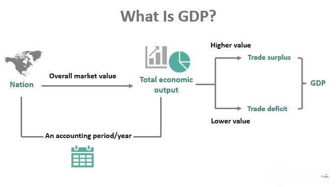

## Table of Contents

## What is Gross Domestic Product (GDP)?

Gross Domestic Product, or GDP, is the total value of all goods and services produced within a country's borders in a specific time period, usually a year. It's like adding up everything that people and businesses make or do, from cars and computers to haircuts and hamburgers. GDP is an important measure because it helps us understand how well a country's economy is doing. If the GDP is growing, it usually means the economy is getting stronger and more people might be working.

GDP can be calculated in different ways, but one common method is to add up all the spending in the economy. This includes what consumers spend on goods and services, what businesses invest in things like buildings and equipment, what the government spends, and the difference between what a country exports and imports. Another way to look at GDP is by adding up all the incomes earned by everyone in the country, including wages, profits, and taxes minus subsidies. Both methods should give you the same total GDP number.

## Why is GDP important for measuring a country's economy?

GDP is important because it tells us how big and how fast a country's economy is growing. It's like a scorecard for the economy. When GDP goes up, it usually means more people are working and making things, which is good for the country. If the GDP stays the same or goes down, it might mean the economy is not doing well, and people might be struggling to find jobs or buy things they need.

People also use GDP to compare how different countries are doing. If one country's GDP is growing faster than another's, it might be a sign that its economy is stronger. Governments and businesses look at GDP to make decisions about where to spend money or invest. For example, if a country's GDP is growing, the government might decide to build new roads or schools, knowing that the economy can support these projects.

## What are the different types of GDP?

There are three main types of GDP that people talk about: nominal GDP, real GDP, and GDP per capita. Nominal GDP is the total value of all goods and services produced in a country, using the current prices. It's like adding up everything made without adjusting for price changes. Real GDP is a bit different because it takes into account changes in prices over time. It uses a special set of prices from a certain year, called the base year, to make sure we're comparing apples to apples when looking at GDP from different years. This helps us see if the economy is really growing or if it's just that prices are going up.

GDP per capita is another type of GDP that looks at how much each person in the country would get if the GDP were divided equally among everyone. It's like taking the total GDP and dividing it by the number of people in the country. This helps us understand the average wealth or income of people in that country. Each of these types of GDP gives us a different way to look at how well an economy is doing, and they all help us understand the economy a bit better.

## What is the basic formula for calculating GDP?

The basic formula for calculating GDP is GDP = C + I + G + (X - M). In simple terms, this means you add up all the spending in the economy. C stands for consumer spending, which is what people spend on things like food, clothes, and entertainment. I stands for investment, which is what businesses spend on things like new buildings or equipment. G is for government spending, which includes things like building roads or paying for schools. X is exports, or the value of goods and services sold to other countries, and M is imports, or the value of goods and services bought from other countries. You subtract imports from exports because imports are not produced within the country's borders.

Another way to think about calculating GDP is by looking at all the income earned in the country. This method is called the income approach, and it adds up wages, profits, rents, and taxes minus subsidies. Both the spending approach and the income approach should give you the same total for GDP, because in a healthy economy, what people earn is what they spend. These formulas help us understand the size and health of an economy by showing how much money is moving around.

## How does the expenditure approach to calculating GDP work?

The expenditure approach to calculating GDP is like adding up all the money spent in a country. It looks at four main types of spending: what people spend on things like food and clothes, what businesses spend on things like new buildings and equipment, what the government spends on things like schools and roads, and the difference between what a country sells to other countries and what it buys from them. If you add up all this spending, you get the total GDP.

This approach makes sense because when someone buys something, that money goes to the person or business that made it. So, all the spending in a country adds up to the total value of everything produced. Economists use this method because it's a straightforward way to measure how much economic activity is happening. It helps us see if people are buying more or less, if businesses are investing, and if the government is spending a lot or a little.

## What is the income approach to calculating GDP and how is it different from the expenditure approach?

The income approach to calculating GDP is like adding up all the money that people and businesses earn in a country. It includes things like wages that workers get paid, profits that businesses make, rent that people pay for using land or buildings, and taxes that the government collects minus any subsidies it gives out. When you add up all these different kinds of income, you get the total GDP. This method works because all the money that's earned in the country comes from the goods and services that are produced.

The income approach is different from the expenditure approach because it looks at money from the other side. Instead of adding up all the spending, it adds up all the earnings. But both methods should give you the same total GDP because, in a healthy economy, what people and businesses earn is what they spend. The expenditure approach focuses on spending by consumers, businesses, the government, and the difference between exports and imports. The income approach, on the other hand, focuses on where that money ends up, in the form of wages, profits, rents, and taxes. Both methods are useful for understanding how an economy works, but they give us different perspectives on the same thing.

## Can you explain the production approach to GDP calculation?

The production approach to calculating GDP is like adding up the value of everything that's made in a country. Imagine you're making a cake. You start with ingredients like flour and sugar, which have some value. When you bake the cake, it's worth more than the sum of its parts because you've added your time and skill to it. In the same way, businesses take raw materials and turn them into finished goods and services. The production approach adds up the value added at each step of making things, from raw materials to the final product. This way, we can see how much value is created in the economy.

This method is different from the expenditure and income approaches because it focuses on the actual production process. Instead of looking at how much people spend or earn, it looks at what businesses and workers produce. It's like counting all the cakes, cars, and haircuts made in a country and adding up their value. Even though it's a different way of looking at things, the production approach should give the same total GDP as the other methods because they're all measuring the same economy, just from different angles.

## What are the components of GDP in the expenditure method?

The expenditure method for calculating GDP adds up all the spending in a country. It has four main parts: what people spend on things like food and clothes, what businesses spend on things like new buildings and equipment, what the government spends on things like schools and roads, and the difference between what a country sells to other countries and what it buys from them. When you add up all this spending, you get the total GDP.

This method works because when someone buys something, that money goes to the person or business that made it. So, all the spending in a country adds up to the total value of everything produced. Economists use this method because it's a straightforward way to measure how much economic activity is happening. It helps us see if people are buying more or less, if businesses are investing, and if the government is spending a lot or a little.

## How do you adjust GDP for inflation to get real GDP?

To adjust GDP for inflation and get real GDP, you need to use a special set of prices from a certain year, called the base year. Imagine you're comparing the price of a burger from last year to this year. If the burger cost $5 last year and $6 this year, you need to use last year's price to see if more burgers are being made, not just if they cost more. So, you take this year's number of burgers and multiply it by last year's price to see the real value.

This helps us understand if the economy is really growing or if prices are just going up. If nominal GDP, which uses current prices, goes up a lot but real GDP, which uses the base year's prices, stays the same, it means prices are going up but not more things are being made. By using real GDP, we can see the true growth of the economy, without the effects of inflation making it look bigger than it is.

## What are the limitations of using GDP as a measure of economic welfare?

GDP is a good way to see how big an economy is, but it doesn't tell the whole story about how well people are doing. It counts all spending the same, even if it's on things that might not make people happier or healthier. For example, if there's a lot of pollution, people might have to spend more on medicine, which makes GDP go up, but it doesn't mean their lives are better. GDP also doesn't count things that don't have a price tag, like the time parents spend with their kids or the beauty of nature. So, a country might have a high GDP, but if people are unhappy or the environment is bad, it doesn't show that.

Another problem with GDP is that it doesn't show how money is shared among people. A country might have a big GDP, but if most of the money goes to just a few people, many others might still be poor. GDP also doesn't tell us about things like how safe people feel, how much free time they have, or how good their schools are. These things are important for how well people live, but they don't show up in GDP numbers. So, while GDP is useful for understanding the size of an economy, it's not perfect for measuring how well people are doing overall.

## How can GDP data be used for economic forecasting and policy-making?

GDP data is like a crystal ball for economists and policymakers. They use it to guess what might happen next in the economy. If GDP is growing fast, it might mean that people are buying more stuff and businesses are making more things. This could be a sign that the economy will keep growing, and maybe more people will get jobs. But if GDP is not growing or even shrinking, it might mean that people are not spending as much, and businesses might start to worry. Economists can use this information to make predictions about the future, like whether there might be a recession or a boom.

Policymakers also use GDP data to make important decisions. If they see that GDP is growing slowly or not at all, they might decide to spend more money on things like building roads or helping people find jobs. This is called fiscal policy. On the other hand, if GDP is growing too fast and prices are going up a lot, they might decide to raise interest rates to slow things down. This is called monetary policy. By looking at GDP numbers, policymakers can try to keep the economy on a steady path, making sure it grows without getting out of control.

## What are some advanced statistical methods used to refine GDP estimates?

Economists use fancy math to make GDP numbers more accurate. One way they do this is by using something called "seasonal adjustment." This means they take out the effects of things that happen every year, like more spending during holidays or less spending in winter. By doing this, they can see the real changes in the economy, not just the normal ups and downs. Another method is called "chain linking," which helps compare GDP from different years even if prices have changed a lot. It's like using a chain to connect different pieces of information, making sure everything lines up right.

They also use "input-output analysis" to understand how different parts of the economy affect each other. Imagine you're making a cake and you need flour, sugar, and eggs. Input-output analysis looks at how much of each ingredient is used and how it affects the whole economy. This helps economists see the big picture and make better guesses about GDP. By using these advanced methods, they can get a clearer and more detailed view of how the economy is doing, which helps them make better decisions and predictions.

## What is GDP and why is it important?

Gross Domestic Product (GDP) stands as a pivotal metric in evaluating the economic vitality of a nation. By encapsulating the total market value of all finished goods and services produced within a country's borders over a specific period, GDP offers a comprehensive snapshot of economic performance. This measurement is crucial for policymakers, investors, and analysts seeking to understand a nation's economic trajectory and formulate informed strategies.

There are three primary approaches to calculating GDP: the expenditure method, the production (or output) method, and the income method.

1. **Expenditure Method**: This approach calculates GDP by aggregating total spending on the nation’s final goods and services over a specified period. The formula is typically expressed as:
$$
   \text{GDP} = C + I + G + (X - M)

$$

   Here, $C$ represents consumption by households, $I$ stands for investment by businesses, $G$ denotes government spending, and $X - M$ is net exports (exports minus imports).

2. **Production Method**: Also known as the output method, this calculates GDP by adding up the value added at each stage of production of all final goods and services. In essence, it reflects the difference between the output of goods and services and the intermediate consumption required to produce them.

3. **Income Method**: This method sums up the total national income, including wages, profits, rents, and taxes minus subsidies. The idea is that the output’s total value is equivalent to the income generated by producing it.

Each method provides a different lens through which GDP can be viewed, yet they should theoretically yield the same GDP figure when accurately calculated.

Adjustments for inflation are essential for accurately representing an economy's growth. Nominal GDP measures a country's economic output based on current prices, without correcting for inflation. However, real GDP adjusts for inflation, providing a more accurate depiction of an economy's true growth by valuing all goods and services produced at constant prices. The deflator, which is the ratio of nominal GDP to real GDP multiplied by 100, helps differentiate between these two figures.

Moreover, GDP per capita, which divides the GDP by the total population, serves as an important indicator of living standards. It allows for cross-country comparisons by reflecting the average economic output per person, thus adjusting for population differences.

Overall, understanding GDP through these varied approaches and adjustments allows for a nuanced interpretation of economic performance and living standards, enabling stakeholders to make well-grounded decisions.

## What are the types and components of GDP?

Gross Domestic Product (GDP) offers two principal types of measurement: nominal GDP and real GDP. Nominal GDP represents the total market value of goods and services produced in a country, valued at current prices during the period of measurement. Hence, it does not account for inflation or deflation and can be inflated by price increases over time, potentially distorting economic analysis. In contrast, real GDP adjusts for changes in price levels by employing a base year's prices, thereby providing a clearer picture of economic growth and productivity by focusing solely on [volume](/wiki/volume-trading-strategy) changes rather than value changes.

$$
\text{Real GDP} = \frac{\text{Nominal GDP}}{\text{GDP Deflator}} \times 100
$$

GDP per capita further refines this analysis by dividing the GDP by the country's population, offering insights into the average economic output per person. This measurement is crucial for comparing economic productivity and living standards across countries, as it normalizes GDP figures by accounting for population size.

The calculation of GDP comprises four main components, each reflecting different facets of economic activity:

1. **Consumer Spending (C)**: This component represents expenditures by households and non-profit institutions on goods and services. Typically, it is the largest part of GDP and includes expenditures on non-durable goods, durable goods, and services. Increased consumer spending generally indicates a healthy, expanding economy.

2. **Government Spending (G)**: This encompasses government consumption expenditures and gross investment on goods and services that directly benefit the public, such as infrastructure and defense services. Government spending can stabilize an economy during downturns by sustaining demand, though excessive spending might lead to budget deficits.

3. **Investments (I)**: This category includes business investments in capital goods, residential construction, and inventory changes. It reflects the private sector's anticipation of future economic conditions. Higher investment levels generally suggest future growth, as businesses expand capabilities to meet anticipated demand.

4. **Net Exports (NX)**: The value of a country’s exports minus its imports defines this component. A positive net export indicates a trade surplus, contributing positively to GDP, whereas a negative net export (a trade deficit) detracts from GDP. Trade balances have significant implications on currency strength and economic policy.

These components collectively formulate the GDP using the expenditure approach:

$$
\text{GDP} = C + G + I + (X - M)
$$

where $X$ represents exports and $M$ imports. Each component's variations shed light on different economic behaviors and policies impacting overall economic health. Accurate analysis through the lens of GDP helps policymakers, economists, and investors understand economic strengths and determine appropriate economic strategies.

## References & Further Reading

[1]: ["GDP: A Brief but Affectionate History"](https://www.jstor.org/stable/j.ctvc77mfx) by Diane Coyle

[2]: Bureau of Economic Analysis. ["GDP and the Economy"](https://apps.bea.gov/scb/issues/2024/10-october/pdf/1024-gdp-economy.pdf). U.S. Department of Commerce.

[3]: Mankiw, N. G. (2019). ["Macroeconomics"](https://books.google.com/books/about/Principles_of_Macroeconomics_9th_Edition.html?id=Hm22EAAAQBAJ). Worth Publishers.

[4]: ["Algorithmic Trading: Winning Strategies and Their Rationale"](https://www.wiley.com/en-us/Algorithmic+Trading%3A+Winning+Strategies+and+Their+Rationale-p-9781118460146) by Ernest P. Chan

[5]: Jorgenson, D. W., & Landefeld, S. J. (Eds.). (2006). ["A New Architecture for the U.S. National Accounts"](https://www.nber.org/system/files/chapters/c0132/c0132.pdf). University of Chicago Press.