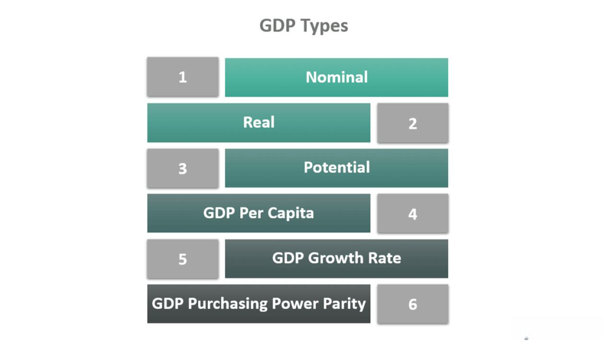

## Table of Contents

## What is Gross Domestic Product (GDP)?

Gross Domestic Product, or GDP, is the total value of all goods and services produced within a country's borders in a specific time period, usually a year. It's like a big scoreboard that shows how much a country's economy is producing. GDP helps us understand if a country's economy is growing, shrinking, or staying the same. For example, if a country makes more cars, grows more food, and provides more haircuts this year than last year, its GDP will be higher.

GDP is important because it gives us a snapshot of a country's economic health. Governments and businesses use GDP to make decisions. If GDP is growing, it might mean more jobs and higher incomes for people. But if GDP is shrinking, it could mean fewer jobs and lower incomes. Economists also look at GDP to compare how different countries are doing. For example, if one country's GDP is growing faster than another's, it might be seen as a better place to invest money.

## How is GDP calculated?

GDP can be calculated in a few different ways, but one common method is called the expenditure approach. This method adds up all the money spent on goods and services in a country during a year. It includes spending by households on things like food and cars, spending by businesses on things like new factories and computers, spending by the government on things like schools and roads, and spending by foreigners on the country's exports minus what the country spends on imports from other countries. When you add all these up, you get the total GDP.

Another way to calculate GDP is the income approach. This method adds up all the income earned by everyone in the country during a year. This includes wages earned by workers, profits earned by businesses, rent earned by landlords, and interest earned by people who lend money. The idea is that all the money spent on goods and services eventually ends up as income for someone, so the total income should equal the total spending, which is the GDP. Both methods should give the same result, but in practice, there might be small differences because of how data is collected and reported.

## Why is GDP important for economists?

GDP is super important for economists because it's like a big thermometer for a country's economy. It tells them if the economy is getting hotter, meaning it's growing, or if it's cooling down, meaning it's shrinking. When economists see that GDP is growing, they know that more goods and services are being made and sold, which usually means more jobs and more money for people. On the other hand, if GDP is shrinking, it can mean fewer jobs and less money for people, which can be a sign that the economy is in trouble.

Economists also use GDP to compare how different countries are doing. If one country's GDP is growing faster than another's, it might be seen as a better place to invest money or start a business. GDP helps economists make predictions about the future too. If they see GDP growing steadily, they might predict that the economy will keep doing well. But if GDP starts to fall, they might warn that tough times could be ahead. So, GDP is a really useful tool for understanding and predicting what's happening in the world of money and business.

## How does GDP influence government policy?

GDP helps governments decide what to do to make the country better. If GDP is growing, the government might feel good about the economy and might spend more money on things like schools, hospitals, and roads. They might also lower taxes to help people and businesses keep more of their money. But if GDP is not growing or is shrinking, the government might worry that the economy is in trouble. They might then try to help the economy by spending more money themselves or by cutting taxes to encourage people and businesses to spend more.

Governments also use GDP to see if their policies are working. If they start a new program to help businesses and then see GDP grow, they might think the program is a good idea. But if GDP doesn't grow, they might change their plans. GDP is like a report card for the government's economic policies. It helps them know if they are doing a good job or if they need to try something different to help the country's economy.

## What is the difference between nominal GDP and real GDP?

Nominal GDP and real GDP are two ways to measure the total value of goods and services produced in a country. Nominal GDP is the total value of everything produced in a year, using the prices from that same year. So, if the price of a car goes up, nominal GDP will go up too, even if the same number of cars are made. It's like looking at the economy without taking off your sunglasses – you see everything, but the brightness can make things look different.

Real GDP, on the other hand, adjusts for changes in prices over time. It uses the prices from a base year to measure the value of goods and services. This way, if the price of a car goes up but the same number of cars are made, real GDP won't change. Real GDP is like looking at the economy with clear glasses – you see how much is really being produced, without the price changes making things look different. Economists usually prefer to use real GDP because it gives a clearer picture of whether the economy is growing or shrinking.

## How does GDP growth affect investment decisions?

When a country's GDP is growing, it usually means more people are working and [earning](/wiki/earning-announcement) money. This can make investors feel good about putting their money into that country. They might think that businesses will do well and make more profits, so they buy stocks or start new projects. A growing GDP can also mean that the government is doing well and might not need to raise taxes or borrow a lot of money, which is good for investors too.

On the other hand, if GDP growth is slow or shrinking, investors might worry. They might think that businesses will struggle and make less money, so they might sell their stocks or hold off on new projects. A shrinking GDP can also make investors worry that the government might raise taxes or borrow more money, which can make investing riskier. So, GDP growth is a big deal for investors because it helps them decide where and when to put their money.

## What are the limitations of using GDP as an economic indicator?

GDP is a great tool for understanding how an economy is doing, but it has some limitations. One big problem is that GDP doesn't tell us everything about how people are doing. It counts all the money spent, but it doesn't care if that money is making people happier or healthier. For example, if a country spends a lot of money on cleaning up after a natural disaster, that makes GDP go up, but it doesn't mean people are better off. Also, GDP doesn't count things like volunteer work or taking care of family members at home, even though these things are important for society.

Another limitation is that GDP doesn't show how fair the economy is. It adds up all the money spent, but it doesn't say anything about who is spending it. If a few rich people are spending a lot of money while many others are struggling, GDP might look good, but most people aren't doing well. Plus, GDP doesn't tell us anything about the environment. If a country is growing its economy by using up a lot of natural resources or polluting the air and water, GDP won't show that the country might be hurting its future. So, while GDP is useful, it's important to look at other things too to get a full picture of how a country is doing.

## How does GDP per capita relate to the standard of living?

GDP per capita is a way to measure how much money each person in a country would get if all the money made in a year was shared equally. It's like taking the whole GDP and dividing it by the number of people in the country. This number can tell us something about the standard of living, which is how well people live in terms of having enough money for food, a home, and other things they need.

But, GDP per capita is not a perfect way to measure the standard of living. It doesn't show if the money is shared fairly among people. In some countries, a few people might have a lot of money while many others have very little. Also, GDP per capita doesn't count things that make life better but don't cost money, like clean air, good health, and time with family and friends. So, while GDP per capita can give us a rough idea of how well people are doing, it's important to look at other things too to really understand their standard of living.

## What is the impact of GDP on currency valuation?

When a country's GDP is growing, it often makes its currency stronger. This is because a growing GDP means the country's economy is doing well, and people from other countries might want to invest there. When more people want to buy a country's currency to invest, the demand for that currency goes up, which makes its value go up too. For example, if the United States has a growing GDP, more people might want to buy dollars to invest in American businesses, making the dollar stronger compared to other currencies.

On the other hand, if a country's GDP is shrinking, it can make its currency weaker. A shrinking GDP means the economy is not doing well, and investors might not want to put their money there. When fewer people want to buy a country's currency, the demand for it goes down, which makes its value go down too. For instance, if Japan's GDP is shrinking, fewer people might want to buy yen, making the yen weaker compared to other currencies. So, GDP can have a big impact on how strong or weak a country's currency is.

## How do economists use GDP to predict economic cycles?

Economists use GDP to predict economic cycles by looking at how it changes over time. They watch to see if GDP is growing steadily, which means the economy is in a good phase, often called an expansion. If GDP growth starts to slow down, economists might predict that the economy is heading into a slowdown or a recession. By comparing current GDP growth rates with past patterns, economists can make guesses about what might happen next. For example, if GDP has been growing for a long time but starts to drop, they might warn that a recession could be coming.

Another way economists use GDP to predict economic cycles is by looking at different parts of GDP, like consumer spending, business investment, and government spending. If consumer spending is going up, it might mean the economy will keep growing. But if business investment starts to drop, it could be a sign that businesses are worried about the future, and a slowdown might be on the way. By putting all these pieces together, economists can get a better idea of where the economy is headed and help prepare for what might come next.

## What role does GDP play in international trade and global economics?

GDP is important for international trade and global economics because it shows how big and strong a country's economy is. When a country has a high GDP, it means it is making and selling a lot of goods and services. This can make other countries want to trade with it more. For example, if the United States has a high GDP, other countries might want to buy more American products like cars and computers. Also, a high GDP can make a country's currency stronger, which can make its products more expensive for other countries to buy. But it can also make it easier for the country to buy things from other places because its money is worth more.

GDP also helps countries decide how much to trade with each other. If a country's GDP is growing, it might want to buy more things from other countries to keep its economy growing. But if a country's GDP is shrinking, it might try to sell more things to other countries to make money. This can affect global economics because when one country's GDP goes up or down, it can change how much it trades with other countries. For example, if China's GDP is growing, it might buy more oil from Saudi Arabia, which can affect oil prices around the world. So, GDP is a big deal in deciding how countries trade with each other and how the global economy works.

## How can alternative measures complement GDP in economic analysis?

GDP is a great way to see how much money a country is making, but it doesn't tell the whole story. That's where other measures come in to help. For example, the Human Development Index (HDI) looks at things like how healthy people are, how much education they have, and how much money they make. This can show if people's lives are getting better, even if the country's GDP isn't growing a lot. Another measure is the Genuine Progress Indicator (GPI), which tries to see if the economy is really making people happier by counting things like volunteer work and the cost of pollution. These measures can help us see if the economy is good for everyone, not just good for making money.

Using these other measures along with GDP can give us a fuller picture of how a country is doing. For instance, if GDP is going up but the GPI is going down, it might mean that the country is making more money but people aren't happier because of things like pollution or not having enough time for family. Or if HDI is going up even if GDP is staying the same, it might mean that people are getting healthier and more educated, which is good even if the country isn't making more money. By looking at all these different measures together, we can understand the economy better and make better decisions about how to help people live better lives.

## What is GDP and why is it important?

Gross Domestic Product (GDP) stands as a fundamental economic indicator that measures the total value of goods and services produced within a country’s borders over a specific period, typically a year or a quarter. This comprehensive metric reflects the economic output and is crucial for understanding the economic performance of a nation. It offers valuable insights into whether an economy is expanding or contracting.

Economists utilize GDP data to assess the overall health of the economy. When GDP increases, it typically indicates economic growth, suggesting that businesses are producing more goods and services, employment levels are rising, and the standard of living may be improving. Conversely, a decline in GDP can signal economic contraction, pointing to potential issues such as reduced production, higher unemployment, and decreased consumer spending.

For investors, GDP trends are vital for making informed market predictions. Economic growth, as revealed through rising GDP figures, often correlates with higher corporate profits and potentially rising stock prices, encouraging investment in equities. In contrast, during periods of economic stagnation or recession, reflected in declining GDP figures, investors might shift their focus towards more conservative investments such as bonds, which are typically seen as safer during economic downturns. This practice of adjusting investment portfolios in response to GDP trends underscores the importance of GDP as an economic compass.

A comprehensive understanding of GDP also requires distinguishing between its two primary measurements: nominal and real GDP. Nominal GDP is calculated at current market prices and does not account for inflation or deflation. While it provides a snapshot of economic output at current prices, it may not accurately reflect changes in the [volume](/wiki/volume-trading-strategy) of goods and services produced. Real GDP addresses this issue by adjusting for inflation, offering a more accurate representation of an economy’s true growth by maintaining constant prices across different periods.

The formula for nominal GDP is straightforward: 

$$
\text{Nominal GDP} = \sum (P_t \times Q_t)
$$

where $P_t$ is the current price level and $Q_t$ is the quantity of goods and services. Real GDP, on the other hand, is calculated by using constant prices from a base year:

$$
\text{Real GDP} = \sum (P_b \times Q_t)
$$

where $P_b$ is the price from the base year. The adjustment for inflation provides an indispensable tool for economic evaluations, as it allows for the comparison of economic output over time without the distorting effects of price changes.

In summary, GDP serves as a vital indicator for gauging the economic health of a country. Its ability to highlight trends in economic growth or contraction makes it indispensable for both economists and investors. Understanding the distinction between nominal and real GDP is crucial for accurate economic assessment and informed decision-making in both policy and investment arenas.

## References & Further Reading

[1]: Mankiw, N. G. (2020). ["Principles of Economics"](https://books.google.com/books/about/Principles_of_Economics.html?id=KQfFDwAAQBAJ). Cengage Learning.

[2]: Allen, F., & Karjalainen, R. (1999). ["Using Genetic Algorithms to Find Technical Trading Rules"](https://www.sciencedirect.com/science/article/pii/S0304405X9800052X). Journal of Financial Economics, 51(2), 245-271.

[3]: Chinn, M. D., & Kucko, K. (2015). ["The Predictive Power of the Yield Curve across Countries and Time"](https://www.ssc.wisc.edu/~mchinn/Chinn_Kucko_IF2015.pdf). Journal of Economic Perspectives, 29(1), 167-190.

[4]: DeLong, J. B., & Magin, K. (2006). ["The U.S. Equity Return Premium: Past, Present, and Future"](https://pubs.aeaweb.org/doi/pdfplus/10.1257/jep.23.1.193). Journal of Economic Perspectives, 21(3), 193-208.

[5]: Carlin, B. P., & Chib, S. (1995). ["Bayesian Model Choice via Markov Chain Monte Carlo Methods"](https://www.jstor.org/stable/2346151). Journal of the Royal Statistical Society: Series B (Methodological), 57(3), 473-484.