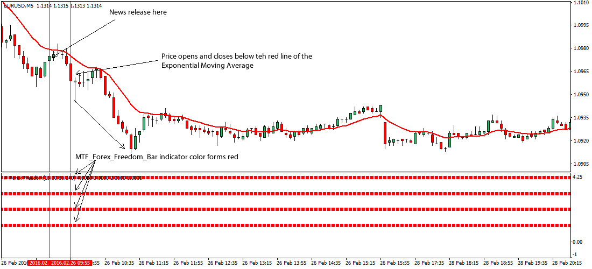

## Table of Contents

## What is Gross Domestic Product (GDP) and why is it important for trading?

Gross Domestic Product, or GDP, is the total value of all goods and services produced within a country's borders in a specific time period, usually a year. It's like adding up everything a country makes and does, from cars and computers to haircuts and hamburgers. GDP is a big number that helps us understand how well a country's economy is doing. If the GDP is growing, it usually means the economy is doing well, and people are making and buying more stuff.

GDP is important for trading because it gives traders and investors a good idea of a country's economic health. When a country's GDP is growing, it often means that businesses are doing well, and people have more money to spend. This can make the country's currency stronger, which is good for traders who are buying and selling that currency. On the other hand, if a country's GDP is shrinking, it might mean that the economy is struggling, and the currency could become weaker. Traders use GDP numbers to make decisions about where to invest their money and which currencies to trade.

## How can GDP data influence financial markets?

GDP data can have a big impact on financial markets because it tells investors how well a country's economy is doing. When a country's GDP goes up, it usually means the economy is growing, and people are making and spending more money. This good news can make investors feel more confident, so they might buy more stocks and other investments from that country. This can push up the prices of stocks and make the country's currency stronger. On the other hand, if GDP numbers are lower than expected, it can make investors worried. They might start selling their investments, which can cause stock prices to drop and the currency to weaken.

Financial markets also react to GDP data because it helps predict what central banks might do next. Central banks, like the Federal Reserve in the U.S., control interest rates and can influence the economy. If GDP is growing fast, the central bank might raise interest rates to keep inflation in check. Higher interest rates can attract more foreign investors looking for better returns, which can boost the value of the country's currency. But if GDP is shrinking, the central bank might lower interest rates to help the economy grow again. Lower interest rates can make the currency less attractive to foreign investors, which might cause it to lose value. So, GDP data is a key piece of information that traders and investors watch closely to make their decisions.

## What are the key components of GDP that traders should monitor?

When traders look at GDP, they should pay attention to four main parts: consumer spending, business investment, government spending, and net exports. Consumer spending is all the money people spend on things like food, clothes, and cars. It's a big part of GDP because when people buy more stuff, it helps the economy grow. Business investment is when companies spend money on new factories, machines, or buildings. If businesses are investing a lot, it's a sign they think the economy will do well. Government spending includes money the government spends on things like schools, roads, and defense. This spending can help boost the economy. Net exports are the difference between what a country sells to other countries and what it buys from them. If a country sells more than it buys, it's good for GDP.

Traders should watch these parts of GDP because changes in them can tell a lot about where the economy is headed. For example, if consumer spending goes up, it might mean people feel good about their jobs and the future, which could make the economy grow faster. If business investment is down, it might mean companies are worried about the future, and the economy could slow down. Government spending can also change a lot from year to year, and big changes can have a big impact on GDP. Net exports can be affected by things like the value of the country's currency or trade deals with other countries. By keeping an eye on these key parts of GDP, traders can get a better idea of what might happen next in the economy and make smarter trading decisions.

## How do traders use GDP growth rates to make trading decisions?

Traders use GDP growth rates to make trading decisions by looking at how fast or slow the economy is growing. If the GDP growth rate is higher than expected, it usually means the economy is doing well. This good news can make traders feel more confident, so they might buy more stocks or invest in the country's currency, thinking it will get stronger. On the other hand, if the GDP growth rate is lower than expected, it can make traders worried. They might start selling their investments, which can cause stock prices to drop and the country's currency to weaken.

Traders also use GDP growth rates to guess what central banks might do next. If the GDP is growing fast, the central bank might raise interest rates to keep the economy from overheating. Higher interest rates can make the country's currency more attractive to foreign investors, which can push its value up. But if the GDP growth rate is low or shrinking, the central bank might lower interest rates to help the economy grow again. Lower interest rates can make the currency less attractive, which might cause its value to drop. By watching GDP growth rates, traders can make better guesses about future economic moves and adjust their trading strategies accordingly.

## What are the differences between nominal and real GDP, and how do they affect trading strategies?

Nominal GDP is the total value of all goods and services produced in a country without adjusting for inflation. It's like looking at the price tags of everything made in a year. Real GDP, on the other hand, takes inflation into account, so it shows the actual increase or decrease in the value of goods and services. It's like looking at how much more or less stuff a country is making, not just how much prices have gone up. Traders need to know the difference because nominal GDP can be misleading if prices are going up a lot, while real GDP gives a clearer picture of the economy's true health.

When traders are making decisions, they often look at real GDP because it tells them if the economy is really growing or not. If real GDP is growing, it's a sign that the economy is doing well, which might make traders want to buy stocks or the country's currency. If real GDP is shrinking, it could mean the economy is struggling, and traders might want to sell their investments. Nominal GDP can still be useful because it shows the total spending in the economy, which can affect things like inflation and interest rates. By understanding both nominal and real GDP, traders can make better guesses about what might happen next in the economy and adjust their trading strategies accordingly.

## How can traders predict GDP figures and use these predictions in their trading?

Traders can predict GDP figures by looking at different pieces of economic data that come out before the official GDP numbers. They pay attention to things like how much people are spending, how many jobs are being added, how much factories are making, and what businesses are saying about the future. They also look at surveys and reports from big banks and research groups, which often try to guess what the GDP numbers will be. By putting all this information together, traders can make their own guesses about what the GDP will be and how it might change from one time to the next.

Traders use these predictions to make decisions about buying and selling stocks, currencies, and other investments. If they think the GDP will be higher than what most people expect, they might buy more stocks or the country's currency, thinking it will go up in value. If they think the GDP will be lower than expected, they might sell their investments, thinking the value will go down. By making good guesses about GDP, traders can try to make money by being ready for what the economy might do next.

## What are the common economic indicators related to GDP that traders should be aware of?

Traders should keep an eye on a few key economic indicators that are closely related to GDP. One important indicator is consumer spending, which shows how much money people are spending on things like food, clothes, and cars. This is a big part of GDP because when people buy more, it helps the economy grow. Another indicator is business investment, which is when companies spend money on new factories, machines, or buildings. If businesses are investing a lot, it's a sign they think the economy will do well. Government spending is also important because it includes money the government spends on things like schools, roads, and defense. This spending can help boost the economy.

Another key indicator is net exports, which is the difference between what a country sells to other countries and what it buys from them. If a country sells more than it buys, it's good for GDP. Traders also watch employment data, like the unemployment rate and job growth numbers, because when more people have jobs, they tend to spend more, which can help the economy grow. Inflation rates are important too because they show how fast prices are going up. If inflation is high, it can affect how much people spend and how businesses invest. By keeping an eye on these indicators, traders can get a better idea of what might happen to GDP and make smarter trading decisions.

## How do international GDP comparisons impact global trading strategies?

When traders look at GDP numbers from different countries, they can see which economies are doing better than others. If one country's GDP is growing faster than another's, it might mean that country's currency will get stronger. Traders might then decide to buy that country's currency or invest in its stock market, thinking they can make more money. On the other hand, if a country's GDP is growing slower or even shrinking, traders might sell that country's currency or stocks, expecting them to lose value. By comparing GDP numbers, traders can figure out where to put their money to get the best returns.

International GDP comparisons also help traders guess what central banks might do next. If a country's GDP is growing fast, its central bank might raise interest rates to keep inflation in check. Higher interest rates can attract more foreign investors looking for better returns, which can make the country's currency stronger. But if a country's GDP is growing slowly or shrinking, the central bank might lower interest rates to help the economy grow again. Lower interest rates can make the currency less attractive to foreign investors, which might cause it to lose value. By understanding how GDP numbers in different countries compare, traders can make better guesses about future economic moves and adjust their trading strategies accordingly.

## What are some advanced GDP trading strategies used by experienced traders?

Experienced traders often use advanced GDP trading strategies that involve looking at GDP numbers in more detail. They might use something called GDP growth forecasts to guess what the economy will do next. They look at how different parts of GDP, like consumer spending or business investment, are changing over time. If they see that one part is growing faster than expected, they might decide to buy stocks or the country's currency, thinking it will go up in value. They also pay attention to how GDP numbers compare to what other people expect. If the actual GDP numbers are better than what most people thought, traders might buy more, expecting prices to go up.

Another strategy experienced traders use is called GDP surprise trading. This means they look at how much the actual GDP numbers are different from what was expected. If the GDP number is a lot higher than expected, it's a positive surprise, and traders might buy more stocks or currency, thinking the economy is doing better than people thought. If the GDP number is a lot lower than expected, it's a negative surprise, and traders might sell, expecting prices to go down. They also use technical analysis to look at charts and patterns that might show what will happen next. By combining all these pieces of information, experienced traders can make smarter guesses about the economy and adjust their trading strategies to try to make more money.

## How can traders use GDP data in conjunction with other economic indicators to refine their strategies?

Traders can use GDP data along with other economic indicators to get a fuller picture of the economy and make better trading decisions. For example, they might look at GDP numbers together with employment data, like the unemployment rate and job growth numbers. If GDP is growing and more people are getting jobs, it's a good sign that the economy is doing well. Traders might then decide to buy more stocks or the country's currency, thinking their value will go up. They also watch consumer spending numbers because when people spend more, it can help the economy grow. If consumer spending is going up along with GDP, traders might feel more confident about investing.

Another way traders use GDP data with other indicators is by looking at inflation rates. If GDP is growing but inflation is also high, it might mean that prices are going up too fast. This can make the central bank raise interest rates to slow things down, which can affect trading decisions. Traders might then think about selling some investments if they expect interest rates to go up. They also pay attention to business investment numbers because if businesses are spending more on new factories and machines, it's a sign they think the economy will do well. By combining GDP data with these other indicators, traders can make smarter guesses about what might happen next in the economy and adjust their trading strategies accordingly.

## What are the risks associated with trading based on GDP data, and how can they be mitigated?

Trading based on GDP data can be risky because the numbers can be surprising. Sometimes, the actual GDP numbers are different from what people expected, and this can make stock prices and currency values go up or down a lot. Traders might lose money if they guessed wrong about the GDP numbers. Also, GDP data only comes out a few times a year, so traders have to wait a long time between reports. This means they might miss out on other important things happening in the economy that could affect their trades. Another risk is that GDP numbers can be changed later, which can make traders' decisions based on the first numbers not so good.

To lower these risks, traders can look at other economic indicators along with GDP data. Things like how many people have jobs, how much people are spending, and how fast prices are going up can give a better idea of what's happening in the economy. By using all this information together, traders can make smarter guesses about what might happen next. They can also use something called technical analysis to look at charts and patterns that might show what stock prices or currency values will do. This can help them be ready for surprises in the GDP numbers. Lastly, traders can spread their money around by not putting all of it into one trade. This way, if one trade doesn't go well, they won't lose everything.

## How do geopolitical events influence GDP and subsequently affect trading strategies?

Geopolitical events like wars, trade deals, or changes in government can really change a country's GDP. For example, if two countries start a trade war, they might put up barriers that make it harder to sell things to each other. This can slow down their economies and make their GDP numbers go down. On the other hand, if countries sign a new trade deal, it can help their economies grow because they can sell more stuff to each other. Also, if there's a war or a big political change, it can make businesses and people feel unsure about the future, so they might spend less money, which can hurt the GDP.

Traders need to watch these geopolitical events because they can affect their trading strategies. If a trade war starts, traders might sell stocks or the currency of the countries involved, thinking their value will go down because of the slower economy. But if a new trade deal is signed, traders might buy more stocks or the currency, thinking their value will go up because of the growing economy. By keeping an eye on what's happening around the world, traders can make better guesses about what might happen to GDP and adjust their trading plans to try to make more money.

## References & Further Reading

[1]: Bank for International Settlements. (2019). ["Triennial Central Bank Survey - Foreign exchange turnover in April 2019."](https://www.bis.org/statistics/rpfx19_fx.pdf)

[2]: Lopez de Prado, M. (2018). ["Advances in Financial Machine Learning"](https://www.amazon.com/Advances-Financial-Machine-Learning-Marcos/dp/1119482089). Wiley.

[3]: Geweke, J. (2010). ["Principles of GARCH Modeling."](https://www.researchgate.net/publication/335580042_Empirical_performance_of_GARCH_GARCH-M_GJR-GARCH_and_log-GARCH_models_for_returns_volatility) Routledge.

[4]: Brooks, C., & Prokopczuk, M. (2007). ["The Dynamics of Commodity Spot and Futures Markets: A Primer."](https://papers.ssrn.com/sol3/papers.cfm?abstract_id=1849505) The European Journal of Finance.

[5]: Aronson, D. R. (2007). ["Evidence-Based Technical Analysis: Applying the Scientific Method and Statistical Inference to Trading Signals."](https://onlinelibrary.wiley.com/doi/book/10.1002/9781118268315) Wiley.

[6]: Chan, E. P. (2009). ["Quantitative Trading: How to Build Your Own Algorithmic Trading Business."](https://github.com/ftvision/quant_trading_echan_book) John Wiley & Sons.

[7]: Jansen, S. (2020). ["Machine Learning for Algorithmic Trading."](https://github.com/stefan-jansen/machine-learning-for-trading) Packt Publishing.