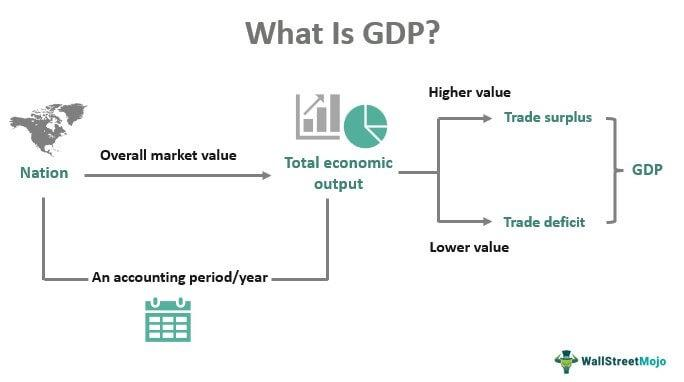

Currency trading, commonly referred to as forex trading, represents a highly dynamic financial market where traders exchange national currencies against each other. It is the largest and most liquid market in the world, with daily trading volumes exceeding $6 trillion as of 2020 according to the Bank for International Settlements. Forex trading is strongly influenced by various economic factors, with Gross Domestic Product (GDP) figures playing a crucial role in informing trading decisions. GDP-focused trades involve analyzing the economic health of countries, as indicated by their GDP figures, to anticipate currency movements. This approach helps traders identify opportunities and make informed decisions.

In addition, the advent of algorithmic trading has profoundly altered the forex trading landscape. Algorithmic trading leverages computer algorithms to execute trades based on predefined criteria, significantly enhancing the speed and precision with which trades are made. Algorithms can process vast amounts of market data, including economic indicators such as GDP, to generate trading signals and execute orders without the emotional bias that might affect human traders. This technological advancement has become indispensable for forex traders seeking to optimize their strategies and improve trading outcomes.



This article focuses on the integration of economic indicators, particularly GDP, within currency trading and examines how algorithmic trading is reshaping these strategies. GDP announcements are pivotal events that traders monitor closely, as they provide insights into a country's economic performance and potential currency strength or weakness. Understanding these announcements and their effects on the market is key for traders aiming to capitalize on the ensuing volatility.

The growing importance of algorithmic trading techniques will be analyzed, alongside actionable strategies that exploit GDP data to enhance decision-making processes. By combining economic insights with advanced trading technologies, traders can develop robust strategies capable of withstanding market fluctuations, ensuring consistent performance. This guide aims to provide forex traders with valuable knowledge to adeptly merge economic data with cutting-edge algorithmic solutions, thereby bolstering their trading acumen and optimizing market engagement.

## Table of Contents

## Understanding GDP in Currency Trading

Gross Domestic Product (GDP) is an essential economic gauge that forex traders examine meticulously. It measures the total market value of all produced goods and services within a nation over a specific period. GDP provides insights into economic health and potential growth, thereby influencing currency strength in the forex market.

The performance of a country's GDP is pivotal for its currency valuation. A robust GDP growth rate typically signifies a healthy economy, which can lead to an appreciation of the nation's currency. Conversely, stagnation or contraction in GDP could indicate economic struggles, potentially leading to a depreciation of the currency. Consequently, GDP data serves as a critical tool for forex traders to evaluate economic stability and forecast currency movements.

Forex traders use GDP data to discern trends in economic expansion or contraction and to anticipate potential changes in interest rates set by a country's central bank. Generally, higher GDP growth can prompt central banks to increase interest rates to control inflationary pressures, making the nation's currency more attractive to investors seeking higher returns. Conversely, lower GDP growth might lead to [interest rate](/wiki/interest-rate-trading-strategies) cuts, aiming to stimulate the economy, which could result in currency depreciation.

To leverage GDP data effectively, traders develop economic strategies that incorporate this metric to predict market trends and make informed trading decisions. By analyzing GDP figures, traders can identify trading opportunities that align with anticipated market movements. Such strategies might include adjusting investment portfolios to capitalize on expected currency appreciation or depreciation based on the latest GDP announcements.

Moreover, advanced analytics and models are often employed for a deeper understanding of GDP impacts. Python, for example, can be used for such an analysis. Here's a basic outline of how GDP data can be incorporated into a trading strategy using Python:

```python
import pandas as pd

# Load GDP data (example file)
gdp_data = pd.read_csv('gdp_data.csv')

# Calculate GDP growth rate
gdp_data['GDP Growth Rate'] = gdp_data['GDP'].pct_change() * 100

# Analyze trends
growth_trend = gdp_data['GDP Growth Rate'].mean()

# Decision making based on GDP growth trend
if growth_trend > 3:  # Assuming 3% indicates strong growth
    decision = "Consider long positions on the currency"
elif growth_trend < 1:  # Assuming 1% indicates weak growth
    decision = "Consider short positions on the currency"
else:
    decision = "Hold current positions"

print(decision)
```

This script demonstrates a simple approach to integrating GDP growth analysis into trading decisions. Strategies that incorporate such analyses allow traders to adjust their positions with greater precision, reacting promptly to new GDP data releases.

Ultimately, understanding GDP's role in currency trading helps traders anticipate financial market movements and refine their trading strategies for improved outcomes. The integration of GDP analysis in [forex](/wiki/forex-system) trading underscores its significance as a tool for enhancing market predictions and executing profitable trades.

## GDP Announcements and Market Impact

Gross Domestic Product (GDP) announcements are critical events in the forex market, occurring on a quarterly basis. These announcements provide a comprehensive overview of a country's economic performance, influencing currency valuations and trading strategies. When GDP figures are released, they act as benchmarks for assessing economic health. Traders closely monitor these announcements to interpret the economic trajectory, which can directly affect currency strength.

The immediate market impact of a GDP announcement is often characterized by increased [volatility](/wiki/volatility-trading-strategies). This volatility arises because traders and investors react swiftly to the new data, adjusting their positions based on how the actual numbers compare to previous forecasts and expectations. For instance, a GDP figure exceeding expectations typically signals robust economic growth, potentially resulting in a stronger national currency. This is because investors tend to favor economies demonstrating higher growth prospects, driving demand for that country's currency.

Conversely, if the GDP figures fall short of expectations, it might indicate slowing economic activity, leading to a depreciation of the currency as market participants adjust their positions to reflect the weaker economic outlook. This reaction is often swift, as traders use the data to quickly recalibrate their trading strategies in anticipation of future economic policy adjustments.

Traders don't merely react to absolute GDP numbers; they also analyze the components and contributing factors to understand broader economic trends. This involves looking into consumer spending, investment levels, government expenditure, and net exports, which collectively form the GDP. By doing so, traders can discern underlying strengths or weaknesses in an economy.

Understanding how to interpret GDP announcements is crucial for forex traders aiming to capitalize on market movements. Predictive strategies often involve forming hypotheses based on anticipated gaps between actual data and market expectations. For example, suppose the market predicts a GDP growth of 2%, but the actual number is reported at 3%. This positive gap is likely to trigger buying activity in the currency associated with the higher GDP growth.

To enhance the ability to engage in profitable trades, traders might employ algorithms that incorporate historical GDP data and expectations into their trading strategies. These algorithms can rapidly digest the information and execute trades faster than humanly possible, taking advantage of short-term inefficiencies and trends identified around GDP announcements.

Overall, GDP announcements serve as a fundamental indicator in forex trading, shaping currency valuation by offering insights into an economy’s potential trajectory. By anticipating these data releases and understanding their implications, traders can position themselves to better navigate the currency market and capitalize on the economic signals provided.

## Algorithmic Trading in Forex Markets

Algorithmic trading, often referred to as algo trading, employs sophisticated computer programs to execute trades based on predetermined rules and criteria. This method leverages technology to perform trades at speeds and frequencies beyond human capacity, allowing traders to exploit ephemeral market opportunities. Algorithms can swiftly analyze vast sets of market data, including crucial economic indicators like Gross Domestic Product (GDP) figures, enabling traders to make informed decisions with a high degree of efficiency and consistency.

One of the prominent advantages of algo trading is its ability to minimize human errors and eliminate emotional biases, which often impede trading performance. By adhering to well-defined rules and eliminating human inconsistencies, [algorithmic trading](/wiki/algorithmic-trading) strategies are implemented with precision, enhancing the potential for profitable outcomes.

Integrating GDP data into algorithmic trading strategies can significantly optimize trading returns. GDP figures provide insights into economic growth patterns, which can influence currency valuations in the forex market. Algorithms can be programmed to detect these patterns and adjust trading strategies accordingly, ensuring that trades are based on the latest economic conditions.

For example, consider a Python snippet implementing a simple algorithmic trading strategy based on GDP data:

```python
import pandas as pd

# Load GDP and currency exchange rate data
gdp_data = pd.read_csv('gdp_data.csv')  # GDP data file
exchange_rate_data = pd.read_csv('exchange_rate_data.csv')  # Exchange rate data file

# Preprocess data
gdp_data['date'] = pd.to_datetime(gdp_data['date'])
exchange_rate_data['date'] = pd.to_datetime(exchange_rate_data['date'])
merged_data = pd.merge(gdp_data, exchange_rate_data, on='date')

# Define a basic trading strategy
def trading_strategy(row):
    if row['gdp_growth'] > 2.5:  # Assume GDP growth above 2.5% signals currency strength
        return 'buy'
    elif row['gdp_growth'] < 1.0:  # Assume GDP growth below 1.0% signals currency weakness
        return 'sell'
    else:
        return 'hold'

# Apply the trading strategy
merged_data['trade_signal'] = merged_data.apply(trading_strategy, axis=1)

# Display the trade signals
print(merged_data[['date', 'gdp_growth', 'trade_signal']])
```

In this example, the algorithm uses GDP growth rates to determine trading signals such as 'buy', 'sell', or 'hold', based on predefined thresholds. This systematic approach allows traders to capitalize on insights derived from economic growth metrics, adjusting positions in anticipation of market movements.

Overall, algorithmic trading represents a pivotal shift in the forex market landscape, providing traders with tools to efficiently leverage both historical and real-time economic data. By incorporating GDP data into their algorithmic routines, traders can refine their strategies to achieve optimized, risk-adjusted returns.

## Developing Economic Strategies with GDP and Algo Trading

Combining GDP analysis with algorithmic trading provides traders with a robust framework for navigating the volatile forex markets. By leveraging historical GDP data, traders can backtest their algorithmic models, allowing them to identify patterns and optimize predictive accuracy. This process involves analyzing past GDP figures to understand how changes in economic output have historically impacted currency movements. The insights gained can be translated into algorithms that predict future trends based on similar economic conditions.

Key economic indicators such as interest rates and inflation play vital roles alongside GDP in shaping market dynamics. By integrating these factors into trading algorithms, traders can develop a comprehensive strategy that assesses the broader economic landscape. For instance, a rise in GDP often signals economic growth, which might lead to higher interest rates. This correlation can be codified into an algorithm that triggers trades when GDP growth meets specific thresholds or when it coincides with certain interest rate changes:

```python
def trade_signal(gdp_growth, interest_rate):
    if gdp_growth > 3.0 and interest_rate < 2.0:
        return "buy"
    elif gdp_growth < 1.0 and interest_rate > 3.0:
        return "sell"
    else:
        return "hold"
```

Regular monitoring and adjustment of these algorithms are crucial due to the ever-evolving nature of global markets. Economic conditions are subject to rapid changes triggered by geopolitical events, policy shifts, or unexpected market disclosures. Traders must therefore ensure their models are adaptable, incorporating real-time data inputs to maintain efficacy.

Continuous learning and iteration are essential for developing resilient trading systems. As economic paradigms shift, algorithms must evolve to interpret new data trends accurately. This requires traders to continually test and refine their models, possibly incorporating [machine learning](/wiki/machine-learning) techniques to enhance predictive capabilities:

```python
from sklearn.ensemble import RandomForestClassifier

# Example of using historical economic data for model training
features = [[gdp1, interest_rate1, inflation1], [gdp2, interest_rate2, inflation2], ...]
labels = ['buy', 'sell', 'hold']

model = RandomForestClassifier()
model.fit(features, labels)

# Predict based on incoming data
new_data = [[current_gdp, current_interest_rate, current_inflation]]
prediction = model.predict(new_data)
```

Through such technological integration, traders can build systems capable of enduring the uncertainties of the forex market, thereby securing a competitive advantage. The adaptability of algorithms ensures that traders not only react to immediate market conditions but also anticipate future trends, helping them to capitalize on emerging opportunities.

## The Future of GDP and Algorithmic Trading

The future of currency trading lies in the seamless integration of macroeconomic data, such as Gross Domestic Product (GDP), and advanced trading technologies. As the forex market continues to evolve, the use of machine learning (ML) and [artificial intelligence](/wiki/ai-artificial-intelligence) (AI) is becoming central to developing algorithms that can process economic data in real-time. This technological progression allows for the creation of adaptable trading strategies that leverage insights from GDP data, offering traders a competitive advantage in dynamic markets.

Machine learning algorithms are particularly effective at identifying patterns in large data sets, enabling traders to anticipate market movements based on GDP fluctuations and other economic indicators. For instance, by employing supervised learning models, traders can train algorithms to recognize how GDP changes have historically affected currency values. This model can then predict potential future currency movements in response to new GDP announcements. These predictions can be continuously refined with additional data, improving their accuracy and reliability over time.

The incorporation of AI in forex trading algorithms also enhances risk management and efficiency. Algorithms can be designed to automatically adjust trading parameters in response to shifts in economic conditions, such as a sudden change in GDP growth rates. This adaptability not only helps in mitigating risks but also ensures that trading strategies remain aligned with the current economic landscape.

Traders must remain informed about technological advancements and global economic trends to optimize their trading strategies effectively. Continuous education in the fields of machine learning and artificial intelligence is crucial as these technologies advance. Moreover, understanding the intricacies of economic indicators like GDP can aid in the development of more comprehensive and robust trading systems.

By embracing these innovations, traders can improve their operational efficiency and profit margins. The integration of macroeconomic data with cutting-edge technology enables more informed decision-making and timely trade execution, which are vital in today’s fast-paced financial markets. As such, the future of currency trading will likely be dominated by those who successfully merge economic insights with algorithmic prowess, positioning themselves favorably in an increasingly digital landscape.

## Conclusion

Currency trading combines complex elements of finance, economics, and technology, offering significant rewards to those who employ well-informed economic strategies coupled with advanced technological tools. By integrating GDP data with algorithmic trading, traders can enhance their ability to manage and profit from market volatility. Leveraging these strategies allows traders to refine their decision-making processes, thus positioning them to succeed in the increasingly digital forex marketplace. Continuous education, adaptation, and innovation remain paramount in maintaining competitiveness and profitability in this fast-evolving field. This article has elucidated the connection between GDP and algorithmic trading, offering valuable insights to help traders achieve improved trade outcomes.

## References & Further Reading

[1]: Bank for International Settlements. (2019). ["Triennial Central Bank Survey - Foreign exchange turnover in April 2019."](https://www.bis.org/statistics/rpfx19_fx.pdf)

[2]: Lopez de Prado, M. (2018). ["Advances in Financial Machine Learning"](https://www.amazon.com/Advances-Financial-Machine-Learning-Marcos/dp/1119482089). Wiley.

[3]: Geweke, J. (2010). ["Principles of GARCH Modeling."](https://www.researchgate.net/publication/335580042_Empirical_performance_of_GARCH_GARCH-M_GJR-GARCH_and_log-GARCH_models_for_returns_volatility) Routledge.

[4]: Brooks, C., & Prokopczuk, M. (2007). ["The Dynamics of Commodity Spot and Futures Markets: A Primer."](https://papers.ssrn.com/sol3/papers.cfm?abstract_id=1849505) The European Journal of Finance.

[5]: Aronson, D. R. (2007). ["Evidence-Based Technical Analysis: Applying the Scientific Method and Statistical Inference to Trading Signals."](https://onlinelibrary.wiley.com/doi/book/10.1002/9781118268315) Wiley.

[6]: Chan, E. P. (2009). ["Quantitative Trading: How to Build Your Own Algorithmic Trading Business."](https://github.com/ftvision/quant_trading_echan_book) John Wiley & Sons.

[7]: Jansen, S. (2020). ["Machine Learning for Algorithmic Trading."](https://github.com/stefan-jansen/machine-learning-for-trading) Packt Publishing.