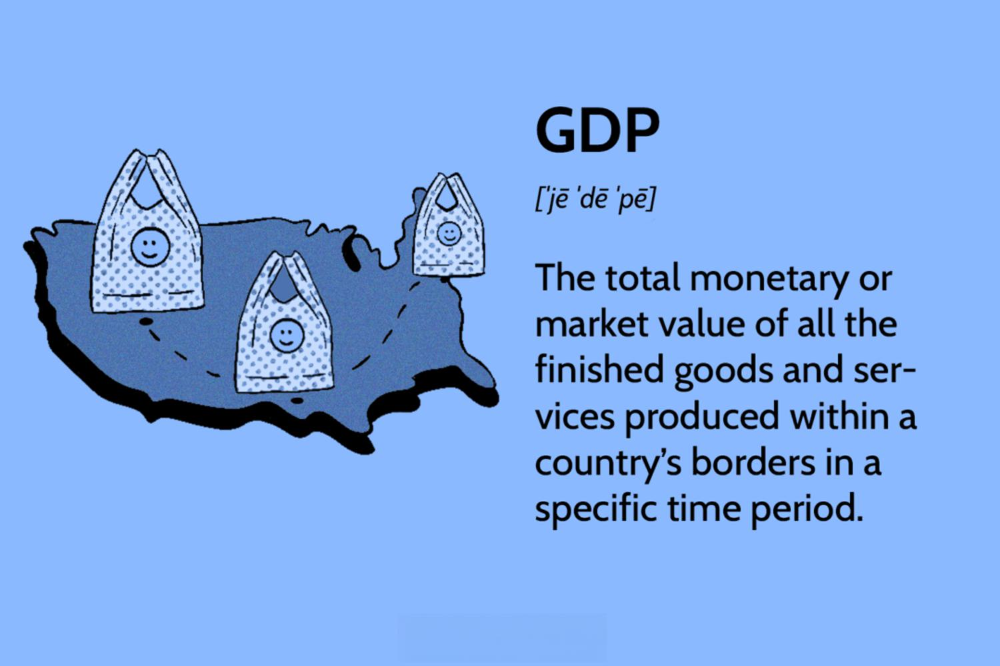

Economic indicators are essential tools for analyzing the health and forecasting future trends of an economy. These indicators include various statistics that reflect economic performance and guide policymakers, investors, and businesses in their decision-making processes. Among these indicators, the Gross Domestic Product (GDP) holds a paramount position. GDP represents the total market value of all final goods and services produced within a country in a specific time period and serves as a comprehensive measure of economic activity and health. It provides valuable insights into the size and growth rate of an economy, making it indispensable for assessing economic performance.

The significance of GDP extends beyond economic analysis to financial markets, where it plays a crucial role in algorithmic trading strategies. Algorithmic trading involves the use of computer programs to execute trading strategies based on predefined criteria, allowing for rapid and efficient decision-making. Economic indicators like GDP are integrated into these algorithms to optimize trading strategies, enabling traders to capitalize on market conditions that are indicative of economic changes.

The incorporation of GDP data into algorithmic trading strategies empowers traders to make data-driven decisions. By analyzing GDP trends and forecasts, traders can predict market movements, adjust their positions, and implement strategies that align with anticipated economic conditions. For instance, a strong GDP growth rate may signal favorable market conditions, prompting traders to increase their investments in growth-oriented assets. Conversely, a contraction in GDP may trigger defensive strategies to mitigate potential losses.

This integration of economic indicators into algorithmic trading is facilitated by advanced data analytics and machine learning techniques, which enhance the accuracy and speed of trading decisions. These technologies allow traders to process vast amounts of economic data in real time, identify patterns, and develop sophisticated models that predict market trends based on GDP analytics.

Understanding the role of GDP as an economic indicator in algorithmic trading sets the stage for exploring how GDP analysis can influence trading strategies. By examining the interplay between economic indicators and trading algorithms, we gain insights into the potential for optimizing market outcomes through informed decision-making. This synthesis of economic analysis and technological advancement underscores the evolving landscape of financial markets, where data-driven strategies continue to shape trading practices and outcomes.

## Table of Contents

## Understanding GDP as an Economic Indicator

Gross Domestic Product (GDP) is a fundamental economic indicator that quantifies the monetary value of goods and services produced within a country's borders over a specific period, typically measured annually or quarterly. GDP is a critical measure used to assess a nation's economic health and trajectory. It serves as a comprehensive metric reflecting the aggregate economic activity, offering insights into the overall performance and stability of an economy.

GDP is composed of four main components: consumer spending, government expenditure, investments, and net exports. These elements provide a holistic view of the economic landscape:

1. **Consumer Spending**: This component, denoted by the expenditure approach as 'C', represents the total value of goods and services purchased by households. It is often the largest segment of GDP and a key driver of economic growth, reflecting consumer confidence and market demand.

2. **Government Expenditure**: Represented as 'G', this includes all government consumption, investment, and transfer payments. Public spending on infrastructure, education, and defense are examples of expenditures that contribute directly to GDP, influencing economic stability and growth.

3. **Investments**: Noted as 'I', investments encompass business expenditures on capital goods that will be used for future production. It includes business investments in equipment and structures, residential construction, and changes in business inventories, playing a crucial role in enhancing productive capacity and economic potential.

4. **Net Exports**: Calculated as exports minus imports (X-M), net exports add to GDP when exports exceed imports, signaling a trade surplus. Conversely, a trade deficit occurs when imports surpass exports. This component reflects a country's competitive advantage and global economic position.

The significance of GDP in predicting economic trends and its impact on financial markets is profound. High GDP growth typically indicates a robust economy, leading to increased employment, higher income levels, and improved business prospects. Conversely, a decline in GDP can signal economic distress, influencing investor confidence and market dynamics. Financial markets closely monitor GDP data as it provides critical insights into economic cycles, investor behavior, and policy decisions.

GDP data is collected through comprehensive surveys and data analysis conducted by national statistical agencies. In the United States, for example, the Bureau of Economic Analysis (BEA) is responsible for estimating GDP figures using data from surveys, censuses, and other economic indicators. GDP figures are reported periodically, with initial estimates subject to revisions as more accurate data becomes available.

Economic analysts utilize GDP data to discern trends, make forecasts, and guide policy formulation. By examining GDP alongside other macroeconomic indicators, analysts can evaluate economic performance, set monetary policies, and allocate resources effectively. The timely dissemination and analysis of GDP data are crucial for making informed economic decisions and strategies.

## Algorithmic Trading and Economic Indicators

Algorithmic trading refers to the use of computer software to automate and enhance trading strategies, thereby increasing efficiency and executing complex trading processes without direct human intervention. These algorithms take advantage of fast computational speeds and vast data analysis capabilities to capitalize on market opportunities that might be imperceptible to human traders.

Economic indicators, such as the Gross Domestic Product (GDP), are crucial inputs in these automated systems. Algorithms can integrate GDP data to inform trading decisions by analyzing economic health and predicting market trends. This integration often involves creating models that incorporate GDP growth rates, historical data, and projections, which are then used to forecast asset price movements and ensure timely execution of trades. These models may rely on techniques such as statistical analysis and econometrics to understand and predict the relationships between GDP changes and financial market responses.

The strategic use of economic data in trading algorithms offers several benefits. By incorporating real-time economic indicators, traders can enhance their models' predictive accuracy, leading to potentially higher returns and lower risks. This data-driven approach allows for the optimization of portfolio allocations and the identification of [arbitrage](/wiki/arbitrage) opportunities based on macroeconomic trends.

Advancements in [algorithmic trading](/wiki/algorithmic-trading) have seen the integration of [machine learning](/wiki/machine-learning) and other data analytics methodologies, significantly enhancing these trading strategies. Machine learning algorithms can process large datasets to identify patterns and relationships that traditional statistical methods might miss. Techniques such as natural language processing can also be used to analyze market sentiment and news reports, providing additional layers of insight into economic conditions and their implications for trading.

For example, machine learning models can be employed to predict GDP movements from economic reports or news articles, allowing traders to adjust their strategies in anticipation of expected economic shifts. By continuously learning and adapting from new data, these models can improve their predictive capabilities over time, offering a dynamic approach to economic analysis in trading.

In summary, the incorporation of GDP and other economic indicators into algorithmic trading models represents a sophisticated fusion of economics and technology. As these technologies evolve, algorithmic trading strategies are likely to become more robust, adaptive, and capable of navigating the complexities of global markets with precision.

## The Role of GDP in Algorithmic Trading Strategies

In algorithmic trading, GDP data serves as a critical component influencing trading strategies. Traders utilize GDP projections to gauge potential market movements and economic shifts. By estimating future GDP growth, traders develop predictive models to anticipate changes in market dynamics. For instance, if GDP is projected to increase significantly, it might indicate economic expansion, encouraging investment in growth-oriented assets such as stocks. Conversely, a declining GDP projection could signal economic contraction, leading traders to shift towards safer assets like bonds.

GDP data announcements play a pivotal role in executing algorithmic trades. Algorithms are often pre-programmed to react to GDP data releases, which are scheduled quarterly. Upon release, trading algorithms swiftly analyze this data to identify deviations from expectations. For example, if the actual GDP growth rate exceeds forecasts, algorithms may initiate buying strategies for equities, whereas lower-than-expected data might trigger selling actions. These executions occur within milliseconds, capitalizing on the immediate market reaction before human traders can respond.

Case studies underscore the profound impact of GDP data on trading outcomes. One notable example involves the U.S. GDP announcements and their direct correlation with the movements of the S&P 500 index. Historical analyses reveal that when GDP announcements surpass market expectations, the index often experiences a positive rally. Conversely, unfavorable GDP data has been associated with downturns in the index. Statistical models quantify this relationship, illustrating a significant correlation coefficient between GDP announcement surprises and subsequent market returns.

The integration of GDP data into algorithmic trading strategies underscores its importance as a fundamental economic indicator. By leveraging GDP projections, real-time data analysis, and historical trends, traders can refine their strategies to optimize market engagement. This careful integration of GDP analytics not only enhances the precision of trading models but also provides traders with a strategic edge in navigating complex financial landscapes.

## Challenges and Limitations

Gross Domestic Product (GDP) is a comprehensive measure of a country's economic activity and health. Despite its significance, GDP data has limitations and challenges, especially in a real-time trading environment.

One key limitation is the inherent inaccuracies in GDP data. GDP figures are calculated using vast amounts of data from various economic activities, leading to potential errors or omissions. These inaccuracies can be due to several factors, such as data collection errors, estimation techniques, and adjustments made for inflation and seasonality. As a result, traders relying on GDP data for decision-making must account for these potential inaccuracies when developing trading strategies.

Integrating qualitative GDP forecasts into [quantitative trading](/wiki/quantitative-trading) algorithms presents another challenge. Qualitative forecasts, which include expert opinions, political considerations, and economic sentiment, are inherently subjective and difficult to quantify. Incorporating these qualitative elements into algorithmic models requires innovative techniques, such as sentiment analysis or natural language processing, to interpret and assign numerical values to qualitative data. However, these methods can introduce additional layers of complexity and uncertainty, making it challenging to maintain accuracy in trading algorithms.

Economic data revisions are a significant concern for traders using GDP data. Initial GDP estimates are often revised as more comprehensive data becomes available, which can lead to substantial changes in the reported figures. These revisions can impact trading strategies that rely on timely and accurate data. For instance, a strategy based on initial GDP estimates may yield different results once the revised data is released. This unpredictability necessitates caution among traders, who must prepare for potential shifts in data and adjust their strategies accordingly.

Lastly, the sometimes lagging nature of GDP data poses a challenge for real-time trading. GDP data is typically released on a quarterly basis, reflecting past economic activity rather than current conditions. This lag can result in missed opportunities or incorrect assessments of the market's current state. Traders must be cautious and supplement GDP data with other, more frequent economic indicators to gain a comprehensive view of the market environment.

In summary, while GDP is a valuable economic indicator, it has limitations in real-time trading. Inaccuracies, challenges in integrating qualitative forecasts, the effects of data revisions, and the lagging nature of GDP reports necessitate careful consideration and adaptation by traders developing algorithmic trading strategies.

## Future Trends in Economic Indicator-Based Algo Trading

Emerging trends in algorithmic trading continue to reshape the landscape of financial markets, prominently featuring the increased use of [artificial intelligence](/wiki/ai-artificial-intelligence) (AI) and machine learning. These technologies allow for deeper analysis and more accurate predictions by identifying patterns and correlations within vast datasets that would be impossible for human traders to discern. As AI and machine learning algorithms become more sophisticated, their application in trading strategies that leverage economic indicators like GDP is expanding.

The integration of a broader array of economic indicators with GDP in trading models is another significant trend. Economic indicators such as employment figures, inflation rates, and consumer confidence scores, when combined with GDP data, provide a richer context for understanding the economic environment. This holistic approach enhances the predictive power of algorithmic models, enabling traders to make more informed decisions. For example, a trading model might integrate consumer spending trends alongside GDP growth rates to better anticipate shifts in market sentiment.

Real-time data processing and advanced analytics further enhance the efficacy of trading strategies based on economic indicators. With the advent of high-frequency trading systems, the ability to process data in real-time has become crucial. These systems can react to GDP announcements and other economic data releases within milliseconds, adjusting trading positions almost instantaneously. Advanced analytics techniques, such as natural language processing and sentiment analysis, can also provide insights from unstructured data, such as news articles or social media, allowing traders to react to market-moving information more swiftly and accurately.

Macroeconomic policies and global economic shifts are likely to impact these algorithmic trading strategies significantly. Changes in fiscal policy, [interest rate](/wiki/interest-rate-trading-strategies) adjustments by central banks, or international trade agreements can all influence economic indicators like GDP. Consequently, algorithmic models must be adaptable, incorporating these macroeconomic factors to remain effective. For instance, a shift in monetary policy might alter inflation expectations, which would, in turn, affect GDP projections and, subsequently, trading strategies based on these projections.

In summary, the future of economic indicator-based algorithmic trading is being shaped by technological advancements, broader data integration, real-time processing capabilities, and macroeconomic considerations. As these trends continue to evolve, traders who effectively harness these developments are likely to achieve a competitive edge in the financial markets.

## Conclusion

Gross Domestic Product (GDP) and other economic indicators are essential elements in crafting robust algorithmic trading strategies. GDP serves as a comprehensive measure of a country's economic performance, encompassing all goods and services produced over a specific period. By integrating GDP data alongside other economic indicators, traders gain invaluable insights, enabling them to execute informed and timely trades. These indicators offer historical data that provide a foundation for anticipating future market trends, while allowing for the prediction of macroeconomic shifts that could influence asset prices and market dynamics. 

The balance between leveraging historical GDP data and forecasting future economic trends is crucial for successful algorithmic trading. Historical data sets the stage by highlighting patterns and cycles within the economy, and this information can be utilized to train predictive models. On the other hand, forward-looking GDP projections and revisions can adjust these models, refining their predictive capabilities. This dual-pronged approach ensures that trading strategies remain adaptive and responsive to both historical context and imminent economic developments.

Algorithmic trading strategies have also evolved rapidly with advancements in data processing and analytics technologies. Enhanced computational power and sophisticated algorithms now allow for the real-time analysis of vast datasets, facilitating quicker decision-making processes. Machine learning techniques, in particular, enable the continuous improvement of trading algorithms by learning from past successes and failures. This results in strategies that can adapt to new patterns and data in ways that were previously impossible.

Ultimately, economic indicators such as GDP are indispensable tools for traders who seek to capitalize on market opportunities. By providing a lens through which the economic health and prospects of a nation can be evaluated, these indicators offer a rich well of information that supports the development of trading strategies aimed at optimizing returns. As technology continues to progress, the integration of economic indicators into algorithmic trading will likely become even more refined, underscoring their fundamental role in the financial markets.

## References & Further Reading

[1]: Bergstra, J., Bardenet, R., Bengio, Y., & Kégl, B. (2011). ["Algorithms for Hyper-Parameter Optimization."](https://papers.nips.cc/paper/4443-algorithms-for-hyper-parameter-optimization) Advances in Neural Information Processing Systems 24.

[2]: ["Advances in Financial Machine Learning"](https://www.amazon.com/Advances-Financial-Machine-Learning-Marcos/dp/1119482089) by Marcos Lopez de Prado

[3]: ["Evidence-Based Technical Analysis: Applying the Scientific Method and Statistical Inference to Trading Signals"](https://www.amazon.com/Evidence-Based-Technical-Analysis-Scientific-Statistical/dp/0470008741) by David Aronson

[4]: ["Machine Learning for Algorithmic Trading"](https://github.com/PacktPublishing/Machine-Learning-for-Algorithmic-Trading-Second-Edition) by Stefan Jansen

[5]: ["Quantitative Trading: How to Build Your Own Algorithmic Trading Business"](https://www.amazon.com/Quantitative-Trading-Build-Algorithmic-Business/dp/1119800064) by Ernest P. Chan

[6]: Bureau of Economic Analysis. ["Gross Domestic Product"](https://www.bea.gov/data/gdp/gross-domestic-product) - Official U.S. GDP data and analysis.

[7]: Hasbrouck, J. (2007). ["Empirical Market Microstructure: The Institutions, Economics, and Econometrics of Securities Trading"](https://www.semanticscholar.org/paper/Empirical-Market-Microstructure%3A-The-Institutions%2C-Hasbrouck/a2a574e945727316309a30f7a5bc55e48821c75c). Oxford University Press. 

[8]: Piketty, T. (2014). ["Capital in the Twenty-First Century"](https://www.jstor.org/stable/j.ctt6wpqbc). Harvard University Press.

[9]: Bollen, J., Mao, H., & Zeng, X. (2011). ["Twitter mood predicts the stock market."](https://www.sciencedirect.com/science/article/pii/S187775031100007X) Journal of Computational Science, Volume 2, Issue 1, March 2011, Pages 1-8.

[10]: Fama, E. F. & French, K. R. (1993). ["Common Risk Factors in the Returns on Stocks and Bonds."](https://www.sciencedirect.com/science/article/pii/0304405X93900235) Journal of Financial Economics, Volume 33, Issue 1, February 1993, Pages 3-56.