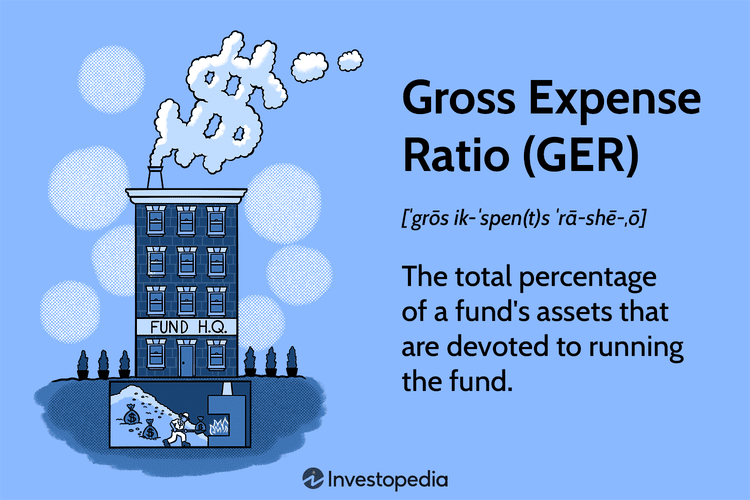

## Table of Contents

## What is the Gross Expense Ratio?

The Gross Expense Ratio is a measure used to understand the total cost of managing and operating a mutual fund or an exchange-traded fund (ETF). It includes all the fees and expenses that are charged to the fund, such as management fees, administrative fees, and other operational costs. This ratio is expressed as a percentage of the fund's average net assets. A higher Gross Expense Ratio means that a larger portion of the fund's assets is being used to cover these costs, which can reduce the overall return for investors.

Investors often look at the Gross Expense Ratio to compare different funds and make informed decisions. A lower Gross Expense Ratio can be more attractive because it means less of the fund's returns are eaten up by fees. However, it's important to consider other factors as well, like the fund's performance and investment strategy, because a fund with a higher expense ratio might still offer better overall returns if it performs well.

## How is the Gross Expense Ratio calculated?

The Gross Expense Ratio is figured out by taking all the costs of running a mutual fund or ETF and dividing them by the fund's total assets. These costs include things like paying the people who manage the fund, the fees for keeping records, and other day-to-day expenses. Once you add up all these costs for a year, you divide that number by the average amount of money in the fund during that year. The result is then turned into a percentage.

This percentage shows how much of the fund's money goes towards these expenses each year. For example, if a fund has $100 million in assets and spends $1 million on expenses, the Gross Expense Ratio would be 1% ($1 million divided by $100 million, then multiplied by 100 to get a percentage). This number helps investors see how much they are paying to have their money managed and can be used to compare different funds.

## Why is the Gross Expense Ratio important for investors?

The Gross Expense Ratio is important for investors because it tells them how much of their money is being used to pay for the costs of running the fund. This includes things like paying the people who manage the fund and other fees. If the Gross Expense Ratio is high, it means more of the fund's money is going towards these costs, which can leave less money for the investors at the end of the day. By looking at the Gross Expense Ratio, investors can see how much they are paying to have their money managed.

Investors use the Gross Expense Ratio to compare different funds. A fund with a lower Gross Expense Ratio might be more attractive because it means less money is being taken out for fees, which could lead to higher returns for the investor. However, it's not the only thing to consider. A fund with a higher Gross Expense Ratio might still be a good choice if it performs well and makes more money for investors. So, while the Gross Expense Ratio is a helpful tool, it's important to look at the whole picture when choosing where to invest.

## How does the Gross Expense Ratio differ from the Net Expense Ratio?

The Gross Expense Ratio and the Net Expense Ratio both tell you about the costs of running a mutual fund or ETF, but they are a bit different. The Gross Expense Ratio includes all the costs of running the fund, like paying the people who manage it, the fees for keeping records, and other expenses. It's the total cost before any waivers or reimbursements are taken into account. This number shows you the full amount of money that goes towards running the fund each year.

On the other hand, the Net Expense Ratio is what you get after some of those costs are reduced or paid back. Sometimes, the people who run the fund might decide to waive some fees or give back some money to the investors. When this happens, the Net Expense Ratio will be lower than the Gross Expense Ratio. This number is important because it shows you the actual cost you will pay as an investor after any adjustments. Both ratios are useful, but the Net Expense Ratio gives you a better idea of what you will really be paying.

## What are typical ranges for Gross Expense Ratios in different types of funds?

Gross Expense Ratios can vary a lot depending on the type of fund. For big, popular index funds that try to match the performance of a market index, like the S&P 500, the Gross Expense Ratio is usually pretty low. These funds often have ratios between 0.02% and 0.20%. They are cheap because they don't need a lot of people to manage them since they just follow an index. Actively managed funds, where people pick and choose which stocks or bonds to invest in, tend to have higher Gross Expense Ratios. These can range from about 0.50% to over 1.50% because they need more work and people to manage them.

Specialty funds, like those that focus on a specific industry or country, can have even higher Gross Expense Ratios. These might be anywhere from 1.00% to 2.00% or more. The reason is that these funds often need more research and special knowledge to manage, which costs more money. When looking at Gross Expense Ratios, it's good to compare funds of the same type because what's considered high or low can change depending on the kind of fund you're looking at.

## How can the Gross Expense Ratio impact the overall return on investment?

The Gross Expense Ratio can have a big effect on how much money you make from your investment. This ratio shows how much of the fund's money goes towards paying for things like the people who manage the fund and other costs. If the Gross Expense Ratio is high, it means more of the fund's money is being used to pay these costs, which leaves less money for you at the end. Over time, even a small difference in the Gross Expense Ratio can add up and make a big difference in your overall return.

For example, if you invest in a fund with a Gross Expense Ratio of 1%, that means 1% of the fund's money is taken out each year to pay for costs. If another fund has a Gross Expense Ratio of 0.1%, it's only taking out 0.1% each year. Over many years, the fund with the lower Gross Expense Ratio will likely give you more money because less is being taken out for fees. So, when choosing where to invest, it's smart to look at the Gross Expense Ratio to see how it might affect your returns.

## What factors contribute to a high Gross Expense Ratio?

A high Gross Expense Ratio can come from different things. One big reason is if the fund is actively managed. This means people are always picking and choosing which stocks or bonds to buy or sell. This takes a lot of work and needs more people, so it costs more money. Another reason could be if the fund focuses on a special area, like a certain industry or country. These funds need more research and special knowledge, which also makes the costs go up.

Also, smaller funds might have higher Gross Expense Ratios. This is because they have the same kinds of costs as bigger funds, but they are spread out over less money. So, each investor ends up paying more. Sometimes, if a fund is new or not very popular, it might have to charge more to cover its costs. All these things can make the Gross Expense Ratio go up, which means more of the fund's money is used for costs instead of making money for investors.

## Can the Gross Expense Ratio be used to compare funds from different asset classes?

The Gross Expense Ratio can be used to compare funds, but it's not always the best way to compare funds from different asset classes. Different types of funds, like stocks, bonds, or real estate, have different costs to manage them. So, a high Gross Expense Ratio in one type of fund might be normal, while the same ratio in another type of fund might be very high. For example, an actively managed stock fund might have a higher Gross Expense Ratio than a bond index fund, but that doesn't mean the stock fund is a bad choice. It just means the costs are different because of what the fund does.

When comparing funds from different asset classes, it's important to look at more than just the Gross Expense Ratio. You should also think about the fund's goals, how it has done in the past, and what kind of risks it takes. A fund with a higher Gross Expense Ratio might still be a good choice if it makes more money for you over time. So, while the Gross Expense Ratio is a helpful number to know, it's just one part of the bigger picture when choosing where to invest your money.

## How do regulatory bodies oversee the disclosure of Gross Expense Ratios?

Regulatory bodies like the Securities and Exchange Commission (SEC) in the United States make sure that mutual funds and ETFs tell investors about their Gross Expense Ratios. They do this by making rules that say funds have to show their Gross Expense Ratios in their prospectus and other important documents. This helps investors see how much they are paying for the fund to be managed. The SEC checks these documents to make sure the Gross Expense Ratios are correct and that investors get all the information they need.

Besides the SEC, other groups like the Financial Industry Regulatory Authority (FINRA) also help watch over how Gross Expense Ratios are shared with investors. They make sure that the information is clear and easy to understand. This way, investors can make good choices about where to put their money. Both the SEC and FINRA work to keep things fair and open so that investors know exactly what they are paying for.

## What strategies can fund managers use to minimize the Gross Expense Ratio?

Fund managers can use several strategies to keep the Gross Expense Ratio low. One way is to use passive management instead of active management. Passive funds, like index funds, just try to match the performance of a market index, which means they don't need as many people to pick and choose investments. This saves money on salaries and research, which can lower the Gross Expense Ratio. Another strategy is to grow the fund's size. When a fund gets bigger, the same costs are spread out over more money, so each investor pays less. This is called economies of scale.

Another approach is to negotiate better deals with service providers. Fund managers can try to get lower fees for things like record-keeping or legal services. This can help keep the Gross Expense Ratio down. Sometimes, fund managers might also decide to waive some of their own fees or reimburse investors for certain costs. This doesn't lower the Gross Expense Ratio directly, but it can reduce the Net Expense Ratio, which is what investors actually pay. By using these strategies, fund managers can make their funds more attractive to investors by keeping costs low.

## How does the Gross Expense Ratio affect tax considerations for investors?

The Gross Expense Ratio can have an impact on how much tax investors have to pay. When a fund has a high Gross Expense Ratio, it means more of the fund's money is being used to pay for costs like management fees. This can reduce the overall return for investors, which might mean they have less income to be taxed on. However, if the fund is structured in a way that allows these expenses to be used as a tax deduction, investors might be able to lower their taxable income by the amount of the expenses.

On the other hand, a lower Gross Expense Ratio means more of the fund's money is left to grow and be distributed to investors. This could lead to higher returns, which might increase the amount of taxable income for investors. It's important for investors to understand how the Gross Expense Ratio of their fund might affect their taxes, and they might want to talk to a tax advisor to see how they can make the most of their investments while keeping their tax bill in check.

## What advanced analytical methods can be used to assess the impact of Gross Expense Ratios on long-term investment performance?

One way to look at how Gross Expense Ratios affect long-term investment performance is by using something called regression analysis. This method helps see if there's a link between the Gross Expense Ratio and how well the fund does over time. By putting together data on a lot of funds over many years, you can use regression analysis to see if funds with lower Gross Expense Ratios tend to do better. This can help investors understand if paying less in fees might mean more money in their pockets at the end of the day.

Another useful tool is Monte Carlo simulation. This method uses math to guess how a fund might do in the future by running lots of different scenarios. By changing the Gross Expense Ratio in these scenarios, you can see how it might change the fund's performance over the long run. This helps investors see the risks and rewards of choosing a fund with a certain Gross Expense Ratio. Both of these methods give a deeper look into how the costs of running a fund can affect what investors earn over time.

## What are the key aspects of understanding financial metrics in investment funds?

Financial metrics are crucial for assessing the efficiency and performance of investment funds, helping investors make informed decisions. Investment funds are commonly categorized into mutual funds, exchange-traded funds (ETFs), and hedge funds, each having distinct structures and operational models.

Mutual funds aggregate capital from various investors to purchase securities in a diversified portfolio managed by financial professionals. ETFs, similar to mutual funds, are collections of assets but are traded on stock exchanges like individual stocks. Hedge funds, often involving sophisticated strategies, are less regulated and cater to accredited investors seeking higher returns.

Key financial metrics such as Return on Investment (ROI), alpha, and beta are vital for evaluating these fund types. ROI measures the efficiency of an investment, calculated as:

$$
\text{ROI} = \left(\frac{\text{Current Value of Investment} - \text{Cost of Investment}}{\text{Cost of Investment}}\right) \times 100 \%
$$

A higher ROI indicates a more profitable investment. While ROI provides a basic profitability overview, it does not consider market risk, which is where alpha and beta become critical.

Alpha represents the excess return of an investment compared to a benchmark index. It quantifies the manager's skill in generating above-market returns. A positive alpha suggests that the fund has outperformed the market.

$$
\text{Alpha} = \text{Fund Return} - (\text{Market Return} \times \beta)
$$

Beta measures the [volatility](/wiki/volatility-trading-strategies) or systematic risk of a fund relative to the market. A beta greater than 1 indicates higher volatility than the market, while a beta less than 1 suggests less volatility. It helps in understanding the fund's sensitivity to market movements, aiding in the risk assessment.

By examining these metrics, investors can better assess which type of investment fund aligns with their risk tolerance and return expectations. Combining these quantitative measures with qualitative analysis of the fund's strategy and management provides a comprehensive evaluation framework to optimize investment decisions.

## What is the process of decoding expense ratios?

The expense ratio is a critical metric in evaluating the efficiency and cost-effectiveness of investment funds, revealing the percentage of a fund's assets used for administrative and operational expenses over a fiscal year. This ratio significantly impacts an investor's net returns, as higher expense ratios typically reduce the amount of returns an investor receives.

The expense ratio can be categorized into two distinct types: the gross expense ratio and the net expense ratio. The gross expense ratio encompasses all of a fund's operating costs, including management fees, administrative fees, and other operational expenses, without considering any fee waivers or reimbursements. It offers an overarching view of the total costs incurred by a fund.

In contrast, the net expense ratio accounts for any fee waivers or reimbursements offered by the fund manager. By deducting these waivers and reimbursements from the gross expenses, the net expense ratio provides a more precise measure of the actual costs borne by investors. For instance, if a fund has a gross expense ratio of 1.5% but offers fee waivers amounting to 0.3%, the net expense ratio would be 1.2%.

The impact of these ratios on net returns is substantial. Consider an example where an investor places $10,000 in a fund with an average annual return of 8% and a net expense ratio of 1.2%. The expenses will trim the real return, with the net return calculated as follows:

$$
\text{Net Annual Return} = (1 + \text{Annual Return}) \times (1 - \text{Net Expense Ratio}) - 1
$$

In this scenario, the net return, after accounting for the expense ratio, would be approximately 6.8%. This simple calculation underscores the importance of being aware of expense ratios, as a seemingly negligible difference in percentage points can accumulate significantly over time, especially in long-term investments.

Evaluating expense ratios is vital for investors seeking to optimize their portfolios and maximize returns. Lower expense ratios are generally preferable as they leave more room for returns to compound over time. However, it is crucial for investors to assess whether lower-cost funds still align with their investment goals and strategies, as occasionally higher expenses can be justified by superior management and performance.

Understanding the nuances between gross and net expense ratios allows investors to make informed decisions, enabling them to gauge the true cost of their investments and its implications on their financial goals.

## What are ETFs and their specific expense ratios?

Exchange-traded funds (ETFs) have gained popularity among investors due to their generally lower expense ratios compared to actively managed funds. These lower ratios arise from the passive investment strategies typical of ETFs, which involve less active management and thus incur fewer costs. Unlike mutual funds that frequently adjust their holdings to outperform specific benchmarks, ETFs often track established indices, resulting in reduced management overhead and cost savings for investors.

Expense ratios vary significantly among ETFs based on their investment focus, market segments, and sectors. Broad-market ETFs, which encompass large indices such as the S&P 500, typically exhibit lower expense ratios. This is due to the scale advantages and widespread [liquidity](/wiki/liquidity-risk-premium) of the underlying securities, facilitating cost-effective management. Sector-specific or niche ETFs might display higher expense ratios, as these funds require more specialized management and might invest in less liquid instruments that entail greater trading costs.

An example is the comparison between a broad-based [ETF](/wiki/etf-trading-strategies) like the SPDR S&P 500 ETF (SPY), which reports an expense ratio of approximately 0.09%, and a sector-targeted ETF such as the Global X Lithium & Battery Tech ETF (LIT), which might have an expense ratio closer to 0.75% due to its more focused investment strategy. This variance can guide investor choice, as those with cost-sensitive strategies may prefer broad-based ETFs for their lower management costs.

The benefits of lower expense ratios in ETFs extend significantly into long-term investment performance. The annual cost savings from reduced expense ratios compound over time, leading to potentially substantial differences in net returns. For instance, if two ETFs start with an equal net asset value and one incurs an annual expense ratio of 0.10%, while another incurs 0.50%, the long-term impact becomes evident when applying these costs over several decades. This scenario can be modeled using the future value of an investment formula:

$$
FV = PV \times (1 - \text{Expense Ratio})^n
$$

where $FV$ is the future value, $PV$ is the present value of the investment, and $n$ is the number of years. For example, an initial investment of $10,000 grows over 20 years with differing annual expense ratios such as 0.10% versus 0.50%, leading to notable differences in the final value due to compound cost savings.

In summary, the selection of ETFs with lower expense ratios can be a critical [factor](/wiki/factor-investing) in investment strategy, offering the potential for improved net returns over extended periods. The compounding nature of cost savings inherent in low-cost ETFs underscores the importance of careful expense analysis in achieving favorable long-term financial outcomes for investors.

## References & Further Reading

1. **Books:**
   - Malkiel, B. G. (2019). *A Random Walk Down Wall Street: The Time-Tested Strategy for Successful Investing*. This book provides insights into investment strategies, including detailed discussions on mutual funds, ETFs, and the foundational concepts surrounding expenses in investment portfolios.
   - Bodie, Z., Kane, A., & Marcus, A. J. (2018). *Essentials of Investments*. This comprehensive book covers financial metrics, the intricacies of different investment funds, and the nuances of expense ratios.

2. **Academic Papers:**
   - French, K. R. (2008). *Presidential Address: The Cost of Active Investing*. *The Journal of Finance, 63(4)*, 1537–1573. This paper elaborates on the costs associated with active fund management, providing an empirical perspective on expense ratios within the financial sector.
   - Carhart, M. M. (1997). *On Persistence in Mutual Fund Performance*. *The Journal of Finance, 52(1)*, 57–82. This paper discusses performance metrics such as alpha and beta, with a focus on mutual fund performance and costs.

3. **Articles:**
   - "Understanding Expense Ratios and Their Impact on Investments" by Morningstar. Available at [Morningstar's website](https://www.morningstar.com). This article provides an overview of expense ratios and their implications for fund performance, with a focus on mutual funds and ETFs.
   - "How ETFs Work" by ETF.com. Available at [ETF.com](https://www.etf.com). This article explores the structure of ETFs, including how expense ratios affect ETF selection and investor returns.

4. **Reports:**
   - S&P Dow Jones Indices (2021). *SPIVA® U.S. Scorecard*. This report provides a comparative analysis of active funds versus passive funds like ETFs, considering expense ratios and investment returns.

5. **Algorithmic Trading Resources:**
   - Chan, E. (2017). *Algorithmic Trading: Winning Strategies and Their Rationale*. This book is a concise guide to algorithmic trading strategies, discussing how algo trading can be used to manage trading costs and improve fund efficiency.
   - De Prado, M. L. (2018). *Advances in Financial Machine Learning*. This resource offers insights into applying machine learning techniques in algorithmic trading, emphasizing optimization of trading strategies, which could affect both gross and net expense ratios.

6. **Online Courses and Tutorials:**
   - Coursera offers a course titled "Financial Markets" by Yale University, which includes modules on investment funds and their expenses.
   - Khan Academy provides free content on "Investing and Financial Markets" that covers the basics of mutual funds, ETFs, and an introduction to algorithmic trading principles.

These resources form a foundational toolkit for understanding investment funds, expense ratios, and the role of algorithmic trading, allowing investors to make informed decisions for optimizing returns.

