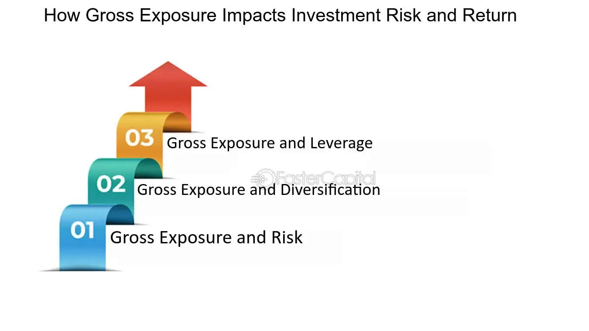

## Table of Contents

## What is gross exposure in finance?

Gross exposure in finance is a way to measure how much risk an investor or a fund is taking. It's the total value of all the investments, both the ones that might make money and the ones that might lose money. Imagine you have a basket of stocks; gross exposure is like counting all the stocks in the basket, no matter if they are going up or down in value.

This measure is important because it gives a clear picture of the total investment size. For example, if a fund has $100 million in stocks that could go up and $50 million in stocks that could go down, the gross exposure would be $150 million. This helps investors understand the full scope of their investments and manage their risk better.

## How is gross exposure calculated?

Gross exposure is calculated by adding up the total value of all investments, whether they are long positions (investments expected to increase in value) or short positions (investments expected to decrease in value). For example, if you have $100,000 in stocks you think will go up and $50,000 in stocks you think will go down, your gross exposure would be $150,000. This sum gives you a clear picture of how much money is at play in your portfolio.

This measure is important because it helps investors see the full extent of their investment activity. It's different from net exposure, which subtracts the short positions from the long positions. By focusing on gross exposure, investors can better understand the total risk they are taking on, which is crucial for making informed decisions about their investments.

## Why is gross exposure important in financial analysis?

Gross exposure is important in financial analysis because it shows the total amount of money an investor or fund has put into the market. This number includes all investments, whether they are expected to go up or down in value. By looking at gross exposure, investors can see how much risk they are taking on. It's like knowing the total size of your bet in a game; the bigger the bet, the more you could win or lose.

This measure helps investors make better decisions about their money. If someone sees that their gross exposure is very high, they might decide to reduce their investments to lower their risk. On the other hand, if the gross exposure is low, they might feel more comfortable taking on more investments. Understanding gross exposure gives investors a clear picture of their overall investment strategy and helps them manage their portfolios more effectively.

## Can you explain the difference between gross exposure and net exposure?

Gross exposure and net exposure are two ways to look at how much money you have invested. Gross exposure is the total amount of money you have in all your investments, whether you think they will go up or down in value. For example, if you have $100 in stocks you think will go up and $50 in stocks you think will go down, your gross exposure is $150. It shows the full size of your investment, which helps you see how much risk you are taking.

Net exposure is different because it shows the difference between your investments that you think will go up and the ones you think will go down. Using the same example, if you have $100 in stocks you think will go up and $50 in stocks you think will go down, your net exposure is $50. This number tells you how much you could lose or gain if everything goes as expected. Net exposure is useful for understanding the direction of your investment strategy, while gross exposure shows the overall size and risk.

## How does gross exposure affect investment risk?

Gross exposure shows how much money you have put into all your investments. The more money you invest, the bigger your gross exposure, and the more risk you take. Imagine you're betting on a game; the more money you bet, the more you could win or lose. So, if your gross exposure is high, it means you have a lot of money at risk, and small changes in the market could affect your investments a lot.

Knowing your gross exposure helps you manage your risk better. If you see that your gross exposure is too high, you might decide to take some money out of your investments to lower your risk. On the other hand, if your gross exposure is low, you might feel okay with putting more money in. By keeping an eye on your gross exposure, you can make smarter choices about how much risk you want to take with your investments.

## What are some common strategies for managing gross exposure?

One common strategy for managing gross exposure is diversification. This means spreading your money across different types of investments, like stocks, bonds, and real estate. By not putting all your money in one place, you can lower your risk. If one investment goes down, the others might go up, balancing out your overall gross exposure.

Another strategy is to use stop-loss orders. These are like safety nets for your investments. You set a point where, if your investment drops to that level, it automatically sells. This helps you limit how much money you could lose on any single investment, keeping your gross exposure in check.

Lastly, you can adjust your gross exposure by changing how much you invest. If you think the market is too risky, you might take some money out of your investments to lower your gross exposure. On the other hand, if you feel confident, you might put more money in to increase it. This way, you can control your risk based on what's happening in the market.

## In what types of financial instruments is gross exposure most relevant?

Gross exposure is most relevant in financial instruments like stocks, bonds, and derivatives. Stocks are shares in companies, and if you have a lot of money in stocks, your gross exposure is high. Bonds are loans you give to companies or governments, and they can also add to your gross exposure. Derivatives are more complex; they're like bets on how other financial things will do. If you're using derivatives, your gross exposure can get very big very fast because they let you control a lot of money with just a little.

Hedge funds and mutual funds often use gross exposure to see how much risk they are taking. These funds can have a lot of money in different kinds of investments, so knowing their gross exposure helps them make smart choices. For example, if a [hedge fund](/wiki/hedge-fund-trading-strategies) has a high gross exposure, it might decide to sell some investments to lower the risk. This way, gross exposure helps them keep their investments safe and balanced.

## How does gross exposure impact portfolio diversification?

Gross exposure shows how much money you have in all your investments. If you have a lot of money spread out in different types of investments, like stocks, bonds, and real estate, your gross exposure is high. But, having a high gross exposure can still mean you're diversified if you've spread your money around. Diversification means not putting all your eggs in one basket. So, if one investment goes down, the others might go up, balancing out your overall gross exposure. This way, even with a high gross exposure, you can manage risk by having a mix of different investments.

On the other hand, if your gross exposure is high because you've put a lot of money into just one type of investment, like only stocks, you're not diversified. This can be risky because if something goes wrong with that one type of investment, you could lose a lot of money. So, when managing your gross exposure, it's important to think about diversification. By spreading your money across different kinds of investments, you can keep your gross exposure high but still manage your risk well.

## What are the regulatory considerations related to gross exposure?

Regulatory bodies often have rules about how much risk financial firms can take. Gross exposure is a key number they look at because it shows the total amount of money a firm has invested. If a firm's gross exposure is too high, regulators might worry that the firm is taking on too much risk. They might ask the firm to lower its gross exposure by selling some investments or by not taking on new ones. This helps keep the financial system safe and stops firms from getting into too much trouble.

Different countries have different rules about gross exposure. For example, in the United States, the Securities and Exchange Commission (SEC) and the Commodity Futures Trading Commission (CFTC) have rules that firms must follow. These rules can limit how much gross exposure a firm can have, especially if it uses a lot of borrowed money or deals in risky investments like derivatives. By keeping an eye on gross exposure, regulators can help make sure that firms don't take on more risk than they can handle, which protects both the firms and the people who invest in them.

## How do leverage and gross exposure interact in financial markets?

Leverage and gross exposure are closely linked in financial markets. Leverage means using borrowed money to make investments. When you use leverage, you can control a bigger amount of money than you actually have. This can increase your gross exposure, which is the total value of all your investments. If you borrow a lot of money to invest, your gross exposure goes up because you're putting more money into the market. This can make your investments grow faster, but it also makes them riskier because you could lose more money if things go wrong.

Because of this, managing leverage is important for keeping your gross exposure at a safe level. If you use too much leverage, your gross exposure can get very high, and even small changes in the market can have a big impact on your investments. Financial regulators often watch how much leverage firms use because it can affect the stability of the whole market. By keeping an eye on both leverage and gross exposure, investors and firms can make smarter choices about how much risk they want to take.

## Can you provide an example of how gross exposure is used in hedge fund strategies?

A hedge fund might use gross exposure to see how much risk it's taking. Imagine a hedge fund has $100 million in stocks it thinks will go up and $50 million in stocks it thinks will go down. The gross exposure for this hedge fund would be $150 million. By looking at this number, the fund managers can decide if they're taking on too much risk. If they think the market is getting too risky, they might sell some of their investments to lower their gross exposure and keep their risk at a safe level.

Using gross exposure helps hedge funds make smart choices about their investments. For example, if a hedge fund wants to use a strategy that involves buying and selling a lot of different stocks quickly, it might end up with a very high gross exposure. The fund managers would then need to keep a close eye on this number to make sure they're not putting too much money at risk. By managing their gross exposure, hedge funds can balance the chance of making big profits with the risk of losing a lot of money.

## What advanced metrics should be considered alongside gross exposure for a comprehensive risk assessment?

When looking at how much risk you're taking, gross exposure is a good start, but it's not the whole story. You should also look at net exposure, which is the difference between the investments you think will go up and the ones you think will go down. This helps you see if you're betting more on things going up or down. Another important metric is [value at risk](/wiki/var-value-at-risk) (VaR), which tries to guess the most money you could lose in a bad situation. It's like a safety warning that tells you how much you might lose if things go really wrong.

Another useful metric is the Sharpe ratio, which looks at how much return you're getting for the risk you're taking. It's like checking if the reward is worth the risk. You should also think about beta, which shows how much your investments move with the market. A high beta means your investments could go up or down a lot when the market moves. By looking at all these metrics together with gross exposure, you get a fuller picture of your risk and can make smarter choices about your investments.

## What is the understanding of financial risk and gross exposure?

Financial risk is the potential of losing financial assets or funds, a core concern for investors and portfolio managers. This risk can arise from a variety of factors including market volatility, economic recessions, or changes in interest rates. Effective risk management includes identifying, assessing, and prioritizing risks so that strategies can be applied to minimize, monitor, and control the probability and impact of unfavorable events. 

Gross exposure plays an integral role in measuring and managing financial risk. It is defined as the total absolute value of the long and short positions held within a portfolio. Unlike net exposure, which considers hedging or offsetting positions, gross exposure provides a more comprehensive picture of the actual scale of financial exposure. This helps investors understand the full extent of their market commitments without the influence of counterbalancing measures.

The calculation of gross exposure can be illustrated through a simple formula: 

$$
\text{Gross Exposure} = \sum |\text{Long Positions}| + \sum |\text{Short Positions}|
$$

For instance, if an investment fund holds $150 million in long positions and $100 million in short positions, the gross exposure would be $250 million. This figure reflects the total capital at risk, underscoring the importance for investors to understand their gross exposure, especially when evaluating the overall risk of their portfolio.

Gross exposure is invaluable in assessing the risk and potential impact of market changes on a portfolio. It highlights the extent to which an investment strategy is committed to the market, providing a critical data point for making informed decisions. While gross exposure does not account for hedging strategies or leverage, it nonetheless offers insight into the level of financial risk associated with a given investment approach. As a result, comprehending and regularly monitoring gross exposure is crucial for investors seeking to effectively manage risk and optimize their investment strategies.

## How do you calculate gross exposure?

Calculating gross exposure involves a straightforward process that provides a comprehensive view of an investment portfolio's total market risk. This metric sums the absolute values of all long and short positions held within the portfolio, granting insights into the overall capital at risk.

To calculate gross exposure, use the following formula:

$$
\text{Gross Exposure} = |\text{Long Positions}| + |\text{Short Positions}|
$$

Consider an investment fund that holds $150 million in long positions and $100 million in short positions. Applying the formula, the gross exposure would be:

$$
\text{Gross Exposure} = |150,000,000| + |100,000,000| = 250,000,000
$$

This $250 million figure represents the total market exposure of the fund, without accounting for any hedging strategies or leverage. It indicates the scale of financial commitments and potential risks linked to the investment strategy.

Understanding and calculating gross exposure is essential for investors as it provides a clear picture of the total capital at risk. It allows them to assess their exposure to market fluctuations, aiding in strategic decision-making and risk management. By knowing their gross exposure, investors can better tailor their portfolios to mitigate potential losses while aligning with their financial goals.

## What are Risk Management Strategies for Algo Traders?

Algo traders employ various risk management strategies to handle market exposure effectively. These strategies are essential for minimizing potential losses while maximizing profits. One key technique involves the use of stop-loss orders. A stop-loss order is a pre-defined sell order set at a particular price level. It automatically triggers when a security's price falls to that specified level, enabling traders to cap their losses. This automated approach allows for disciplined trading, ensuring that losses do not exceed a trader's risk tolerance at any given time.

Trailing stops offer another method to limit potential losses while allowing for gains as prices change. Unlike fixed stop-loss orders, trailing stops are dynamic and adjust according to the security's price movement. As the price of a security increases, the trailing stop moves with it at a specified distance. However, if the security's price decreases, the trailing stop remains fixed at its last adjusted position, eventually selling the security if the price falls enough to trigger the stop.

Dynamic position sizing is also crucial in managing risk effectively. This strategy involves adjusting the size of the trade based on factors such as market [volatility](/wiki/volatility-trading-strategies) and the trader's risk tolerance. For instance, using the formula:

$$
\text{Position Size} = \frac{\text{Risk Capital}}{\text{Entry Price} - \text{Stop-Loss Price}}
$$

traders can determine the appropriate size of their position. This calculation considers the capital they're willing to risk and the difference between the entry price and stop-loss price, ensuring that exposure aligns with their risk management objectives.

Diversification across various asset classes and geographic regions is another effective strategy for reducing concentrated exposure to any single risk source. Diversification spreads risk by investing in different areas that respond differently to the same event. By holding a mix of assets, algo traders can mitigate the impact of poor performance in any single asset or region, thereby stabilizing overall returns.

Hedging through derivatives, such as options and futures, is a strategy to counterbalance risks in volatile markets. Options give traders the right, but not the obligation, to buy or sell an asset at a predetermined price, while futures are contracts to buy or sell at a future date for a specified price. These financial instruments can be used to offset potential losses in other areas of the portfolio. For example, if a trader holds a long position in a stock, they might buy a put option to protect against a decline in the stock's price.

These risk management strategies are integral to maintaining a balanced and resilient trading portfolio. By implementing stop-loss orders, trailing stops, and dynamic position sizing, traders can protect against adverse market movements. Diversification and hedging further enhance a trader's ability to withstand market volatility, paving the way for more stable and successful trading outcomes.

## What are Advanced Financial Measurements in Algo Trading?

In [algorithmic trading](/wiki/algorithmic-trading), advanced financial measurements play a crucial role in the effective management of market exposure. Value at Risk (VaR) is one of the key metrics used by traders to estimate the potential loss in the value of an asset or portfolio over a specific time frame, under normal market conditions, and at a given confidence level. The formula for VaR, particularly under the parametric method (also known as the variance-covariance method), is often expressed as:

$$

\text{VaR} = (Z \times \sigma \times \sqrt{t}) \times V 
$$

where:

- $Z$ is the Z-score corresponding to the desired confidence level (e.g., 1.65 for 95%, 2.33 for 99%),
- $\sigma$ is the standard deviation of the asset or portfolio's returns,
- $t$ is the time horizon for VaR calculation (typically measured in days),
- $V$ is the current value of the asset or portfolio.

VaR provides traders with a quantifiable metric that represents potential losses, allowing them to optimize their trading strategies and set risk thresholds accordingly.

In addition to VaR, stress testing is employed to simulate extreme market conditions. This process involves creating hypothetical scenarios to evaluate how trading positions are likely to perform during severe market disruptions. Stress testing covers various scenarios, such as significant [interest rate](/wiki/interest-rate-trading-strategies) changes or sudden market collapses. By analyzing potential outcomes under these simulated conditions, traders can develop strategies to mitigate the impact of adverse events. For example, a Python script could execute a stress test by modeling a sudden 10% market drop and calculating the consequent portfolio valuation changes to anticipate losses.

Scenario analysis extends the concept of stress testing by offering a more dynamic assessment of future financial outcomes, based on varying assumptions about market conditions. Unlike a single stress test, scenario analysis considers multiple potential future states of the world. Traders can assess how different market movements, economic indicators, or policy changes might affect their portfolio performance. This type of analysis facilitates strategic decision-making, enabling traders to adapt their positions proactively.

By integrating these advanced financial measurements, algorithmic traders enhance their risk management strategies, enabling them to navigate market complexities with greater precision and confidence. Such tools are integral in supporting informed decision-making processes in high-frequency and high-[volume](/wiki/volume-trading-strategy) trading environments.

## References & Further Reading

[1]: Bergstra, J., Bardenet, R., Bengio, Y., & Kégl, B. (2011). ["Algorithms for Hyper-Parameter Optimization."](https://dl.acm.org/doi/10.5555/2986459.2986743) Advances in Neural Information Processing Systems 24.

[2]: ["Advances in Financial Machine Learning"](https://www.amazon.com/Advances-Financial-Machine-Learning-Marcos/dp/1119482089) by Marcos Lopez de Prado

[3]: ["Evidence-Based Technical Analysis: Applying the Scientific Method and Statistical Inference to Trading Signals"](https://www.amazon.com/Evidence-Based-Technical-Analysis-Scientific-Statistical/dp/0470008741) by David Aronson

[4]: ["Machine Learning for Algorithmic Trading"](https://github.com/stefan-jansen/machine-learning-for-trading) by Stefan Jansen

[5]: ["Quantitative Trading: How to Build Your Own Algorithmic Trading Business"](https://www.amazon.com/Quantitative-Trading-Build-Algorithmic-Business/dp/1119800064) by Ernest P. Chan