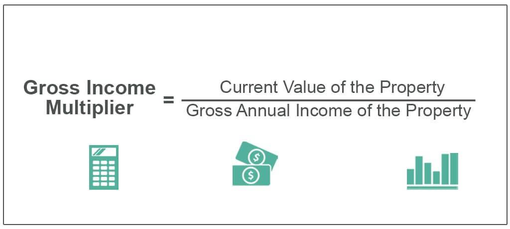

The Gross Income Multiplier (GMI) stands as a pivotal figure in real estate valuation, offering a snapshot of an investment property’s value based on its potential revenue streams. Calculating GMI is straightforward: it involves dividing the property's sale price by its gross annual rental income. This metric simplifies the initial assessment of whether a property's asking price aligns with its anticipated income, though it does not consider detailed financial factors such as operating costs, maintenance, or taxes. As a result, GMI serves as a preliminary filter for investors assessing the validity of a property’s pricing relative to its income-generating potential.

As the real estate market grows increasingly complex, investors leverage the straightforward nature of GMI to make quicker, more informed decisions. Yet, it’s essential to recognize that GMI should be used in conjunction with other financial metrics for a comprehensive appraisal. Diverse financial parameters—like Net Operating Income (NOI) and capitalization rates—provide a deeper understanding of a property's financial health beyond its gross income.



Beyond its traditional application, the GMI’s utility extends into algorithmic trading, where it can aid in refining real estate investment strategies. By integrating GMI into algorithmic models, investors can dynamically analyze and adapt to market shifts, resulting in more robust investment decisions. This integration represents a shift towards more sophisticated, data-driven methodologies in evaluating real estate opportunities.

In summary, the GMI is a significant initial step in real estate valuation but should be part of a broader set of analyses to account for the complexities of investment strategies. Its combination with algorithmic tools can greatly enhance the efficacy of evaluating real estate investments, underscoring the importance of a multi-faceted approach in today’s fast-paced property markets.

## Table of Contents

## What is Gross Income Multiplier (GMI)?

The Gross Income Multiplier (GMI) is a crucial valuation metric predominantly used in real estate to evaluate the potential worth of an investment property. This metric provides a simplified way to estimate a property's value by calculating the ratio of the property's sale price to its gross annual rental income. Mathematically, it can be expressed as:

$$
\text{GMI} = \frac{\text{Sale Price of Property}}{\text{Gross Annual Rental Income}}
$$

By employing the GMI, real estate investors can quickly assess whether a property is priced in alignment with its income-generating potential. This straightforward assessment gives a snapshot of the income-to-value relationship, offering insights into whether the property's asking price is reasonable compared to its potential revenue streams.

However, the Gross Income Multiplier has its limitations. It does not [factor](/wiki/factor-investing) in operating costs such as maintenance expenses, property taxes, insurance, or vacancies, which can substantially impact the net profitability of a property. Consequently, while GMI serves as a valuable initial tool for property evaluation, it is essential to complement it with other financial analysis methods, such as Net Operating Income (NOI) or capitalization rate assessments, to gain a comprehensive understanding of an investment's attractiveness.

Given its simplicity, GMI is favored for quick comparisons across different properties. However, it is crucial for investors to apply it alongside other financial assessment tools to ensure a more detailed and nuanced analysis of real estate investment opportunities.

## Understanding Gross Income with Examples

Gross Income Multiplier (GMI) is a straightforward measure used in real estate to quickly estimate the value ratio of an investment property in comparison to its gross revenue potential. To understand this concept with practical examples, consider a property that is valued at $500,000 with a gross annual rental income of $100,000. In this scenario, the GMI can be calculated as follows:

$$
\text{GMI} = \frac{\text{Sale Price}}{\text{Gross Annual Rental Income}} = \frac{500,000}{100,000} = 5
$$

This calculation implies that the property's sale price is five times its gross annual income. The result reflects how the market values the potential income stream generated from the property. A lower GMI value can indicate a property that might be undervalued, suggesting that it could yield better returns relative to its purchase price, making it potentially attractive to investors seeking higher value propositions.

Using GMI, investors can effectively compare different properties by standardizing the metric across various sizes and property types. It allows for expedient assessments, facilitating decisions on which properties might offer better comparative market value. For instance, if another property has a GMI of 7, it could suggest that, relative to its income, it is priced higher than the first one with a GMI of 5.

However, it is important to consider that market conditions and property types might impact the benchmarks or typical GMI values. Different real estate markets may have varying average GMI values influenced by local economic conditions, demand, and supply of rental properties. Additionally, different types of properties like commercial, residential, or industrial might have distinct expected GMI levels due to differing risk profiles and management costs. 

Thus, while Gross Income Multiplier serves as a handy tool for preliminary analysis by providing a quick snapshot of income potential versus market valuation, its application must be complemented by deeper analysis. The GMI should be interpreted while considering broader market context and alongside additional metrics to form a comprehensive investment evaluation.

## Limitations of Using GMI

Gross Income Multiplier (GMI), while useful, has several limitations that can impact its efficacy as a standalone valuation metric. A primary constraint is that GMI does not account for operating costs such as utilities, property taxes, and potential vacancies. These expenses are critical in determining a property's net profitability. By exclusively focusing on gross income, GMI can potentially overstate a property's financial benefits.

Another significant limitation of GMI is its inherent assumption of uniformity across different property classes. This assumption can be misleading because properties often differ markedly in terms of expense ratios and management practices. For instance, a residential property typically involves different costs and management requirements compared to a commercial one. Consequently, using GMI without adjustments could result in inaccurate assessments, especially when evaluating diverse property portfolios.

GMI essentially provides a 'back of the envelope' calculation, a rudimentary estimate suited for quick evaluations but inadequate for comprehensive investment analysis. It lacks the depth required to encapsulate all variables influencing an investment's value. As such, relying predominantly on GMI can mislead investors, especially when significant factors like capital expenditures or potential shifts in future income are not considered.

To address these limitations and obtain a more accurate financial insight, it is critical to use GMI alongside other financial measures. The Net Income Multiplier (NIM), which considers net operating income, and capitalization rates can offer more nuanced perspectives by incorporating operating costs and future income potential. This multi-metric approach will enable investors to better gauge the complete financial landscape of prospective real estate investments, leading to more informed decision-making.

## Integrating GMI with Algorithmic Trading

Algorithmic trading has increasingly become an essential component of real estate investment strategies, providing a systematic way to analyze and optimize investment decisions. By integrating Gross Income Multiplier (GMI) with [algorithmic trading](/wiki/algorithmic-trading), investors can enhance their ability to quickly adapt to market changes and make efficient property evaluations.

Firstly, algorithmic trading facilitates the incorporation of dynamic data inputs, such as GMI, alongside other key financial metrics. This allows investors to rapidly assess the value of investment properties relative to their income potential. The integration of GMI into an automated trading strategy can streamline the property evaluation process by continuously analyzing vast datasets to identify potential investment opportunities. For example, a basic algorithm can constantly scan the market for properties with a lower GMI, which might indicate undervaluation and potentially higher returns.

Here's a simple illustration of how this might be implemented using Python:

```python
# Python code to identify properties with low GMI
properties = [
    {'property_id': 1, 'sale_price': 500000, 'annual_income': 100000},
    {'property_id': 2, 'sale_price': 750000, 'annual_income': 150000},
    {'property_id': 3, 'sale_price': 300000, 'annual_income': 80000}
]

def calculate_gmi(property):
    return property['sale_price'] / property['annual_income']

# Setting a threshold for GMI
gmi_threshold = 6

# Finding properties with GMI below the threshold
undervalued_properties = [prop for prop in properties if calculate_gmi(prop) < gmi_threshold]

print("Undervalued Properties:", undervalued_properties)
```

By automating the evaluation process, investors can efficiently perform comparative analyses across numerous properties, minimizing manual errors and focusing on the most promising options. Algorithmic models can also simulate various market scenarios by adjusting GMI calculations for operational costs and future income forecasts.

Moreover, integrating GMI with algorithmic strategies enables a data-driven approach that surpasses traditional investment methods. This approach not only enhances the ability to execute real-time adjustments based on updated financial inputs but also significantly reduces the time and resources required for decision-making. The strategic use of algorithmic tools can maximize returns by identifying untapped opportunities in competitive markets, thereby optimizing portfolio performance.

In summary, the synergy between GMI and algorithmic trading offers a powerful method for real estate investors aiming to refine their investment strategies and improve decision-making processes. By leveraging automated tools and dynamic data analysis, investors can achieve a more sophisticated and efficient evaluation of real estate assets, ultimately leading to more informed investment choices.

## Conclusion

The Gross Income Multiplier (GMI) serves as an essential tool in the preliminary valuation of real estate properties, providing a straightforward metric that relates potential income to the market value. This method allows investors to quickly assess whether a property is worth its asking price in light of the expected rental income. However, while GMI is useful for such quick assessments, relying solely on it without acknowledging its limitations could lead to inaccurate investment decisions. Its inability to factor in operating costs, varying market conditions, and property-specific expenses necessitates that GMI be used in conjunction with other financial indicators.

Integrating GMI within algorithmic trading frameworks can significantly enhance investment strategies by leveraging sophisticated, adaptable models. Through automation, dynamic data inputs, and simulation of various scenarios, algorithmic trading systems can enrich the decision-making process, providing a more strategic and data-driven approach compared to manual analyses.

When combined with other metrics such as the Net Income Multiplier (NIM) or capitalization rates, GMI becomes part of a comprehensive suite of tools that allows for rigorous evaluation of real estate investments. This multifaceted approach ensures that investors consider a wide range of factors influencing property value and potential return, leading to more informed and effective investment strategies.

In today's fast-paced, data-driven financial environment, staying informed about tools like GMI and their potential applications in algorithmic trading is fundamental for investors aiming to optimize their decision-making processes. Such knowledge not only maximizes returns but also ensures a competitive edge in an ever-evolving real estate market.

## References & Further Reading

[1]: Geltner, D., Miller, N., Clayton, J., & Eichholtz, P. (2013). ["Commercial Real Estate Analysis and Investments."](https://www.researchgate.net/publication/245702364_Commercial_Real_Estate_Analysis_and_Investments) South-Western College Pub.

[2]: Brueggeman, W. B., & Fisher, J. D. (2010). ["Real Estate Finance and Investments."](https://www.mheducation.com/highered/product/real-estate-finance-investments-brueggeman-fisher/M9781260734300.html) McGraw-Hill Education.

[3]: Fabozzi, F. J. (2016). ["Handbook of Real Estate Investment: Strategies and Techniques."](https://books.google.com/books/about/Bond_Markets_Analysis_and_Strategies_ten.html?id=bQpNEAAAQBAJ) Wiley Finance.

[4]: Chan, E. P. (2009). ["Quantitative Trading: How to Build Your Own Algorithmic Trading Business."](https://github.com/ftvision/quant_trading_echan_book) Wiley.

[5]: Lopez de Prado, M. (2018). ["Advances in Financial Machine Learning."](https://www.amazon.com/Advances-Financial-Machine-Learning-Marcos/dp/1119482089) Wiley.