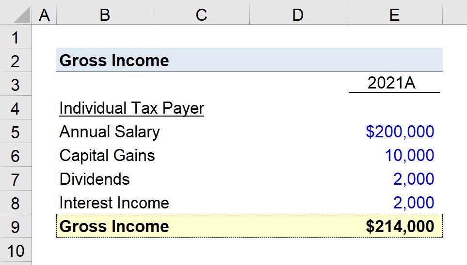

In the landscape of modern financial markets, understanding income calculation is crucial for effective financial planning. Fundamental to this understanding is the concept of gross income, which serves as a cornerstone in various financial assessments and calculations. Gross income typically represents the total income earned by an individual or entity before any deductions such as taxes, insurance, or other expenses. It encompasses wages, bonuses, rental income, and other earnings, forming the basis upon which more nuanced financial terms and figures—such as net income and taxable income—are derived.

The significance of gross income lies in its pervasive role across numerous financial contexts. It influences personal financial decision-making, impacting budget preparation and loan eligibility, while also playing a critical role in tax calculations. Accurately calculating gross income aids in assessing one's financial health and preparing comprehensive financial statements, thereby supporting informed financial management.



Parallel to this traditional financial context, the advent of algorithmic trading (algo trading) has introduced a transformative approach to trading in the financial industry. Algorithmic trading involves using predefined algorithms to execute trades at optimal times based on a range of financial indicators, including gross income figures. Such precision requires high accuracy from the financial data utilized, making the comprehension of foundational metrics like gross income paramount.

This article aims to explore the calculation of gross income, its relationship with other key financial terms, and its significant application in algorithmic trading. By understanding these concepts, individuals and professionals alike can enhance their financial literacy and optimize their decision-making processes. Harnessing this knowledge not only benefits personal financial planning but also empowers traders and financial institutions to craft robust, data-driven strategies in a competitive marketplace. 

Overall, a thorough grasp of gross income and related financial terms provides a vital advantage, paving the way for success in both personal financial management and sophisticated trading environments.

## Table of Contents

## Understanding Gross Income

Gross income represents the total earnings of an individual or entity before any deductions, taxes, or expenses are applied. It encompasses all sources of income, providing a comprehensive picture of the financial inflow. The primary distinction between gross income and net income is that net income accounts for deductions, such as taxes, insurance, and retirement contributions, resulting in the actual take-home pay.

The components that typically contribute to gross income include:

1. **Wages and Salaries:** The most common form of income, wages, and salaries are payments received for employment, which could be hourly or salaried compensation.

2. **Bonuses and Commissions:** Often tied to performance or attainment of certain targets, bonuses and commissions supplement regular wages and increase gross income.

3. **Rental Income:** Revenue from renting property is a significant component of gross income for landlords or property investors.

4. **Dividends and Interest:** Earnings from investments, such as dividends from stocks or interest from savings accounts, are included in gross income.

5. **Business or Self-employment Income:** For business owners and freelancers, gross income includes revenue from goods or services provided before deducting any business expenses.

6. **Other Earnings:** This may include alimony, royalties, pensions, or any additional streams of revenue.

Accurate calculation of gross income is crucial for multiple financial activities:

- **Personal Budget Planning:** A clear understanding of gross income helps individuals plan their monthly budgets by setting realistic goals for savings and expenditures.

- **Loan Applications:** Lenders assess gross income to evaluate an applicant's ability to repay loans, making it a key metric in the approval process for mortgages, personal loans, and credit cards.

- **Tax Purposes:** Gross income serves as the starting point for calculating taxable income, which determines the amount of tax owed. It's essential to identify all sources of gross income to ensure compliance with tax regulations.

Gross income impacts financial statements and personal finance management significantly. For instance, in a personal finance context, an individual's income statement will list gross income as the top line. This figure is crucial because all subsequent deductions are subtracted from it to derive net income. Financial statements of businesses showcasing total revenue also highlight gross income, thereby affecting profitability analysis and operational efficiency assessments. 

For example, consider a salaried employee [earning](/wiki/earning-announcement) $70,000 annually, receiving a $5,000 annual bonus, and earning $2,000 in rental income. The employee's gross income would be calculated as:

$$
\text{Gross Income} = \text{Wages} + \text{Bonuses} + \text{Rental Income} = 70,000 + 5,000 + 2,000 = 77,000
$$

Understanding gross income plays a pivotal role in personal finance by setting the groundwork for effective financial planning and management.

## Key Financial Terms Related to Gross Income

Gross income is a fundamental term in financial analysis, serving as the starting point for calculating several key financial metrics such as net income, taxable income, and adjusted gross income (AGI). Each of these terms is essential for understanding an individual's or entity’s financial health and obligations.

**Net Income**

Net income, often referred to as the "bottom line," represents the amount of money left after all expenses, including taxes and operating costs, have been deducted from total revenue. It is calculated from gross income by subtracting expenses such as salaries, rent, utilities, and taxes. The formula for net income can be expressed as:

$$
\text{Net Income} = \text{Gross Income} - \text{Total Expenses}
$$

Net income is critical for assessing the profitability of a business or the disposable income available to an individual. It is prominently featured in financial statements like income statements and is a vital indicator for investors and analysts when evaluating company performance.

**Taxable Income**

Taxable income is the portion of gross income that is subject to income tax, determined by subtracting allowable deductions and exemptions from gross income. The calculation of taxable income is crucial for preparing accurate tax returns and ensuring compliance with tax laws. The formula for taxable income is:

$$
\text{Taxable Income} = \text{Gross Income} - \text{Deductions} - \text{Exemptions}
$$

This figure dictates the tax liability owed to the government and is pivotal in financial planning and cash flow management.

**Adjusted Gross Income (AGI)**

Adjusted Gross Income (AGI) is a measure used primarily in the United States tax code to determine the amount of income used to calculate further tax liability. It is derived by taking gross income and subtracting specific adjustments, such as retirement contributions, student loan interest, and tuition fees. The equation for AGI is:

$$
\text{Adjusted Gross Income} = \text{Gross Income} - \text{Adjustments}
$$

AGI influences eligibility for certain tax credits and deductions, making it a crucial figure in tax planning and financial strategy.

**Application and Misconceptions**

In financial documents and scenarios, understanding these terms is essential. For instance, tax filings require precise calculations of taxable income to avoid overpayment or penalties. Similarly, financial planners rely on net income to advise clients on savings and investments.

A common misconception is conflating gross income with net income. While gross income refers to total earnings, net income reflects what remains after financial obligations. Similarly, misunderstanding the impact of deductions and adjustments can lead to inaccuracies in taxable income and AGI calculations. Recognizing these differences ensures more precise financial analysis and better-informed decision-making.

Overall, comprehending how to derive key financial metrics from gross income enhances financial literacy and enables individuals and businesses to manage their finances more effectively.

## Algorithmic Trading and Financial Terms

Algorithmic trading, often referred to as algo trading, is the use of computer algorithms to execute trading decisions with minimal human intervention. These algorithms are designed to monitor market conditions and execute orders based on pre-defined criteria, such as timing, price, and quantity. By using historical and real-time data, algos can rapidly process information and execute trades more efficiently than human traders, capitalizing on market opportunities in milliseconds.

Accurate financial data is critical in [algorithmic trading](/wiki/algorithmic-trading). This includes comprehensive metrics such as gross income, which is essential in formulating trading strategies. Gross income data plays a significant role in assessing the financial health of entities and is often used alongside other financial metrics in trading algorithms. For example, companies with higher gross incomes might signal better financial performance, leading to potential investment opportunities.

The role of financial terms like gross income in algo trading strategies is pivotal. Algorithms can utilize gross income figures to compute earnings ratios, profitability margins, or growth rates, forming the backbone of quantitative analysis and decision-making processes. Gross income, along with net income and other financial indicators, provides insights into the efficiency and profitability of companies, sectors, or even entire markets. This information is crucial for [machine learning](/wiki/machine-learning) models deployed within algorithms, which often [factor](/wiki/factor-investing) in these financial terms when predicting future price movements or [volatility](/wiki/volatility-trading-strategies).

For instance, consider an algorithm that aims to invest in companies with increasing profitability. Python code for extracting gross income data, analyzing trends, and making decisions could look like this:

```python
import pandas as pd

# Sample financial data
data = pd.DataFrame({'Company': ['A', 'B', 'C'],
                     'GrossIncome': [100000, 150000, 120000],
                     'NetIncome': [70000, 100000, 90000]})

# Calculate gross profit margin for each company
data['GrossProfitMargin'] = (data['GrossIncome'] - data['NetIncome']) / data['GrossIncome']

# Select companies with a Gross Profit Margin above a certain threshold
selected_companies = data[data['GrossProfitMargin'] > 0.2]

print(selected_companies)
```

In practice, algorithmic trading systems leverage vast volumes of financial data to decipher trading patterns or anomalies. For example, an algo trading system might analyze quarterly earnings data and its deviation from market expectations, using such discrepancies to automate buy or sell orders. Algorithms might also incorporate gross income variations in industries correlated with macroeconomic variables like consumer spending or supply chain dynamics.

Furthermore, algorithms must adapt to data inaccuracies or sudden market shocks. Gross income figures might fluctuate due to seasonal factors, requiring sophisticated statistical techniques to adjust for such variations and maintain trading algorithm effectiveness. Consequently, algorithms may combine gross income data with broader economic indicators, further highlighting its importance.

In summary, the integration of financial terms such as gross income into algorithmic trading frameworks enables systems to harness the potential of vast datasets effectively. These strategies facilitate refined analysis and precise execution, providing valuable insights for both individual traders and institutional investors.

## Practical Applications and Case Studies

Understanding and applying gross income calculations is crucial in various real-world scenarios, where accurate financial assessments are needed for effective decision-making and strategic planning. Gross income serves as a foundational financial metric in personal finance management, corporate financial analysis, and the rapidly evolving domain of algorithmic trading.

### Real-World Scenarios Requiring Gross Income Calculations

One essential application of gross income calculations is in personal budgeting. Individuals need to determine their gross income to create realistic budgets, ensuring they allocate sufficient funds for savings, investments, and necessary expenses while maintaining a balance between income and expenditure. Lenders also use gross income data when evaluating loan applications, as it helps determine an applicant's creditworthiness and ability to repay the borrowed amount.

In the corporate context, companies rely on gross income calculations to produce accurate financial statements. Gross income is pivotal in analyzing revenue and gauging a company's profitability before accounting for operational costs. This analysis enables businesses to project future earnings, plan investments, and inform stakeholders about the financial health of the organization.

### Algorithmic Trading Strategies Leveraging Gross Income Data

Algorithmic trading systems require precise financial data to execute trades efficiently and minimize risk. These systems are programmed with algorithms that use various inputs, including economic indicators, market data, and financial metrics such as gross income. Gross income data is particularly significant when algorithms are tasked with analyzing the financial performance of companies to determine the value of their stocks.

For instance, an algorithmic trading model may be developed to buy stocks of companies with a consistently increasing gross income, as it suggests robust sales performance and potential profitability. By utilizing data on gross income alongside other financial metrics, algorithms can predict price movements and execute trades based on trend analysis. A case study example could be how a [hedge fund](/wiki/hedge-fund-trading-strategies) employs algorithmic trading strategies that factor in gross income growth rates to identify lucrative investment opportunities, thereby improving returns on investment.

### Benefits to Individual Traders and Financial Institutions

Both individual traders and financial institutions benefit significantly from incorporating gross income data into their trading models. For individual traders, understanding gross income and its implications helps them make informed trading decisions, manage risk, and optimize their portfolio by identifying investment opportunities with favorable financial outlooks.

Financial institutions, on the other hand, leverage gross income data to enhance their trading systems, offering more competitive and analytic trading products. By integrating gross income metrics into their algorithmic trading frameworks, institutions can improve the predictive accuracy of their models, thus offering clients better returns and more robust financial products. Such integration ensures they remain competitive in an increasingly data-driven financial market.

In conclusion, the practical applications of gross income calculations extend across personal finance, corporate accountability, and algorithmic trading. These calculations are invaluable for developing intelligent trading strategies and making informed financial decisions, underlining the importance of accurate and comprehensive financial modeling for success in the financial markets.

## Conclusion

In conclusion, this article has explored the multifaceted concept of gross income and its pivotal role in financial planning and algorithmic trading. Gross income serves as a foundational element in the calculation of various financial terms such as net income, taxable income, and adjusted gross income, each of which holds distinct relevance in financial analyses and personal finance management. Accurately understanding and calculating gross income is essential for effective budgeting, loan applications, and tax filings, impacting both individual and institutional financial statements.

Algorithmic trading, an increasingly prevalent force in modern financial markets, greatly benefits from precise financial data, including accurate gross income figures. The development of effective algo trading strategies relies heavily on this data, demonstrating gross income's significance beyond traditional financial planning to cutting-edge trading methodologies. Accurate calculations and interpretations of gross income and its related terms enable traders and financial institutions to devise strategic models that enhance decision-making and trading outcomes.

Encouraging continuous learning and application of these concepts is crucial for advancing financial literacy and trading success. By deepening their understanding of these terms, individuals and professionals can improve their financial management and capitalize on emerging opportunities presented by algorithmic trading strategies.

To further enhance your knowledge in this area, consider exploring comprehensive resources on income calculations and financial terms, such as tax guides from government websites or financial literacy platforms. For a deeper dive into algorithmic trading, [books](/wiki/algo-trading-books) like "Algorithmic Trading: Winning Strategies and Their Rationale" by Ernie Chan or online courses on platforms like Coursera and Khan Academy can offer valuable insights. By leveraging these resources, readers can build a robust foundation in financial management and trading, equipping themselves with the skills needed for success in today's dynamic financial markets.

## References & Further Reading

[1]: ["Algorithmic Trading: Winning Strategies and Their Rationale"](https://www.amazon.com/Algorithmic-Trading-Winning-Strategies-Rationale-ebook/dp/B00CY5HC0U) by Ernie Chan

[2]: ["Gross Income vs. Net Income: Differences and How to Calculate Both"](https://www.bankrate.com/taxes/gross-income-vs-net-income/) from Investopedia

[3]: ["Advances in Financial Machine Learning"](https://www.amazon.com/Advances-Financial-Machine-Learning-Marcos/dp/1119482089) by Marcos Lopez de Prado

[4]: ["Quantitative Trading: How to Build Your Own Algorithmic Trading Business"](https://www.amazon.com/Quantitative-Trading-Build-Algorithmic-Business/dp/1119800064) by Ernest P. Chan

[5]: ["Machine Learning for Algorithmic Trading"](https://github.com/PacktPublishing/Machine-Learning-for-Algorithmic-Trading-Second-Edition) by Stefan Jansen