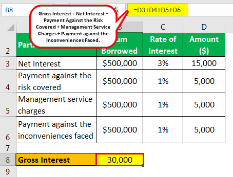

In today's rapidly evolving financial markets, understanding key financial terms and concepts is crucial for both seasoned investors and beginners. As global financial systems continue to advance in complexity and reach, the need for a firm grasp of foundational principles becomes increasingly essential for navigating market dynamics effectively. The financial world is abundant with terminologies and concepts that might appear daunting without a well-structured guide. 

This article aims to provide clarity on important financial terms and concepts, specifically focusing on interest calculation, gross interest, and their pivotal roles in algorithmic trading. Interest calculation is a fundamental aspect that affects various financial avenues, including both savings and borrowing, while gross interest offers insight into potential returns before deductions like taxes and fees are accounted for. Understanding these concepts not only aids in evaluating the true cost and growth potential of financial products but also facilitates strategic decision-making aimed at optimizing profitability. 



In addition, the article will explore how these financial concepts are interlinked and their significance in financial decision-making within the broader scope of algorithmic trading. Algorithmic trading has transformed how trades are executed, allowing for high-speed, data-driven transactions influenced by quantitative analyses of interest rates and earnings. In such a sophisticated trading environment, knowledge of interest calculation and gross interest becomes integral to constructing and executing successful strategies.

By the end of this article, readers will have a clearer understanding of these terms and guidelines on how to apply them effectively in both personal finance and professional trading settings. The insights provided are designed to equip readers with a comprehensive understanding that can be leveraged for better financial decision-making and strategic investments.

## Table of Contents

## Understanding Financial Terminology

Financial terminology serves as the backbone for grasping market dynamics and making well-informed financial decisions. For both individual investors and financial institutions, understanding these terms is foundational to effectively managing finances and investments. Among these critical terms are interest calculation and gross interest, which play a pivotal role in both personal and institutional finance.

Interest calculation is an essential concept that influences a wide array of financial activities. It determines how interest is accrued on savings and charged on loans. The two primary methods of interest calculation are simple and compound interest. Simple interest is calculated on the initial principal alone, using the formula:

$$
\text{Simple Interest} = P \times r \times t
$$

Where $P$ is the principal amount, $r$ is the annual [interest rate](/wiki/interest-rate-trading-strategies), and $t$ is the time period in years. In contrast, compound interest accounts for interest on both the initial principal and the accumulated interest from previous periods. Its formula is expressed as:

$$
A = P \times (1 + \frac{r}{n})^{nt}
$$

Here, $A$ is the amount of money accumulated after n years, including interest, $P$ is the principal, $r$ is the annual interest rate, $n$ is the number of times that interest is compounded per year, and $t$ is the time period in years. Understanding these calculations is crucial for evaluating the cost of loans and the potential growth of savings.

Gross interest, on the other hand, denotes the total interest earned on an investment before any deductions, such as taxes or fees. It is instrumental in determining the profitability of various financial instruments like bonds and savings accounts. By assessing gross interest, investors can gauge the potential returns on their investments without the impact of external deductions. For instance, a savings account may advertise a gross interest rate of 5%, which indicates the rate at which the account's balance will grow before taxation.

These terms form the basis for more nuanced financial concepts and strategies, including risk assessment, investment evaluation, and portfolio management. Acquiring a strong foundational knowledge of such terminology equips individuals and institutions to navigate the complexities of financial markets with confidence. Understanding and utilizing these key terms can considerably enhance one’s ability to maximize investment returns and minimize financial risks. As financial markets continue to evolve, keeping abreast of such fundamental concepts is crucial for sustained financial literacy and success.

## Interest Calculation Basics

Interest is a fundamental concept in finance, influencing a wide variety of financial products and decisions, from personal savings accounts to commercial loans. At its core, interest represents the cost of borrowing money or the reward for saving it, calculated as a percentage of the principal over a specified period. There are two primary types of interest calculations: simple interest and compound interest.

**Simple Interest** is determined using a straightforward calculation: 

$$

\text{Simple Interest} = P \times r \times t
$$

Where $P$ represents the principal amount, $r$ is the annual interest rate (expressed as a decimal), and $t$ denotes the time period in years. For instance, if an individual invests $1,000 at an annual simple interest rate of 5% for three years, the interest earned would be:

$$

\text{Simple Interest} = 1000 \times 0.05 \times 3 = 150 
$$

This means the investor would earn $150 over three years, and the total value of the investment would be $1,150.

**Compound Interest**, on the other hand, considers the reinvestment of interest, meaning interest is calculated not just on the initial principal but also on the accumulated interest from previous periods. The general formula for compound interest is:

$$

A = P \times \left(1 + \frac{r}{n}\right)^{n \times t}
$$

In this formula, $A$ represents the amount of money accumulated after $n$ compounding periods per year over $t$ years, $P$ is the principal amount, $r$ is the annual nominal interest rate, and $n$ is the number of times interest is compounded per year. For example, with the same initial investment of $1,000, a 5% annual interest rate, compounded annually for three years, the calculation would be:

$$

A = 1000 \times \left(1 + \frac{0.05}{1}\right)^{1 \times 3} = 1000 \times 1.157625 = 1157.63 
$$

This results in a total value of $1,157.63 after three years, which includes $157.63 of interest income, slightly more than simple interest, due to compounding.

The calculation of interest is impacted by several crucial factors:

1. **Principal**: The original sum of money deposited or loaned.
2. **Rate**: The percentage of interest charged or earned.
3. **Time Period**: The duration of time over which the interest is calculated.
4. **Compounding Frequency**: How often the accumulated interest is reinvested, which can significantly influence the total interest earned over time.

Understanding these components of interest calculation is vital for accurately assessing the real cost of borrowing or the potential growth of investments. By comparing the results from simple and compound interest calculations, individuals and institutions can make informed decisions, optimizing their financial strategies for savings and loans.

## What is Gross Interest?

Gross interest is an important concept in the financial world, particularly when evaluating the profitability of various investment instruments. It represents the total interest earned on an investment or financial product before any deductions such as taxes, fees, or other charges are applied. This raw figure is crucial as it provides an initial measure of the income potential from an investment.

The gross interest amount can be derived from numerous types of investments, including bonds, savings accounts, and certificates of deposit (CDs). For instance, when an investor buys a bond, the gross interest would be the nominal interest paid by the bond issuer each year. Similarly, for a savings account, it would be the total interest accrued by the account balance, calculated based on the stated interest rate.

Here's a basic example: Suppose an investor holds a savings account with a principal of $10,000 and an annual interest rate of 5%. The gross interest earned in a year would be calculated using the formula for simple interest:

$$
\text{Gross Interest} = \text{Principal} \times \text{Rate} \times \text{Time}
$$

Substituting in the example values gives:

$$
\text{Gross Interest} = 10,000 \times 0.05 \times 1 = \$500
$$

This $500 would be the gross interest earned before any taxes or fees are subtracted.

Understanding gross interest is critical for investors as it serves as the basis for determining the net interest, which is the actual return after deductions. The gross interest figure helps investors compare the profitability of different financial products, as it allows them to assess the raw [earning](/wiki/earning-announcement) potential without external influences.

For example, when comparing two bonds, an investor can look at the gross interest payments to decide which bond might offer better initial returns before taxes and fees are considered. However, to make a fully informed decision, investors must also consider any potential deductions that might reduce the net interest. Thus, gross interest provides an essential reference point for evaluating and making strategic investment decisions.

## Algorithmic Trading in Finance

Algorithmic trading, or algo trading, utilizes complex algorithms and computer systems to execute trades at high speeds with minimal human intervention. These algorithms follow pre-defined criteria, which can include timing, price, quantity, or any mathematical model. The primary advantage of [algorithmic trading](/wiki/algorithmic-trading) is its ability to process vast amounts of data and perform trades more efficiently than a human trader could manually. This section explores how algorithmic trading functions, its impact on financial markets, and the role of interest rates in these trading strategies.

Algorithmic trading systems typically follow a step-by-step procedure that involves data analysis, signal generation, and trade execution. Initially, the algorithm analyses market data to identify trading signals based on set parameters such as moving averages, historical trends, or predicted price movements. Once a signal is identified, the algorithm automatically determines the appropriate trade to execute, factoring in key financial benchmarks like interest rates. By executing trades quickly and at precise moments, algorithmic trading can exploit tiny price differentials that human traders might miss, a practice known as high-frequency trading.

The influence of algorithmic trading on financial markets is significant. It has increased market [liquidity](/wiki/liquidity-risk-premium) and reduced transaction costs due to the high [volume](/wiki/volume-trading-strategy) of trades executed. However, this rapid trading can also contribute to market [volatility](/wiki/volatility-trading-strategies), as seen in events like the 2010 "Flash Crash" where the Dow Jones Industrial Average dropped, and then recovered, by about 1,000 points within minutes. Despite these risks, the speed and efficiency of algorithmic trading contribute to making markets more efficient by ensuring prices reflect available information quicker than traditional trading methods.

Interest rates are a crucial [factor](/wiki/factor-investing) in algorithmic trading strategies, influencing both the cost of borrowing funds and the expected return on investments. Algorithms incorporate these rates to optimize trade executions by anticipating how changes in interest rates might affect asset prices. For instance, an expected rise in interest rates might lead to algorithms short-selling interest-sensitive assets like bonds, while a decrease might trigger the purchase of these assets due to anticipated price increases.

Furthermore, gross interest calculations are integral to evaluating potential investment returns within trading algorithms. Gross interest represents the total returns from a financial instrument before expenses such as taxes, fees, and other deductions. By focusing on gross interest rates, algorithms can identify assets or trades that offer the best potential for profit maximization while managing exposure to interest rate changes.

In summary, algorithmic trading leverages sophisticated algorithms to drive rapid and informed trading decisions, crucially informed by interest rate considerations. This automated approach allows traders to quickly adapt to market changes, capitalizing on opportunities and enhancing overall market efficiency. As technology evolves, the significance of algorithmic trading in financial markets is likely to increase, making it an indispensable component of modern trading strategies.

## Integration of Gross Interest in Algo Trading Strategies

Incorporating gross interest into algorithmic trading strategies has the potential to significantly enhance investment returns by optimizing interest earnings through the targeting of lower fees and higher gross interest rates. Gross interest, defined as the total interest earned on an investment before any deductions, such as taxes or fees, serves as a crucial parameter for evaluating the profitability of various financial instruments. By effectively integrating gross interest calculations into algorithmic models, traders can better assess and predict the outcomes of their trading strategies, ultimately maximizing returns.

Algorithmic trading, characterized by the use of high-speed computer programs to execute trades, relies heavily on data-driven decision-making. One approach to integrating gross interest into these strategies is through optimizing the selection of financial products that offer the highest gross interest rates while minimizing associated fees. For instance, algorithms can be programmed to scan a range of financial instruments, such as bonds or savings accounts, to identify those with superior gross interest metrics. By prioritizing trades that maximize gross interest, algorithmic strategies can yield more attractive returns for investors.

A practical application of integrating gross interest in trading strategies includes the use of predictive analytics and [machine learning](/wiki/machine-learning) models. These models can analyze historical data to uncover patterns and assess the potential future performance of financial instruments. By inputting gross interest rates as a key variable, these algorithms can forecast which investments are likely to provide the greatest profitability. For example, the strategy might involve allocating resources towards assets that have consistently offered high gross interest rates over time, thereby optimizing the overall portfolio performance.

Case studies have demonstrated the success of integrating gross interest considerations into trading algorithms. One notable example is the application of algorithmic trading in fixed-income securities, where traders use sophisticated algorithms to balance the trade-off between interest yield and associated transaction costs. By focusing on gross interest as a fundamental component of these strategies, traders have reported improved margins and increased investment returns.

The role of data analytics and automation is pivotal in evaluating and maximizing gross interest within trading portfolios. Automated systems can continuously monitor market conditions and adjust trading algorithms to capitalize on fluctuations in interest rates. This dynamic approach allows traders to maintain an optimal balance between interest earnings and trading costs, ensuring that the portfolios remain profitable under varying market scenarios. Additionally, automation reduces the likelihood of human error, further enhancing the accuracy and efficiency of gross interest computations.

Python, as a programming language, is particularly well-suited for developing and implementing these algorithms due to its extensive libraries and ease of use in handling large datasets. Below is a simple example illustrating the calculation of gross interest within a Python function:

```python
def calculate_gross_interest(principal, rate, time):
    """
    Calculate gross interest using simple interest formula

    Parameters:
    principal (float): The initial amount of money
    rate (float): The interest rate (as a decimal)
    time (float): The time period for the investment

    Returns:
    float: The calculated gross interest
    """
    return principal * rate * time

# Example usage
principal_amount = 10000  # Initial investment of $10,000
interest_rate = 0.05      # 5% interest rate
investment_period = 3     # 3 years

gross_interest = calculate_gross_interest(principal_amount, interest_rate, investment_period)
print(f"Gross Interest: ${gross_interest:.2f}")
```

This function applies the basic simple interest formula to compute gross interest, a crucial step in forecasting the profitability of an investment. By leveraging similar techniques and more complex models, algorithmic trading can efficiently incorporate gross interest to optimize strategy outcomes, delivering enhanced returns to investors.

## Conclusion

The convergence of financial terminology, interest calculations, and algorithmic trading constructs a framework that, while intricate, is approachable with the right knowledge base. Grasping these concepts enables investors to navigate the financial markets with precision, maximizing potential returns while mitigating risks. This article has elucidated several key financial terms, illustrating their practical applications in algorithmic trading environments. Understanding how interest is calculated—both simple and compound—underscores an investor's ability to evaluate lending costs and savings growth. Simultaneously, recognizing the implications of gross interest assists in assessing the comprehensive earning potential of investments before tax and fee deductions.

Algorithmic trading integrates these fundamentals by deploying computer algorithms capable of executing trades at speeds and efficiencies beyond human capacity. Interest rates and calculations, including gross interest, emerge as core variables in these strategies, influencing the development and success of trading algorithms. As such, algorithmic trading exemplifies the practical significance of mastering financial terminology and interest concepts.

The capability to apply and adapt these insights to rapidly shifting market dynamics is instrumental for achieving sustained financial success. As the financial landscape continues to evolve, driven by technological innovation and shifting economic indicators, investors must remain agile learners, ready to capitalize on the opportunities presented by new financial instruments and trading methodologies.

In sum, while the intersection of financial terminology, interest calculation, and algorithmic trading may appear daunting, it holds the key to unlocking strategic decision-making that can enhance profitability and reduce exposure to market uncertainties. Moving forward, the adept application of these concepts will likely differentiate successful investors in an increasingly complex trading environment.

## Further Reading and Resources

For those interested in deepening their understanding of financial terms, interest calculations, and algorithmic trading, a variety of resources are available to provide more comprehensive insights. Here's a curated list to guide further exploration:

**Books:**
1. **"The Intelligent Investor" by Benjamin Graham** - A classic read for understanding fundamental investment principles and financial terminology.
2. **"A Random Walk Down Wall Street" by Burton Malkiel** - This book offers insights into market dynamics and investment strategies.
3. **"Quantitative Finance for Dummies" by Steve Bell** - Provides a beginner-friendly introduction to complex financial concepts, including interest calculation.
4. **"Algorithmic Trading: Winning Strategies and Their Rationale" by Ernie Chan** - This book is an excellent resource for understanding the basics and strategies of algorithmic trading.

**Online Courses:**
1. **Coursera's "Financial Markets" by Yale University** - An extensive course covering the fundamentals of financial markets, including the role of interest rates.
2. **edX's "Introduction to Computational Finance and Financial Econometrics"** - Offers a deep dive into quantitative finance and computational methods in trading.
3. **Khan Academy's Finance and Capital Markets Course** - Free resources covering basic financial terminology, interest calculation, and more.

**Websites and Forums:**
1. **Investopedia** - A comprehensive resource for learning about financial terms and concepts with detailed articles.
2. **Yahoo Finance** - Offers up-to-date financial news and insights that are crucial for algorithmic trading.
3. **QuantConnect Community** - A platform for algo traders to collaborate and share strategies.
4. **Seeking Alpha** - Provides articles and opinions on market trends which include professional insights into interest rates and trading strategies.

**Data for Practice:**
- **Quandl**: A repository of financial, economic, and alternative datasets which is useful for backtesting trading strategies.
- **Yahoo Finance API**: Allows access to historical market data, ideal for implementing and testing algorithmic trading models in Python.

**Python Libraries**:
- **Pandas and NumPy**: Essential for data manipulation and numerical analysis in financial research.
- **QuantLib**: A library specifically for quantitative finance, helpful for implementing interest calculations and pricing models.
- **TA-Lib**: For technical analysis of financial markets, providing functions to create trading strategies considering gross interest.

Continued learning and staying updated with the latest financial trends is crucial for success in today's market. These resources are intended to provide foundational knowledge and practical tools for mastering financial principles and algorithms.

## References & Further Reading

[1]: ["Algorithmic Trading: Winning Strategies and Their Rationale"](https://books.google.com/books/about/Algorithmic_Trading.html?id=WAlFDwAAQBAJ) by Ernest P. Chan

[2]: ["The Intelligent Investor: The Definitive Book on Value Investing"](https://www.amazon.com/Intelligent-Investor-Third-Definitive-Investing/dp/0063423537) by Benjamin Graham

[3]: ["A Random Walk Down Wall Street: The Time-Tested Strategy for Successful Investing"](https://www.amazon.com/Random-Walk-Down-Wall-Street/dp/0393358380) by Burton G. Malkiel

[4]: ["Quantitative Finance For Dummies"](https://www.amazon.com/Quantitative-Finance-Dummies-Steve-DPhil/dp/1118769465) by Steve Bell

[5]: ["Advances in Financial Machine Learning"](https://www.amazon.com/Advances-Financial-Machine-Learning-Marcos/dp/1119482089) by Marcos Lopez de Prado