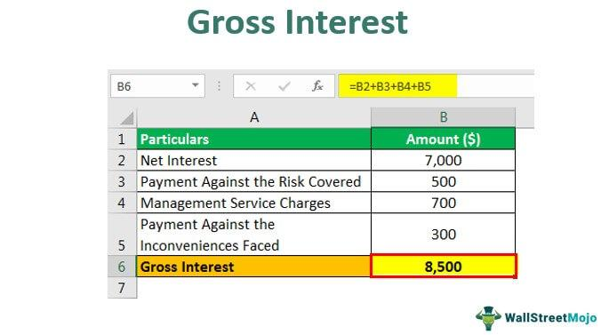

## Table of Contents

## What is gross interest?

Gross interest is the total amount of interest earned on an investment or paid on a loan before any fees or taxes are taken out. It's like the full amount of interest you get or have to pay before anyone takes a cut. For example, if you invest money in a savings account, the bank might tell you that you'll earn 5% interest per year. That 5% is the gross interest.

When you see gross interest mentioned, it's important to remember that it doesn't include things like taxes or fees. So, if you're looking at how much money you'll actually get to keep from an investment, you need to subtract these costs from the gross interest. For instance, if you earn $100 in gross interest but have to pay $20 in taxes, your net interest, or the amount you actually get to keep, would be $80.

## How is gross interest different from net interest?

Gross interest is the total amount of interest you earn or pay before any fees or taxes are taken away. Imagine you put money in a savings account and the bank says you'll get 5% interest each year. That 5% is the gross interest. It's like the whole pie before anyone takes a slice.

Net interest, on the other hand, is what you actually get to keep after subtracting fees and taxes. Using the same example, if you earn $100 in gross interest but have to pay $20 in taxes, your net interest would be $80. So, net interest is the part of the pie that's left for you after everyone else has taken their share.

## Can you explain the basic formula for calculating gross interest?

The basic formula for calculating gross interest is pretty simple. You start with the principal amount, which is the money you initially invest or borrow. Then, you multiply this principal by the interest rate, which is usually given as a percentage. For example, if you invest $1,000 at an interest rate of 5%, you would multiply $1,000 by 0.05 (which is 5% as a decimal). This gives you the gross interest for one period, like a year.

If you want to calculate gross interest over multiple periods, you need to decide if the interest is simple or compound. For simple interest, you just multiply the principal by the interest rate and then by the number of periods. So, if you keep that $1,000 invested for 2 years at 5% simple interest, you'd multiply $1,000 by 0.05 and then by 2. For compound interest, you add the interest earned back to the principal at the end of each period before calculating the next period's interest. This makes the amount of interest grow faster over time.

## What are the common types of financial products where gross interest is applied?

Gross interest is often seen in savings accounts. When you put your money in a savings account, the bank pays you interest for keeping your money with them. This interest is the gross interest before any taxes or fees are taken out. For example, if your savings account says it gives you 2% interest each year, that 2% is the gross interest.

Another place you'll find gross interest is in certificates of deposit, or CDs. With a CD, you agree to leave your money in the bank for a set time, like a year or more. In return, the bank gives you a higher interest rate than a regular savings account. This interest rate is the gross interest, which you earn before any taxes or penalties for early withdrawal are subtracted.

Bonds are another financial product where gross interest comes into play. When you buy a bond, you're basically lending money to a government or company. They pay you back with interest over time. The interest they pay you is the gross interest before any taxes are taken out. So, if a bond promises to pay you 3% interest each year, that 3% is the gross interest.

## How does gross interest affect the overall return on investment?

Gross interest is the starting point for figuring out how much money you'll make from an investment. When you put your money into something like a savings account, a certificate of deposit, or a bond, the interest rate they promise you is the gross interest. This is important because it tells you the maximum amount of interest you could earn before any fees or taxes are taken out. So, if a bank says you'll get 5% interest on your savings, that 5% is the gross interest, and it gives you a good idea of how much your investment could grow.

However, the gross interest doesn't tell the whole story about your overall return on investment. To know how much money you'll actually keep, you need to subtract any fees or taxes from the gross interest. For example, if you earn $100 in gross interest but have to pay $20 in taxes, your real return, or net interest, is only $80. So, while gross interest is a key piece of information, it's the net interest that really shows how much your investment is worth to you in the end.

## What role does gross interest play in savings accounts?

Gross interest is really important when it comes to savings accounts. It's the total amount of interest the bank promises to pay you for keeping your money in their account. For example, if a bank says you'll get 2% interest each year, that 2% is the gross interest. This number helps you see how much your savings could grow over time before any fees or taxes are taken out.

However, the gross interest isn't the final amount you'll actually get to keep. After the bank calculates the gross interest, they might take out fees or taxes. So, if you earn $50 in gross interest but have to pay $10 in fees, you'll only keep $40. That's why it's good to know the gross interest, but you should also think about any costs that might reduce what you take home.

## How can gross interest rates impact loan repayments?

Gross interest rates are super important when it comes to loan repayments. When you take out a loan, the bank charges you interest on the money you borrowed. The interest rate they tell you is the gross interest rate. This rate helps you figure out how much extra money you'll need to pay back on top of the loan itself. For example, if you borrow $1,000 at a 5% gross interest rate, you'll need to pay back the $1,000 plus $50 in interest.

However, the gross interest rate isn't the only thing that affects your loan repayments. After the bank calculates the gross interest, they might take out fees or taxes. So, if you have to pay $10 in fees on top of that $50 in interest, your total repayment goes up. Knowing the gross interest rate is a good start, but you also need to think about any extra costs that could make your loan more expensive.

## What are the tax implications of gross interest earned?

When you earn gross interest, like from a savings account or a bond, you usually have to pay taxes on it. The government sees this interest as part of your income, so you'll need to report it when you file your taxes. The exact amount of tax you pay depends on your total income and the tax laws where you live. For example, if you earn $100 in gross interest and your tax rate is 20%, you'll owe $20 in taxes on that interest.

This means that the gross interest you see isn't what you'll actually get to keep. After paying taxes, the amount you have left is called net interest. So, if you earned $100 in gross interest and paid $20 in taxes, your net interest would be $80. It's important to think about these taxes when you're planning how much money you'll really make from your investments.

## How do financial institutions determine gross interest rates?

Financial institutions like banks decide on gross interest rates by looking at a bunch of different things. One big thing they consider is the interest rates set by the central bank, like the Federal Reserve in the U.S. If the central bank raises its rates, banks usually raise their gross interest rates too. They also think about how much they need to pay to get money from other places, like other banks or investors. If it costs them more to get money, they might raise the gross interest rates they offer to customers to cover those costs.

Another thing banks look at is how much risk they're taking on. If they think there's a bigger chance that people won't pay back their loans, they might charge higher gross interest rates to make up for that risk. They also keep an eye on what other banks are doing. If one bank offers really high gross interest rates to attract customers, other banks might need to raise their rates too, just to stay competitive. So, setting gross interest rates is a bit like a balancing act, where banks try to make money while also keeping their customers happy.

## Can gross interest rates fluctuate over time, and if so, why?

Yes, gross interest rates can definitely change over time. They go up and down because of a lot of different reasons. One big reason is what the central bank, like the Federal Reserve in the U.S., decides to do. If the central bank raises its rates, banks usually follow and raise their gross interest rates too. Another reason is how much it costs banks to get money. If it's more expensive for them to borrow money from other places, they might raise the gross interest rates they offer to customers to cover those costs.

Also, banks think about how risky it is to lend money. If they feel there's a bigger chance people won't pay back their loans, they might charge higher gross interest rates to make up for that risk. Banks also watch what other banks are doing. If one bank starts offering really high gross interest rates to attract customers, other banks might need to raise their rates too, just to stay competitive. So, gross interest rates can move around a lot, depending on all these different things.

## What advanced strategies can be used to maximize returns from gross interest?

To maximize returns from gross interest, one advanced strategy is to use a laddering approach with certificates of deposit (CDs). This means you split your money into different CDs that mature at different times. For example, you could put some money in a 1-year CD, some in a 2-year CD, and some in a 3-year CD. This way, you can take advantage of higher interest rates as they become available without locking all your money away for a long time. When one CD matures, you can reinvest it at the current rate, which might be higher than when you first started.

Another strategy is to keep an eye on interest rate changes and move your money around accordingly. If you think interest rates are going to go up, you might want to keep your money in shorter-term investments so you can quickly move it to a new account with a higher rate. If you think rates are going to go down, locking in a longer-term investment with a good rate now could be a smart move. This kind of active management can help you make the most of the gross interest you earn, but it requires paying close attention to what's happening with interest rates.

## How do international differences in gross interest rates affect global investment decisions?

When people think about where to invest their money around the world, they look at the gross interest rates different countries offer. If one country has higher gross interest rates than another, it might seem like a good place to invest because you could earn more money. But it's not just about the highest rate. Investors also need to think about things like how stable the country's economy is, the taxes they might have to pay, and how easy it is to move money in and out of the country. So, even if a country has high gross interest rates, other factors can make it less appealing.

For example, if Country A offers 5% gross interest on savings accounts and Country B offers only 3%, you might be tempted to put your money in Country A. But if Country A's economy is risky and there are big taxes on the interest you earn, the actual return might not be as good as it seems. On the other hand, if Country B is very stable and has lower taxes, the 3% rate might end up being a better choice. So, when deciding where to invest globally, it's important to look at the whole picture, not just the gross interest rates.

## What is the key to understanding financial terminology?

Financial terminology serves as the backbone for grasping market dynamics and making well-informed financial decisions. For both individual investors and financial institutions, understanding these terms is foundational to effectively managing finances and investments. Among these critical terms are interest calculation and gross interest, which play a pivotal role in both personal and institutional finance.

Interest calculation is an essential concept that influences a wide array of financial activities. It determines how interest is accrued on savings and charged on loans. The two primary methods of interest calculation are simple and compound interest. Simple interest is calculated on the initial principal alone, using the formula:

$$
\text{Simple Interest} = P \times r \times t
$$

Where $P$ is the principal amount, $r$ is the annual [interest rate](/wiki/interest-rate-trading-strategies), and $t$ is the time period in years. In contrast, compound interest accounts for interest on both the initial principal and the accumulated interest from previous periods. Its formula is expressed as:

$$
A = P \times (1 + \frac{r}{n})^{nt}
$$

Here, $A$ is the amount of money accumulated after n years, including interest, $P$ is the principal, $r$ is the annual interest rate, $n$ is the number of times that interest is compounded per year, and $t$ is the time period in years. Understanding these calculations is crucial for evaluating the cost of loans and the potential growth of savings.

Gross interest, on the other hand, denotes the total interest earned on an investment before any deductions, such as taxes or fees. It is instrumental in determining the profitability of various financial instruments like bonds and savings accounts. By assessing gross interest, investors can gauge the potential returns on their investments without the impact of external deductions. For instance, a savings account may advertise a gross interest rate of 5%, which indicates the rate at which the account's balance will grow before taxation.

These terms form the basis for more nuanced financial concepts and strategies, including risk assessment, investment evaluation, and portfolio management. Acquiring a strong foundational knowledge of such terminology equips individuals and institutions to navigate the complexities of financial markets with confidence. Understanding and utilizing these key terms can considerably enhance one’s ability to maximize investment returns and minimize financial risks. As financial markets continue to evolve, keeping abreast of such fundamental concepts is crucial for sustained financial literacy and success.

## What are the basics of interest calculation?

Interest is a fundamental concept in finance, influencing a wide variety of financial products and decisions, from personal savings accounts to commercial loans. At its core, interest represents the cost of borrowing money or the reward for saving it, calculated as a percentage of the principal over a specified period. There are two primary types of interest calculations: simple interest and compound interest.

**Simple Interest** is determined using a straightforward calculation: 

$$

\text{Simple Interest} = P \times r \times t
$$

Where $P$ represents the principal amount, $r$ is the annual interest rate (expressed as a decimal), and $t$ denotes the time period in years. For instance, if an individual invests $1,000 at an annual simple interest rate of 5% for three years, the interest earned would be:

$$

\text{Simple Interest} = 1000 \times 0.05 \times 3 = 150 
$$

This means the investor would earn $150 over three years, and the total value of the investment would be $1,150.

**Compound Interest**, on the other hand, considers the reinvestment of interest, meaning interest is calculated not just on the initial principal but also on the accumulated interest from previous periods. The general formula for compound interest is:

$$

A = P \times \left(1 + \frac{r}{n}\right)^{n \times t}
$$

In this formula, $A$ represents the amount of money accumulated after $n$ compounding periods per year over $t$ years, $P$ is the principal amount, $r$ is the annual nominal interest rate, and $n$ is the number of times interest is compounded per year. For example, with the same initial investment of $1,000, a 5% annual interest rate, compounded annually for three years, the calculation would be:

$$

A = 1000 \times \left(1 + \frac{0.05}{1}\right)^{1 \times 3} = 1000 \times 1.157625 = 1157.63 
$$

This results in a total value of $1,157.63 after three years, which includes $157.63 of interest income, slightly more than simple interest, due to compounding.

The calculation of interest is impacted by several crucial factors:

1. **Principal**: The original sum of money deposited or loaned.
2. **Rate**: The percentage of interest charged or earned.
3. **Time Period**: The duration of time over which the interest is calculated.
4. **Compounding Frequency**: How often the accumulated interest is reinvested, which can significantly influence the total interest earned over time.

Understanding these components of interest calculation is vital for accurately assessing the real cost of borrowing or the potential growth of investments. By comparing the results from simple and compound interest calculations, individuals and institutions can make informed decisions, optimizing their financial strategies for savings and loans.

## What is Gross Interest?

Gross interest is an important concept in the financial world, particularly when evaluating the profitability of various investment instruments. It represents the total interest earned on an investment or financial product before any deductions such as taxes, fees, or other charges are applied. This raw figure is crucial as it provides an initial measure of the income potential from an investment.

The gross interest amount can be derived from numerous types of investments, including bonds, savings accounts, and certificates of deposit (CDs). For instance, when an investor buys a bond, the gross interest would be the nominal interest paid by the bond issuer each year. Similarly, for a savings account, it would be the total interest accrued by the account balance, calculated based on the stated interest rate.

Here's a basic example: Suppose an investor holds a savings account with a principal of $10,000 and an annual interest rate of 5%. The gross interest earned in a year would be calculated using the formula for simple interest:

$$
\text{Gross Interest} = \text{Principal} \times \text{Rate} \times \text{Time}
$$

Substituting in the example values gives:

$$
\text{Gross Interest} = 10,000 \times 0.05 \times 1 = \$500
$$

This $500 would be the gross interest earned before any taxes or fees are subtracted.

Understanding gross interest is critical for investors as it serves as the basis for determining the net interest, which is the actual return after deductions. The gross interest figure helps investors compare the profitability of different financial products, as it allows them to assess the raw [earning](/wiki/earning-announcement) potential without external influences.

For example, when comparing two bonds, an investor can look at the gross interest payments to decide which bond might offer better initial returns before taxes and fees are considered. However, to make a fully informed decision, investors must also consider any potential deductions that might reduce the net interest. Thus, gross interest provides an essential reference point for evaluating and making strategic investment decisions.

## References & Further Reading

[1]: ["Algorithmic Trading: Winning Strategies and Their Rationale"](https://books.google.com/books/about/Algorithmic_Trading.html?id=WAlFDwAAQBAJ) by Ernest P. Chan

[2]: ["The Intelligent Investor: The Definitive Book on Value Investing"](https://www.amazon.com/Intelligent-Investor-Third-Definitive-Investing/dp/0063423537) by Benjamin Graham

[3]: ["A Random Walk Down Wall Street: The Time-Tested Strategy for Successful Investing"](https://www.amazon.com/Random-Walk-Down-Wall-Street/dp/0393358380) by Burton G. Malkiel

[4]: ["Quantitative Finance For Dummies"](https://www.amazon.com/Quantitative-Finance-Dummies-Steve-DPhil/dp/1118769465) by Steve Bell

[5]: ["Advances in Financial Machine Learning"](https://www.amazon.com/Advances-Financial-Machine-Learning-Marcos/dp/1119482089) by Marcos Lopez de Prado