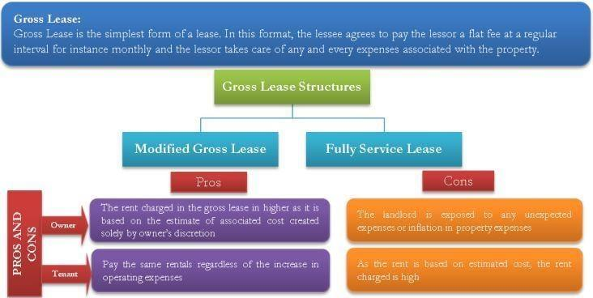

## Table of Contents

## What is a gross lease?

A gross lease is a type of rental agreement where the tenant pays a fixed rent, and the landlord covers most of the property expenses. These expenses can include property taxes, insurance, and maintenance costs. This makes it easier for the tenant because they know exactly how much they need to pay each month without worrying about additional costs.

Gross leases are common in residential properties, like apartments. They are also used in some commercial spaces, especially for smaller businesses that want predictable expenses. The simplicity of a gross lease can be very appealing to tenants who prefer not to deal with the complexities of managing property costs.

## How does a gross lease differ from other types of leases?

A gross lease is different from other leases because it's simple. In a gross lease, the tenant pays a fixed rent, and the landlord takes care of all the other costs like taxes, insurance, and repairs. This makes it easy for the tenant because they know exactly what they will pay each month. Gross leases are often used for apartments and small businesses that want predictable expenses.

In contrast, a net lease requires the tenant to pay some of the property expenses on top of the rent. There are different kinds of net leases, like single net, double net, and triple net. In a single net lease, the tenant pays rent plus property taxes. In a double net lease, they also pay insurance. And in a triple net lease, they pay rent, taxes, insurance, and maintenance. These leases can be more complicated but might be cheaper if the tenant can manage the extra costs well.

Another type of lease is a modified gross lease, which is a mix between a gross lease and a net lease. In a modified gross lease, the tenant and landlord share some of the costs. For example, the tenant might pay the rent and utilities, while the landlord covers taxes and insurance. This type of lease gives both the tenant and landlord some flexibility in managing expenses.

## What are the common types of gross leases?

Gross leases come in different forms, but the most common types are the full-service gross lease and the modified gross lease. A full-service gross lease is the simplest type. The tenant pays a fixed rent, and the landlord takes care of all the other costs like taxes, insurance, and repairs. This type of lease is often used for apartments and small businesses that want predictable expenses without the hassle of managing property costs.

A modified gross lease is a bit different. It's a mix between a gross lease and a net lease. In this type of lease, the tenant and landlord share some of the costs. For example, the tenant might pay the rent and utilities, while the landlord covers taxes and insurance. This gives both the tenant and landlord some flexibility in managing expenses. Modified gross leases are often used when both parties want to share the financial responsibility of the property.

These two types of gross leases offer different benefits depending on what the tenant and landlord need. A full-service gross lease is great for tenants who want simplicity and predictability. A modified gross lease might be better for those who are willing to share some costs for more control over expenses.

## Who typically pays for utilities and maintenance in a gross lease?

In a gross lease, the landlord usually pays for utilities and maintenance. This means the tenant just pays a fixed rent each month, and the landlord takes care of everything else. This makes it easy for the tenant because they don't have to worry about extra bills or fixing things that break.

Sometimes, there might be a modified gross lease. In this case, the tenant and landlord might share some costs. For example, the tenant might pay for utilities like electricity and water, while the landlord still pays for maintenance and other big expenses. This type of lease gives both the tenant and landlord a bit more control over what they pay for.

## What are the advantages of a gross lease for tenants?

A gross lease is great for tenants because it makes things simple. With a gross lease, tenants pay a fixed amount of rent every month. They don't have to worry about extra costs like property taxes, insurance, or fixing things that break. This makes budgeting easier because tenants know exactly how much they need to pay, and they don't have to deal with surprises.

Another advantage is that tenants don't need to spend time managing the property. The landlord takes care of everything, from paying the bills to making repairs. This can be a big relief, especially for people who are busy or don't want to deal with the hassle of property management. So, a gross lease can make renting a lot less stressful and more predictable for tenants.

## What are the disadvantages of a gross lease for tenants?

A gross lease might not always be the best choice for tenants. One reason is that the rent can be higher than other types of leases. Because the landlord has to pay for things like taxes, insurance, and repairs, they might charge more rent to cover these costs. So, even though the rent is fixed, it could be more expensive than paying a lower rent and some extra bills separately.

Another disadvantage is that tenants have less control over the property. Since the landlord handles all the maintenance and other expenses, tenants can't choose who does the repairs or how things are managed. If the landlord doesn't take good care of the property, the tenant might have to live with issues they can't fix themselves. This can be frustrating if the tenant wants more control over their living or working space.

## How can a gross lease benefit landlords?

A gross lease can help landlords by making their income predictable. Since tenants pay a fixed rent every month, landlords know exactly how much money they will get. This makes it easier for landlords to plan their finances and budget for the future. They don't have to worry about tenants not paying extra bills or costs, which can make managing the property simpler.

Another way a gross lease benefits landlords is by giving them control over the property. Since the landlord pays for things like taxes, insurance, and repairs, they can choose who does the work and how it's done. This can help keep the property in good shape and make sure everything is managed the way the landlord wants. It also means the landlord can keep a close eye on the property and make sure it stays a good place for tenants to live or work.

## What are the potential drawbacks of a gross lease for landlords?

A gross lease can be tough for landlords because they have to pay for everything. This means they need to cover costs like taxes, insurance, and repairs on top of any other expenses. If these costs go up, the landlord might not make as much money as they planned. This can be stressful because the landlord has to handle all the financial risks, and it can be hard to predict how much money they will have left after paying all the bills.

Another problem with a gross lease is that it might not attract as many tenants. Some people might think the rent is too high because it includes all the other costs. This can make it harder for the landlord to find good tenants. If the property stays empty for a while, the landlord still has to pay all the bills, which can be a big problem. So, even though a gross lease can make income predictable, it can also make it harder to keep the property rented out and profitable.

## How is the rent calculated in a gross lease?

In a gross lease, the rent is calculated by adding up all the costs the landlord has to pay for the property. This includes things like property taxes, insurance, and maintenance. The landlord figures out how much these costs will be for the whole year and then divides that by the number of months in the lease. They add this amount to the base rent they want to charge, which is how much they think the property is worth to rent out.

The total amount is then divided by the number of tenants if the property is shared. For example, if the landlord has to pay $12,000 a year for taxes, insurance, and maintenance, and they want to charge $1,000 a month for the base rent, they would add $1,000 (which is $12,000 divided by 12 months) to the base rent. So, the monthly rent for a tenant would be $2,000. This way, the landlord can cover all the costs and still make some profit.

## Can the terms of a gross lease be negotiated?

Yes, the terms of a gross lease can be negotiated. Both the tenant and the landlord can talk about things like the rent amount, how long the lease will last, and who pays for what. For example, a tenant might want to pay less rent, or they might want the landlord to fix things faster. The landlord might want to charge more rent or have the tenant help with some costs.

Negotiating can help both the tenant and the landlord get what they need. If they can agree on the terms, everyone can be happy with the lease. It's important for both sides to talk openly and be willing to make some changes. This way, they can create a lease that works well for both of them.

## What should tenants consider before signing a gross lease?

Before signing a gross lease, tenants should think about their budget. Since the rent in a gross lease includes everything like taxes, insurance, and repairs, it might be higher than other types of leases. Tenants need to make sure they can afford the fixed rent every month. They should also check if the rent will go up during the lease and if there are any extra fees they might have to pay.

Tenants should also think about how much control they want over the property. With a gross lease, the landlord takes care of everything, so tenants can't choose who does the repairs or how things are managed. If the landlord doesn't keep the property in good shape, tenants might have to live with problems they can't fix themselves. It's important for tenants to understand how the landlord will handle maintenance and other issues before they sign the lease.

## How do gross leases impact property management and financial planning for landlords?

Gross leases can make property management easier for landlords because they get a fixed amount of rent every month. This makes it simpler for landlords to plan their finances because they know exactly how much money they will receive. They don't have to worry about tenants not paying extra bills or costs, which can make managing the property less stressful. However, landlords still need to handle all the property expenses like taxes, insurance, and repairs. This means they have to be good at keeping track of these costs and making sure they have enough money to cover them.

On the other hand, gross leases can also make financial planning harder for landlords. Since they have to pay for all the property expenses, any increase in these costs can cut into their profits. Landlords need to be careful and predict these costs as accurately as possible to avoid losing money. If the rent they charge isn't enough to cover all the expenses, they might end up struggling financially. So, while gross leases can provide a steady income, they also come with the challenge of managing all the financial risks on their own.

## What is the relationship between Algorithmic Trading and Lease Management?

Algorithmic trading, a concept traditionally associated with financial markets, has found a new application in commercial leasing. By using algorithms, stakeholders in real estate can optimize rent collection and streamline lease management through advanced data analysis techniques.

One of the core benefits of utilizing algorithms in lease management is the capacity to process large volumes of data with speed and accuracy. Algorithms can analyze multiple data points, such as tenant payment history, seasonal market trends, and property occupancy rates, to predict the most opportune times for lease negotiations or rent adjustments. For instance, [machine learning](/wiki/machine-learning) models can be employed to determine the probability of tenant default or predict future rental income based on current market conditions.

To illustrate, consider the implementation of a simple linear regression model to predict rental income. Assume that rental income $R$ relies on factors such as average market rent $M$, property occupancy rate $O$, and the economic growth indicator $G$. A basic model might be structured as:

$$
R = \beta_0 + \beta_1 M + \beta_2 O + \beta_3 G + \epsilon
$$

Here, $\beta$ represents the coefficients determined by the regression analysis and $\epsilon$ is the error term. The model's output aids property managers in making informed decisions based on forecasted trends, promoting proactive lease management strategies.

Moreover, algorithms contribute to enhancing decision-making strategies in real estate investments by providing actionable insights derived from historical and real-time data. For example, [reinforcement learning](/wiki/reinforcement-learning), a type of machine learning, can be applied to develop adaptive pricing strategies that respond dynamically to market fluctuations. By simulating different scenarios and learning from outcome feedback, these algorithms can fine-tune pricing models to maximize profitability.

Python, a common programming language used in developing such models, offers libraries like Pandas for data manipulation, Scikit-learn for implementing machine learning models, and Matplotlib for data visualization. Here's a hypothetical Python snippet demonstrating a basic regression analysis:

```python
import pandas as pd
from sklearn.model_selection import train_test_split
from sklearn.linear_model import LinearRegression
import matplotlib.pyplot as plt

# Load dataset
data = pd.read_csv('rental_data.csv')

# Define features and target
features = data[['MarketRent', 'OccupancyRate', 'GrowthIndicator']]
target = data['RentalIncome']

# Split data into train and test sets
X_train, X_test, y_train, y_test = train_test_split(features, target, test_size=0.2)

# Initialize and train the model
model = LinearRegression()
model.fit(X_train, y_train)

# Predict and visualize
predictions = model.predict(X_test)
plt.scatter(y_test, predictions)
plt.xlabel('Actual Rental Income')
plt.ylabel('Predicted Rental Income')
plt.title('Actual vs Predicted Rental Income')
plt.show()
```

By integrating these advanced computational methods, stakeholders can optimize financial commitments and explore innovative approaches to lease management. The result is a more efficient and profitable real estate investment landscape, bolstered by the strategic insights and precision provided by [algorithmic trading](/wiki/algorithmic-trading) techniques in lease management.

## References & Further Reading

[1]: Mulrooney, S. (2019). ["Types of Commercial Real Estate Leases"](https://www.squarefoot.com/leasopedia/different-types-of-commercial-leases/). Investopedia.

[2]: Fisher, J.D. & Goetzmann, W.N. (2005). ["The importance of lease flexibility in real estate leasing."](https://papers.ssrn.com/sol3/papers.cfm?abstract_id=705303) Journal of Real Estate Finance and Economics.

[3]: Lopez de Prado, M. (2018). ["Advances in Financial Machine Learning"](https://www.amazon.com/Advances-Financial-Machine-Learning-Marcos/dp/1119482089). Wiley.

[4]: Jansen, S. (2020). ["Machine Learning for Algorithmic Trading"](https://github.com/stefan-jansen/machine-learning-for-trading). Packt Publishing.

[5]: Chan, E.P. (2008). ["Quantitative Trading: How to Build Your Own Algorithmic Trading Business"](https://github.com/ftvision/quant_trading_echan_book). Wiley.

[6]: Geltner, D.M., & Miller, N.G. (2001). ["Commercial Real Estate Analysis and Investments"](https://www.researchgate.net/publication/245702364_Commercial_Real_Estate_Analysis_and_Investments). South-Western Publishing.