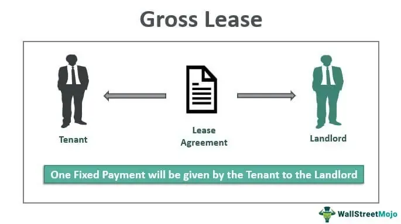

Understanding commercial lease types is crucial for both investors and tenants in the real estate market, as these agreements dictate the allocation of costs and responsibilities that can significantly impact financial outcomes. This article explores a range of lease types, including gross leases and modified gross leases, which each present unique advantages and disadvantages that must be considered by businesses when entering into a leasing agreement.

Gross leases typically offer cost predictability for tenants, as they involve the landlord covering expenses such as taxes, insurance, and maintenance, while the tenant pays a fixed rent. On the other hand, modified gross leases introduce a more balanced distribution of costs, incorporating elements of both gross and net leases to tailor financial responsibility between the tenant and landlord. This hybrid approach can provide flexibility and adaptability, appealing to parties seeking an equitable arrangement.



In recent years, the intersection of technology with commercial leasing has introduced innovative approaches, such as algorithmic trading, which can optimize lease management. By using data analytics, algorithms enhance decision-making strategies, impacting rent collection and providing valuable insights for real estate investments.

Overall, comprehending the various lease structures is vital as they influence not only financial commitments but also strategic decision-making processes within the dynamic landscape of real estate. This article aims to equip readers with a thorough understanding of these lease types and explore how technology can play a pivotal role in enhancing the efficiency of lease management.

## Table of Contents

## Understanding Lease Types

Commercial lease types are essential components of the real estate market, determining how costs are distributed and responsibilities are shared between landlords and tenants. Understanding these types, including gross leases, net leases, and modified gross leases, is vital for all parties involved to ensure clarity and efficiency in property management.

### Gross Leases
A gross lease is a lease agreement where the tenant pays a fixed rental amount, while the landlord covers most, if not all, of the property expenses. These expenses typically include taxes, insurance, and maintenance costs. This type of lease offers tenants cost predictability, as they do not have to deal with fluctuating operational expenses. The primary advantage for tenants is the simplicity of financial planning, as they are only liable for the agreed rent. However, landlords may impose a higher base rent to account for potential variations in operational costs.

### Net Leases
In contrast, net leases shift certain financial responsibilities from the landlord to the tenant. There are various kinds of net leases, typically classified as single, double, or triple net leases. A single net lease requires the tenant to pay a portion of the property taxes, while a double net lease involves taxes and insurance. The triple net lease (NNN) is the most comprehensive, wherein tenants are responsible for property taxes, insurance, and maintenance, excluding structural repairs. This arrangement favors landlords, as their financial responsibilities are significantly reduced. Tenants, however, may benefit from potentially lower base rents and a greater direct influence on managing operational costs.

### Modified Gross Leases
Modified gross leases present a hybrid approach, incorporating elements from both gross and net leases. In this structure, the tenant pays a base rent alongside a share of some operational expenses. The specific cost allocation can vary and is often negotiable, providing flexibility to both parties. Typically, tenants might pay the base rent and utilities, while the landlord covers larger expenses like insurance and property taxes. This lease type allows for an equitable distribution of financial responsibilities, appealing to both tenants seeking cost control and landlords wanting to mitigate comprehensive financial liabilities.

### Significance of Commercial Real Estate Leases
Commercial real estate leases are contracts that grant tenants the right to use a property for a specified business purpose over a set period. These leases not only define the operational dynamics between tenants and landlords but also impact the financial strategies and potential profitability of the properties involved. Understanding different lease types helps stakeholders make informed decisions, influencing business feasibility, expense control, and long-term investment returns. 

In summary, the selection of a lease type heavily influences the allocation of operational costs and the financial management responsibilities between involved parties, thereby shaping the economic outcomes of commercial property dealings.

## Gross Lease

A gross lease is a type of commercial lease agreement where the tenant pays a fixed rental amount, and the landlord covers all property-related expenses. These expenses typically include property taxes, insurance, utilities, and maintenance. This arrangement simplifies budgeting for the tenant, as they do not have to worry about fluctuating additional costs. The agreed-upon rent remains constant over the lease term, which provides a stable and predictable financial obligation.

**Advantages of Gross Leases**

One of the principal advantages of a gross lease for tenants is cost predictability. Since the rent is fixed and all operating expenses are included, tenants can better manage their budgeting without the uncertainty of additional charges. For landlords, a gross lease can be advantageous because the simplicity of a single fee structure might attract more tenants looking for predictable financial commitments.

In addition, gross leases can offer administrative ease, as landlords manage and coordinate all operational expenses. This centralized responsibility can result in more efficient management of services like maintenance and repairs, ensuring timely addressal of issues without back-and-forth negotiations with tenants.

**Comparison with Net Leases**

In contrast to gross leases, net leases, such as single, double, or triple net leases, structure the financial responsibilities differently. In a net lease, the tenant is responsible for some or all of the property’s operating expenses in addition to the rent. For example, a triple net lease requires the tenant to pay for property taxes, insurance, and maintenance costs on top of the base rent.

This structure can potentially lead to lower base rents than gross leases because the landlord shifts some operational expense responsibilities to the tenant. However, the trade-off is that tenants may face unpredictable costs, making budgeting more challenging.

In gross leases, since the landlord carries the risk of escalating operational costs, they might set a higher base rent to account for such unpredictability. This approach distributes the financial risk differently than net leases, where tenants directly bear cost increases.

In summary, gross leases provide a straightforward, predictable cost structure which appeals primarily to tenants who prefer budget stability. However, the potential for higher base rents can be a consideration that weighs against this simplicity. Understanding these dynamics is crucial for both landlords and tenants when negotiating lease agreements to suit their financial strategies.

## Modified Gross Lease

Modified gross leases represent a compromise between the straightforward cost structure of gross leases and the variable expenses associated with net leases. In a modified gross lease, the tenant and landlord share certain operating expenses, such as utilities, maintenance, and janitorial services, allowing flexibility in how these costs are distributed.

The hybrid nature of modified gross leases is evident in their structure. Unlike a pure gross lease, where the landlord covers all operating costs, or a net lease, where these costs are borne entirely by the tenant, a modified gross lease strikes a balance. Typically, the base rent covers some of the property expenses, while others are negotiated and specified in the lease agreement. For example, the tenant may pay a base rent plus a portion of the utility costs, with the specifics dependent on both parties' preferences. This arrangement can be advantageous for tenants who wish to have predictable rent expenses while still sharing responsibilities for fluctuations in utilities or other costs.

Cost-sharing arrangements are a hallmark of modified gross leases. These agreements often start with a fixed rate that includes basic services and require tenants to share costs such as property taxes, insurance, or common area maintenance based on pre-defined terms. This sharing can offer the tenant protection against rising costs, as the landlord and tenant can agree upon caps or adjustments based on actual cost experiences.

The flexibility of modified gross leases accommodates varying financial positions and needs of tenants and landlords. By being able to adjust who bears particular costs, these leases can be tailored to suit both parties. For instance, new businesses might prefer a predictable base rent with minimal additional costs, while established companies might be willing to take on more variable costs in exchange for a lower fixed rent.

Such lease structures facilitate an equitable distribution of financial responsibilities, aligning incentives for both landlords and tenants. While tenants have more control and predictability over their expenses, landlords can ensure that tenants contribute adequately to the ongoing operational costs of maintaining the property. This balance helps in mitigating financial risks and encourages transparent negotiations, ultimately fostering a cooperative relationship between the tenant and landlord.

In summary, modified gross leases offer a flexible and balanced approach to handling property expenses. They allow for shared responsibility between landlords and tenants, creating an adaptable and equitable framework that is particularly beneficial in the dynamic and complex environment of commercial real estate.

## Advantages and Disadvantages of Lease Types

In evaluating commercial lease types, it is important to understand their respective advantages and disadvantages for both landlords and tenants. This section focuses particularly on gross leases and modified gross leases, discussing their implications within the commercial property market and potential considerations for businesses when choosing a lease type.

### Gross Leases

A gross lease is a common lease structure where the tenant pays a fixed rental amount, and the landlord covers most operational expenses, including property taxes, insurance, and maintenance. 

#### Advantages for Tenants:
1. **Cost Predictability**: Since the tenant pays a fixed amount, financial planning and budgeting become simpler without concern for variable operating costs.
2. **Simplicity**: Gross leases generally involve fewer financial responsibilities for tenants, reducing administrative burdens.

#### Advantages for Landlords:
1. **Attracts Tenants**: Offering cost predictability often makes properties more appealing to potential tenants seeking stability.
2. **Simplified Billing**: Collecting a single rent payment simplifies accounting for landlords.

#### Disadvantages for Tenants:
1. **Higher Base Rent**: To cover potential fluctuations in operational expenses, landlords may charge a higher base rent.
2. **Limited Control**: Tenants may have minimal say over how the property is managed or maintained.

#### Disadvantages for Landlords:
1. **Maintenance Costs**: The landlord bears the risk of increased maintenance and operational expenses.
2. **Revenue Risk**: Estimating proper rent levels to cover costs can be challenging, especially in periods of inflation.

### Modified Gross Leases

Modified gross leases serve as a hybrid between gross and net leases, where specific operating costs are divided between tenant and landlord as per mutual agreement.

#### Advantages for Tenants:
1. **Flexibility**: Tenants can negotiate terms allowing them to pay for utilities or other expenses directly, potentially reducing overall cost burden.
2. **Control Over Expenses**: Tenants often have more control over their share of operating expenses, such as managing their utility consumption.

#### Advantages for Landlords:
1. **Shared Cost Risks**: By passing certain expenses onto tenants, landlords reduce their operational cost risk.
2. **Potential for Reduced Costs**: With some costs being directly handled by tenants, landlords may lower overall management expenses.

#### Disadvantages for Tenants:
1. **Variable Costs**: Unlike gross leases, tenants may face fluctuating operational expenses based on consumption and market conditions.
2. **Complexity**: Negotiating and managing shared expenses requires more administrative effort.

#### Disadvantages for Landlords:
1. **Increased Negotiation**: Requires detailed negotiations and clear agreements to avoid conflicts over shared costs.
2. **Monitoring**: Landlords need systems to monitor and allocate shared expenses accurately, adding complexity to property management.

### Considerations for Choosing a Lease Type

When selecting between gross and modified gross leases, businesses should consider their operational needs and financial strategies. A business looking for financial stability may prioritize the fixed-cost advantage of a gross lease. Alternatively, a company that wants more control over its operational costs might find a modified gross lease more appealing. Calculating the potential benefits and projections can be facilitated by simulating various cost scenarios, possibly using Python to model different lease conditions and their corresponding financial implications:

```python
def lease_cost_scenario(base_rent, variable_expenses, months=12):
    gross_lease_cost = base_rent * months
    modified_gross_lease_cost = (base_rent + variable_expenses) * months
    return gross_lease_cost, modified_gross_lease_cost

base_rent = 2000  # Example base rent in currency units
variable_expenses = 300  # Example additional monthly expenses in a modified gross lease

gross, modified_gross = lease_cost_scenario(base_rent, variable_expenses)
print("Total Gross Lease Cost:", gross)
print("Total Modified Gross Lease Cost:", modified_gross)
```

Ultimately, understanding the advantages and disadvantages breeds informed decision-making, contributing to strategic lease choices that align with business goals and financial health.

## Algorithmic Trading and Lease Management

Algorithmic trading, a concept traditionally associated with financial markets, has found a new application in commercial leasing. By using algorithms, stakeholders in real estate can optimize rent collection and streamline lease management through advanced data analysis techniques.

One of the core benefits of utilizing algorithms in lease management is the capacity to process large volumes of data with speed and accuracy. Algorithms can analyze multiple data points, such as tenant payment history, seasonal market trends, and property occupancy rates, to predict the most opportune times for lease negotiations or rent adjustments. For instance, [machine learning](/wiki/machine-learning) models can be employed to determine the probability of tenant default or predict future rental income based on current market conditions.

To illustrate, consider the implementation of a simple linear regression model to predict rental income. Assume that rental income $R$ relies on factors such as average market rent $M$, property occupancy rate $O$, and the economic growth indicator $G$. A basic model might be structured as:

$$
R = \beta_0 + \beta_1 M + \beta_2 O + \beta_3 G + \epsilon
$$

Here, $\beta$ represents the coefficients determined by the regression analysis and $\epsilon$ is the error term. The model's output aids property managers in making informed decisions based on forecasted trends, promoting proactive lease management strategies.

Moreover, algorithms contribute to enhancing decision-making strategies in real estate investments by providing actionable insights derived from historical and real-time data. For example, [reinforcement learning](/wiki/reinforcement-learning), a type of machine learning, can be applied to develop adaptive pricing strategies that respond dynamically to market fluctuations. By simulating different scenarios and learning from outcome feedback, these algorithms can fine-tune pricing models to maximize profitability.

Python, a common programming language used in developing such models, offers libraries like Pandas for data manipulation, Scikit-learn for implementing machine learning models, and Matplotlib for data visualization. Here's a hypothetical Python snippet demonstrating a basic regression analysis:

```python
import pandas as pd
from sklearn.model_selection import train_test_split
from sklearn.linear_model import LinearRegression
import matplotlib.pyplot as plt

# Load dataset
data = pd.read_csv('rental_data.csv')

# Define features and target
features = data[['MarketRent', 'OccupancyRate', 'GrowthIndicator']]
target = data['RentalIncome']

# Split data into train and test sets
X_train, X_test, y_train, y_test = train_test_split(features, target, test_size=0.2)

# Initialize and train the model
model = LinearRegression()
model.fit(X_train, y_train)

# Predict and visualize
predictions = model.predict(X_test)
plt.scatter(y_test, predictions)
plt.xlabel('Actual Rental Income')
plt.ylabel('Predicted Rental Income')
plt.title('Actual vs Predicted Rental Income')
plt.show()
```

By integrating these advanced computational methods, stakeholders can optimize financial commitments and explore innovative approaches to lease management. The result is a more efficient and profitable real estate investment landscape, bolstered by the strategic insights and precision provided by [algorithmic trading](/wiki/algorithmic-trading) techniques in lease management.

## Conclusion

Understanding commercial lease types and their financial implications is pivotal for both investors and tenants. Different lease structures, such as gross leases and modified gross leases, impact how operational costs are allocated and influence financial commitments. Gross leases offer tenants cost predictability as landlords cover expenses like taxes, insurance, and maintenance. In contrast, modified gross leases provide a flexible cost-sharing arrangement, allowing for a more equitable distribution of financial responsibilities between landlords and tenants.

Technology, particularly algorithmic trading, is increasingly optimizing lease management. Algorithms analyze vast amounts of data to streamline rent collection and identify patterns, enhancing decision-making in real estate investments. For instance, machine learning models can forecast market trends and rental prices, facilitating strategic lease agreements and optimizing revenue streams.

Strategically, understanding lease types and leveraging technology offers numerous benefits. Investors and tenants can make informed decisions that align with their business objectives, ensuring efficient financial management and maximizing property investments. As technology continues to evolve, its integration in lease management will likely enhance efficiency and transform traditional approaches, paving the way for more data-driven and adaptive strategies in real estate management.

## FAQs

### FAQs

**1. What are the main differences between gross leases and modified gross leases?**

Gross leases entail the landlord taking responsibility for all property-related operational costs, including taxes, insurance, and maintenance. Tenants pay a single lump sum, providing cost predictability. Modified gross leases are a hybrid structure where certain expenses, such as utilities or janitorial services, are shared between landlord and tenant. This creates a flexible arrangement compared to the straightforward cost burden on landlords in gross leases.

**2. Who benefits more, landlords or tenants, under a gross lease?**

Tenants generally benefit from the simplicity and predictability of gross leases, as they pay a fixed rent without worrying about fluctuating expenses like property taxes or maintenance fees. Landlords, however, bear the risk of expense increases, potentially reducing their profit margins over time.

**3. How do modified gross leases affect landlords and tenants differently?**

In modified gross leases, the cost-sharing aspect allows both parties to negotiate what expenses will be divided. This can be beneficial for landlords as they can pass on certain operational costs to tenants. For tenants, it provides the opportunity to negotiate certain terms and possibly lower their fixed payments if they can manage some of the variable costs effectively.

**4. Is there a misconception about the flexibility of modified gross leases?**

A common misconception is that modified gross leases always provide flexibility to tenants. While cost-sharing offers negotiation possibilities, the level of flexibility largely depends on the terms agreed upon at the lease initiation. If tenants are not careful, they might end up bearing more variable costs than they anticipated.

**5. Can a tenant switch from a gross lease to a modified gross lease if the market conditions change?**

Switching lease types typically requires renegotiation of the lease terms, which can only happen with both parties' consent. It's advisable to have an open line of communication with landlords and include an option to renegotiate in the lease agreement to adapt to shifting market conditions.

**6. Are gross leases more advantageous in certain economic conditions?**

Yes, gross leases are particularly advantageous in times of economic [volatility](/wiki/volatility-trading-strategies) or when operational costs are expected to fluctuate. Tenants benefit from the fixed rent structure, shielding them from unpredictable increases in expenses.

**7. How can both landlords and tenants ensure a fair modified gross lease?**

Both parties should clearly define which costs are shared and to what extent. A detailed agreement drafted with the aid of property consultants or legal advisers can help establish clarity and fairness. Consistent communication and clear contract clauses pave the way for a balanced lease agreement.

**8. Is it possible to quantify the financial advantage of one lease type over the other?**

While exact financial comparison depends on specific circumstances, utilizing financial models can help quantify potential costs. For example, a simple Python script using historical data on maintenance, taxes, and other variable costs can predict the likely financial burden under modified gross leases relative to gross leases.

```python
# Hypothetical example for calculating expected costs in a modified gross lease
import numpy as np

# Historical expense data
maintenance_costs = np.array([1000, 1500, 1200, 1300])
taxes = np.array([800, 850, 900, 950])
utilities = np.array([150, 200, 175, 160])

# Calculate average annual costs
average_maintenance = np.mean(maintenance_costs)
average_taxes = np.mean(taxes)
average_utilities = np.mean(utilities)

# Total expected tenant cost if these are tenant's responsibilities
expected_tenant_cost = average_maintenance + average_taxes + average_utilities

print(f"Expected annual cost under modified gross lease: ${expected_tenant_cost}")
```

This script would help quantify potential financial responsibilities, aiding both landlords and tenants in decision-making processes.

## References & Further Reading

[1]: Mulrooney, S. (2019). ["Types of Commercial Real Estate Leases"](https://www.squarefoot.com/leasopedia/different-types-of-commercial-leases/). Investopedia.

[2]: Fisher, J.D. & Goetzmann, W.N. (2005). ["The importance of lease flexibility in real estate leasing."](https://papers.ssrn.com/sol3/papers.cfm?abstract_id=705303) Journal of Real Estate Finance and Economics.

[3]: Lopez de Prado, M. (2018). ["Advances in Financial Machine Learning"](https://www.amazon.com/Advances-Financial-Machine-Learning-Marcos/dp/1119482089). Wiley.

[4]: Jansen, S. (2020). ["Machine Learning for Algorithmic Trading"](https://github.com/stefan-jansen/machine-learning-for-trading). Packt Publishing.

[5]: Chan, E.P. (2008). ["Quantitative Trading: How to Build Your Own Algorithmic Trading Business"](https://github.com/ftvision/quant_trading_echan_book). Wiley.

[6]: Geltner, D.M., & Miller, N.G. (2001). ["Commercial Real Estate Analysis and Investments"](https://www.researchgate.net/publication/245702364_Commercial_Real_Estate_Analysis_and_Investments). South-Western Publishing.