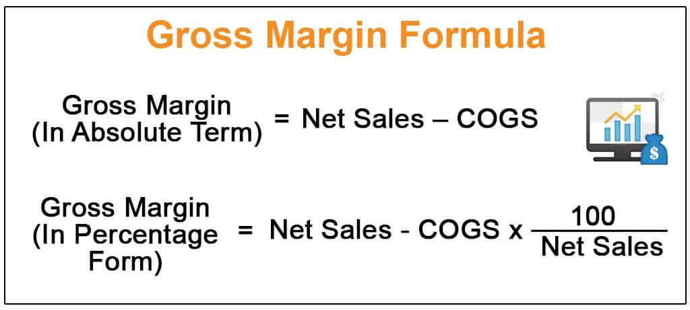

Algorithmic trading, commonly referred to as algo trading, has significantly altered the financial landscape by leveraging automation to execute trades at speeds and frequencies that traditional trading cannot match. This approach involves using pre-defined instructions or complex algorithms to determine the timing, pricing, and quantity of trades, allowing traders to capitalize swiftly on market opportunities.

Central to optimizing algorithmic trading strategies is a deep understanding of financial metrics, such as gross margin. Gross margin is a pivotal indicator of a company's financial efficiency, representing the percentage of revenue retained after deducting the cost of goods sold (COGS). The formula for calculating gross margin is:



$$
\text{Gross Margin} = \left( \frac{\text{Total Revenue} - \text{COGS}}{\text{Total Revenue}} \right) \times 100
$$

This measurement is vital in assessing a company's profitability and operational efficiency, as it reflects how well a company controls its production costs relative to its revenue. In the context of algorithmic trading, analyzing financial metrics like gross margin is essential for developing and refining trading strategies to maximize profitability.

As algorithmic trading continues to evolve, incorporating comprehensive financial analysis ensures that strategies remain not only effective in terms of execution speed but also profitable by accounting for all incurred costs. This article examines how gross margin profitability analysis can be integrated into algorithmic trading to enhance its effectiveness and profitability, offering insights into the intersection of financial analysis and automated trading technology.

## Table of Contents

## Understanding Gross Margin

Gross margin is a fundamental financial metric crucial for evaluating a company's operational efficiency and profitability. It represents the portion of revenue that exceeds the cost of goods sold (COGS), which includes expenses directly tied to production, such as labor and materials. Expressed as a percentage, this metric provides a clear picture of how efficiently a company is producing its goods or services relative to its sales.

The formula to calculate gross margin is expressed as:

$$
\text{Gross Margin} = \left(\frac{\text{Total Revenue} - \text{COGS}}{\text{Total Revenue}}\right) \times 100
$$

This measurement is beneficial for stakeholders by providing insights into how well a company manages its production costs. A high gross margin indicates efficient cost management and higher profitability, while a low gross margin may suggest that a company is struggling to control production costs or is operating in a highly competitive market with thin profit margins.

Understanding how to calculate and analyze gross margin is essential for assessing a company's financial health and operational performance. It aids investors, analysts, and managers in making informed decisions regarding pricing strategies, cost control measures, and overall business strategy. By scrutinizing gross margins over time, stakeholders can identify trends and make strategic adjustments to enhance profitability.

## Role of Financial Metrics in Trading

Financial metrics play a crucial role in both evaluating and optimizing trading strategies. They provide objective measures of a trading strategy's performance, helping traders to identify strengths, weaknesses, and areas for improvement. In [algorithmic trading](/wiki/algorithmic-trading), these metrics ensure that strategies are not only generating revenue but also converting that revenue into substantial profit effectively.

Gross margin, a significant financial metric, offers insights into the profitability derived from sales after accounting for costs of goods sold (COGS). It calculates the efficiency of converting revenue into net income. This metric is particularly useful in algorithmic trading, where cost efficiency is a vital parameter for successful strategy execution. The formula for gross margin is:

$$
\text{Gross Margin (\%)} = \left( \frac{\text{Total Revenue} - \text{COGS}}{\text{Total Revenue}} \right) \times 100
$$

While gross margin is essential, it is merely one component in a comprehensive evaluation of trading strategies. Metrics such as Return on Investment (ROI), [volatility](/wiki/volatility-trading-strategies), and expense ratios are equally critical. ROI evaluates the profitability of an investment, providing a direct comparison of how much money is made compared to how much is invested. The basic ROI formula is:

$$
\text{ROI (\%)} = \left( \frac{\text{Net Profit}}{\text{Investment Cost}} \right) \times 100
$$

Volatility measures the price fluctuations of an asset or trading strategy over time, offering insights into the risk associated with that strategy. Understanding volatility enables traders to assess possible returns against associated risks.

Expense ratios, which detail the operational costs relative to the fund's assets, are essential in understanding how management fees and other costs affect net profitability. These metrics collectively facilitate a holistic approach to evaluating trading strategies, allowing traders to adjust parameters and optimize performance for sustained profitability.

In conclusion, by meticulously analyzing financial metrics, traders can fine-tune algorithmic strategies to better adapt to market conditions, ultimately achieving more efficient and profitable trading processes.

## Essential Metrics for Algorithmic Trading Performance

Algorithmic trading performance is evaluated through a variety of metrics aimed at measuring both returns and risks in a trading strategy. Among these, the Sharpe Ratio is widely utilized for gauging risk-adjusted returns. This metric is calculated by subtracting the risk-free rate from the expected return and then dividing the result by the standard deviation of the returns. The formula for the Sharpe Ratio is:

$$
\text{Sharpe Ratio} = \frac{E[R] - R_f}{\sigma_R}
$$

Where $E[R]$ is the expected return, $R_f$ is the risk-free rate, and $\sigma_R$ is the standard deviation of the portfolio’s excess return. A higher Sharpe Ratio indicates a better risk-adjusted performance.

Maximum Drawdown is another critical metric that measures the worst possible loss from a peak to a trough in a portfolio’s value before a new peak is achieved. It reflects the potential risk of a trading strategy and helps investors understand the impact of market downturns on their portfolios.

Win Rate represents the proportion of trades that end with a profit. It is expressed as a percentage and is calculated as:

$$
\text{Win Rate} = \left( \frac{\text{Number of Winning Trades}}{\text{Total Number of Trades}} \right) \times 100
$$

Profit Factor is a metric that compares the total gains of successful trades to the total losses of unsuccessful ones. It is computed as:

$$
\text{Profit Factor} = \frac{\text{Total Profits}}{\text{Total Losses}}
$$

A Profit Factor greater than one indicates a profitable strategy, whereas a value less than one suggests an unprofitable one.

Average Trade is a measure of the average profit or loss per trade and is essential for evaluating the overall performance of a trading strategy. It is calculated by dividing the sum of profits and losses by the total number of trades.

Each of these metrics provides vital insights into the effectiveness, risk exposure, and profitability of algorithmic trading strategies. Through careful analysis and application of these metrics, traders can refine algorithmic models, adjust risk parameters, and enhance profitability by better aligning strategies with market conditions.

## Integrating Gross Margin into Algo Trading

Integrating gross margin analysis into algorithmic trading can significantly enhance trading performance by focusing on cost efficiency and effectively setting margin targets. Gross margin, calculated using the formula $(\text{Total Revenue} - \text{COGS}) / \text{Total Revenue} \times 100$, provides traders with valuable insights into cost structures and profitability. This integration allows traders to optimize strategy parameters by targeting desired margins while minimizing associated costs, thus ensuring that trading strategies are not only effective but also profitable once all expenses are accounted for.

In algorithmic trading, where speed and precision are critical, a keen understanding of financial metrics like gross margin helps in making informed decisions. By incorporating gross margin insights, traders can adjust their algorithms to account for variable costs that directly impact profitability. For example, if a trader notices a declining gross margin trend, they might adjust their algorithm to focus on more cost-efficient assets or trading times, thereby preserving profitability.

Moreover, incorporating gross margin analysis can aid in setting realistic margin targets that align with a company's overall financial strategy. This can involve adjusting trade entry and [exit](/wiki/exit-strategy) points, position sizing, or even the selection of trading instruments. Python, with its extensive data manipulation capabilities, serves as a practical tool for implementing such adjustments:

```python
import pandas as pd

# Sample function to calculate gross margin
def calculate_gross_margin(revenue, cogs):
    return ((revenue - cogs) / revenue) * 100

# Sample dataframe of trading data
data = {'Revenue': [1200, 1500, 1600], 'COGS': [700, 800, 850]}

# Convert to DataFrame
df = pd.DataFrame(data)

# Apply the gross margin calculation
df['Gross_Margin'] = df.apply(lambda row: calculate_gross_margin(row['Revenue'], row['COGS']), axis=1)

print(df)
```

This example demonstrates how algorithmic traders can utilize programming to integrate gross margin analysis into their strategies, allowing for dynamic adjustments based on real-time data. By focusing on both revenue generation and cost management, traders ensure that their strategies remain profitable in diverse market conditions. Additionally, integrating such financial analyses encourages more strategic decision-making by aligning trading operations with broader business financial goals, ultimately fostering sustainable profitability.

## Challenges and Considerations

Algorithmic trading, while offering numerous advantages, presents certain challenges that traders must diligently address. One significant concern is overfitting. This phenomenon occurs when a trading model is excessively customized to fit historical market data. As a result, the model might perform superbly on past data but falter in real-time trading. Overfitting can lead to models that react to noise rather than signals, thereby diminishing the robustness and reliability of trading strategies. To combat overfitting, cross-validation and out-of-sample testing are recommended to ensure that models maintain their predictive power outside of the data they were trained on.

Another critical issue in algorithmic trading is high transaction costs. These costs, comprising brokerage fees, taxes, and the bid-ask spread, can significantly reduce profit margins. Even if a trading strategy is theoretically profitable, substantial transaction costs might render it unviable in practice. A high turnover rate can exacerbate this problem, as frequent trading increases cumulative transaction costs. Calculating the break-even cost per trade and integrating it into the trading algorithm can help evaluate whether the net profits post-transaction are worthwhile. Traders should seek to optimize algorithms by reducing trade frequency or improving execution efficiency to minimize these costs.

Addressing these challenges requires a strategic approach. Using robust statistical techniques to prevent overfitting and incorporating transaction cost analysis into the development of trading strategies can significantly improve the overall performance and profitability of algorithmic trading systems.

## Conclusion

Optimizing algorithmic trading strategies necessitates a profound understanding of financial metrics, with gross margin being a key component. Gross margin provides insight into a company's ability to manage its cost structure relative to revenue, thereby influencing both the development and execution of effective trading strategies. Calculating this metric allows traders to better assess potential investments by focusing on profitability metrics that extend beyond mere revenue figures. 

In the rapidly changing environment of financial markets, strategies must be continuously refined and adapted to remain effective. This ongoing process involves reassessing algorithms to handle evolving market dynamics, ensuring that models remain robust against new data patterns. The adaptive nature of algorithmic strategies is essential not only for maintaining profitability but also for reducing the likelihood of model degradation over time.

Combining these traditional financial metrics with advanced algorithmic tools enhances the ability to navigate complex market scenarios. Utilizing computational methods such as [machine learning](/wiki/machine-learning) and data analytics can uncover patterns and insights that are not apparent through conventional analysis. This integration broadens the scope of algorithmic trading, allowing for a more nuanced and comprehensive approach to strategy development. By striking a balance between historical financial analysis and modern computational techniques, traders can achieve sustained profitability even amid market complexities and uncertainties.

## References & Further Reading

[1]: Hull, J. C. (2012). ["Options, Futures, and Other Derivatives"](https://www.semanticscholar.org/paper/Options%2C-Futures%2C-and-Other-Derivatives-Hull/89bdee500c8623864fc9eb7a471546aa713acc44) (9th ed.). Pearson.

[2]: Wong, B. (2015). ["Starting with a gridding approach to algorithmic trading"](https://onlinelibrary.wiley.com/doi/full/10.1111/joes.12153) Journal of Trading, 10(3), 31-40.

[3]: Kant, G. (2012). ["Trading Systems: A New Approach to System Development and Portfolio Optimisation"](https://www.amazon.com/Trading-Systems-Development-Portfolio-Optimisation/dp/1905641796). Springer.

[4]: Sharpe, W. F. (1994). ["The Sharpe Ratio"](https://web.stanford.edu/~wfsharpe/art/sr/SR.htm) Journal of Portfolio Management, 21(1), 49-58.

[5]: Pardo, R. (2008). ["The Evaluation and Optimization of Trading Strategies"](https://onlinelibrary.wiley.com/doi/book/10.1002/9781119196969) (2nd ed.). Wiley.