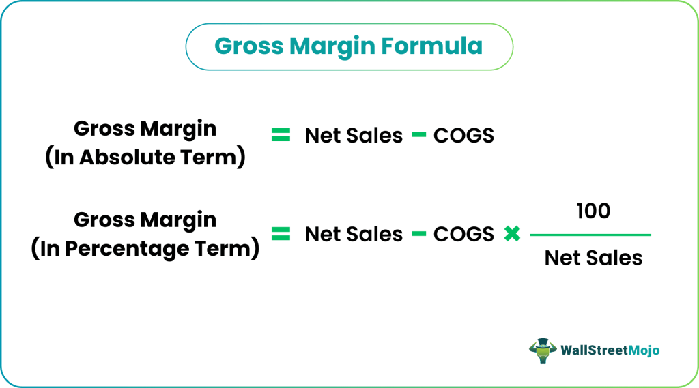

## Table of Contents

## What is gross margin?

Gross margin is the money a business makes after it pays for the things it sells. It's like if you bought toys for $5 each and sold them for $10 each, your gross margin would be $5 per toy. This number helps business owners see how well they are doing at selling their products.

It's important because it shows if a business can make enough money to cover other costs like rent, salaries, and utilities. If the gross margin is too low, the business might struggle to pay these other bills. By keeping an eye on gross margin, business owners can make smart decisions about pricing and costs to keep their business healthy.

## Why is gross margin important for a business?

Gross margin is really important for a business because it shows how much money is left after paying for the things they sell. This money is what helps the business pay for other things like rent, salaries, and utilities. If the gross margin is high, it means the business is doing well at selling its products and has more money to cover these other costs. But if the gross margin is low, it might be hard for the business to pay all its bills.

Business owners need to watch their gross margin closely. It helps them make smart choices about how much to charge for their products and how much to spend on buying or making them. By keeping the gross margin healthy, a business can stay strong and grow. If the gross margin starts to drop, it's a warning sign that the business might need to change its prices or find cheaper ways to get its products.

## How do you calculate gross margin?

To calculate gross margin, you start by finding out how much money you make from selling your products. This is called your revenue. Then, you subtract the cost of the things you sold, which is called the cost of goods sold (COGS). The difference between your revenue and your COGS is your gross profit. To get the gross margin, you divide your gross profit by your revenue and then multiply by 100 to turn it into a percentage.

For example, if you sell toys and you made $100 from selling them (that's your revenue), and it cost you $60 to buy those toys (that's your COGS), your gross profit would be $100 - $60 = $40. To find the gross margin, you would divide $40 by $100, which gives you 0.4. Multiply that by 100 to get a percentage, and your gross margin is 40%. This means for every dollar you make in sales, you keep 40 cents after paying for the toys.

## What is the difference between gross margin and gross profit?

Gross profit and gross margin are two important numbers that businesses use to see how well they are doing. Gross profit is the money left over after a business pays for the things it sells. For example, if you sell toys for $100 and it costs you $60 to buy them, your gross profit is $100 - $60 = $40. This number tells you how much money you have before you start paying for other things like rent and salaries.

Gross margin, on the other hand, is a percentage that shows how much of your sales money is left after paying for the things you sell. Using the same example, your gross profit was $40 and your sales were $100. To find the gross margin, you divide the gross profit by the sales and then multiply by 100 to get a percentage. So, $40 divided by $100 is 0.4, and when you multiply by 100, you get a gross margin of 40%. This means for every dollar you make in sales, you keep 40 cents after paying for the toys. Gross margin helps you see how efficient your business is at turning sales into profit.

## Can you provide a simple example of gross margin calculation?

Let's say you own a lemonade stand. You sell each cup of lemonade for $2, and in one day, you sell 50 cups. So, your total sales, or revenue, for the day is $2 x 50 = $100. Now, to make the lemonade, you spent $40 on lemons, sugar, and cups. This $40 is your cost of goods sold (COGS).

To find your gross profit, you subtract the cost of goods sold from your revenue. So, $100 - $40 = $60. This $60 is your gross profit for the day. Now, to calculate your gross margin, you divide your gross profit by your revenue and then multiply by 100 to get a percentage. So, $60 divided by $100 is 0.6, and when you multiply by 100, you get a gross margin of 60%. This means for every dollar you make in sales, you keep 60 cents after paying for the lemonade ingredients.

## How does gross margin differ across various industries?

Gross margin can be very different from one industry to another. Some businesses, like software companies, often have high gross margins because once they make the software, it doesn't cost them much to sell it to more people. For example, a software company might spend a lot of money to create a program, but after that, selling copies of the software to more customers doesn't cost much. So, their gross margin can be as high as 70% or even 80%. On the other hand, businesses like grocery stores have much lower gross margins. They buy food and other items at a certain price and then sell them for just a little more. Their gross margins might only be around 2% to 5% because they have to sell a lot of products to make a profit.

In industries like manufacturing, gross margins can vary a lot depending on what they make. A company that makes expensive machinery might have a higher gross margin than one that makes simple plastic parts. The machinery company can charge a lot more for their products, so even if the costs to make them are high, the gross margin can still be good, maybe around 30% to 40%. But the company making plastic parts might have a lower gross margin, maybe around 10% to 20%, because they can't charge as much for their products. Understanding these differences helps businesses know what kind of profit they can expect and how they need to manage their costs.

## What factors can affect a company's gross margin?

Many things can change a company's gross margin. One big [factor](/wiki/factor-investing) is how much it costs to make or buy the things the company sells. If these costs go up because materials or labor get more expensive, the gross margin can go down unless the company raises its prices. Another factor is how much the company charges for its products. If they can charge more without increasing costs, their gross margin will go up. Competition also plays a role. If other companies start selling similar products for less, a company might have to lower its prices, which can hurt its gross margin.

Another thing that can affect gross margin is how well the company manages its inventory. If a lot of products sit around without being sold, the company might have to sell them at a discount, which lowers the gross margin. Also, changes in the economy can make a difference. During tough times, people might not want to spend as much money, so companies might have to lower prices to keep selling their products. On the other hand, if the economy is doing well, people might be willing to pay more, which can help increase the gross margin.

## How can a business improve its gross margin?

A business can improve its gross margin by looking at the costs of the things it sells. If a business can find cheaper ways to make or buy its products, it can keep more money after selling them. This might mean finding new suppliers who charge less, using less expensive materials, or figuring out ways to make things more efficiently. For example, if a toy company can buy plastic at a lower price, the cost to make each toy goes down, and the gross margin goes up.

Another way to improve gross margin is by changing the prices of the products. If a business can charge more for its products without losing customers, it will make more money on each sale. This could mean adding new features to make the products seem more valuable or finding a way to show customers that their products are worth the higher price. But, the business needs to be careful because if it raises prices too much, customers might go to competitors instead. Balancing costs and prices well is key to boosting the gross margin and keeping the business healthy.

## What is a good gross margin percentage to aim for?

A good gross margin percentage can be different for every business because it depends on what kind of products they sell and what industry they are in. For example, software companies might aim for a gross margin of 70% to 80% because their costs to make the software are low after it's created. On the other hand, grocery stores might be happy with a gross margin of just 2% to 5% because they have to sell a lot of products to make a profit.

In general, a business should aim for a gross margin that is higher than what is common in their industry. This helps them make enough money to cover other costs like rent, salaries, and utilities. If a business can keep their gross margin healthy, it means they are doing well at selling their products and managing their costs, which is important for staying strong and growing.

## How does gross margin relate to operating margin and net profit margin?

Gross margin, operating margin, and net profit margin are all important numbers that show how well a business is doing. Gross margin is the money left after paying for the things a business sells. It's like if you sell toys for $100 and it costs you $60 to buy them, your gross margin is $40. Operating margin takes things a step further. It looks at the money left after paying for the things you sell and also after paying for other costs like rent, salaries, and utilities. If your gross profit was $40 and you spent another $20 on these other costs, your operating profit would be $20, and that's what you use to calculate the operating margin.

Net profit margin is the final piece of the puzzle. It shows the money left after paying for everything, including taxes and interest on loans. If your operating profit was $20 and you had to pay $5 in taxes and interest, your net profit would be $15. To find the net profit margin, you divide this net profit by your total sales and turn it into a percentage. So, if your sales were $100, your net profit margin would be 15%. Each of these margins helps business owners see different parts of their business's health, from how well they sell their products to how well they manage all their costs.

## What are the limitations of using gross margin as a performance metric?

Gross margin is a helpful number for businesses, but it doesn't tell the whole story. It only shows how much money is left after paying for the things a business sells. It doesn't include other important costs like rent, salaries, and utilities. So, a business might have a high gross margin but still struggle to pay all its bills if these other costs are too high. Also, gross margin can be different from one industry to another. What's a good gross margin for a software company might not be good for a grocery store. This makes it hard to compare businesses in different industries just by looking at their gross margins.

Another problem with gross margin is that it can be affected by things the business can't control, like changes in the prices of materials or labor. If these costs go up, the gross margin might go down even if the business is doing everything right. Also, gross margin doesn't show how well a business is selling its products or how much it's selling. A business might have a high gross margin but low sales, which means it's not making much money overall. So, while gross margin is useful, it's important for businesses to look at other numbers too, like operating margin and net profit margin, to get a full picture of how they are doing.

## How can gross margin analysis be used for strategic decision-making?

Gross margin analysis can help business owners make smart choices about their company. By looking at the gross margin, they can see if they are making enough money after paying for the things they sell. If the gross margin is low, it might mean they need to find cheaper ways to buy or make their products. Or, they might need to think about charging more for what they sell. This analysis can also show if some products are doing better than others. If one product has a higher gross margin, the business might want to focus more on selling that product.

Understanding gross margin can also help with planning for the future. If a business sees that its gross margin is getting smaller over time, it might be a sign that costs are going up or that they need to change their prices. By keeping an eye on gross margin, a business can make decisions that keep them strong and ready for whatever might happen next. It's like having a map that shows where the business is now and where it could go, helping them choose the best path forward.

## What is Gross Margin and How is it Understood?

Gross margin is a fundamental financial metric crucial for evaluating a company's operational efficiency and profitability. It represents the portion of revenue that exceeds the cost of goods sold (COGS), which includes expenses directly tied to production, such as labor and materials. Expressed as a percentage, this metric provides a clear picture of how efficiently a company is producing its goods or services relative to its sales.

The formula to calculate gross margin is expressed as:

$$
\text{Gross Margin} = \left(\frac{\text{Total Revenue} - \text{COGS}}{\text{Total Revenue}}\right) \times 100
$$

This measurement is beneficial for stakeholders by providing insights into how well a company manages its production costs. A high gross margin indicates efficient cost management and higher profitability, while a low gross margin may suggest that a company is struggling to control production costs or is operating in a highly competitive market with thin profit margins.

Understanding how to calculate and analyze gross margin is essential for assessing a company's financial health and operational performance. It aids investors, analysts, and managers in making informed decisions regarding pricing strategies, cost control measures, and overall business strategy. By scrutinizing gross margins over time, stakeholders can identify trends and make strategic adjustments to enhance profitability.

## What is the Role of Financial Metrics in Trading?

Financial metrics play a crucial role in both evaluating and optimizing trading strategies. They provide objective measures of a trading strategy's performance, helping traders to identify strengths, weaknesses, and areas for improvement. In [algorithmic trading](/wiki/algorithmic-trading), these metrics ensure that strategies are not only generating revenue but also converting that revenue into substantial profit effectively.

Gross margin, a significant financial metric, offers insights into the profitability derived from sales after accounting for costs of goods sold (COGS). It calculates the efficiency of converting revenue into net income. This metric is particularly useful in algorithmic trading, where cost efficiency is a vital parameter for successful strategy execution. The formula for gross margin is:

$$
\text{Gross Margin (\%)} = \left( \frac{\text{Total Revenue} - \text{COGS}}{\text{Total Revenue}} \right) \times 100
$$

While gross margin is essential, it is merely one component in a comprehensive evaluation of trading strategies. Metrics such as Return on Investment (ROI), [volatility](/wiki/volatility-trading-strategies), and expense ratios are equally critical. ROI evaluates the profitability of an investment, providing a direct comparison of how much money is made compared to how much is invested. The basic ROI formula is:

$$
\text{ROI (\%)} = \left( \frac{\text{Net Profit}}{\text{Investment Cost}} \right) \times 100
$$

Volatility measures the price fluctuations of an asset or trading strategy over time, offering insights into the risk associated with that strategy. Understanding volatility enables traders to assess possible returns against associated risks.

Expense ratios, which detail the operational costs relative to the fund's assets, are essential in understanding how management fees and other costs affect net profitability. These metrics collectively facilitate a holistic approach to evaluating trading strategies, allowing traders to adjust parameters and optimize performance for sustained profitability.

In conclusion, by meticulously analyzing financial metrics, traders can fine-tune algorithmic strategies to better adapt to market conditions, ultimately achieving more efficient and profitable trading processes.

## What are the essential metrics for algorithmic trading performance?

Algorithmic trading performance is evaluated through a variety of metrics aimed at measuring both returns and risks in a trading strategy. Among these, the Sharpe Ratio is widely utilized for gauging risk-adjusted returns. This metric is calculated by subtracting the risk-free rate from the expected return and then dividing the result by the standard deviation of the returns. The formula for the Sharpe Ratio is:

$$
\text{Sharpe Ratio} = \frac{E[R] - R_f}{\sigma_R}
$$

Where $E[R]$ is the expected return, $R_f$ is the risk-free rate, and $\sigma_R$ is the standard deviation of the portfolio’s excess return. A higher Sharpe Ratio indicates a better risk-adjusted performance.

Maximum Drawdown is another critical metric that measures the worst possible loss from a peak to a trough in a portfolio’s value before a new peak is achieved. It reflects the potential risk of a trading strategy and helps investors understand the impact of market downturns on their portfolios.

Win Rate represents the proportion of trades that end with a profit. It is expressed as a percentage and is calculated as:

$$
\text{Win Rate} = \left( \frac{\text{Number of Winning Trades}}{\text{Total Number of Trades}} \right) \times 100
$$

Profit Factor is a metric that compares the total gains of successful trades to the total losses of unsuccessful ones. It is computed as:

$$
\text{Profit Factor} = \frac{\text{Total Profits}}{\text{Total Losses}}
$$

A Profit Factor greater than one indicates a profitable strategy, whereas a value less than one suggests an unprofitable one.

Average Trade is a measure of the average profit or loss per trade and is essential for evaluating the overall performance of a trading strategy. It is calculated by dividing the sum of profits and losses by the total number of trades.

Each of these metrics provides vital insights into the effectiveness, risk exposure, and profitability of algorithmic trading strategies. Through careful analysis and application of these metrics, traders can refine algorithmic models, adjust risk parameters, and enhance profitability by better aligning strategies with market conditions.

## References & Further Reading

[1]: Hull, J. C. (2012). ["Options, Futures, and Other Derivatives"](https://www.semanticscholar.org/paper/Options%2C-Futures%2C-and-Other-Derivatives-Hull/89bdee500c8623864fc9eb7a471546aa713acc44) (9th ed.). Pearson.

[2]: Wong, B. (2015). ["Starting with a gridding approach to algorithmic trading"](https://onlinelibrary.wiley.com/doi/full/10.1111/joes.12153) Journal of Trading, 10(3), 31-40.

[3]: Kant, G. (2012). ["Trading Systems: A New Approach to System Development and Portfolio Optimisation"](https://www.amazon.com/Trading-Systems-Development-Portfolio-Optimisation/dp/1905641796). Springer.

[4]: Sharpe, W. F. (1994). ["The Sharpe Ratio"](https://web.stanford.edu/~wfsharpe/art/sr/SR.htm) Journal of Portfolio Management, 21(1), 49-58.

[5]: Pardo, R. (2008). ["The Evaluation and Optimization of Trading Strategies"](https://onlinelibrary.wiley.com/doi/book/10.1002/9781119196969) (2nd ed.). Wiley.