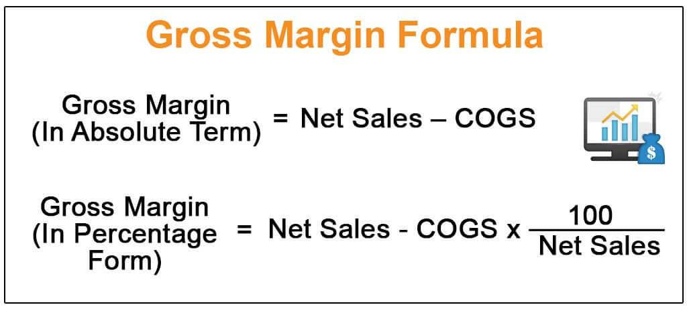

## Table of Contents

## What is gross margin?

Gross margin is the money a business makes from selling its products after paying for the cost of making those products. It's like if you sell a toy for $10 and it costs you $6 to make it, your gross margin is $4. This number is important because it shows how well a business is doing at making money from its products before other costs like rent and salaries are taken out.

Businesses use gross margin to see if they are pricing their products right and if they are making them efficiently. If the gross margin is high, it means the business is doing well in these areas. If it's low, the business might need to find ways to reduce the cost of making the product or increase the price they sell it for. Keeping an eye on gross margin helps businesses make smart decisions about how to grow and stay profitable.

## How is gross margin calculated?

Gross margin is calculated by subtracting the cost of goods sold (COGS) from the total revenue, and then dividing that number by the total revenue. Let's say you made $100 from selling your products and it cost you $60 to make them. You subtract $60 from $100 to get $40, which is your gross profit. Then, you divide $40 by $100 to get 0.4, or 40% when turned into a percentage. That 40% is your gross margin.

This calculation helps you see what percentage of each dollar of revenue is left after paying for the costs of making your products. It's a key number for businesses because it shows how efficiently they are producing and selling their goods. A higher gross margin means the business is keeping more money from each sale after covering the cost of goods sold, which is good for the business's health and growth.

## Why is gross margin important for a business?

Gross margin is important for a business because it shows how much money is left after paying for the stuff they need to make their products. This number helps business owners see if they are setting the right price for their products and if they are making them in a smart way. If the gross margin is high, it means the business is doing a good job at both making and selling their products. But if it's low, it might be a sign that they need to find cheaper ways to make their products or maybe charge more for them.

Understanding gross margin also helps businesses make plans for the future. If they know their gross margin, they can decide if they can afford to grow bigger, like opening a new store or making more products. It's like having a map that shows them where they are doing well and where they might need to make changes. This way, they can keep their business healthy and make more money over time.

## What is the difference between gross margin and gross profit?

Gross margin and gross profit are related but different. Gross profit is the total amount of money you make from selling your products after you subtract the cost of making them. It's like if you sell a toy for $10 and it costs you $6 to make, your gross profit is $4. This number tells you how much money you have left from each sale before you pay for other things like rent and salaries.

Gross margin, on the other hand, is a percentage that shows what part of your total sales money is left after paying for the cost of making your products. Using the same toy example, if you sell it for $10 and it costs $6 to make, your gross profit is $4. To find the gross margin, you divide $4 by $10, which gives you 0.4 or 40%. This percentage helps you see how efficiently you are making and selling your products, and it's useful for comparing your business with others or tracking your own progress over time.

## How does gross margin differ from net margin?

Gross margin and net margin are both important numbers for a business, but they show different things. Gross margin is the percentage of money left after paying for the stuff needed to make your products. It's like if you sell a toy for $10 and it costs $6 to make, your gross margin is 40%. This number tells you how well you are doing at making and selling your products before other costs come into play.

Net margin, on the other hand, is the percentage of money left after paying for everything, including the cost of making your products, rent, salaries, and other expenses. Using the same toy example, if you sell it for $10, it costs $6 to make, and you have $2 in other expenses, your net profit is $2. Your net margin would then be 20%. This number gives you a fuller picture of how much money your business is really making after all costs are covered.

## What is considered a good gross margin percentage?

A good gross margin percentage can vary a lot depending on the type of business. For example, businesses that sell physical products, like a toy store, might aim for a gross margin of around 30% to 50%. On the other hand, service-based businesses, like a consulting firm, often have higher gross margins, sometimes reaching 70% or more, because they don't have to pay for things like materials or manufacturing.

What's considered "good" also depends on what other businesses in the same industry are doing. If your gross margin is higher than your competitors, that's a good sign. But if it's lower, you might need to find ways to make your products cheaper or sell them for more money. Keeping an eye on your gross margin and comparing it with others helps you make smart decisions to keep your business healthy and growing.

## How can a business improve its gross margin?

A business can improve its gross margin by finding ways to make their products cheaper. This could mean buying materials at a lower price, using less expensive suppliers, or making the product in a way that uses fewer resources. For example, if a toy company finds a cheaper type of plastic, they can lower the cost of making each toy, which means their gross margin goes up. Another way is to make the production process more efficient, like using machines that work faster or training workers to be more productive. All these steps help the business keep more money from each sale after paying for the cost of making the product.

Another way to boost gross margin is by selling products for more money. If a business can convince customers that their product is worth a higher price, they can increase the price without changing the cost of making it. This means more money left over after paying for the product's cost, leading to a higher gross margin. To do this, the business might need to show why their product is better or different from others, maybe through marketing or by adding special features. By either cutting costs or raising prices, or ideally doing both, a business can improve its gross margin and make more money from each sale.

## What factors can affect a company's gross margin?

A company's gross margin can be affected by many things. One big factor is the cost of the stuff they need to make their products. If the price of materials goes up, it costs more to make each product, which can lower the gross margin. Another thing that can change the gross margin is how much they sell their products for. If they can charge more for their products without the cost going up, their gross margin goes up too. The way they make their products also matters. If they find a faster or cheaper way to make things, their gross margin can improve.

Another factor is how much competition there is. If there are a lot of other companies selling similar products, a business might have to lower their prices to stay competitive, which can hurt their gross margin. Changes in what customers want can also affect gross margin. If people start wanting different products, a company might have to change what they make, which can change their costs and prices. Lastly, things like taxes and tariffs on the materials they use can make a big difference in the cost of making products, which in turn affects the gross margin.

## How does gross margin analysis help in pricing strategies?

Gross margin analysis helps a business figure out the best price to sell their products. By looking at the gross margin, a business can see how much money they make from each sale after paying for the cost of making the product. If the gross margin is low, it might mean they need to raise their prices or find a cheaper way to make their products. On the other hand, if the gross margin is high, they might be able to lower their prices a bit to sell more products and still make a good profit. This helps them find the sweet spot where they can sell a lot of products at a price that keeps their business healthy.

Understanding gross margin also helps a business see how they compare to others in their industry. If their gross margin is lower than their competitors, they might need to adjust their prices to stay competitive. If it's higher, they might have room to lower prices and still make a good profit, or they might decide to keep their prices the same and enjoy a bigger profit. By using gross margin analysis, a business can make smart choices about pricing that help them grow and stay profitable.

## Can gross margin be used to compare companies in different industries?

Gross margin can be used to compare companies in different industries, but it's not always the best way to do it. Gross margin shows how much money a company keeps from each sale after paying for the cost of making the product. Since different industries have different costs and ways of making money, comparing gross margins across industries can be tricky. For example, a tech company might have a higher gross margin than a grocery store because tech products often cost less to make compared to their selling price. So, while gross margin can give you a general idea, it's better to compare companies within the same industry where costs and pricing are more similar.

Still, gross margin can be useful if you want to see how well a company is doing at making and selling its products, no matter the industry. If one company has a much higher gross margin than another, it might mean they are better at keeping costs down or charging more for their products. But to really understand why one company's gross margin is different from another's, you need to look at other things too, like how they make their products, who they sell to, and what their overall business strategy is. So, while gross margin can be a helpful starting point, it's just one piece of the puzzle when comparing companies across different industries.

## How do seasonal variations impact gross margin?

Seasonal variations can change a company's gross margin because the cost of making products and how much people want to buy them can be different at different times of the year. For example, if a company makes winter coats, they might sell a lot more in the fall and winter. They might buy materials in bulk during the summer when prices are lower, which can lower their costs and increase their gross margin. But if they can't sell all their coats before spring, they might have to lower their prices, which can hurt their gross margin.

Another way seasonal changes affect gross margin is through changes in demand. During busy times like holidays, a company might be able to sell their products for more money because a lot of people want to buy them. This can boost their gross margin. But if they can't make enough products to meet the demand, they might miss out on sales, which can lower their gross margin. So, understanding how the seasons affect their business helps a company plan better and keep their gross margin healthy.

## What advanced metrics can be derived from gross margin for financial analysis?

Gross margin can be used to create more advanced metrics that help businesses understand their financial health better. One important metric is the gross margin return on inventory (GMROI), which shows how much money a business makes from the inventory they have. It's like figuring out if the stuff they have sitting in their store or warehouse is worth the money they spent on it. To find GMROI, you divide the gross margin by the average inventory cost. If this number is high, it means the business is doing a good job of turning their inventory into profit.

Another useful metric is the contribution margin, which helps a business see how much money each product adds to covering other costs like rent and salaries after paying for the cost of making it. This can be especially helpful for businesses that sell many different products. By figuring out the contribution margin for each product, a business can see which ones are the most profitable and focus on selling more of those. Both GMROI and contribution margin give a deeper look into how well a business is doing financially, beyond just looking at the gross margin alone.

## What is Gross Margin and How Can It Be Understood?

Gross margin is a fundamental financial metric, serving as a crucial indicator of a business's profitability. This metric highlights the portion of revenue that remains after accounting for the cost of goods sold (COGS). By providing insight into the efficiency and profitability of a company's core operations, gross margin is a valuable tool for investors and stakeholders.

The gross margin is calculated using the formula: 

$$
\text{Gross Margin} = \left( \frac{\text{Total Revenue} - \text{Cost of Goods Sold}}{\text{Total Revenue}} \right) \times 100
$$

Expressed as a percentage, gross margin illustrates what proportion of revenue is converted into gross profit, offering a clear view of the financial headroom a company has to cover other operating expenses and generate net profit.

It's important to note that gross margins can vary significantly across different industries due to varying cost structures and pricing strategies. For instance, technology companies might experience higher gross margins compared to retail businesses because of relatively lower COGS and higher value-added services. Thus, industry benchmarks are essential when evaluating a company's gross margin to account for these inherent discrepancies.

Beyond immediate profitability, gross margin analysis can also reveal insights into a company’s operational efficiency. Companies with high and stable gross margins are often perceived as more efficient in managing their production processes and controlling costs, which may translate into a sustainable competitive advantage. Conversely, a declining gross margin may signal increasing production costs or competitive price pressures that could affect future profitability.

In summary, gross margin is not only a measure of past performance but also a predictive tool that provides insight into a company's long-term financial health and business viability. Understanding and analyzing gross margin is an essential practice in financial assessment, whether for internal management decisions or external investment evaluations.

## What is the Role of Financial Metrics in Trading?

Financial metrics are essential tools that offer quantitative insights into the effectiveness and efficiency of trading strategies, aiding traders significantly in their decision-making processes. These metrics serve as indicators of various aspects of a trading strategy's performance, particularly its profitability, and help traders to evaluate and optimize their algorithms.

One of the key financial metrics is the gross margin, which assists in assessing the profitability of trading strategies. Gross margin is expressed as:

$$
\text{Gross Margin} = \frac{\text{Total Revenue} - \text{Cost of Goods Sold}}{\text{Total Revenue}} \times 100\%\]

In the context of trading, 'Cost of Goods Sold' can refer to the transaction costs, including broker fees, slippage, and taxes, which are inevitable parts of executing trades. A higher gross margin indicates that a strategy is more efficient in converting revenue into actual profit, highlighting the importance of controlling transaction costs in [algorithmic trading](/wiki/algorithmic-trading).

Financial metrics go beyond profitability measures. They form part of a broader toolkit that includes other performance indicators such as return on investment (ROI), [volatility](/wiki/volatility-trading-strategies), and expense ratios which also play critical roles in evaluating a trading strategy's success. The integration of these metrics allows traders to fine-tune their systems, making data-driven adjustments to improve performance and align their strategies with market conditions.

The effective use of financial metrics enables algorithmic traders to backtest and optimize their systems, ensuring that they operate efficiently in a dynamic market. By analyzing the performance metrics generated by a trading strategy, traders can identify strengths and weaknesses, adapting their algorithms to mitigate risks and enhance profitability. This approach underscores the critical role of financial metrics in constructing robust algorithmic trading strategies that are versatile and resilient in various market situations.

## What are the essential metrics for algorithmic trading performance?

Metrics such as Sharpe Ratio, Maximum Drawdown, Win Rate, Profit Factor, and Average Trade are pivotal for performance assessment in algorithmic trading. These quantitative measures provide traders with the necessary insights to evaluate and enhance their trading strategies.

The Sharpe Ratio is a widely used metric that evaluates the risk-adjusted returns of a trading strategy. It is calculated by subtracting the risk-free rate from the strategy's average return and dividing the result by the standard deviation of the strategy's returns. Mathematically, it can be expressed as:

$$
\text{Sharpe Ratio} = \frac{R_p - R_f}{\sigma_p}
$$

where $R_p$ is the average return of the portfolio, $R_f$ is the risk-free rate, and $\sigma_p$ is the standard deviation of the portfolio's excess return. A higher Sharpe Ratio indicates better risk-adjusted performance, allowing traders to assess how well the returns of a strategy compensate for the risks taken.

Maximum Drawdown (MDD) is another critical metric for risk management. It measures the largest peak-to-trough decline in a trading portfolio over a specified time period. Monitoring MDD helps traders understand the potential risk exposure and the ability of their strategies to recover from losses. It is typically expressed as a percentage of the portfolio's value:

$$
\text{MDD} = \frac{\text{Peak Value} - \text{Trough Value}}{\text{Peak Value}} \times 100\%
$$

The Win Rate, defined as the proportion of winning trades relative to the total number of trades, offers insights into the effectiveness of a trading strategy. Although a high win rate is desirable, it should be considered alongside other metrics to ensure overall profitability, as it doesn't account for the magnitude of gains or losses.

Profit Factor is calculated by dividing the total gross profit by the total gross loss for a trading strategy. It provides an indication of how much profit is realized for every unit of loss. A Profit Factor greater than one implies a profitable strategy:

$$
\text{Profit Factor} = \frac{\text{Total Gross Profit}}{\text{Total Gross Loss}}
$$

Lastly, Average Trade refers to the average profit or loss per trade, serving as an indicator of strategy efficiency. Consistently positive average trades suggest a sound trading approach.

These metrics, when used collectively, furnish traders with a comprehensive view of their algorithmic strategies, facilitating informed decision-making and fine-tuning of their trading systems for better performance.

## How can Gross Margin be Integrated into Algo Trading?

Algorithmic trading involves executing orders using automated and pre-programmed trading instructions to account for variables such as timing, price, and [volume](/wiki/volume-trading-strategy). Gross margin analysis can be crucial in enhancing algorithmic trade strategies by focusing on cost efficiency and effective margin targeting. Gross margin, calculated as:

$$
\text{Gross Margin} = \left( \frac{\text{Revenue} - \text{Cost of Goods Sold (COGS)}}{\text{Revenue}} \right) \times 100\%
$$

is essential to understanding how much money is made after accounting for the costs directly associated with the trading strategy.

When traders apply gross margin analysis within algorithmic trading, they gain insights into the efficiency of their strategies. Algorithmic trades often incur transaction costs, fees, and other related expenses which can significantly impact net profits. By examining gross margins, traders can better align their algorithms to ensure that strategies remain profitable after all trading expenses are considered.

Incorporating gross margin reviews, traders can revise and optimize strategy parameters to hit desired margin targets while minimizing costs. For instance, strategies could be adjusted to favor assets with lower transaction costs or optimized execution tactics that reduce slippage, thereby enhancing overall margin performance. Gross margin acts as a guiding metric, helping traders hone their approaches and align them with target profitability goals.

Ultimately, gross margin evaluation helps clarify how much of the revenue generated by a trading strategy translates into actual profit after costs. This is integral not only for measuring the efficiency of current strategies but also essential for developing future strategies that take full advantage of market opportunities while staying within cost constraints.

## References & Further Reading

[1]: Bergstra, J., Bardenet, R., Bengio, Y., & Kégl, B. (2011). ["Algorithms for Hyper-Parameter Optimization."](https://papers.nips.cc/paper/4443-algorithms-for-hyper-parameter-optimization) Advances in Neural Information Processing Systems 24.

[2]: ["Advances in Financial Machine Learning"](https://www.amazon.com/Advances-Financial-Machine-Learning-Marcos/dp/1119482089) by Marcos Lopez de Prado

[3]: ["Evidence-Based Technical Analysis: Applying the Scientific Method and Statistical Inference to Trading Signals"](https://www.amazon.com/Evidence-Based-Technical-Analysis-Scientific-Statistical/dp/0470008741) by David Aronson

[4]: ["Machine Learning for Algorithmic Trading"](https://github.com/PacktPublishing/Machine-Learning-for-Algorithmic-Trading-Second-Edition) by Stefan Jansen

[5]: ["Quantitative Trading: How to Build Your Own Algorithmic Trading Business"](https://books.google.com/books/about/Quantitative_Trading.html?id=j70yEAAAQBAJ) by Ernest P. Chan