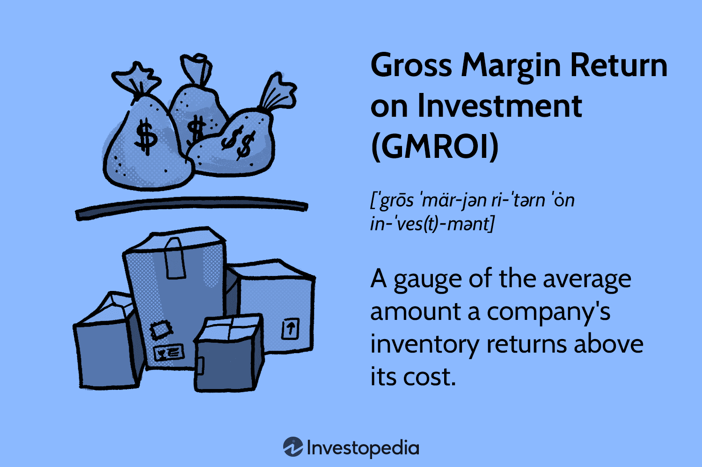

## Table of Contents

## What is Gross Margin Return on Investment (GMROI)?

Gross Margin Return on Investment (GMROI) is a way to measure how well a business is using its money to make a profit. It looks at the gross margin, which is the money left after paying for the products you sell, and compares it to the amount of money you used to buy those products. This helps business owners see if they are making good decisions about what to buy and sell.

GMROI is important because it shows if the money spent on inventory is being used effectively. If the GMROI is high, it means the business is doing a good job turning its inventory into profit. If it's low, it might mean the business needs to rethink what products it's buying or how it's pricing them. This can help businesses make smarter choices and improve their overall success.

## Why is GMROI important for businesses?

GMROI is important for businesses because it helps them understand how well they are using their money to make a profit. It shows if the money spent on buying products is being turned into profit effectively. If a business has a high GMROI, it means they are doing a good job of choosing the right products to buy and sell. This can help business owners feel confident that their decisions are leading to success.

On the other hand, if the GMROI is low, it's a warning sign that the business might need to make some changes. It could mean they are buying too many products that don't sell well or that they are not setting the right prices. By keeping an eye on GMROI, businesses can figure out what's working and what's not, and make smarter choices about what to buy and sell in the future. This can lead to better profits and a stronger business overall.

## How is GMROI calculated?

GMROI is calculated by dividing the gross margin by the average inventory cost. The gross margin is the money left after subtracting the cost of the products from the revenue made by selling those products. The average inventory cost is the total amount of money spent on inventory over a period of time, divided by the number of times you check the inventory during that period.

To find the gross margin, you start with the total revenue from sales, then subtract the cost of the goods sold. For example, if you sold products for $100 and it cost you $60 to buy those products, your gross margin would be $40. To find the average inventory cost, add up the cost of all the inventory you had at different times during the period and divide by the number of times you checked. If you had inventory costing $50 at the start and $70 at the end of the month, the average would be $60. Then, divide the gross margin by the average inventory cost to get the GMROI. In this case, it would be $40 divided by $60, which equals 0.67, or a GMROI of 67%.

## What does a high GMROI indicate?

A high GMROI means that a business is doing a good job of turning the money they spend on products into profit. When the GMROI is high, it shows that the business is choosing the right products to buy and sell. They are likely selling these products at a good price, which leads to more money left over after paying for the products.

This is important because it means the business is using its money wisely. A high GMROI can help the business grow and make more money in the future. It gives the business owners confidence that their choices are leading to success, and it can help them make even better decisions about what to buy and sell next.

## What does a low GMROI suggest?

A low GMROI means that a business is not doing a good job of turning the money they spend on products into profit. It shows that they might be buying products that do not sell well or that they are not setting the right prices for their products. This can lead to less money left over after paying for the products, which is not good for the business.

When a business sees a low GMROI, it's a warning sign that they need to make some changes. They might need to look at what products they are buying and decide if they should buy different ones that will sell better. They might also need to think about changing their prices to make more money from each sale. By figuring out what's not working and fixing it, the business can improve its GMROI and become more successful.

## How can GMROI be used to compare different products or categories?

GMROI can help businesses compare different products or categories by showing which ones bring in the most profit for the money spent on them. If a business sells many different types of products, they can use GMROI to see which products are the best at turning the money spent on them into profit. For example, if a store sells both toys and clothes, they can calculate the GMROI for each category. If the GMROI for toys is higher than for clothes, it means that the money spent on toys is being used more effectively to make a profit.

By comparing the GMROI of different products or categories, a business can make better decisions about what to buy and sell. If they see that one category has a low GMROI, they might decide to buy less of those products or try to sell them at a higher price. On the other hand, if a category has a high GMROI, the business might decide to buy more of those products because they know they can make good money from them. This helps the business focus on what sells well and makes the most profit.

## What are the limitations of using GMROI as a performance metric?

While GMROI is a useful tool for businesses, it does have some limitations. One big limitation is that GMROI only looks at the money made from selling products, not other costs like rent or employee salaries. So, a business might have a high GMROI but still not be making a profit if these other costs are too high. Also, GMROI does not tell you about how fast products sell. A product might have a high GMROI but take a long time to sell, which can tie up money that could be used for other things.

Another limitation is that GMROI can be affected by how a business decides to price their products. If a business lowers prices to sell more, the GMROI might go down even if they are making more money overall. This can make it hard to understand if a low GMROI means the business is doing badly or if it's just because of a pricing strategy. Because of these limitations, businesses should use GMROI along with other ways of measuring performance to get a full picture of how they are doing.

## How does inventory turnover affect GMROI?

Inventory turnover is how fast a business sells and replaces its products. It's important because it can affect GMROI. If a business has a high inventory turnover, it means they are selling products quickly. This can lead to a higher GMROI because they are not holding onto products for a long time, which means they can use the money from sales to buy more products and keep making a profit.

On the other hand, if a business has a low inventory turnover, it means products are sitting on the shelves for a long time. This can lower the GMROI because the money used to buy those products is not being turned into profit quickly. The business might have to wait a long time to get that money back, and in the meantime, they might miss out on other chances to make money. So, a business needs to find a good balance to keep their GMROI high.

## Can GMROI be applied to services, or is it limited to products?

GMROI is usually used for businesses that sell products, like stores that sell clothes or electronics. It helps them see if the money they spend on buying products is being used well to make a profit. But, it can be a bit tricky to use GMROI for services because services are different from products. When you sell a service, like a haircut or a cleaning job, you don't have to buy things to sell them. Instead, you might need to pay for things like employee time or tools.

Even though GMROI is mostly for products, you can still use it for services if you think about it in a different way. You can look at the money you make from a service after paying for the costs of providing that service. For example, if you run a cleaning business, you can see how much profit you make after paying for cleaning supplies and employee wages. It's not exactly the same as using GMROI for products, but it can still help you understand if you're making good money from your services.

## How can a business improve its GMROI?

A business can improve its GMROI by focusing on buying the right products. They should choose products that sell quickly and at a good price. If a product sells well and makes a lot of money, the business should buy more of it. On the other hand, if a product doesn't sell well, the business might want to buy less of it or stop buying it altogether. This helps the business use its money better and make more profit.

Another way to improve GMROI is by setting the right prices for products. If a business sells products at too low a price, they might not make enough money to cover their costs. By raising prices a little, they can make more money from each sale. But, they need to be careful not to raise prices too much, or customers might not want to buy the products anymore. Finding the right balance can help the business make more profit and improve its GMROI.

## What role does pricing strategy play in optimizing GMROI?

Pricing strategy is very important for making GMROI better. If a business sets prices too low, they might sell a lot of products, but they won't make enough money to cover what they spent on buying those products. This means their GMROI will be low because they are not making enough profit. By raising prices a little, the business can make more money from each sale. This can help them make more profit and improve their GMROI.

But, it's also important not to raise prices too much. If prices are too high, customers might not want to buy the products anymore. This can lead to lower sales and a lower GMROI because the business is not selling enough products to make a good profit. So, finding the right balance in pricing is key. The business needs to set prices that are high enough to make a good profit but not so high that they scare customers away. This way, they can sell enough products at a good price to improve their GMROI.

## How does GMROI integrate with other financial metrics in business analysis?

GMROI is a helpful tool that works well with other financial metrics to give businesses a full picture of how they are doing. For example, a business might use GMROI along with the inventory turnover rate to see how fast products are selling and if they are making good money from them. If a business has a high GMROI but a low inventory turnover, it might mean they are making a good profit on each sale but not selling products quickly enough. By looking at both metrics together, the business can find the right balance to make more money.

Another important metric that goes well with GMROI is the net profit margin. While GMROI looks at the profit made from the money spent on products, the net profit margin looks at the overall profit after all costs, like rent and employee salaries, are paid. If a business has a high GMROI but a low net profit margin, it might mean that other costs are eating into their profits. By using both metrics together, a business can see if they need to cut costs or change their pricing strategy to make more money. This helps them make smarter decisions and improve their overall success.

## What is Gross Margin Return on Investment (GMROI) and how can it be understood?

Gross Margin Return on Investment (GMROI) is a vital financial metric that assesses a company's efficiency in converting its inventory into cash above the inventory's cost. It is particularly valuable for retailers aiming to evaluate the profitability of their inventory investment. A fundamental aspect of GMROI is its ability to provide insights into inventory turnover and profitability, emphasizing which products yield the highest returns on investment.

The GMROI is calculated using the formula:

$$
\text{GMROI} = \frac{\text{Gross Profit}}{\text{Average Inventory Cost}}
$$

Here, Gross Profit refers to the difference between sales revenue and the cost of goods sold (COGS), while Average Inventory Cost is the mean of the beginning and ending inventory for a specific period. By employing this formula, businesses can assess whether their inventory management strategies are effective. A GMROI value greater than 1 indicates that the firm is generating more revenue than the cost of the inventory, thus achieving profitable inventory turnover. This scenario suggests efficient inventory management, where the products sold are covering costs and contributing to the firm's profitability.

Conversely, a GMROI value below 1 may signal inefficiencies, implying the inventory costs exceed the revenue generated from sales. Such a situation necessitates a reassessment of the inventory management strategies to identify potential issues, such as overstocking or pricing problems.

For retailers, understanding GMROI is crucial. It provides critical insights into which products or product categories are contributing the most to profitability. By analyzing GMROI, retailers can make informed decisions about purchasing, stocking, and pricing strategies. This metric serves as a compass, guiding retailers to optimize inventory levels and allocate resources efficiently, thereby enhancing overall business profitability.

## What is the Significance of GMROI in Investment Return?

The Gross Margin Return on Investment (GMROI) is a vital metric for investors scrutinizing the retail sector. It provides crucial insights into a company's inventory management and overall operational efficiency, aiding investors in making informed decisions about the profitability of their retail investments. At its core, GMROI measures how effectively inventory investments are converted into gross profits. This metric is calculated as:

$$
GMROI = \frac{\text{Gross Profit}}{\text{Average Inventory Cost}}
$$

A GMROI greater than 1 signifies that the firm is generating more profit from its inventory than the cost incurred to acquire it. In contrast, a GMROI less than 1 indicates potential inefficiencies in managing inventory or generating adequate returns.

For investors, a high GMROI points to strong managerial prowess and efficient inventory practices, implying a potential for higher returns on inventory investments. This makes it an essential tool for evaluation, as it reflects not just profitability but also how well a company is leveraging its resources.

Consider a retail company with a GMROI of 1.5. This indicates that for every dollar invested in inventory, the company is generating $1.50 in gross profit. Such a ratio underscores the firm's adeptness at inventory turnover and margin optimization, which are critical components of its market position.

Investment strategies often hinge on understanding and analyzing such financial metrics. Hence, a thorough comprehension of GMROI allows investors to assess a company’s operational competency and to forecast its future profit potential. High GMROI values are typically linked with robust growth strategies and efficient capital allocation, making them an attractive signal for investment opportunities. Consequently, investors rely on GMROI to gauge the financial health and strategic alignment of their retail investments with broader market dynamics and trends.

## References & Further Reading

[1]: ["Retail Math, Made Simple."](https://books.google.com/books/about/Retail_Math_Made_Simple_5th_Edition.html?id=CKWs6Mr4rQ4C) National Retail Federation.

[2]: Jersey, D. & Dalhoff, P. (2015). ["Optimizing Inventory Management for Financial Control."](https://www.researchgate.net/publication/377189703_DATA_ANALYTICS_TO_ENHANCE_SUPPLY_CHAIN_DECISION-MAKING_INVENTORY_MANAGEMENT_AND_LOGISTIC_OPTIMIZATION) Coresight Research.

[3]: ["Inventory Best Practices,"](https://www.forbes.com/advisor/business/inventory-management-techniques/) by Steven Bragg.

[4]: Ortega, A. (2018). ["Understanding and Calculating the Basic Inventory Metrics,"](https://www.netsuite.com/portal/resource/articles/inventory-management/inventory-management-kpis-metrics.shtml) Supply Chain 24/7.

[5]: ["The Essentials of Inventory Management"](https://www.amazon.com/Essentials-Inventory-Management-Max-Muller/dp/0814416551) by Max Muller.
