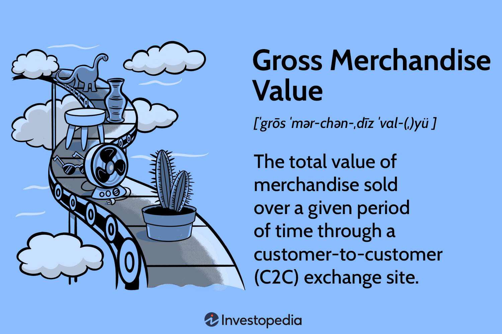

## Table of Contents

## What is Gross Merchandise Value (GMV)?

Gross Merchandise Value, or GMV, is the total amount of money made from selling products or services on a platform over a certain time. It's like adding up all the price tags of everything sold, before taking away any costs like discounts or returns. For example, if an online store sold items worth $100, $200, and $300 in a day, the GMV for that day would be $600.

GMV is useful for businesses because it shows how much they are selling, which can help them understand how well they are doing. However, it doesn't tell the whole story because it doesn't include things like the costs of running the business or money lost from returns. So, while GMV is a good starting point to see sales performance, other numbers like net profit are also important to get a full picture of a business's health.

## How is GMV calculated?

Gross Merchandise Value, or GMV, is calculated by adding up the total sales value of all goods and services sold on a platform during a specific period. This means you take the price of each item sold and add them all together. For example, if you sold a shirt for $20, a pair of shoes for $50, and a hat for $30 in one day, your GMV for that day would be $100.

It's important to note that GMV includes the full price of items before any discounts, returns, or other deductions are taken into account. So, if a customer bought something on sale or returned an item, those adjustments are not subtracted from the GMV. This makes GMV a useful measure to see the total sales volume, but it doesn't show the actual money a business keeps after all costs.

## Why is GMV important for businesses?

GMV is important for businesses because it shows how much they are selling. It's like a big number that tells them the total value of all the products or services they sold in a certain time. This helps businesses see if they are growing or if they need to make changes. For example, if a business sees that their GMV is going up every month, they know that more people are buying from them, which is a good sign.

However, GMV doesn't tell the whole story. It only shows sales before any discounts, returns, or other costs are taken away. So, while a high GMV can make a business look successful, it's also important to look at other numbers like net profit to see how much money the business is actually keeping. This way, businesses can get a full picture of their health and make better decisions.

## What are the key components needed to calculate GMV?

To calculate Gross Merchandise Value (GMV), you need to add up the total sales value of all the products or services sold on a platform over a certain time. This means you take the price of each item sold and add them all together. For example, if you sold a shirt for $20, a pair of shoes for $50, and a hat for $30 in one day, your GMV for that day would be $100.

It's important to remember that GMV includes the full price of items before any discounts, returns, or other deductions are taken into account. So, if a customer bought something on sale or returned an item, those adjustments are not subtracted from the GMV. This makes GMV a useful measure to see the total sales volume, but it doesn't show the actual money a business keeps after all costs.

## Can you provide a simple example of how to calculate GMV?

Let's say you run a small online store. In one day, you sold a toy car for $10, a doll for $15, and a puzzle for $5. To find your Gross Merchandise Value (GMV) for that day, you simply add up the prices of everything you sold. So, $10 + $15 + $5 equals $30. That means your GMV for that day is $30.

Remember, GMV is just the total value of all the sales before you take away any discounts or returns. If someone returned the puzzle or bought the doll on sale, you wouldn't subtract those amounts from the GMV. It's like looking at the total amount of money that came in from sales, without worrying about what goes out.

## What are the advantages of using GMV as a metric?

Using Gross Merchandise Value (GMV) as a metric is helpful for businesses because it gives them a quick look at how much they are selling. It's like a big number that shows the total value of all the stuff sold in a certain time. This helps businesses see if they are growing or if they need to make changes. For example, if a business sees that their GMV is going up every month, they know that more people are buying from them, which is a good sign.

However, GMV doesn't tell the whole story. It only shows sales before any discounts, returns, or other costs are taken away. So, while a high GMV can make a business look successful, it's also important to look at other numbers like net profit to see how much money the business is actually keeping. This way, businesses can get a full picture of their health and make better decisions.

## What are the limitations or disadvantages of relying on GMV?

While Gross Merchandise Value (GMV) can show a business how much they are selling, it doesn't tell the whole story. GMV only looks at the total sales before taking away any discounts, returns, or other costs. This means if a business has a lot of returns or gives out many discounts, their actual money might be a lot less than what the GMV shows. So, relying only on GMV might make a business think they are doing better than they really are.

Another problem with GMV is that it doesn't show how much money the business is actually keeping after all the costs. For example, if a business spends a lot on advertising or has high shipping costs, those expenses are not part of the GMV. So, a high GMV might look good, but if the costs are also high, the business might not be making much profit. It's important for businesses to look at other numbers like net profit to get a full picture of their financial health.

## How does GMV differ from revenue and net sales?

Gross Merchandise Value (GMV) is different from revenue and net sales because it looks at the total value of everything sold before taking away any discounts, returns, or other costs. GMV is like adding up all the price tags of items sold, even if some of those items were sold at a discount or later returned. For example, if a store sold a shirt for $20, but the customer used a $5 coupon, the GMV would still count the full $20, not the $15 the store actually received.

Revenue, on the other hand, is the total amount of money a business actually receives from sales after discounts but before other costs like returns are taken away. So, in the example above, the revenue would be $15 because that's what the store got after the discount. Net sales go a step further and subtract returns and allowances from revenue. If the customer returned the shirt, the net sales would be $0 because the store didn't keep any money from that sale. So, while GMV gives a big picture of total sales volume, revenue and net sales show a more accurate picture of the money a business actually keeps.

## In what industries is GMV most commonly used?

Gross Merchandise Value (GMV) is most commonly used in industries where a lot of products or services are sold through a platform, like online marketplaces and e-commerce. For example, companies like Amazon and eBay use GMV to show how much stuff is being sold on their websites. It helps them see if more people are buying things and if their business is growing. GMV is also useful for businesses that want to compare themselves to others in the same industry, because it gives a simple way to look at total sales.

Another industry where GMV is often used is in the sharing economy, like ride-sharing and home-sharing platforms. Companies like Uber and Airbnb use GMV to show the total value of all the rides or stays booked through their apps. This helps them understand how much activity is happening on their platforms and how popular their services are. Just like in e-commerce, GMV in the sharing economy gives a big picture of how much business is being done, but it doesn't show the actual money the company keeps after costs.

## How can GMV be used to assess the performance of an e-commerce platform?

GMV, or Gross Merchandise Value, is a helpful way to see how well an e-commerce platform is doing. It's like adding up all the prices of everything sold on the platform in a certain time. If the GMV is going up, it means more people are buying things, which is good for the business. For example, if an online store's GMV was $100,000 last month and it's $120,000 this month, that's a sign that the store is growing.

However, GMV doesn't tell the whole story. It only shows the total sales before taking away discounts, returns, or other costs. So, a high GMV might look good, but if the store has a lot of returns or gives out many discounts, the actual money they keep could be much less. That's why it's important for e-commerce platforms to look at other numbers like net profit too, to get a full picture of how well they are really doing.

## What advanced metrics should be considered alongside GMV for a comprehensive analysis?

When looking at how well an e-commerce platform is doing, it's important to look at more than just Gross Merchandise Value (GMV). One important metric to consider is net profit, which is the money left after all the costs are taken away from the revenue. This tells you how much money the business is actually keeping. Another useful metric is the conversion rate, which shows the percentage of visitors who actually buy something. A high conversion rate means the platform is good at turning visitors into customers.

Another metric to keep an eye on is the average order value (AOV), which is the average amount of money each customer spends in one go. This can help the business understand if they are selling more expensive items or if customers are buying more things at once. Customer lifetime value (CLTV) is also important because it shows how much money a customer is likely to spend over time. By looking at these metrics alongside GMV, a business can get a full picture of how well they are doing and where they might need to make changes.

## How can fluctuations in GMV be interpreted and what might they indicate about market conditions?

When the Gross Merchandise Value (GMV) of a business goes up or down, it can tell us a lot about what's happening in the market. If GMV is going up, it might mean that more people are buying things, which could be because of a good economy or because the business is doing something right, like running a great sale or having popular products. On the other hand, if GMV is going down, it might mean that fewer people are buying, which could be because of a bad economy or because the business is not doing as well as before.

Fluctuations in GMV can also show us how well a business is keeping up with changes in what people want or how they shop. For example, if a business sees a big jump in GMV during a holiday season, it might mean they did a good job preparing for more sales. But if GMV drops suddenly, it could mean there's a problem, like a new competitor taking away customers or people not liking the products anymore. By watching these changes, a business can figure out what's working and what needs to be fixed to keep doing well.

## What is Gross Merchandise Value (GMV) and how is it understood?

Gross Merchandise Value (GMV) is a critical metric in the e-commerce industry, representing the total monetary value of goods sold over a specific period via an online marketplace. It serves as a broad indicator of a platform's transaction volume and market activity, capturing all customer payments made for products and services before deducting any fees, refunds, or discounts. GMV provides businesses with insights into their sales performance and can signal the overall health and trajectory of an e-commerce platform.

### Calculation and Representation

The calculation of GMV is relatively straightforward. For a given time frame, it is the sum of all sales orders processed. Mathematically, GMV can be expressed as:

$$

\text{GMV} = \sum_{i=1}^{n} (p_i \times q_i) 
$$

where $p_i$ is the price of the $i^\text{th}$ item sold, and $q_i$ is the quantity of that item. This equation aggregates the revenue earned from each transaction without considering the deductions mentioned earlier.

### GMV vs. Net Sales

While GMV gives a raw estimation of sales processed, it differs substantially from Net Sales, which account for the operational reality of income. Net Sales subtracts discounts, returns, taxes, and any fees associated with the sale, giving a more actual picture of the revenue. For businesses, both metrics are essential: GMV highlights gross transaction [volume](/wiki/volume-trading-strategy), while Net Sales reflect actual revenue inflows.

### Impact on Business Decisions

For decision-makers, GMV can influence several strategic areas:

1. **Inventory Management:** By gauging sales volumes, companies can better plan inventory levels, minimizing overstock and stockouts.

2. **Market Expansion:** High GMV can indicate solid market demand, signaling potential opportunities for geographic or product line expansions.

3. **Investor Relations:** A consistently high GMV is often used to attract investors by demonstrating market dominance and potential for brand monetization.

4. **Supplier Negotiations:** Strong GMV figures provide leverage in negotiating with suppliers about pricing, payment terms, and exclusive deals.

### Leveraging GMV for Competitive Advantage

Successful e-commerce entities exploit GMV metrics by integrating data-driven strategies into their operations. Giants like Amazon and Alibaba use detailed sales data to refine predictive algorithms, optimizing everything from logistics to customer targeting. By analyzing GMV trends, these companies can detect shifts in consumer preferences, adjust pricing in real-time, and design targeted marketing campaigns to boost customer acquisition and retention.

In conclusion, GMV is an indispensable metric for gauging the volume of commerce conducted on an e-commerce platform, offering critical insights that inform strategic business decisions and drive competitive strategies. While not the sole indicator of fiscal health, it provides a necessary lens into market activity and business growth potential.

 to Algorithmic Trading in E-commerce

Algorithmic trading, fundamentally, refers to the use of computer algorithms to execute orders in financial markets at speeds and efficiencies that human traders cannot match. Traditionally, these algorithms are designed to make decisions based on pre-defined criteria, including timing, price, and quantity parameters, thus optimizing trading performance and minimizing market impact. In financial markets, [algorithmic trading](/wiki/algorithmic-trading) accounts for a significant volume of trades, utilizing statistical [arbitrage](/wiki/arbitrage), [market making](/wiki/market-making), and [trend following](/wiki/trend-following) among other strategies to exploit market inefficiencies.

The transition of algorithmic strategies from financial markets to e-commerce platforms represents an innovative application of these computational techniques beyond traditional stock and commodities trading. In e-commerce, algorithms are employed to automate and optimize various processes, particularly focusing on enhancing Gross Merchandise Value (GMV). The primary similarity in the use of algorithms across these sectors is the reliance on data-driven decision-making to improve operational efficiency and outcomes. However, the objectives differ; while financial trading seeks to capitalize on market movements, e-commerce algorithms aim to optimize inventory management, pricing strategies, and customer engagement to boost sales volume.

To optimize GMV, algorithms in e-commerce are specifically tailored to enhance several operational dimensions. These include dynamic pricing algorithms, which adjust prices in real-time based on supply and demand fluctuations; inventory optimization algorithms, which predict stock levels to meet anticipated demand; and personalized marketing algorithms that recommend products based on consumer behavior and preferences. Each of these applications is designed to increase the total sales dollar value of merchandise sold, thereby maximizing GMV.

Current trends and technologies in algorithmic trading as they apply to e-commerce encompass advancements in [artificial intelligence](/wiki/ai-artificial-intelligence) (AI) and [machine learning](/wiki/machine-learning). These technologies provide the foundation for algorithms that can learn from historical data patterns, making predictive analytics more accurate and effective. For instance, machine learning algorithms can analyze vast datasets to predict consumer purchasing trends, allowing e-commerce platforms to tailor their offerings strategically.

Moreover, the integration of big data analytics in e-commerce enables platforms to harness the massive volumes of data generated from customer interactions, thereby refining algorithmic models for better performance. Cloud computing also supports these data-intensive operations by providing the necessary computational power and storage scalability.

In summary, the incorporation of algorithmic trading techniques into e-commerce represents a significant evolution of traditional trading strategies. By leveraging cutting-edge technologies to automate and enhance various processes, e-commerce platforms are better equipped to optimize their GMV, driving growth and competitive advantage in a rapidly evolving digital marketplace.

## References & Further Reading

[1]: Bergstra, J., Bardenet, R., Bengio, Y., & Kégl, B. (2011). ["Algorithms for Hyper-Parameter Optimization."](https://papers.nips.cc/paper/4443-algorithms-for-hyper-parameter-optimization) Advances in Neural Information Processing Systems 24.

[2]: ["Advances in Financial Machine Learning"](https://www.amazon.com/Advances-Financial-Machine-Learning-Marcos/dp/1119482089) by Marcos Lopez de Prado

[3]: ["Evidence-Based Technical Analysis: Applying the Scientific Method and Statistical Inference to Trading Signals"](https://www.amazon.com/Evidence-Based-Technical-Analysis-Scientific-Statistical/dp/0470008741) by David Aronson

[4]: ["Machine Learning for Algorithmic Trading"](https://github.com/PacktPublishing/Machine-Learning-for-Algorithmic-Trading-Second-Edition) by Stefan Jansen

[5]: ["Quantitative Trading: How to Build Your Own Algorithmic Trading Business"](https://www.amazon.com/Quantitative-Trading-Build-Algorithmic-Business/dp/0470284889) by Ernest P. Chan