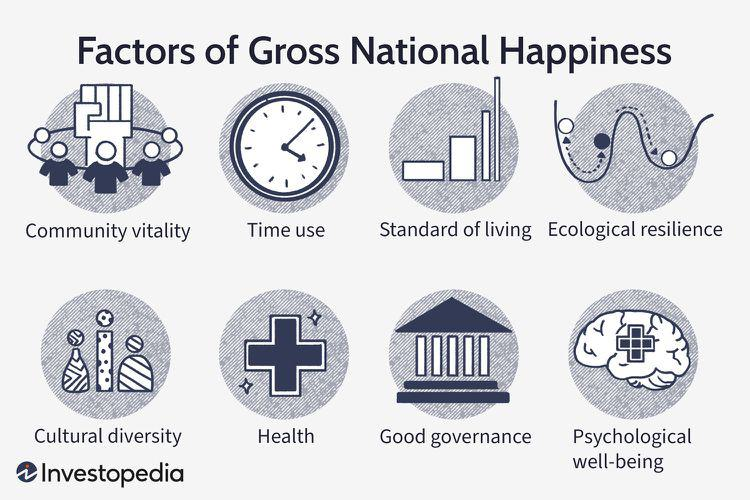

Gross National Happiness (GNH) is a holistic measure of economic and moral progress, contrasting with more traditional economic indicators such as Gross Domestic Product (GDP). Introduced by the Kingdom of Bhutan, GNH is based on the premise that true development occurs when material and spiritual development happen side by side, thereby emphasizing the well-being and happiness of citizens as fundamental to development plans and policies. The importance of GNH lies in its comprehensive approach to national development. It incorporates various dimensions of life, including governance, sustainable development, cultural values, and environmental preservation, providing a broader, morally grounded framework for measuring a nation's progress.

Economic progress traditionally measured through GDP focuses on the production and consumption of goods and services, often neglecting the moral and subjective well-being of individuals. GNH, on the other hand, seeks to align economic objectives with moral-political goals, encouraging policies that balance material growth with ethical considerations. This approach reflects a broader understanding of progress, where the enhancement of individual well-being is prioritized alongside economic development.

The introduction of algorithmic trading, or algo trading, into discussions of national happiness may initially seem incongruous. However, as a growing feature of global financial markets, algo trading is highly relevant in discussions of economic and moral progress. Algorithmic trading involves using advanced algorithms to execute trades at speeds and frequencies that are impossible for human traders. It has the potential to reshape financial markets, offering increased liquidity and market efficiency.

Linking algo trading with GNH concepts revolves around the idea that financial innovations and market practices should not only aim for economic efficiency but should also consider the impacts on societal well-being. This may involve integrating ethical considerations and GNH principles into the design and operation of algorithmic trading systems. The aim should be to ensure that such financial innovations support and enhance the dimensions of happiness and well-being prioritized by GNH, such as equitable economic growth and environmental sustainability.

In summary, the integration of GNH principles into economic and technological systems, like algorithmic trading, represents a move towards more inclusive and ethically-informed economic policies. It provides a framework for evaluating and directing economic activities to support the holistic well-being of populations, ensuring that progress is measured not only by economic output but also through the happiness and quality of life of individuals.

## Table of Contents

## Understanding Gross National Happiness (GNH)

Gross National Happiness (GNH) is a comprehensive, multidimensional measure of economic and moral progress, originated by the Kingdom of Bhutan. First proposed by the Fourth King of Bhutan, King Jigme Singye Wangchuck, in the 1970s, GNH was introduced as an alternative to traditional economic measures like Gross Domestic Product (GDP), emphasizing that the well-being of citizens should be prioritized over purely economic [statistics](/wiki/bayesian-statistics).

While GDP provides a quantitative measure of a country's economic performance, focusing primarily on production and consumption levels, it fails to account for the qualitative aspects of human life. It measures the total value of goods and services produced over a specific time period but does not consider income distribution, environmental impact, or social well-being. In contrast, GNH seeks to evaluate prosperity not by material wealth but by holistic considerations encompassing various aspects of life quality. 

The holistic approach of GNH incorporates nine domains that are crucial in measuring happiness and well-being. These domains include psychological well-being, health, education, time use, cultural diversity and resilience, good governance, community vitality, ecological diversity and resilience, and living standards. Each domain is meant to reflect diverse elements of citizens' lives and contribute collectively to an overall sense of contentment and harmony. The inclusion of these quality-of-life factors signifies a shift from a singular focus on economic growth to a broader pursuit of individual and communal happiness.

The GNH framework allows policymakers to design and implement policies that are aligned with improving the overall quality of life, rather than just economic output. By considering psychological and cultural aspects alongside environmental and social parameters, Bhutan has set a precedent for measuring national success through a more equitable and sustainable lens.

## The Four Pillars of Gross National Happiness

Gross National Happiness (GNH) is a unique developmental philosophy introduced by Bhutan, structured around four fundamental pillars: good governance, sustainable development, cultural preservation, and environmental conservation. These pillars collectively guide Bhutan's public policy formation and implementation, aiming to foster a balanced approach to progress that transcends mere economic gains.

### Good Governance

Good governance is the cornerstone of GNH, emphasizing transparency, accountability, and inclusiveness in decision-making processes. It seeks to ensure that all governmental actions are aligned with the welfare of its citizens. In Bhutan, policies are designed to enhance democratic processes, uphold the rule of law, and ensure effective public service delivery. This fosters trust between the government and citizens and encourages active civic participation, creating a political environment where everyone’s voice contributes to societal well-being.

### Sustainable Development

Sustainable development within the GNH framework prioritizes the well-being of both current and future generations, integrating economic growth with environmental stewardship and social equity. In Bhutan, economic policies are crafted to stimulate growth while minimizing environmental degradation. This holistic approach encourages enterprises to focus not only on profits but also on their social and environmental impact. The government supports sectors like tourism and agriculture, promoting eco-friendly practices and sustainable livelihoods, thereby ensuring long-term economic resilience.

### Cultural Preservation

Preserving the rich cultural heritage and traditions of Bhutan is vital for maintaining the unique identity and continuity of its communities. The GNH approach to cultural preservation involves safeguarding traditional customs, languages, and arts. Bhutanese policies actively promote cultural education and heritage conservation projects. By fostering a sense of pride and identity, cultural preservation contributes to social cohesion and individual well-being, reinforcing the values and communal bonds essential for happiness.

### Environmental Conservation

Recognizing the intrinsic link between environmental health and human well-being, GNH emphasizes environmental conservation as a critical pillar. Bhutan is renowned for its commitment to maintaining ecological balance, with policies that enforce sustainable land use, protect biodiversity, and promote renewable energy. The nation aims to remain carbon neutral and has implemented stringent environmental regulations to protect its natural landscapes. This commitment ensures the sustainability of natural resources, supporting life and livelihoods, and enhancing the quality of life for its citizens.

### Role in Shaping Public Policy

These four pillars of GNH are embedded in Bhutan’s policy-making processes, ensuring that socio-economic development aligns with the happiness and well-being of its citizens. The government assesses policy impacts through the GNH framework, balancing economic goals with social and environmental considerations. By aligning policies with these pillars, Bhutan exemplifies a pursuit of holistic development, where happiness is seen as a fundamental human goal, integrating ethical, environmental, and cultural dimensions into its national development agenda.

## The Role of GNH Index

The Gross National Happiness (GNH) Index is a multidimensional measure aimed at assessing the collective happiness and well-being of a nation's population. Developed and utilized primarily in Bhutan, the GNH Index provides a comprehensive framework that transcends conventional economic metrics, such as Gross Domestic Product (GDP). The innovative nature of the GNH Index lies in its holistic evaluation of well-being, incorporating parameters that reflect the diverse experiences of citizens.

The GNH Index is composed of nine domains that encompass a wide range of life conditions. These domains are: (1) Psychological Well-being, (2) Health, (3) Education, (4) Time Use, (5) Cultural Diversity and Resilience, (6) Good Governance, (7) Community Vitality, (8) Ecological Diversity and Resilience, and (9) Living Standards. Each domain is further divided into specific indicators, which are used to assess individual satisfaction and societal progress in these areas. For example, the 'Time Use' domain evaluates work-life balance, while 'Cultural Diversity and Resilience' measures the strength and preservation of cultural practices and traditions.

In measuring happiness at a national level, the GNH Index employs a survey methodology that captures data across these domains. Participants respond to a series of questions that address both subjective and objective aspects of well-being. The responses are then aggregated to produce a comprehensive happiness score for the nation. The index not only highlights the areas where citizens are thriving but also identifies domains that require policy intervention and improvement.

The implications of GNH Index scores are significant when determining policy outcomes. High scores in certain domains suggest successful governmental policies and practices, while low scores indicate areas that require attention and resource allocation. Policymakers utilize this data to craft targeted initiatives aimed at improving national well-being. For instance, if 'Health' scores are lower than desired, the government may introduce new healthcare programs or campaigns to enhance public health outcomes.

The GNH Index, therefore, functions as both a diagnostic tool and a guiding instrument for public policy. It aligns development objectives with the well-being of citizens, fostering a governance model that prioritizes happiness and quality of life over sheer economic growth. By integrating these scores into decision-making processes, Bhutan sets a precedent for adopting happiness-centric policy frameworks that other countries may emulate in pursuit of sustainable and equitable development.

## GNH vs World Happiness Report

The Gross National Happiness (GNH) and the World Happiness Report (WHR) are influential frameworks used to evaluate happiness and well-being on a national and global scale, respectively. Each employs distinct methodologies with unique implications for policy development. 

GNH, introduced by Bhutan, is a holistic index that transcends conventional economic measures, focusing instead on a comprehensive set of indicators that encompass cultural, social, and environmental factors. It is rooted in four main pillars: good governance, sustainable socio-economic development, cultural preservation, and environmental conservation. These pillars are assessed through various domains such as psychological well-being, health, education, time use, cultural diversity, and resilience, among others. The GNH index measures the collective happiness and well-being of a population by evaluating performance across these domains and identifying areas in need of policy intervention.

In contrast, the World Happiness Report, coordinated by the United Nations Sustainable Development Solutions Network, employs a survey-based approach, primarily relying on self-reported subjective well-being from respondents in various countries. It utilizes key variables known to influence happiness, including GDP per capita, social support, healthy life expectancy, freedom to make life choices, generosity, and perceptions of corruption, to generate an annual happiness score for each participating country. 

While GNH emphasizes broader, culturally tailored indicators reflecting a nation's priorities and values, the WHR uses a more standardized method conducive to international comparisons. The difference in methodologies results in unique applications in policy development. GNH serves as a guiding framework for Bhutan's national policies, promoting a harmonious balance between economic development and holistic well-being. Its application has inspired policy shifts towards sustainability, cultural retention, and social cohesion.

Meanwhile, the WHR's global scope offers countries comparative data and insights into which socio-economic factors correlate with happiness. This encourages countries to explore best practices and strategies observed in higher-ranking nations. Policies inspired by the WHR might focus more on economic and social support systems, health care, and corruption reduction, aiming to optimize happiness through economic and institutional improvements.

In summary, GNH and WHR provide complementary but distinct approaches to understanding happiness and well-being, each informing policy development in diverse ways. While GNH offers a deep, culturally significant model for nations like Bhutan, the WHR provides a comparative tool for countries aiming to improve their citizens' well-being in a globally informed context. These methodologies highlight the multifaceted nature of happiness, encouraging a multidimensional analysis in crafting policies aimed at enhancing quality of life.

## Algo Trading and Happiness

Algorithmic trading, or algo trading, is the use of computer algorithms to manage trading activities in financial markets. This method rapidly processes vast amounts of data, identifies trading opportunities, and executes orders at speeds unattainable by human traders. The adoption of algo trading has been growing globally due to its efficiency and precision, which reduce trading costs and enhance market [liquidity](/wiki/liquidity-risk-premium).

Aligning [algorithmic trading](/wiki/algorithmic-trading) with Gross National Happiness (GNH) objectives is an intriguing concept. GNH, primarily established as an alternative development philosophy, prioritizes well-being over purely economic growth, emphasizing sustainable and equitable socio-economic development. To integrate GNH principles into algo trading, one must consider the broader impact of trading strategies on societal and environmental well-being. For instance, applying GNH might involve creating algorithms that invest not just for financial returns but also in companies that align with social and environmental governance ([ESG](/wiki/esg-investing)) criteria. This could further promote sustainable development, one of the four pillars of GNH.

Ethical implications emerge when considering how algo trading could support or undermine GNH goals. A potential challenge is ensuring that algorithmic decisions do not inadvertently harm certain sectors or communities, leading to increased inequality or environmental degradation. Designing ethical algorithms requires transparency, accountability, and a commitment to positive societal impact. For instance, leveraging [machine learning](/wiki/machine-learning) models to predict market trends should include an evaluation of the social implications of financial decisions.

On the positive side, integrating GNH principles into algo trading may yield significant benefits. Algorithms informed by GNH values could prioritize investments that contribute to long-term societal well-being, such as renewable energy projects or social enterprises. This approach aligns financial activities with ethical standards that enhance community welfare and environmental health, reflecting GNH's holistic vision of progress.

In summary, while the intersection of algorithmic trading and GNH presents challenges, it also offers opportunities for financial systems to contribute positively to global happiness and sustainable development. With careful design and implementation, algorithmic trading can be tailored to support broader socio-economic goals consistent with the vision of Gross National Happiness.

## The Future of GNH and Economic Systems

Gross National Happiness (GNH) offers a transformative paradigm that could significantly influence global economic policies by prioritizing human well-being and ecological sustainability over traditional economic growth metrics. This paradigm shift encourages the formulation of economic policies that prioritize holistic well-being, sustainable development, and equitable resource distribution. 

As the world becomes more interconnected and technologically advanced, there is an evolving opportunity to integrate emerging technologies such as algorithmic trading (algo trading) with GNH principles. Algo trading, which uses computer algorithms to automate trading decisions based on pre-defined criteria, is increasingly prevalent in global financial markets. Its potential to enhance market efficiency and provide liquidity is notable, but aligning it with GNH requires a deliberate recalibration of its objectives to incorporate social and environmental welfare.

The integration of technology with GNH could take multiple forms. For instance, implementing GNH-aligned ethical guidelines within algo trading algorithms could ensure that trades are carried out with social and environmental considerations in mind. These guidelines could be enforced by incorporating parameters that evaluate the long-term societal impacts of trading activities, such as investments in companies with high sustainability ratings or those contributing positively to social well-being.

Furthermore, integrating GNH with economic systems could also see the creation of new financial metrics and indices that better reflect human and ecological health. Such innovation would address the inadequacies of Gross Domestic Product (GDP) as a singular measure of national success. Additionally, leveraging data analytics and machine learning within the GNH framework could provide insights into socio-economic trends, allowing for the proactive formulation of policies aimed at enhancing public welfare.

Technological advancements can also facilitate the real-time assessment and visualization of GNH, offering policymakers dynamic tools to monitor the impacts of their decisions across various domains such as education, health, and the environment. This integrated approach fosters a balanced economic system where economic pursuits are in harmony with the quest for happiness and sustainability.

In summary, the future of GNH in influencing global economic systems is promising and necessitates a commitment to rethink existing economic models. As technology, including algo trading, continues to evolve, its potential to support a GNH-oriented economic approach lies in aligning financial systems with broader objectives of human happiness and environmental health. This would pave the way for a world where economic progress is synonymous with prosperity, equity, and sustainability.

## Conclusion

Gross National Happiness (GNH) holds significant value in contemporary society as it challenges traditional economic measurements. Moving beyond Gross Domestic Product (GDP), GNH embraces a more comprehensive understanding of progress by integrating quality-of-life factors into socioeconomic assessments. This approach recognizes that economic success alone does not equate to a fulfilled or content population. 

As economies globally strive for balance between wealth and wellbeing, GNH offers a paradigm that emphasizes good governance, cultural preservation, sustainable development, and environmental conservation. This framework provides a holistic view that reflects the complex interplay of various dimensions of human experience, underscoring the belief that true progress is multidimensional.

The convergence of happiness, economics, and technology marks a critical juncture. Algorithmic trading, as a representation of technological advancement in the economic sphere, exemplifies how technology can be both a tool for efficiency and a subject of ethical scrutiny. Integrating GNH principles with such technological practices encourages the development of systems that not only drive economic efficiency but also sustain and enhance human well-being.

Ultimately, embracing GNH as a foundational element in future economic systems encourages a shift towards policies that value human contentment alongside growth. This perspective advocates for a future where economic strategies foster an environment conducive to happiness, promoting a more equitable and compassionate global society. By prioritizing GNH, nations can strive towards development that truly serves the well-being of their populations, setting a benchmark for holistic and sustainable progress.

## References & Further Reading

[1]: Ura, K., Alkire, S., Zangmo, T., & Wangdi, K. (2012). ["A Short Guide to Gross National Happiness Index."](https://ophi.org.uk/publications/Extensive-GNH-2012) Oxford Poverty and Human Development Initiative.

[2]: Centre for Bhutan Studies. (2016). ["A Proposal for GNH Value Education Framework."](https://www.researchgate.net/publication/365687214_Gross_national_happiness_and_challenges_for_education_in_Bhutan_Perspectives_of_policy_experts) 

[3]: Diener, E., Inglehart, R., & Tay, L. (2013). ["Theory and Validity of Life Satisfaction Scales."](https://psycnet.apa.org/record/2013-19475-001) Social Indicators Research, 112(3), 497–527.

[4]: Petty, R. E., Brinol, P., & Tormala, Z. L. (2002). ["Thought confidence as a determinant of persuasion: The self-validation hypothesis."](https://psycnet.apa.org/record/2002-12575-003) Journal of Personality and Social Psychology.

[5]: Foster, J. E., & Sen, A. (1997). ["On Economic Inequality."](https://academic.oup.com/book/4134) Oxford University Press.