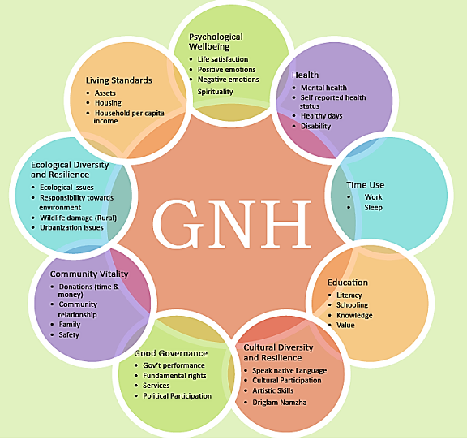

## Table of Contents

## What is the Gross National Happiness Index?

The Gross National Happiness Index is a way to measure how happy and well-off people are in a country. It was first used in Bhutan, a small country in the Himalayas. Instead of just looking at money, like with Gross Domestic Product (GDP), the Gross National Happiness Index looks at many different parts of life. These parts include things like health, education, living standards, and how connected people feel to their community and culture.

The idea behind the Gross National Happiness Index is that true progress should make people happier and more fulfilled, not just richer. Bhutan uses this index to help make decisions about what the government should do. For example, they might focus on building more schools or hospitals if those things make people happier. Other countries have started to look at this idea too, because they see that happiness and well-being are important for a good life.

## Who developed the Gross National Happiness Index and why?

The Gross National Happiness Index was developed by the country of Bhutan. It was started by the fourth King of Bhutan, Jigme Singye Wangchuck, in the early 1970s. He wanted a different way to measure how well his country was doing, one that looked at more than just money. He believed that the happiness and well-being of his people were more important than how rich the country was.

King Jigme Singye Wangchuck introduced the idea because he thought that focusing only on economic growth, like many other countries did, was not enough. He wanted to make sure that policies in Bhutan helped people live happier and more fulfilling lives. The Gross National Happiness Index was created to guide the government in making decisions that would improve the quality of life for everyone in Bhutan, not just increase the country's wealth.

## What are the Four Pillars of Gross National Happiness?

The Four Pillars of Gross National Happiness are the main areas that Bhutan looks at to see how happy and well-off its people are. These pillars are: good government, a strong culture, protecting the environment, and making sure everyone can grow and be healthy. Each pillar is important because it helps make life better for the people of Bhutan.

Good government means that the leaders make fair rules and help everyone in the country. A strong culture means people keep their traditions and feel proud of who they are. Protecting the environment is about taking care of nature so that it stays beautiful and healthy. Making sure everyone can grow and be healthy means giving people good education, healthcare, and chances to do well in life. These four pillars work together to make Bhutan a happy place for its people.

## How is the Gross National Happiness Index measured?

The Gross National Happiness Index is measured by looking at many different parts of life in Bhutan. People fill out surveys that ask questions about their health, how much they earn, how safe they feel, and if they have enough time for friends and family. These surveys help find out how happy people are in different areas of their life. The answers are put into nine different groups, like health, education, and how connected people feel to their community. Each group is given a score, and all the scores together make up the Gross National Happiness Index.

The government of Bhutan uses these scores to see which areas need more help. If the scores show that people are not happy with their health, the government might spend more money on hospitals. Or if the scores show that people feel their culture is not strong, the government might start programs to help keep traditions alive. By measuring happiness this way, Bhutan can make choices that make life better for everyone.

## Can you explain the significance of each of the Four Pillars?

The first pillar, good government, is important because it makes sure that the leaders in Bhutan make fair rules and help everyone in the country. When the government works well, people feel safe and trust their leaders. This helps everyone feel happier and more secure. The second pillar, a strong culture, is about keeping traditions alive and making sure people feel proud of who they are. When people feel connected to their culture, they are more likely to feel happy and fulfilled in their lives.

The third pillar, protecting the environment, is crucial because it helps keep nature beautiful and healthy. Bhutan believes that a clean and green environment makes people happier. By taking care of the forests, rivers, and mountains, the country ensures that future generations can also enjoy a good quality of life. The fourth pillar, making sure everyone can grow and be healthy, focuses on giving people good education, healthcare, and chances to do well in life. When people are healthy and have opportunities to learn and grow, they can live happier and more fulfilling lives. Together, these four pillars help Bhutan measure and improve the happiness of its people.

## How does the Gross National Happiness Index differ from traditional economic indicators like GDP?

The Gross National Happiness Index is different from traditional economic indicators like GDP because it looks at more than just money. GDP measures how much a country produces and how rich it is. It only focuses on the economy and does not care about other parts of life. The Gross National Happiness Index, on the other hand, looks at many different things that make people happy and well-off. It includes things like health, education, and how connected people feel to their community and culture. So, while GDP might say a country is doing well because it is making a lot of money, the Gross National Happiness Index might say the country needs to do more to make people happier.

This difference is important because it shows that money is not the only thing that matters for a good life. The Gross National Happiness Index helps countries like Bhutan make decisions that improve the quality of life for everyone, not just the economy. For example, if the Index shows that people are not happy with their health, the government might spend more money on hospitals. Or if people feel their culture is not strong, the government might start programs to help keep traditions alive. By looking at happiness and well-being in many different ways, the Gross National Happiness Index gives a fuller picture of how well a country is doing.

## What are some countries that have adopted or are influenced by the Gross National Happiness model?

Some countries have been influenced by Bhutan's Gross National Happiness model. One country is the United Arab Emirates. They started a program called the National Program for Happiness and Wellbeing in 2016. This program looks at how happy people are and tries to make life better for everyone. Another country is New Zealand. They have a "Wellbeing Budget" that focuses on making people healthier and happier, not just richer. They look at things like mental health and the environment to see how well the country is doing.

Other countries are also paying attention to the Gross National Happiness model. For example, the United Kingdom has a program called the Office for National Statistics' Measuring National Well-being Programme. This program asks people about their happiness and life satisfaction to see how well the country is doing. In Canada, some cities like Victoria have started to use happiness and well-being as a way to measure how well they are doing. These countries see that happiness and well-being are important for a good life, just like Bhutan does.

## How has the implementation of the Gross National Happiness Index affected policy-making in Bhutan?

The Gross National Happiness Index has changed how Bhutan makes its rules and plans. Before, the government might have focused a lot on making more money. Now, they look at many different things that make people happy. If the Index shows that people are not happy with their health, the government might spend more money on hospitals. Or if people feel their culture is not strong, the government might start programs to help keep traditions alive. This way, the government makes choices that help everyone in Bhutan live happier and better lives.

The Index has also made Bhutan think about the environment a lot. They know that a clean and green environment makes people happier. So, they have rules to protect nature, like keeping a lot of the country covered in forests. This helps make sure that future generations can also enjoy a good quality of life. By using the Gross National Happiness Index, Bhutan makes sure that their policies help people be healthy, learn, and feel connected to their community and culture.

## What are the criticisms or limitations of the Gross National Happiness Index?

Some people think the Gross National Happiness Index is hard to use because it looks at many different things. It is not as simple as just counting money like with GDP. This can make it hard for other countries to understand and use it. Also, the Index depends a lot on what people say in surveys. If people do not answer the surveys honestly, the results might not be right. This can make it hard to trust the Index and use it to make good decisions.

Another problem is that the Gross National Happiness Index might not work the same way in different countries. What makes people happy in Bhutan might be different from what makes people happy in other places. So, it might not be easy for other countries to use the same way. Also, some people worry that focusing too much on happiness might make the government forget about important things like jobs and money. They think that a country needs to be rich to be happy, and the Index might not look at this enough.

## How can the Gross National Happiness Index be integrated into global sustainability goals?

The Gross National Happiness Index can be a good tool to help reach global sustainability goals. It looks at many different things like health, education, and the environment, which are all important for sustainability. By using the Index, countries can see how well they are doing in these areas and make plans to improve. For example, if the Index shows that people are not happy with the environment, countries might make rules to protect nature better. This can help meet goals like keeping the planet clean and healthy for everyone.

Also, the Gross National Happiness Index can help countries focus on making life better for everyone, not just richer. This is important for sustainability because it means thinking about the future and making sure everyone has what they need. By looking at happiness and well-being, countries can work on things like giving everyone good healthcare and education. This can help meet global goals like ending poverty and making sure everyone can live a good life.

## What research methods are used to assess the components of the Gross National Happiness Index?

To assess the components of the Gross National Happiness Index, researchers in Bhutan use surveys. They ask people questions about different parts of their lives, like how healthy they are, how much money they make, and if they feel safe. These questions help measure things like health, education, and how connected people feel to their community. The answers are then put into nine different groups, and each group gets a score. All the scores together make up the Gross National Happiness Index. This way, the researchers can see which areas are doing well and which ones need more help.

The surveys are important because they let people say how they feel about their lives. But it is hard to make sure everyone answers honestly. Sometimes, people might not tell the truth, which can make the results less accurate. Also, the questions need to be clear and easy to understand so that everyone can answer them the same way. Researchers work hard to make the surveys as good as possible so that the Gross National Happiness Index can give a true picture of how happy and well-off people are in Bhutan.

## How can other countries adapt the Gross National Happiness model to their specific cultural and economic contexts?

Other countries can adapt the Gross National Happiness model by changing it to fit their own culture and economy. Each country is different, so what makes people happy in one place might not be the same in another. For example, a country might focus more on jobs and money if that is what people care about most. They could use surveys to ask people what makes them happy and then make rules based on those answers. This way, the Gross National Happiness model can help countries make life better for everyone, not just richer.

It is important for countries to think about their own values and needs when using the Gross National Happiness model. They might need to change some of the questions in the surveys to match what is important to their people. For example, if a country values family time a lot, they could ask more questions about that. By doing this, countries can use the model to improve things like health, education, and the environment in a way that makes sense for them. This can help everyone live happier and more fulfilling lives.

## References & Further Reading

[1]: Ura, K., Alkire, S., Zangmo, T., & Wangdi, K. (2012). ["A Short Guide to Gross National Happiness Index."](https://ophi.org.uk/publications/Extensive-GNH-2012) Oxford Poverty and Human Development Initiative.

[2]: Centre for Bhutan Studies. (2016). ["A Proposal for GNH Value Education Framework."](https://www.researchgate.net/publication/365687214_Gross_national_happiness_and_challenges_for_education_in_Bhutan_Perspectives_of_policy_experts) 

[3]: Diener, E., Inglehart, R., & Tay, L. (2013). ["Theory and Validity of Life Satisfaction Scales."](https://psycnet.apa.org/record/2013-19475-001) Social Indicators Research, 112(3), 497–527.

[4]: Petty, R. E., Brinol, P., & Tormala, Z. L. (2002). ["Thought confidence as a determinant of persuasion: The self-validation hypothesis."](https://psycnet.apa.org/record/2002-12575-003) Journal of Personality and Social Psychology.

[5]: Foster, J. E., & Sen, A. (1997). ["On Economic Inequality."](https://academic.oup.com/book/4134) Oxford University Press.