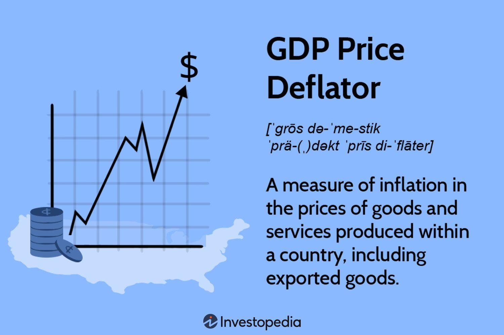

## Table of Contents

## What is the Gross National Product (GNP) Deflator?

The Gross National Product (GNP) Deflator is a measure that helps us understand how prices change over time for all the goods and services produced by a country's residents. It's like a special tool that shows us if the economy is getting more expensive or if prices are staying the same. We calculate the GNP Deflator by comparing the current prices of goods and services to the prices of those same goods and services in a base year. If the GNP Deflator goes up, it means prices have gone up and there's inflation. If it stays the same or goes down, it means prices are stable or falling.

The GNP Deflator is important because it gives us a broad picture of inflation across the whole economy. Unlike other measures like the Consumer Price Index (CPI), which only looks at a basket of goods and services that consumers buy, the GNP Deflator covers everything produced, including things businesses buy. This makes it a more complete measure of inflation. Economists and policymakers use the GNP Deflator to make decisions about economic policy, like setting interest rates or planning budgets, because it helps them understand how the value of money is changing over time.

## How is the GNP Deflator calculated?

The GNP Deflator is calculated by comparing the value of all goods and services produced by a country's residents in a given year to the value of those same goods and services in a base year. To do this, you first need to find the nominal GNP, which is the total value of all goods and services at current prices. Then, you find the real GNP, which is the total value of those goods and services at the prices from the base year. The GNP Deflator is then calculated by dividing the nominal GNP by the real GNP and multiplying the result by 100 to get a percentage.

For example, if the nominal GNP in the current year is $1,000 billion and the real GNP (using base year prices) is $800 billion, the GNP Deflator would be calculated as follows: ($1,000 billion / $800 billion) * 100 = 125. This means that the overall price level has increased by 25% since the base year. The GNP Deflator helps us see how much inflation has affected the economy by showing the difference between current prices and base year prices for everything produced by the country's residents.

## What is the difference between GNP Deflator and GDP Deflator?

The GNP Deflator and the GDP Deflator are both tools that help us understand how prices are changing in an economy, but they measure slightly different things. The GNP Deflator looks at all the goods and services produced by a country's residents, no matter where in the world they are. This means it includes the value of what people from that country produce even if they are working or living in another country. On the other hand, the GDP Deflator focuses on all the goods and services produced within a country's borders, regardless of who produced them. So, if a foreign company makes something in the country, it's included in the GDP Deflator but not in the GNP Deflator.

Both deflators are calculated in a similar way. You take the nominal value, which is the total value at current prices, and divide it by the real value, which is the total value at base year prices, then multiply by 100. The difference in what they measure means that the GNP Deflator can give a different picture of inflation compared to the GDP Deflator. For example, if a lot of a country's residents work abroad and send money back home, the GNP Deflator might show higher inflation than the GDP Deflator because it includes the value of what those residents produce abroad. Economists use these deflators to understand different aspects of the economy and make better decisions about policy.

## Why is the GNP Deflator important for economic analysis?

The GNP Deflator is important for economic analysis because it helps us see how prices are changing for everything that a country's residents produce. It's like a special tool that shows us if things are getting more expensive over time. By comparing the current prices of goods and services to the prices from a base year, the GNP Deflator tells us if there's inflation, which means prices are going up, or if prices are staying the same or even going down. This information is crucial for economists and policymakers because it helps them understand how the value of money is changing and how that affects the economy.

The GNP Deflator also gives us a broad view of the economy because it includes everything produced by a country's residents, no matter where they are in the world. This makes it different from the GDP Deflator, which only looks at what's produced inside the country's borders. By using the GNP Deflator, economists can get a better picture of how well a country's residents are doing economically, even if they work abroad. This can help in making decisions about things like interest rates, taxes, and government spending, as it provides a more complete understanding of inflation and economic health.

## How does the GNP Deflator relate to inflation?

The GNP Deflator helps us see if prices are going up, which is called inflation. It does this by comparing the price of everything made by a country's people now to what it cost in a base year. If the GNP Deflator number goes up, it means prices are higher now than they were in the base year, so there's inflation. If the number stays the same or goes down, it means prices are not changing much or are even getting cheaper.

Understanding inflation is important because it affects how much things cost and how much money people can buy with their earnings. When the GNP Deflator shows inflation, it tells us that the money we have today buys less than it did before. This can change how people spend, save, and invest. Economists and people who make rules for the country use the GNP Deflator to make good choices about things like interest rates and how much money the government should spend, to keep the economy healthy.

## Can you explain the formula used to compute the GNP Deflator?

The GNP Deflator is a way to see how prices are changing for everything made by a country's people. To find it, you need to know two things: the nominal GNP and the real GNP. The nominal GNP is the total value of all the goods and services made at today's prices. The real GNP is the total value of those same goods and services, but using the prices from a base year. The formula to calculate the GNP Deflator is simple: you take the nominal GNP, divide it by the real GNP, and then multiply by 100 to turn it into a percentage.

For example, if the nominal GNP this year is $1,000 billion and the real GNP (using base year prices) is $800 billion, you would do this: ($1,000 billion / $800 billion) * 100 = 125. This means the GNP Deflator is 125, which tells us that prices have gone up by 25% since the base year. The GNP Deflator helps us understand if the economy is experiencing inflation, which means prices are going up, or if prices are staying the same or even going down.

## What are the limitations of using the GNP Deflator as an economic indicator?

The GNP Deflator has some limitations when used as an economic indicator. One big issue is that it can be hard to compare prices over time because the things people buy change. For example, new products like smartphones or services like streaming movies weren't around in the base year, so it's tricky to include them in the calculation. This can make the GNP Deflator less accurate because it doesn't always show the true changes in prices.

Another problem is that the GNP Deflator looks at everything produced by a country's people, no matter where they are. This can be confusing if a lot of people work in other countries. For example, if many people from a country work abroad and send money back home, the GNP Deflator might show higher inflation than what people in the country are actually experiencing. This makes it harder for policymakers to use the GNP Deflator to make good decisions about things like interest rates or government spending.

## How does the GNP Deflator adjust for changes in price levels over time?

The GNP Deflator helps us see how prices are changing by comparing the total value of everything made by a country's people at today's prices to the value of those same things at prices from a base year. If the GNP Deflator number goes up, it means prices are higher now than they were in the base year, so there's inflation. If it stays the same or goes down, it means prices aren't changing much or are even getting cheaper. This helps economists and people who make rules for the country understand if the money we have today buys less than it did before.

But, the GNP Deflator has some problems when trying to show how prices change over time. For one thing, it's hard to compare prices because the things people buy change. New products like smartphones or services like streaming movies weren't around in the base year, so it's tricky to include them in the calculation. Also, the GNP Deflator looks at everything produced by a country's people, no matter where they are. This can be confusing if a lot of people work in other countries because it might show higher inflation than what people in the country are actually experiencing.

## What role does the GNP Deflator play in real GNP calculations?

The GNP Deflator helps us figure out the real GNP, which is how much everything a country's people make is worth when we take away the effects of price changes. To do this, we start with the nominal GNP, which is the total value of everything made at today's prices. Then, we use the GNP Deflator to adjust this number to see what it would be worth if we used the prices from a base year. The GNP Deflator is like a special tool that shows us how much prices have changed since the base year. If the GNP Deflator goes up, it means prices are higher now, so we need to make the nominal GNP smaller to find the real GNP.

This adjustment is important because it lets us see if the country's people are making more or less stuff, without the confusion of price changes. For example, if the GNP Deflator shows that prices have gone up by 25% since the base year, we would divide the nominal GNP by 1.25 to find the real GNP. This way, we can compare how much is being produced from one year to another more accurately. By using the GNP Deflator, economists and policymakers can understand the true growth of the economy, which helps them make better decisions about things like interest rates and government spending.

## How can changes in the GNP Deflator affect economic policy decisions?

Changes in the GNP Deflator can really affect how people who make rules for the country, like economists and policymakers, decide what to do. The GNP Deflator helps them see if prices are going up, which is called inflation. If the GNP Deflator number goes up a lot, it tells them that things are getting more expensive. This might make them decide to raise interest rates, which is like making it more expensive to borrow money. They do this to try to slow down spending and keep prices from going up too fast.

On the other hand, if the GNP Deflator shows that prices aren't changing much or are even going down, it means there's no big inflation problem. In this case, policymakers might decide to keep interest rates low or even lower them. This makes it cheaper for people and businesses to borrow money, which can help them spend more and grow the economy. So, by watching the GNP Deflator, people who make rules can choose the best actions to keep the economy healthy and balanced.

## What are some real-world examples of how the GNP Deflator has been used in economic reports?

Economists and policymakers often use the GNP Deflator to understand how prices are changing in the economy. For example, in the United States, the Bureau of Economic Analysis (BEA) regularly publishes reports that include the GNP Deflator. They use it to adjust the nominal GNP to find the real GNP, which helps them see if the economy is actually growing or if the growth is just because of higher prices. In one report, the BEA might show that the GNP Deflator increased by 2% over the last year, indicating that there's been a bit of inflation. This information helps the Federal Reserve decide if they need to change interest rates to control inflation.

Another real-world example comes from international reports. The World Bank and the International Monetary Fund (IMF) use the GNP Deflator when they compare the economic performance of different countries. They might find that one country's GNP Deflator has gone up a lot, showing high inflation, while another country's GNP Deflator has stayed the same, indicating stable prices. This helps these organizations give advice to countries on how to manage their economies. For instance, if a country's GNP Deflator is rising quickly, the World Bank might suggest tightening monetary policy to keep inflation in check.

## How do economists interpret fluctuations in the GNP Deflator over different economic cycles?

Economists use the GNP Deflator to understand how prices are changing over time, especially during different economic cycles like booms and recessions. When the economy is doing well and growing, the GNP Deflator might go up because more people are buying things, and this can push prices higher. This is called inflation. If the GNP Deflator rises quickly during a boom, economists might worry that inflation is getting out of control. They might suggest that the government should raise interest rates to make borrowing money more expensive, which can slow down spending and help keep prices from rising too fast.

During a recession, when the economy is not doing so well, the GNP Deflator might not change much or might even go down. This can happen because fewer people are buying things, so businesses might lower their prices to sell more. If the GNP Deflator stays the same or goes down, economists might say there's no big inflation problem. They might suggest that the government should keep interest rates low or even lower them to make borrowing money cheaper. This can help people and businesses spend more, which can help the economy start growing again. By watching how the GNP Deflator changes over different economic cycles, economists can give good advice on what the government should do to keep the economy healthy.

## What is Gross National Product (GNP) and the GNP Deflator?

Gross National Product (GNP) is a metric that measures the monetary value of all the goods and services produced by the residents of a country, regardless of their geographic location. It incorporates the economic output generated by a nation’s citizens and businesses, distinguishing it from Gross Domestic Product (GDP), which focuses on production within a country’s borders. This distinction underscores the significance of considering national interests that might extend beyond physical boundaries.

An essential tool associated with GNP is the GNP deflator, which is used to account for inflation. This index reflects how much of the change in GNP from one period to the next is attributable to changes in the price level, rather than changes in actual output. The GNP deflator is computed using the following formula:

$$
\text{GNP Deflator} = \left( \frac{\text{Nominal GNP}}{\text{Real GNP}} \right) \times 100
$$

This formula provides insights by adjusting nominal GNP, which is evaluated at current market prices, to real GNP, expressed in terms of a base year's prices. Through these adjustments, the GNP deflator facilitates the assessment of economic growth devoid of inflationary effects. 

For example, if a country's nominal GNP rises from $1 trillion to $1.1 trillion over a year, but the GNP deflator reveals that inflation accounts for a 5% increase, the real GNP increase (adjusted for inflation) is only 5%, suggesting that half of the increase was due to inflation. This insight into inflation helps economists and policymakers discern the genuine growth in economic productivity.

In relation to other inflation metrics such as the Consumer Price Index (CPI), the GNP deflator offers a broader measure of inflation. While the CPI focuses on the average change over time in prices paid by urban consumers for a basket of goods and services, the GNP deflator encompasses a wider range of goods and services, including those that are part of investment, government purchases, and exports. Consequently, the GNP deflator can sometimes present a different picture of inflation compared to CPI, as it isn't limited to just consumer goods.

As such, the GNP deflator plays a crucial role in economic analysis and policy formulation by offering a comprehensive view of overall price movements in the economy. This, in turn, helps in understanding the real value generated by the country, providing invaluable insights for economic health assessments.

## References & Further Reading

[1]: Taylor, J. B., & Uhlig, H. (Eds.). (1995). ["Monetary Policy and Inflation: Are Trade-Offs Real?"](https://shop.elsevier.com/books/handbook-of-macroeconomics/taylor/978-0-444-59466-2) American Economic Review.

[2]: ["Measuring the Economy: A Primer on GDP and the National Income and Product Accounts"](https://www.bea.gov/sites/default/files/methodologies/nipa_primer.pdf) by the Bureau of Economic Analysis, U.S. Department of Commerce

[3]: ["The Signal and the Noise: Why So Many Predictions Fail – But Some Don't"](https://en.wikipedia.org/wiki/The_Signal_and_the_Noise) by Nate Silver

[4]: ["Algorithmic Trading and DMA: An Introduction to Direct Access Trading Strategies"](https://www.amazon.com/Algorithmic-Trading-DMA-introduction-strategies/dp/0956399207) by Barry Johnson

[5]: ["Economic Indicators: What They Are and How to Use Them"](https://www.strike.money/fundamental-analysis/economic-indicators) by the Federal Reserve Bank of St. Louis