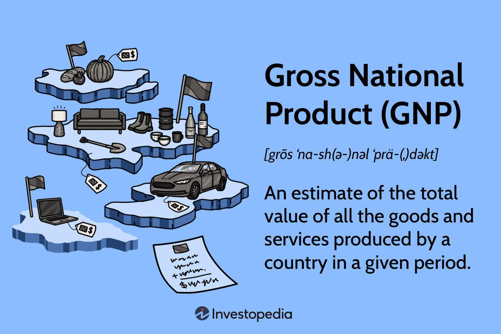

## Table of Contents

## What is Gross National Product (GNP)?

Gross National Product (GNP) is the total value of all goods and services produced by a country's residents and businesses, no matter where they are located in the world. This means that if a company from the United States has a factory in another country, the value of the goods produced in that factory would be included in the U.S. GNP. GNP is different from Gross Domestic Product (GDP), which only counts the value of goods and services produced within a country's borders.

GNP is an important measure because it shows the economic output of a country's citizens and businesses, giving a picture of the nation's economic health. It helps economists and policymakers understand how well the country is doing economically and can influence decisions about taxes, spending, and other economic policies. By looking at changes in GNP over time, people can see if the economy is growing or shrinking.

## How is GNP different from Gross Domestic Product (GDP)?

Gross National Product (GNP) and Gross Domestic Product (GDP) are two ways to measure the size of a country's economy, but they look at different things. GNP measures the total value of all goods and services produced by a country's residents and businesses, no matter where in the world they are located. This means if a company from the United States makes products in another country, those products are counted in the U.S. GNP.

On the other hand, GDP only measures the total value of goods and services produced within a country's borders. So, if a foreign company has a factory in the United States, the value of the goods produced there would be included in the U.S. GDP, but not in the GDP of the foreign company's home country. Essentially, GNP focuses on the nationality of the producers, while GDP focuses on the location of production.

## What are the components of GNP?

GNP is made up of several parts that together show how much a country's people and businesses produce. The main parts are personal consumption, which is what people spend on things like food and clothes; business investment, which includes money spent on building factories or buying machines; government spending, which covers things like building roads and paying for schools; and net exports, which is the difference between what a country sells to other countries and what it buys from them.

Another important part of GNP is net income from abroad. This is the money that people and businesses from the country earn in other countries, minus what foreign people and businesses earn in the country. If a company from the United States makes money in another country, that money is added to the U.S. GNP. But if a foreign company makes money in the United States, that money is subtracted from the U.S. GNP. Together, all these parts give a full picture of a country's economic activity.

## Can you provide a simple example of how GNP is calculated?

Imagine a small country called Sunnyland. In one year, the people of Sunnyland spend $100 on food and clothes, businesses invest $50 in new factories, and the government spends $30 on building schools. Sunnyland also sells $20 worth of goods to other countries but buys $10 worth of goods from them. So far, the total value of what Sunnyland produces is $100 (personal consumption) + $50 (business investment) + $30 (government spending) + $10 (net exports, which is $20 in exports minus $10 in imports) = $190.

Now, let's add the net income from abroad. Sunnyland has a company that made $15 in another country, but a foreign company made $5 in Sunnyland. So, the net income from abroad is $15 - $5 = $10. When we add this to the total value of what Sunnyland produces, we get the GNP. So, Sunnyland's GNP for the year is $190 + $10 = $200. This number shows the total economic output of Sunnyland's people and businesses, no matter where they are working.

## How does GNP reflect the economic performance of a country?

GNP shows how well a country's people and businesses are doing by adding up everything they make and earn, no matter where they are. If the GNP goes up from one year to the next, it means the country is producing more and [earning](/wiki/earning-announcement) more money. This usually means the economy is growing and people are doing better. On the other hand, if the GNP goes down, it might mean the economy is shrinking and people are not doing as well.

GNP is important because it helps people see the big picture of a country's economy. It tells us about the money people spend on things they need, like food and clothes, and the money businesses spend on building new factories. It also includes what the government spends on things like schools and roads. By looking at GNP, leaders can make better decisions about taxes, spending, and other ways to help the economy grow.

## What are the limitations of using GNP as an economic indicator?

GNP is a useful way to see how much a country's people and businesses are making and earning. But it has some problems that make it less perfect as a way to measure how well a country is doing. One big problem is that GNP doesn't show how fair the money is shared among people. A country can have a high GNP, but if most of the money goes to just a few rich people, many others might still be poor. GNP also doesn't tell us if people are happy or if they have good lives. It's just about money, not about things like health or happiness.

Another problem with GNP is that it doesn't count things that are not bought and sold, like the work people do at home or the time they spend helping their community. If more people start working at home instead of at paid jobs, the GNP might go down even if everyone is still working hard. GNP also doesn't think about the harm to the environment. If a country makes a lot of money by cutting down forests or polluting rivers, the GNP might go up, but the country might be worse off in the long run because of the damage to nature.

## How is GNP used in international comparisons?

GNP is used to compare how well different countries are doing economically. By looking at the GNP of different countries, people can see which countries are making and earning more money. This helps to understand which countries have bigger and stronger economies. For example, if Country A has a higher GNP than Country B, it means that the people and businesses from Country A are producing more overall, no matter where they are working.

However, using GNP for international comparisons has its challenges. One big problem is that the cost of living can be very different in different countries. A dollar might buy a lot more in one country than in another. So, just looking at GNP numbers might not give a fair picture of how well people are really doing. To fix this, economists often use something called "purchasing power parity" to adjust GNP numbers so they can be compared more fairly. This way, they can get a better idea of the real economic differences between countries.

## What role does GNP per capita play in assessing living standards?

GNP per capita is a way to measure how much money each person in a country makes on average. It is calculated by taking the total GNP of a country and dividing it by the number of people living there. This number helps us understand if people in a country are generally rich or poor. If a country has a high GNP per capita, it means that, on average, people in that country have more money to spend on things they need and want, like food, clothes, and education.

However, GNP per capita is not perfect for measuring living standards. It does not show how money is shared among people. A country might have a high GNP per capita, but if most of the money goes to just a few rich people, many others might still be poor. Also, GNP per capita does not tell us about other important things like health, happiness, or the environment. So, while it can give us a general idea of how well people are doing, we need to look at other things too to really understand living standards.

## How have methods of calculating GNP evolved over time?

The way we calculate GNP has changed a lot over time. In the beginning, people used simple ways to add up everything a country made and earned. They looked at things like how much people spent on food and clothes, how much businesses spent on building factories, and how much the government spent on things like schools and roads. But as the world got more connected and businesses started working in different countries, it became harder to keep track of everything. So, economists started using better ways to count things like the money people and businesses made in other countries.

Over the years, new ways of calculating GNP have been made to make it more accurate. One big change was the use of computers and better data systems. These helped economists gather and analyze information faster and more correctly. Another change was the use of something called "purchasing power parity," which helps compare GNP numbers between countries more fairly by thinking about the different costs of living. These changes have made GNP a better tool for understanding how well a country's economy is doing, but it still has some problems and is always being improved.

## Can you discuss a real-world scenario where GNP significantly impacted policy decisions?

In the 1980s, Ireland used GNP to make important policy decisions. At that time, Ireland was part of the European Union, but its economy was not doing well. The government looked at the GNP numbers and saw that a lot of Irish companies were making money in other countries, but this money was not helping the people in Ireland. So, they decided to focus on bringing that money back home. They made new rules and gave money to businesses to invest in Ireland instead of other places. This helped the GNP go up and made life better for people in Ireland.

These changes in policy led to what people call the "Celtic Tiger" years, when Ireland's economy grew a lot. By focusing on GNP, the government could see that the money made by Irish companies abroad was not helping the country as much as it could. So, they made policies to bring that money back and invest it in Ireland. This made the GNP grow even more and helped Ireland become one of the fastest-growing economies in Europe. It shows how looking at GNP can help leaders make smart decisions to make their country's economy stronger.

## What are the criticisms of GNP as a measure of economic welfare?

GNP is often used to see how well a country's economy is doing, but it has some big problems when we try to use it to measure how happy and well-off people are. One big problem is that GNP doesn't show how money is shared among people. A country might have a high GNP, but if most of the money goes to just a few rich people, many others might still be poor. Also, GNP doesn't count things that people do for free, like taking care of their family or helping in their community. If more people start doing these things instead of working for money, the GNP might go down even if everyone is still working hard.

Another problem with GNP is that it doesn't think about the environment. If a country makes a lot of money by cutting down forests or polluting rivers, the GNP might go up, but the country might be worse off in the long run because of the damage to nature. GNP also doesn't tell us about important things like health or happiness. It's just about money, not about the quality of life. So, while GNP can give us a general idea of how much a country is making and earning, it doesn't really show how well people are doing in other important ways.

## How does GNP relate to other economic indicators like net national product and national income?

GNP is closely related to other economic indicators like net national product (NNP) and national income. NNP is what you get when you take GNP and subtract the cost of things like factories and machines wearing out over time. This is called depreciation. So, NNP is a bit like GNP but it tries to show the real increase in what a country has, after fixing the wear and tear on its stuff. National income is even closer to NNP because it is what's left after you take away indirect business taxes and add in things like subsidies. So, national income is kind of like the money that people and businesses in a country really have to spend or save.

These three indicators - GNP, NNP, and national income - all help us understand different parts of a country's economy. GNP tells us about the total value of what a country's people and businesses make and earn, no matter where they are. NNP gives us a clearer picture by taking away the cost of things wearing out. And national income shows us how much money is really available for people and businesses to use. By looking at these indicators together, economists and leaders can get a better idea of how well a country's economy is doing and make smarter decisions.

## What is GNP and how can it be understood?

Gross National Product (GNP) is a fundamental economic metric that quantifies the total value of goods and services generated by a nation's residents, regardless of where the production occurs. This measure provides a comprehensive outlook on the economic activity and health relating to a country's nationals rather than its geographical territory. 

### Components of GNP

GNP can be broken down into several key components:

1. **Personal Consumption**: This component accounts for the total value of all goods and services consumed by individuals and households. It includes expenditures on durable goods, nondurable goods, and services.

2. **Private Domestic Investment**: This includes expenditures on capital goods that will be used for future production. It encompasses business investments in equipment and structures, residential building construction, and changes in business inventories.

3. **Government Expenditures**: Government spending on goods and services that are included in GNP. This covers defense, education, public safety, and infrastructure, excluding transfer payments like pensions and unemployment benefits.

4. **Net Exports**: Calculated as the difference between what a country exports and what it imports. A positive net export indicates a trade surplus, while a negative value shows a trade deficit.

Mathematically, GNP can be represented as:

$$
\text{GNP} = C + I + G + (X - M) + NR
$$

Where:
- $C$ is Personal Consumption,
- $I$ is Private Domestic Investment,
- $G$ is Government Expenditures,
- $X$ is Exports,
- $M$ is Imports,
- $NR$ is Net Income Receipts from Abroad (such as income from foreign investments).

### Distinction Between GNP and GDP

While GNP emphasizes the production attributed to a country's citizens, Gross Domestic Product (GDP) concentrates on economic output within the borders of a country, regardless of ownership. The key distinction lies in their geographical focus and ownership criteria:

- **GNP vs. GDP**: GNP includes net income receipts from abroad, capturing the economic contributions of its nationals overseas, whereas GDP measures output strictly within the nation's boundaries.

$$
\text{GDP} = C + I + G + (X - M)
$$

$$
\text{GNP} = \text{GDP} + \text{Net Income Receipts from Abroad (NR)}
$$

This difference becomes significant in cases where a nation has considerable incomes coming from abroad or substantial foreign business operations within its borders.

### Historical Perspective and Evolution of GNP

Historically, GNP was the main metric to assess economic performance until the latter half of the 20th century when GDP started gaining favor among economists and policymakers. The shift was predominantly due to the latter's focus on domestic production, which aligns more closely with fiscal and monetary policies that are territorially bound. However, GNP remains relevant in understanding the economic impact of nationals’ activities worldwide, particularly for countries with significant cross-border economic engagements.

In summary, GNP provides an essential perspective on a nation's economic footprint, factoring in the global contributions of its residents. It remains a valuable complement to GDP, offering insights into broader national economic performance.

## What is the difference between GNP and GDP?

Gross National Product (GNP) and Gross Domestic Product (GDP) are both critical economic indicators used to assess the economic performance of a country, yet they differ significantly in scope and application. Understanding these distinctions is essential for economists, policymakers, and traders who rely on these metrics to inform decisions.

### Differences Between GNP and GDP

GNP measures the total economic output produced by the residents of a country, both domestically and abroad. It includes the value of all goods and services produced by the nationals of a country, regardless of where they operate. In contrast, GDP focuses on the value of goods and services produced within a country's borders, irrespective of the nationality of the producers. The formula for GNP is:

$$
\text{GNP} = \text{GDP} + \text{Net Income from Abroad}
$$

Net Income from Abroad consists of the net receipts of [factor](/wiki/factor-investing) incomes (such as rents, profits, and labor income) from the rest of the world. 

### Preference for GNP or GDP

Some countries prefer GNP over GDP as it reflects the economic activity of their citizens globally, which may be substantial for nations with a significant number of citizens working or investing abroad. For instance, countries with large diaspora communities might see GNP as a more accurate representation of their economic well-being. Conversely, nations with substantial foreign investment within their borders often focus on GDP, which better captures their domestic economic activity.

### Case Studies: GNP vs. GDP

GNP and GDP can yield different perspectives, particularly for countries with considerable foreign investments or expatriate communities. For example, in a small, open economy with a strong overseas workforce, GNP might be significantly higher than GDP due to remittances and income earned abroad. In contrast, a country with substantial foreign direct investment (FDI) might exhibit a higher GDP, as domestic production benefits from foreign entities.

### Implications for Economic Policy and International Trade

The choice between GNP and GDP has implications for crafting economic policies. Governments prioritizing GNP may focus on policies that encourage foreign investment by nationals and protect the income flow from overseas. On the other hand, countries emphasizing GDP might implement policies conducive to attracting FDI and strengthening domestic industries.

In international trade, these differences affect trade balances and economic agreements. A reliance on GDP might direct focus toward policies enhancing domestic production for export, while a GNP-centric view might better suit countries focusing on outward foreign investment strategies.

Understanding these metrics allows policymakers to gauge better where a nation's wealth originates and how it is distributed across borders. They also help investors and traders develop nuanced strategies, considering where economic activities are most vibrant—whether domestically or globally.

## How do Algorithmic Trading and Economic Indicators relate to each other?

Algorithmic trading relies heavily on economic indicators such as GNP and GDP to assess and predict market movements. These indicators provide a quantifiable measure of economic activity, offering traders valuable information to make informed decisions. Sophisticated algorithms are designed to process vast amounts of data at high speed, identifying patterns and trends that would be challenging for human analysts to detect.

The utilization of real-time economic data is crucial in [algorithmic trading](/wiki/algorithmic-trading). With the integration of GNP and GDP figures, algorithms can adjust strategies dynamically, responding instantly to new information. For example, announcements of GNP changes can significantly impact currency values, equities, and other financial instruments. Traders use this data to anticipate market shifts, adjusting their portfolios accordingly.

Mathematically, the integration of GNP data into algorithmic trading models often involves the use of predictive analytics and [machine learning](/wiki/machine-learning) techniques. Algorithms may employ regression analysis, time series models, or more sophisticated methods like neural networks to forecast market responses to GNP variations. A simple linear regression model can be represented as:

$$
\hat{y} = \beta_0 + \beta_1 \times \text{GNP}
$$

where $\hat{y}$ is the predicted market result, $\beta_0$ is the intercept, and $\beta_1$ represents the coefficient associated with GNP.

Python, a preferred language in algorithmic trading, offers a robust framework for handling such tasks. Libraries such as pandas and NumPy facilitate efficient data manipulation, while machine learning libraries like scikit-learn provide tools for building predictive models. An example of using Python for such applications might look like this:

```python
import pandas as pd
from sklearn.linear_model import LinearRegression

# Sample GNP and market data
data = {'GNP': [1000, 2000, 3000, 4000], 'MarketValue': [10, 20, 30, 40]}
df = pd.DataFrame(data)

# Defining independent and dependent variables
X = df[['GNP']]
y = df['MarketValue']

# Creating and training the model
model = LinearRegression()
model.fit(X, y)

# Making predictions
predictions = model.predict(X)
print(predictions)
```

Leveraging GNP data enables traders to refine their algorithmic models, aiming to enhance trading outcomes by aligning strategies with macroeconomic conditions. By incorporating economic indicators into their systems, traders can adapt to variations in economic health, striving for superior performance in dynamic markets.

## References & Further Reading

To enhance your understanding of Gross National Product (GNP), Gross Domestic Product (GDP), and their impacts on algorithmic trading, here is a selection of resources that delve into these economic indicators and their applications in trading:

1. **Academic Articles and Books:**
   - Krugman, P., & Wells, R. (2012). *Macroeconomics*. This textbook provides a comprehensive introduction to macroeconomic concepts, including detailed discussions on GNP and GDP.
   - Mankiw, N. G. (2019). *Principles of Economics*. A foundational text that outlines various economic indicators and their implications for national and international economies.
   - Frankel, J. A., & Romer, D. (1999). "Does Trade Cause Growth?" *American Economic Review*. This paper investigates the relationship between international trade and economic growth, which is often reflected in GNP calculations.

2. **Financial Analysis Publications:**
   - Investopedia: Their articles offer a basic overview and practical examples of GNP vs. GDP, illustrating how these metrics are used by economists and traders alike. [Investopedia - GDP vs. GNP](https://www.investopedia.com/terms/g/gnp.asp)
   - The Economist: Regularly publishes analyses on economic indicators, including GNP and GDP, providing insights into their implications for global markets.
   - Bloomberg: Known for its up-to-minute financial news, Bloomberg offers reports and discussions on economic data releases like GNP, focusing on their impact on market trends and policy-making.

3. **Online Platforms for Real-Time Data:**
   - The World Bank: Provides access to detailed GNP and GDP data across different countries. Their database is a valuable resource for traders looking for historical and comparative data. [World Bank Global Data](https://data.worldbank.org/)
   - Trading Economics: This platform offers real-time economic data, including GNP, GDP, and other indicators, essential for algorithmic trading systems. [Trading Economics](https://tradingeconomics.com/)
   - Federal Reserve Economic Data (FRED): Managed by the Federal Reserve Bank of St. Louis, FRED offers comprehensive datasets that include GNP and related economic indicators, beneficial for analytical and trading purposes. [FRED Economic Data](https://fred.stlouisfed.org/)

These resources should provide a solid foundation for further exploration and application of GNP and GDP data in trading strategies and economic analysis.

