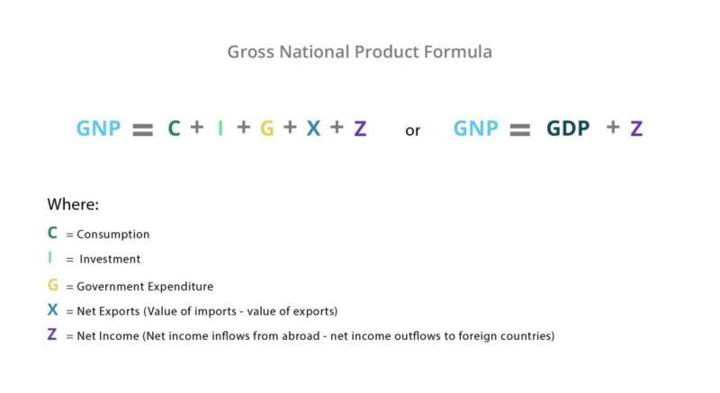

## Table of Contents

## What is Gross National Product (GNP)?

Gross National Product (GNP) is the total value of all goods and services produced by a country's residents and businesses, no matter where they are located in the world. This means that if a company from the United States has a factory in another country, the value of the goods produced in that factory would still be included in the U.S. GNP.

GNP is different from Gross Domestic Product (GDP), which only counts the value of goods and services produced within a country's borders. GNP gives us an idea of the total economic output that can be attributed to a country's citizens and businesses, helping to understand the overall economic health and performance of a nation.

## How does GNP differ from Gross Domestic Product (GDP)?

Gross National Product (GNP) and Gross Domestic Product (GDP) are two ways to measure a country's economy, but they look at it a bit differently. GNP measures the total value of all goods and services produced by a country's residents and businesses, no matter where in the world they are located. So, if a company from the United States has a factory in another country, the value of the goods made there would be counted in the U.S. GNP.

On the other hand, GDP only counts the value of goods and services produced within a country's borders. This means that if a foreign company has a factory in the United States, the value of the goods produced there would be included in the U.S. GDP, even if the company is not American. Both GNP and GDP help us understand how well a country's economy is doing, but they give us slightly different pictures based on where things are made and who makes them.

## Why is GNP an important economic indicator?

GNP is an important economic indicator because it shows the total value of what a country's people and businesses produce all over the world. This helps us understand how much money a country's citizens and companies are making, no matter where they are. It's like looking at all the money coming into a country from its people and businesses, which can tell us a lot about the overall health of the economy.

Another reason GNP is important is that it can be used to compare how well different countries are doing economically. By looking at GNP, we can see which countries are growing and which ones might be struggling. This information helps governments and businesses make better decisions about where to invest and how to plan for the future.

## What are the main components that make up GNP?

GNP is made up of several key parts that together show how much a country's people and businesses are producing. One big part is the money people earn from working, like salaries and wages. This includes what people earn both inside and outside their home country. Another part is the profits companies make, which can come from businesses that are owned by the country's citizens but operate anywhere in the world.

There's also the money that comes from renting out property and earning interest from loans or investments. If a person from the country owns a building in another country and gets rent from it, that money counts towards GNP. The same goes for interest earned on savings or investments made abroad. All these parts together give a full picture of the money a country's people and businesses are bringing in from all over the world.

## How is GNP calculated?

GNP is calculated by adding up all the money earned by a country's people and businesses, no matter where they are in the world. This includes the money people earn from their jobs, whether they work at home or in another country. It also includes the profits companies make, even if those companies are based in another country but owned by the country's citizens. Additionally, GNP counts the money from renting out property and earning interest from loans or investments, as long as these are owned by the country's people.

To figure out GNP, you start with the Gross Domestic Product (GDP), which is the value of all goods and services produced within the country's borders. Then, you add the income earned by the country's residents from foreign investments and subtract the income earned by foreign residents from investments within the country. This adjustment helps to show the total economic output that can be attributed to the country's citizens and businesses, giving a clearer picture of the country's economic health.

## Can you explain the income approach to calculating GNP?

The income approach to calculating GNP is a way to figure out how much money a country's people and businesses are making all over the world. It's like adding up all the money coming in from different places. You start by looking at all the money people earn from their jobs, no matter where they work. This includes salaries and wages. Then, you add the profits made by companies owned by the country's citizens, even if those companies are in other countries. You also include money from renting out property and earning interest on savings or investments.

After adding all these types of income together, you need to make some adjustments. If people from other countries earn money inside your country, you subtract that from your total. But if your country's people earn money in other countries, you add that back in. This helps make sure you're only counting the money made by your own country's people and businesses, no matter where they are. By doing this, you get the GNP, which shows the total economic output that can be attributed to your country's citizens and businesses.

## What is the expenditure approach to GNP calculation?

The expenditure approach to calculating GNP looks at how much money is spent on goods and services produced by a country's people and businesses, no matter where they are. It adds up all the spending by people, businesses, and the government, plus what other countries spend on what the country's people and businesses make. This includes money spent on things like food, clothes, and cars, as well as services like haircuts and doctor visits.

To get the GNP using this approach, you start with the total spending inside the country, which is the GDP. Then, you add the money spent by other countries on what your country's people and businesses make abroad. You also subtract the money spent inside your country on goods and services made by people and businesses from other countries. This way, you end up with the total value of what your country's people and businesses produce and sell all over the world.

## How does GNP per capita provide insight into a country's economic health?

GNP per capita is a way to see how well a country is doing by looking at the total GNP and dividing it by the number of people in the country. It tells us how much money, on average, each person in the country would get if all the money made by the country's people and businesses was shared equally. This can help us understand if the average person in a country is getting richer or poorer over time.

When we compare GNP per capita between different countries, we can see which countries are doing better economically. If a country's GNP per capita is growing, it usually means the country's economy is doing well and people are likely to have more money to spend on things they need and want. But if GNP per capita is going down, it might mean the country's economy is struggling, and people might have less money to spend.

## What are the limitations of using GNP as an economic measure?

GNP is a useful measure to see how much money a country's people and businesses are making all over the world, but it has some limitations. One big problem is that GNP doesn't show how the money is shared among the people. A country might have a high GNP, but if only a few people are making all the money, most people might still be poor. Also, GNP doesn't tell us about the quality of life. It doesn't show if people are happy, healthy, or have good schools and hospitals.

Another issue is that GNP doesn't take into account things that don't have a price tag, like the environment. If a country cuts down a lot of trees to make money, its GNP might go up, but the damage to the environment isn't counted. GNP also doesn't show the value of work that people do at home, like taking care of children or cooking, because this work isn't bought or sold. So, while GNP is helpful, it doesn't give us the whole picture of a country's well-being.

## How do adjustments for inflation affect GNP figures?

Adjustments for inflation are important when looking at GNP figures because they help show the real growth of an economy over time. Inflation means that prices go up, so if we don't adjust for it, GNP might look like it's growing when really it's just that everything costs more. By taking inflation into account, we can see if the economy is actually producing more goods and services, or if the increase in GNP is just because of higher prices.

When we adjust GNP for inflation, we use something called real GNP. Real GNP takes the current GNP and changes it to what it would be if prices hadn't gone up. This gives us a better idea of how much the economy is really growing. For example, if GNP goes up by 5% in a year, but prices also went up by 3%, the real GNP growth would only be about 2%. This helps us understand the true health of the economy without being fooled by inflation.

## What role does GNP play in international economic comparisons?

GNP is a key measure that countries use to compare their economies with others around the world. It shows how much money a country's people and businesses are making, no matter where they are. When countries compare their GNP, they can see which ones are doing better economically. For example, if one country's GNP is growing faster than another's, it might mean that the first country's economy is stronger or growing more quickly.

However, using GNP for these comparisons has its limits. It doesn't tell the whole story about how well people are living in a country. For instance, a country might have a high GNP, but if the money is only going to a few rich people, most people might still be poor. Also, GNP doesn't count things like the health of the environment or the value of work done at home, which are important for understanding a country's true well-being. So, while GNP is helpful for comparing economies, it's important to look at other measures too to get a full picture.

## How has the relevance of GNP changed over time in economic analysis?

GNP used to be a big deal in economic analysis. It was one of the main ways to see how well a country's economy was doing. People used it to compare countries and see which ones were growing faster. GNP was important because it showed how much money a country's people and businesses were making, no matter where they were in the world. But over time, people started to see that GNP had some problems. It didn't show how the money was shared among people, and it didn't tell us about important things like the environment or people's happiness.

These days, GNP is still used, but it's not as important as it used to be. Economists now look at other measures too, like GDP, which focuses on what's produced inside a country's borders. They also use things like the Human Development Index, which looks at health, education, and living standards. These other measures help give a fuller picture of how well a country is doing. So while GNP is still useful for some things, it's just one piece of the puzzle in understanding an economy's health.

## What is GNP and how can it be understood?

Gross National Product (GNP) represents the total economic output produced by the residents of a nation, irrespective of the geographical location of the production. Unlike Gross Domestic Product (GDP), which confines its analysis to the economic activities within the country's borders, GNP accounts for the income earned by a nation's residents and businesses globally. This distinction highlights the efforts and income generation of nationals, even when they operate outside their home country's boundaries.

GNP is composed of several key elements that together provide an overview of economic activity. Key components include:

1. **Personal Consumption Expenditures (PCE):** This reflects the total value of all goods and services consumed by households. It is a critical indicator of national demand and consumer confidence.

2. **Private Domestic Investment:** This consists of business investments in equipment and structures and changes in business inventories. These investments are essential for future production and economic growth.

3. **Government Expenditures on Goods and Services:** Government spending includes all government consumption, investment, and transfer payments. This component indicates the extent of government participation in the economy.

4. **Net Exports (Exports minus Imports):** This is the value of a country's exports minus its imports. A positive net export value contributes to GNP, indicating that a country sells more abroad than it buys.

5. **Net Income Receipts from Abroad:** This includes the income residents earn abroad minus the income foreigners earn domestically. It comprises wages, salaries, and property income (like dividends and interest) from overseas.

The mathematical formula representing GNP can be expressed as:

$$
\text{GNP} = \text{C} + \text{I} + \text{G} + (\text{X} - \text{M}) + \text{NIR}
$$

Where:
- $\text{C}$ represents personal consumption expenditures.
- $\text{I}$ denotes private domestic investment.
- $\text{G}$ stands for government expenditures on goods and services.
- $\text{X}$ is total exports.
- $\text{M}$ is total imports.
- $\text{NIR}$ indicates net income receipts from abroad.

Understanding these components is critical in evaluating a country's economic health, global engagement, and the effectiveness of its residents in generating income. GNP serves as a valuable measure, particularly for economies with significant international operations by their nationals and businesses.

## What is the difference between GNP and GDP?

Gross National Product (GNP) and Gross Domestic Product (GDP) are two major indicators used to assess the economic performance of a country. While they share similarities in tracking economic output, they focus on different aspects. GNP measures the total economic output generated by the residents of a nation, irrespective of the geographical location of the production. In contrast, GDP accounts for all economic activities that occur within a country's borders, regardless of whether the producers are residents or foreign entities.

### Key Differences

The choice between using GNP and GDP as economic measures typically depends on the economic activities and the degree of international integration of a nation. For economies with significant foreign investments and expatriate populations, GNP might present a more accurate picture of the economic contributions of its residents. Conversely, for countries with heavy foreign production activities within their borders, GDP may be more reflective of their economic condition.

**Formulas:**

- **GNP Formula:**
$$
  \text{GNP} = \text{GDP} + \text{Net Income Receipts from Abroad}

$$

  Net income receipts from abroad include income earned by residents from overseas investments minus income earned by foreign nationals domestically.

- **GDP Formula:**
$$
  \text{GDP} = C + I + G + (X - M)

$$

  where:
  - $C$ is consumption,
  - $I$ is investment,
  - $G$ is government spending,
  - $X$ is exports, and
  - $M$ is imports.

### Impact on Economic Analysis

Differences between GNP and GDP can significantly influence economic policy and investment decisions. For example, a country with a large number of citizens working abroad might boast a high GNP but a lower GDP. In such cases, reliance on GDP might underestimate the economic stature of its citizens globally, potentially influencing fiscal policies unfavorably.

### Case Scenarios

1. **Export-Dominant Economies:**
   Countries like Japan and Germany, which have thriving international businesses, often observe a higher GNP relative to GDP due to substantial income from assets held abroad.

2. **Developing Countries with Expatriates:**
   Nations well-known for having large diasporas, such as the Philippines, witness a GNP that holds significant expatriate income contributions, which play a crucial role in national economic assessments.

3. **Post-Reunification Germany:**
   After Germany's reunification, an assessment of both GDP and GNP was crucial. While GDP showcased the immediate economic activities within the unified borders, GNP provided insights into the economic contributions of Germans residing abroad, aiding in more informed policy-making.

Conclusively, understanding whether to prioritize GNP or GDP in economic analysis is crucial, as it provides different perspectives on a nation's economic health and informs both domestic and international economic strategies.

## References & Further Reading

#