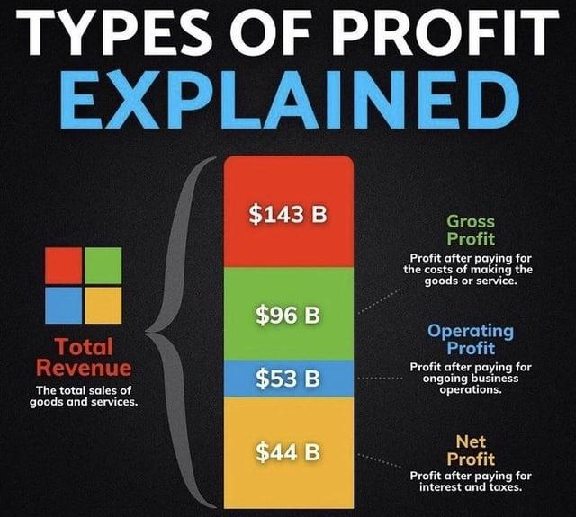

## Table of Contents

## What is gross profit and how is it calculated?

Gross profit is the money a business makes after it subtracts the costs of making and selling its products or services. It's important because it shows how efficiently a company is producing and selling its goods. If the gross profit is high, it means the company is doing a good job at keeping its production costs low compared to what it charges customers.

To calculate gross profit, you start with the total revenue, which is all the money the business earns from sales. Then, you subtract the cost of goods sold (COGS), which includes all the direct costs associated with producing the goods or services, like materials and labor. The formula is simple: Gross Profit = Total Revenue - Cost of Goods Sold. This number helps business owners understand how much money they have left to cover other expenses and hopefully make a profit.

## What is operating profit and how does it differ from gross profit?

Operating profit is the money a business has left after paying for the costs of making and selling its products or services, and also after paying for the day-to-day running of the business. This includes things like rent, utilities, and salaries for people who aren't directly making the products. It's a bit like looking at how much money you have after you've paid for your groceries and your monthly bills.

The main difference between operating profit and gross profit is what costs are included. Gross profit only looks at the costs of making the products, like materials and direct labor. Operating profit goes a step further by also subtracting the costs of running the business, which are called operating expenses. So, operating profit gives you a better idea of how well the business is doing overall, not just how well it's doing at making its products.

## How do you calculate net profit?

Net profit is what's left after a business pays for everything it needs to operate and any other costs like taxes and interest on loans. It's the final number that shows if a business made money or lost money after all expenses are paid. To find net profit, you start with the total revenue, which is all the money the business made from sales. Then, you subtract the cost of goods sold to get the gross profit. After that, you subtract all the operating expenses, like rent and salaries, to get the operating profit.

Next, you need to subtract any other costs that aren't part of the day-to-day running of the business. These can include interest on loans and taxes. Once you've subtracted all these costs from the operating profit, you're left with the net profit. This number is important because it shows the true financial health of the business. If the net profit is positive, the business made money. If it's negative, the business lost money.

## Why is it important to understand the difference between gross, operating, and net profit?

Understanding the difference between gross, operating, and net profit helps you see how a business is doing at different stages. Gross profit shows you how well a company is making and selling its products. It tells you if they're good at keeping the costs of making things low. Operating profit goes a step further. It shows you how well the business is doing after paying for the day-to-day costs of running the business, like rent and salaries. This gives you a better idea of how efficient the whole business is, not just the part that makes the products.

Net profit is the final number that matters the most. It tells you if the business made money or lost money after paying for everything, including taxes and interest on loans. If the net profit is positive, the business made money. If it's negative, the business lost money. By looking at all three types of profit, you can see where the business is doing well and where it might need to improve. This helps business owners and investors make better decisions about how to grow and manage the company.

## Can you provide an example of how gross profit is used in business decision-making?

Imagine you own a bakery and you want to know if it's a good idea to start making a new type of bread. You look at your gross profit to help you decide. Gross profit is the money you have left after paying for the flour, yeast, and other things you need to make the bread. If the gross profit for this new bread is high, it means you're doing a good job at keeping the costs low compared to what you can sell the bread for. This makes you feel more confident about starting to make the new bread because it looks like it will be profitable.

On the other hand, if the gross profit for the new bread is low, it might make you think twice. It could mean that the costs of making the bread are too high compared to what people are willing to pay. In this case, you might decide not to make the new bread, or you might look for ways to lower the costs, like finding a cheaper supplier for the flour. By looking at the gross profit, you can make better decisions about what products to sell and how to price them to make sure your bakery stays profitable.

## What are common expenses deducted to arrive at operating profit?

Operating profit is what's left after you take away the costs of running your business every day from your gross profit. These costs are called operating expenses. Some common operating expenses are rent for your business space, utilities like electricity and water, and salaries for your employees who aren't directly making your products. For example, if you own a restaurant, your operating expenses would include the rent for the restaurant space, the electricity to keep the lights on, and the wages for your servers and managers.

Other common operating expenses are things like office supplies, advertising, and insurance. Office supplies could be things like paper and pens if you run an office. Advertising costs are what you pay to let people know about your business, like running ads on TV or online. Insurance is what you pay to protect your business from things like fires or lawsuits. All these expenses add up, and when you subtract them from your gross profit, you get your operating profit. This number helps you see how well your business is doing after paying for everything it needs to run day to day.

## How do taxes and interest affect net profit?

Taxes and interest can really change how much money a business has left at the end of the day, which is called net profit. When a business makes money, it has to pay taxes to the government. These taxes can be a big chunk of money, and they get taken out of the operating profit. So, even if a business is doing well and making a good operating profit, after paying taxes, the net profit might be a lot smaller. This is why businesses try to find ways to lower their taxes, like using tax breaks or deductions.

Interest is another thing that can affect net profit. If a business has loans, it has to pay interest on those loans. This interest is money the business has to pay to the bank or whoever lent them the money. Just like taxes, this interest gets taken out of the operating profit. So, if a business has a lot of debt and has to pay a lot of interest, it can really cut into the net profit. That's why businesses try to manage their debt carefully and look for loans with lower interest rates.

## What financial ratios use gross, operating, and net profit, and what do they indicate about a company's performance?

Financial ratios that use gross, operating, and net profit help people understand how well a company is doing. The gross profit margin is one of these ratios. It shows how much money a company makes from selling its products after paying for the costs of making them. You find the gross profit margin by dividing the gross profit by the total revenue and then multiplying by 100 to get a percentage. A high gross profit margin means the company is good at keeping its production costs low compared to what it charges customers. This is important because it shows how efficiently the company is making and selling its products.

The operating profit margin is another useful ratio. It shows how much money a company has left after paying for the costs of making its products and the costs of running the business every day. You calculate it by dividing the operating profit by the total revenue and then multiplying by 100. A high operating profit margin means the company is not only good at making and selling its products but also at managing its day-to-day costs. This gives a better idea of the overall health of the business because it includes more expenses than just the cost of goods sold.

Finally, the net profit margin is a key ratio that uses net profit. It shows how much money a company has left after paying for everything, including taxes and interest on loans. To find the net profit margin, you divide the net profit by the total revenue and then multiply by 100. A high net profit margin means the company is making a good profit after paying all its costs. This is the most important ratio because it shows the true financial health of the business. If the net profit margin is positive, the company is making money, but if it's negative, the company is losing money.

## How can changes in gross profit margin signal potential issues in a company's operations?

Changes in a company's gross profit margin can show if there are problems with how the company is making or selling its products. If the gross profit margin goes down, it might mean that the costs of making the products are going up, or that the company is having to sell its products for less money. This could happen if the price of materials goes up, or if there are more costs for things like labor. It could also mean that the company is having to lower its prices because other companies are selling similar products for less. When the gross profit margin drops, it's a warning sign that the company needs to look at its costs and prices to see what's going wrong.

On the other hand, if the gross profit margin goes up, it can be a good sign, but it could also mean there are other problems. A higher gross profit margin might mean the company is doing a good job at keeping its costs low or charging more for its products. But it could also mean the company is not selling as many products as before. If the company is selling fewer products but still making more money per product, it might be because demand is going down. So, even though the gross profit margin is higher, the company needs to check if it's because of good management or because fewer people are buying their products.

## What strategies can a company employ to improve its operating profit?

A company can improve its operating profit by focusing on cutting costs and increasing revenue. One way to cut costs is by looking at all the expenses that go into running the business every day. This includes things like rent, utilities, and salaries for employees who aren't directly making the products. The company might try to find cheaper places to rent, use less electricity, or find ways to do more work with fewer people. By reducing these costs, the company can keep more of the money it makes from selling its products.

Another way to boost operating profit is by increasing revenue. This can be done by selling more products or by charging more for them. The company might try to reach more customers through advertising or by expanding to new markets. They could also look at what customers want and make products that meet those needs better. If the company can charge more for its products without losing customers, it will make more money. By working on both cutting costs and increasing revenue, a company can improve its operating profit and have more money left over after paying for everything it needs to run.

## How does net profit influence a company's ability to reinvest in the business or pay dividends?

Net profit is really important for a company because it shows how much money the business has left after paying for everything. This money can be used to reinvest in the business or to pay dividends to the people who own the company, called shareholders. If the net profit is high, the company has more money to spend on new projects, like making new products or opening new stores. This can help the business grow and become more successful. It also means the company can give more money back to its shareholders as dividends, which makes them happy and might make them want to keep investing in the company.

On the other hand, if the net profit is low or if the company is losing money, it can be harder to reinvest in the business or pay dividends. When there's less money left over, the company might have to be careful about how it spends its money. It might not be able to start new projects or expand as much as it wants. Also, if the company can't pay good dividends, the shareholders might get upset and decide to invest their money somewhere else. So, having a good net profit is really important for keeping the business strong and making sure everyone involved is happy.

## What advanced analytical techniques can be used to forecast future gross, operating, and net profit?

To forecast future gross, operating, and net profit, companies can use advanced analytical techniques like regression analysis and time series forecasting. Regression analysis looks at how different things, like the price of materials or how much people are buying, affect profit. By studying past data, the company can make a model that predicts how much profit it will make if those things change in the future. Time series forecasting is another technique that looks at how profit has changed over time. It uses this information to guess what will happen next, taking into account things like seasonal changes or trends that happen over time.

Another useful technique is scenario analysis, which helps companies think about different things that might happen in the future. For example, they can look at what would happen to their profit if the price of materials went up a lot, or if a new competitor came into the market. By making different scenarios and seeing how they affect gross, operating, and net profit, the company can be better prepared for whatever happens. These advanced techniques help companies make smarter decisions about their future, making sure they can keep making money no matter what comes their way.

## What is the difference between Gross Profit, Operating Profit, and Net Profit?

Profit is a fundamental measure of a company's financial health and operational success. It serves as a critical metric used by investors, analysts, and managers to assess a company's ability to generate earnings relative to its expenses over a specific period. Understanding profit involves dissecting it into three primary components: gross profit, operating profit (also known as earnings before interest and taxes, EBIT), and net profit.

### Gross Profit

Gross profit is the starting point for evaluating a business's profitability. It is calculated by subtracting the cost of goods sold (COGS) from total revenue:

$$
\text{Gross Profit} = \text{Total Revenue} - \text{COGS}
$$

This profit type reflects how efficiently a company uses its production and sales processes. Gross profit indicates the financial viability of core business activities without accounting for indirect costs such as administrative expenses or interest payments. High gross profit margins may suggest a competitive advantage in terms of production cost efficiency or pricing power.

### Operating Profit

Operating profit, or EBIT, provides deeper insights into a company’s profitability by considering all operating expenses, including administrative and selling costs:

$$
\text{Operating Profit} = \text{Gross Profit} - \text{Operating Expenses}
$$

Operating profit measures the earnings obtained from core business operations, excluding the effects of financing and tax activities. It helps in understanding the operational efficiency of a company. A healthy operating profit margin suggests operational prowess in managing costs while maintaining revenue growth.

### Net Profit

Net profit, commonly referred to as the bottom line, encompasses all aspects of a company's income and expenses. It is calculated as:

$$
\text{Net Profit} = \text{Total Revenue} - (\text{COGS} + \text{Operating Expenses} + \text{Interest Expense} + \text{Taxes})
$$

Net profit represents the residual earnings after all costs, including interest expenses and tax obligations, have been deducted. It is a definitive indicator of a company’s ability to generate profits available for reinvestment or distribution to shareholders. The net profit margin provides a comprehensive view of overall financial performance.

Each type of profit—gross, operating, and net—provides unique insights into different facets of a company’s financial performance. Gross profit points to production and sales efficiency, operating profit signifies operational excellence, and net profit reflects the company's overall financial success. Understanding these metrics is essential for making informed financial decisions and evaluating a business’s financial trajectory.

## References & Further Reading

[1]: Bergstra, J., Bardenet, R., Bengio, Y., & Kégl, B. (2011). ["Algorithms for Hyper-Parameter Optimization."](https://papers.nips.cc/paper/4443-algorithms-for-hyper-parameter-optimization) Advances in Neural Information Processing Systems 24.

[2]: ["Advances in Financial Machine Learning"](https://www.amazon.com/Advances-Financial-Machine-Learning-Marcos/dp/1119482089) by Marcos Lopez de Prado

[3]: ["Evidence-Based Technical Analysis: Applying the Scientific Method and Statistical Inference to Trading Signals"](https://www.amazon.com/Evidence-Based-Technical-Analysis-Scientific-Statistical/dp/0470008741) by David Aronson

[4]: ["Machine Learning for Algorithmic Trading"](https://github.com/stefan-jansen/machine-learning-for-trading) by Stefan Jansen

[5]: ["Quantitative Trading: How to Build Your Own Algorithmic Trading Business"](https://www.amazon.com/Quantitative-Trading-Build-Algorithmic-Business/dp/1119800064) by Ernest P. Chan