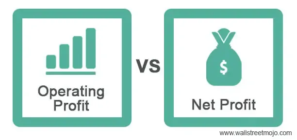

In the world of finance, understanding the various types of profit is crucial for successful business operations and investments. Profits serve as fundamental indicators of financial performance and are essential for making informed decisions in both traditional and modern trading environments. This article will explore the differences between operating profit, net profit, and gross profit, and their relevance in the context of algorithmic trading, often referred to as algo trading.

Algorithmic trading involves the use of complex computational algorithms to automate and optimize trading activities. It is a strategy employed by traders to execute orders based on pre-defined criteria at high speed and volume, often leveraging mathematical models and statistical analysis. In this context, profits play a significant role in evaluating the efficiency and success of trading strategies. By examining profit metrics, traders can assess the financial health of potential investment targets and fine-tune their algorithms to maximize returns.



Operating profit, gross profit, and net profit each provide unique insights into a company's financial standing. Gross profit measures the difference between total revenue and the cost of goods sold (COGS), indicating the efficiency of production and sales processes. Operating profit, or earnings before interest and taxes (EBIT), incorporates operating expenses and offers insight into core business profitability. Meanwhile, net profit, often called the bottom line, reflects the total earnings after all expenses, interest, and taxes.

This article will provide a detailed explanation of each profit type and demonstrate how these metrics can be incorporated into trading strategies for enhanced performance. By the end of this article, readers will have a comprehensive understanding of how to leverage profit metrics for better implementation of algorithmic trading strategies. Through this approach, both experienced and novice traders can improve trade accuracy, reduce risks, and significantly enhance their potential for profitability in an ever-evolving financial market landscape.

## Table of Contents

## Understanding Gross, Operating, and Net Profit

Profit is a fundamental measure of a company's financial health and operational success. It serves as a critical metric used by investors, analysts, and managers to assess a company's ability to generate earnings relative to its expenses over a specific period. Understanding profit involves dissecting it into three primary components: gross profit, operating profit (also known as earnings before interest and taxes, EBIT), and net profit.

### Gross Profit

Gross profit is the starting point for evaluating a business's profitability. It is calculated by subtracting the cost of goods sold (COGS) from total revenue:

$$
\text{Gross Profit} = \text{Total Revenue} - \text{COGS}
$$

This profit type reflects how efficiently a company uses its production and sales processes. Gross profit indicates the financial viability of core business activities without accounting for indirect costs such as administrative expenses or interest payments. High gross profit margins may suggest a competitive advantage in terms of production cost efficiency or pricing power.

### Operating Profit

Operating profit, or EBIT, provides deeper insights into a company’s profitability by considering all operating expenses, including administrative and selling costs:

$$
\text{Operating Profit} = \text{Gross Profit} - \text{Operating Expenses}
$$

Operating profit measures the earnings obtained from core business operations, excluding the effects of financing and tax activities. It helps in understanding the operational efficiency of a company. A healthy operating profit margin suggests operational prowess in managing costs while maintaining revenue growth.

### Net Profit

Net profit, commonly referred to as the bottom line, encompasses all aspects of a company's income and expenses. It is calculated as:

$$
\text{Net Profit} = \text{Total Revenue} - (\text{COGS} + \text{Operating Expenses} + \text{Interest Expense} + \text{Taxes})
$$

Net profit represents the residual earnings after all costs, including interest expenses and tax obligations, have been deducted. It is a definitive indicator of a company’s ability to generate profits available for reinvestment or distribution to shareholders. The net profit margin provides a comprehensive view of overall financial performance.

Each type of profit—gross, operating, and net—provides unique insights into different facets of a company’s financial performance. Gross profit points to production and sales efficiency, operating profit signifies operational excellence, and net profit reflects the company's overall financial success. Understanding these metrics is essential for making informed financial decisions and evaluating a business’s financial trajectory.

## The Importance of Profit Metrics in Algo Trading

In [algorithmic trading](/wiki/algorithmic-trading), the analysis and application of financial metrics such as gross, operating, and net profit are fundamental to creating and assessing trading strategies. These metrics serve as essential tools in evaluating a company's financial stability and potential for generating returns, thereby guiding algorithmic decision-making in trading environments.

Algorithmic trading, often abbreviated as algo trading, employs sophisticated algorithms to execute trades by leveraging data-driven insights. The use of profit metrics provides a wealth of information crucial for defining trading parameters and making informed decisions. For instance, gross profit, derived by subtracting the cost of goods sold (COGS) from total revenue, highlights the efficiency with which a company is manufacturing and selling its products. It can serve as a preliminary filter for algorithms to select potential investment candidates by emphasizing companies with robust production efficiencies.

Operating profit, or Earnings Before Interest and Taxes (EBIT), offers a more comprehensive view by factoring in operating expenses. This metric provides insight into a company's core profitability, exclusive of financial and tax obligations. Algorithms can use operating profits to identify companies with strong operational management and sustainable business models, which are crucial for long-term investment decisions.

The net profit, often referred to as the bottom line, takes into consideration all expenses, interests, and taxes, painting a complete picture of the company's profitability. In algorithmic trading, identifying companies with consistent and strong net profits can be integral for strategies seeking to prioritize long-term stability and growth potential. Algorithms can be programmed to respond dynamically to variations in these profit metrics, optimizing their operations to enhance both the efficiency and profitability of trades.

By integrating these metrics into trading strategies, algorithmic systems can discern which assets to buy or sell based on the financial health reflected by profit margins. Assessing profit margins allows traders to pinpoint economically resilient companies, making informed investment decisions that align with their financial goals. This adaptability ensures that the algorithms are not only reactive to current data but are also predictive of potential profitability outcomes.

Furthermore, algorithms can be designed to incorporate real-time analysis of profit metrics, enabling them to respond swiftly to market changes. This real-time responsiveness is crucial in capitalizing on market opportunities and minimizing exposure to adverse conditions. The ability of algorithms to dynamically adjust in response to financial metrics enhances trade accuracy and profitability, aligning with overall strategic objectives in the trading landscape.

In sum, the integration of gross, operating, and net profit metrics within algorithmic trading frameworks is not merely beneficial but essential. These metrics provide a comprehensive understanding of a company's financial position, driving more precise and informed trading decisions. By leveraging this financial data, traders can significantly optimize their strategies, increase profitability, and maintain a competitive edge in rapidly evolving financial markets.

## Incorporating Profit Metrics into Trading Algorithms

To effectively integrate profit metrics into trading algorithms, it is crucial for traders to focus on maintaining data accuracy and conducting real-time analysis. One effective approach is to set predefined thresholds for profit metrics, such as gross profit, operating profit, and net profit. By doing so, traders can automate their trading processes, enabling algorithms to execute buy or sell orders when these thresholds are met or breached. This ensures that trading decisions are made based on precise financial data, allowing for timely and efficient trades.

Risk management plays a pivotal role when incorporating profit metrics into trading algorithms. It is essential to use these metrics to diversify trade portfolios and establish stop-loss limits, which help in minimizing potential losses. For instance, an algorithm can be programmed to limit exposure to any single asset by setting a maximum allowable percentage of total trading [volume](/wiki/volume-trading-strategy). Furthermore, utilizing stop-loss orders based on specific profit metrics ensures that trades are closed automatically once a certain loss threshold is reached, thus reducing potential losses.

Continuous monitoring of profit metrics is necessary for adapting algorithms to the dynamic nature of financial markets. This involves analyzing market trends, financial reports, and other relevant data to ensure that algorithms remain effective. Traders must regularly update their algorithms to account for changes in market conditions, such as shifts in economic policy or unexpected financial events, which can influence profit metrics. Adapting to these changes helps maintain the relevance and accuracy of trading strategies.

Incorporating these profit metrics into trading algorithms can be achieved using various programming approaches. Here is a simplified example in Python demonstrating how an algorithm might be structured to make decisions based on profit metrics:

```python
class TradingAlgorithm:
    def __init__(self, gross_profit_threshold, operating_profit_threshold, net_profit_threshold):
        self.gross_profit_threshold = gross_profit_threshold
        self.operating_profit_threshold = operating_profit_threshold
        self.net_profit_threshold = net_profit_threshold

    def decide_trade(self, current_gross_profit, current_operating_profit, current_net_profit):
        if current_gross_profit >= self.gross_profit_threshold and \
           current_operating_profit >= self.operating_profit_threshold and \
           current_net_profit >= self.net_profit_threshold:
            return "Buy"
        elif current_net_profit < self.net_profit_threshold:
            return "Sell"
        return "Hold"

# Example usage
algo = TradingAlgorithm(1000, 500, 300)
trade_decision = algo.decide_trade(1200, 600, 250)
print(trade_decision)  # Output: "Sell"
```

By embedding profit metrics into trading algorithms with precise conditions and adaptive functionalities, traders can significantly enhance trading outcomes. This integration supports the development of robust trading strategies designed to optimize profitability and minimize risk in various market scenarios.

## Case Studies and Examples

Real-world examples offer insights into how companies successfully leverage profit metrics like gross, operating, and net profit in their algorithmic trading strategies. These case studies help illustrate the practical benefits and challenges associated with integrating these financial metrics into trading algorithms, providing traders with actionable insights and strategies.

### Case Study 1: Gross Profit Integration

A well-known multinational technology company focused on optimizing its trading algorithm by incorporating gross profit metrics. Recognizing that gross profit reflects the efficiency of producing and selling goods, the firm utilized real-time updates of gross profit margins to adjust its stock purchasing decisions. By setting their trading algorithm to prioritize stocks with consistent growth in gross profit margins, they were able to capture emerging market trends effectively. This strategy required meticulous data analysis, ensuring data accuracy and timeliness. The company effectively improved its decision-making process by programming the algorithm to trigger buy signals when a company's gross profit exceeded a predetermined threshold.

### Case Study 2: Operating Profit Utilization

An investment firm specializing in healthcare stocks incorporated operating profit data into their algorithmic trading model. Operating profit, or EBIT, provides a clear picture of a company’s profitability from core operations. By tracking the operating profits of their portfolio companies, the firm was able to identify shifts in core business performance quickly. They designed an algorithm that automatically adjusted their holdings based on quarterly reports, which often provided significant insights into operational efficiency. This approach minimized exposure to companies experiencing operational challenges, optimizing overall portfolio returns.

### Case Study 3: Net Profit Analysis

A financial services company emphasized net profit as a critical metric in its trading algorithms. As the bottom line after all expenses, taxes, and interest, net profit provides a comprehensive view of a company's financial health. The trading algorithm was programmed to enhance trade accuracy by buying securities of companies with increasing net profit margins over consecutive quarters. This approach integrated [machine learning](/wiki/machine-learning) models to predict future profit trends based on historical and industry data. Although effective, the firm faced challenges with data latency affecting real-time trading decisions. They addressed this by enhancing their data processing capabilities, which significantly improved the algorithm's performance and profitability.

### Practical Insights and Challenges

These examples underscore the importance of integrating financial metrics as part of an algorithmic trading strategy:

1. **Data Accuracy and Timeliness**: Ensuring the precision of profit metrics and receiving up-to-date data are vital. Inaccuracies or delays can significantly impact trading outcomes.

2. **Threshold Settings**: Establishing appropriate profit margin thresholds for triggering trades is crucial. It requires backtesting with historical data to ascertain optimal levels.

3. **Risk Management**: Utilizing stop-loss orders and diversifying trades based on profit metrics help manage risks associated with sudden market shifts.

4. **Technological Infrastructure**: A robust data processing system is needed to handle real-time analytics and maintain the efficiency of trading algorithms.

Through these case studies, traders can gain valuable insights into the practical integration of profit metrics into their algorithmic trading strategies, enhancing their capacity for effective decision-making and portfolio management.

## Conclusion

Understanding and utilizing gross profit, operating profit, and net profit are vital in algorithmic trading. These financial metrics are more than indicators of a company's performance; they are essential inputs that traders use to refine and tailor their trading strategies. Gross profit, calculated as total revenue minus the cost of goods sold (COGS), helps traders understand a company's ability to produce and sell goods efficiently. Operating profit provides insights into a company’s core profitability by accounting for operating expenses, excluding financial and tax expenses. Meanwhile, net profit, the so-called bottom line, reveals the total profit after all expenses, including interest and taxes, are deducted from total revenue.

Integrating these metrics into trading algorithms enables traders to enhance trade accuracy, reduce risks, and improve profitability. By evaluating profit margins, traders can program algorithms to identify and prioritize financially robust companies, providing a solid basis for making informed trading decisions. This application of financial metrics facilitates the development of data-driven trading strategies that can react quickly and appropriately to market changes, using profit metrics as triggers for buy or sell decisions.

Moreover, as financial markets continue to evolve with technological advancements, staying informed and adaptable in trading strategies remains key to long-term success. Automated trading systems that utilize real-time data can adapt their strategies based on changes in profit metrics, thereby ensuring ongoing optimization and responsiveness to dynamic market conditions.

In conclusion, mastering the application of profit metrics, like gross, operating, and net profit, in algorithmic trading offers substantial competitive advantages. By embedding these metrics into trading algorithms, traders not only gain deeper insights into financial health and market opportunities but also enhance their ability to make timely, informed decisions, ultimately maximizing trading efficiency and profitability. As algo trading continues to grow in sophistication, leveraging these financial insights will be crucial for maintaining a competitive edge in the financial markets.

## References & Further Reading

[1]: Bergstra, J., Bardenet, R., Bengio, Y., & Kégl, B. (2011). ["Algorithms for Hyper-Parameter Optimization."](https://papers.nips.cc/paper/4443-algorithms-for-hyper-parameter-optimization) Advances in Neural Information Processing Systems 24.

[2]: ["Advances in Financial Machine Learning"](https://www.amazon.com/Advances-Financial-Machine-Learning-Marcos/dp/1119482089) by Marcos Lopez de Prado

[3]: ["Evidence-Based Technical Analysis: Applying the Scientific Method and Statistical Inference to Trading Signals"](https://www.amazon.com/Evidence-Based-Technical-Analysis-Scientific-Statistical/dp/0470008741) by David Aronson

[4]: ["Machine Learning for Algorithmic Trading"](https://github.com/stefan-jansen/machine-learning-for-trading) by Stefan Jansen

[5]: ["Quantitative Trading: How to Build Your Own Algorithmic Trading Business"](https://www.amazon.com/Quantitative-Trading-Build-Algorithmic-Business/dp/1119800064) by Ernest P. Chan