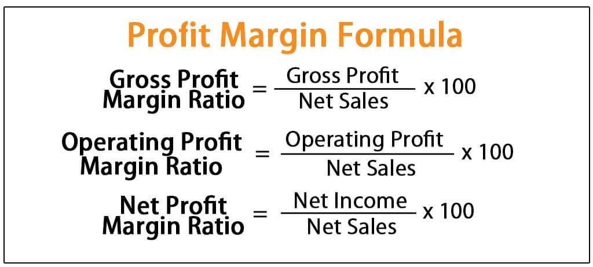

## Table of Contents

## What is a profit margin?

A profit margin is the amount of money a business makes after paying for all its costs. It's shown as a percentage of the money the business makes from selling things. If a business has a high profit margin, it means they keep a lot of the money they earn. If the profit margin is low, they keep less of the money they earn.

To find the profit margin, you subtract all the costs from the money made from sales. Then, you divide that number by the money made from sales and multiply by 100 to get a percentage. For example, if a business makes $100 from sales and spends $60 on costs, their profit is $40. The profit margin would be ($40/$100) * 100 = 40%. This means they keep 40% of the money they earn as profit.

## What is the difference between gross profit, operating profit, and net profit?

Gross profit, operating profit, and net profit are all ways to measure how much money a business makes, but they look at different parts of the business's costs. Gross profit is the money left after a business pays for the things it sells. For example, if a store buys a toy for $5 and sells it for $10, the gross profit is $5. This number helps show how well a business is doing at buying and selling things.

Operating profit goes a step further. It takes the gross profit and then subtracts the costs of running the business, like rent, salaries, and utilities. If the store from before has to pay $3 in rent and salaries, the operating profit would be $2 ($5 gross profit - $3 costs). This number shows how well the business is doing at managing its day-to-day operations.

Net profit is the final number. It takes the operating profit and subtracts any other costs, like taxes and interest on loans. If the store has to pay $1 in taxes, the net profit would be $1 ($2 operating profit - $1 taxes). Net profit is the most complete measure of a business's earnings because it includes all costs. It shows how much money the business really keeps at the end of the day.

## How do you calculate gross profit margin?

Gross profit margin is a way to see how much money a business makes from selling things after paying for what it sold. To find the gross profit margin, you start by figuring out the gross profit. Gross profit is what you get when you take the money made from sales and subtract the cost of the things you sold. For example, if you sell a toy for $10 and it cost you $6 to buy, your gross profit is $4.

Next, you calculate the gross profit margin as a percentage. You do this by dividing the gross profit by the total sales and then multiplying by 100. Using the toy example, you would divide $4 (gross profit) by $10 (total sales) to get 0.4. Multiply 0.4 by 100 to get a gross profit margin of 40%. This means for every dollar of sales, the business keeps 40 cents as gross profit after paying for the cost of the goods.

## How do you calculate operating profit margin?

Operating profit margin shows how much money a business makes after paying for the things it sells and the costs of running the business. To find it, you start with the gross profit, which is the money left after paying for what you sold. Then, you subtract the costs of running the business, like rent, salaries, and utilities. This gives you the operating profit. For example, if you sell a toy for $10, it costs $6 to buy, and you have $2 in running costs, your operating profit is $2 ($10 - $6 - $2).

Next, you calculate the operating profit margin as a percentage. You do this by dividing the operating profit by the total sales and then multiplying by 100. Using the toy example, you would divide $2 (operating profit) by $10 (total sales) to get 0.2. Multiply 0.2 by 100 to get an operating profit margin of 20%. This means for every dollar of sales, the business keeps 20 cents as operating profit after paying for the cost of goods and running the business.

## How do you calculate net profit margin?

Net profit margin shows how much money a business keeps after paying for everything it needs to run. To find it, start with the operating profit, which is what's left after you pay for the things you sell and the costs of running the business. Then, subtract any other costs like taxes and interest on loans. This gives you the net profit. For example, if you sell a toy for $10, it costs $6 to buy, you have $2 in running costs, and $1 in taxes, your net profit is $1 ($10 - $6 - $2 - $1).

Next, you calculate the net profit margin as a percentage. You do this by dividing the net profit by the total sales and then multiplying by 100. Using the toy example, you would divide $1 (net profit) by $10 (total sales) to get 0.1. Multiply 0.1 by 100 to get a net profit margin of 10%. This means for every dollar of sales, the business keeps 10 cents as net profit after paying for everything.

## Why are profit margins important for a business?

Profit margins are important for a business because they show how much money the business keeps after paying for everything it needs. This helps business owners and managers see if they are making enough money to keep the business running and growing. If the profit margins are high, it means the business is doing well and can think about expanding or investing in new things. If the profit margins are low, it might mean the business needs to find ways to cut costs or increase prices to make more money.

Profit margins also help businesses compare themselves to others in the same industry. By looking at the profit margins of similar businesses, a company can see if it is doing better or worse than its competitors. This can help them make smart decisions about how to improve their business. For example, if a business sees that its competitors have higher profit margins, it might look for ways to be more efficient or find new ways to make money. Knowing the profit margins is key to understanding how healthy and successful a business is.

## How do profit margins vary across different industries?

Profit margins can be very different from one industry to another. Some industries, like software and technology, often have high profit margins because once they make a product, it doesn't cost much to sell more copies. For example, a company that makes a popular app can sell it to millions of people without spending a lot more money. On the other hand, industries like grocery stores and restaurants usually have low profit margins. This is because they have to keep buying new things to sell, and the cost of those things can be high.

Another reason profit margins vary is because of how much competition there is in an industry. In industries with lots of competition, like clothing or electronics, businesses often have to keep their prices low to stay in the game. This can lead to lower profit margins. But in industries with less competition, like luxury goods or specialized services, businesses can charge more and have higher profit margins. Understanding these differences helps businesses know what to expect and how to plan for success.

## What factors can affect gross, operating, and net profit margins?

Gross profit margins can be affected by things like the price a business can charge for what it sells and the cost of those things. If a business can charge more for its products or if it can find cheaper ways to buy or make them, the gross profit margin will go up. But if the costs of the things they sell go up, or if they have to lower their prices because of competition, the gross profit margin will go down. Also, changes in the economy can make people buy more or less, which can change how much a business sells and affect the gross profit margin.

Operating profit margins are influenced by the costs of running the business, like rent, salaries, and utilities. If a business can find ways to spend less on these things, like moving to a cheaper building or using less electricity, the operating profit margin will increase. But if these costs go up, or if the business needs to hire more people or pay them more, the operating profit margin will decrease. The efficiency of the business in managing these costs is a big [factor](/wiki/factor-investing) in what the operating profit margin will be.

Net profit margins are affected by all the things that change gross and operating profit margins, plus other costs like taxes and interest on loans. If a business can lower its taxes through good planning or pay off its loans to reduce interest, the net profit margin will go up. But if taxes go up or if the business takes on more debt, the net profit margin will go down. The net profit margin is the final measure of how much money the business keeps, so it can be affected by many different things happening both inside and outside the business.

## How can a business improve its gross profit margin?

A business can improve its gross profit margin by finding ways to sell things for more money or by spending less on the things it sells. If a business can make its products better or more special, it might be able to charge more for them. This could mean adding new features to a product or making it look nicer. Also, if a business can find cheaper ways to buy or make what it sells, that will help too. They could look for better deals from suppliers or find cheaper materials to use. Sometimes, buying things in bigger amounts can help a business get a better price, which can make the gross profit margin go up.

Another way to improve the gross profit margin is by selling more of the things that make the most money. If a business knows which products have the highest profit margins, it can focus on selling more of those. This might mean spending more time and money on advertising those products or making them easier for customers to find. Also, a business can try to sell less of the things that don't make as much money. By focusing on the products that bring in the most profit, a business can make its gross profit margin better.

## How can a business improve its operating profit margin?

A business can improve its operating profit margin by finding ways to spend less money on running the business. This means looking at things like rent, salaries, and utilities and seeing if they can be cheaper. For example, a business might move to a smaller office or find a building with lower rent. They could also try to use less electricity or water to lower their utility bills. Another way is to see if they can do the same work with fewer people or find ways to pay less for the people they have. By cutting down these costs, a business can keep more of the money it makes as operating profit.

Another way to boost the operating profit margin is by making the business run more smoothly. This can mean using better technology to help people work faster or finding ways to do things more efficiently. If a business can make its workers more productive, it might not need to hire as many people, which saves money. Also, a business can look at how it does things and see if there are steps that can be cut out or made simpler. By making the business more efficient, a business can spend less on running costs and improve its operating profit margin.

## How can a business improve its net profit margin?

A business can improve its net profit margin by finding ways to make more money or spend less on everything. This means looking at all the costs, not just the ones for running the business but also things like taxes and interest on loans. If a business can find ways to pay less in taxes, like using tax breaks or planning better, it will keep more money. Also, if a business can pay off its loans faster or get a loan with a lower [interest rate](/wiki/interest-rate-trading-strategies), it will spend less on interest. By focusing on all these costs, a business can make its net profit margin better.

Another way to improve the net profit margin is by making the business more efficient and selling more of the things that make the most money. If a business can find cheaper ways to buy or make what it sells, it will have more money left over after paying for those things. Also, if it can sell more of the products that have the highest profit margins, it will make more money overall. By working on both making more money and spending less, a business can see its net profit margin go up.

## What are the limitations of using profit margins as a financial metric?

Profit margins are a helpful way to see how much money a business keeps after paying for things. But they have some limits. One big limit is that profit margins don't tell you how much money the business is making overall. A business might have a high profit margin but still not be making much money if it doesn't sell a lot of things. Also, profit margins can be different in different industries, so it's hard to compare businesses that are in different kinds of work. A grocery store might have a low profit margin but still be doing well because that's normal for their industry.

Another problem with profit margins is that they can be changed by things outside the business's control. For example, if the cost of things the business needs to buy goes up because of something happening in the world, like a big storm or a change in laws, the profit margin might go down even if the business is doing everything right. Also, profit margins don't show if a business is spending money in smart ways to grow for the future. A business might be spending a lot on new ideas or trying to get into new markets, which could make its profit margin look low now but be good for the future. So, while profit margins are useful, they don't tell the whole story about how a business is doing.

## What is the understanding of Net Profit Margin?

Net profit margin is a key financial metric that indicates the proportion of revenue a company retains as profit after all operating expenses, interest, taxes, and preferred stock dividends have been deducted from its total revenue. This margin provides crucial insight into how effectively a company manages its overall expenses relative to its revenue, offering investors and traders a clear view of its financial health and profitability.

### Importance
The net profit margin is an essential tool for assessing how well a company is managing its financial obligations. A higher margin indicates that the company is more effective at converting revenue into actual profit, suggesting efficient cost management and strong financial performance. For investors, a consistent net profit margin over time can signal stability and profitability, making the company a potentially attractive investment.

### Calculation
The formula for calculating the net profit margin is:

$$
\text{Net Profit Margin} = \left( \frac{\text{Net Profit}}{\text{Total Revenue}} \right) \times 100
$$

For example, if a company has a total revenue of $1,000,000 and a net profit of $100,000, the net profit margin would be:

$$
\text{Net Profit Margin} = \left( \frac{100,000}{1,000,000} \right) \times 100 = 10\%
$$

This indicates that 10% of the company's total revenue is retained as profit after covering all expenses.

### Impact on Algorithmic Trading
In [algorithmic trading](/wiki/algorithmic-trading), the net profit margin can significantly influence decision-making and profit maximization strategies. Traders can utilize this metric to assess the financial health of potential investment targets. A company with a strong net profit margin might be preferred in trading algorithms designed to identify robust financial performance, reducing risk exposure. Moreover, by integrating the net profit margin into algorithms, traders can optimize their portfolio by selecting companies that consistently generate high profitability.

### Key Insights
Analyzing the net profit margin is vital when developing trading models. Over time, tracking changes in this metric can provide insights into a company's profitability trends and operational effectiveness. By monitoring the net profit margins of companies within a trading model, traders can make informed decisions about which stocks to buy or hold, thereby enhancing the profitability of their investment strategies. Moreover, algorithmic adjustments based on observed margin trends can help in adapting to market changes, ensuring that trading decisions align with the financial realities of the companies involved.

## What is Exploring Operating Profit Margin?

Operating profit margin represents the percentage of revenue that remains after deducting operating expenses from total revenue. It is a vital financial metric that provides insight into how effectively a company is managing the costs associated with its core business operations. 

To calculate the operating profit margin, the formula is:

$$
\text{Operating Profit Margin} = \left( \frac{\text{Operating Profit}}{\text{Revenue}} \right) \times 100
$$

Operating profit is derived by subtracting the cost of goods sold (COGS) and operating expenses—including depreciation and amortization—from total revenue. For example, if a company registers $500,000 in total revenue, $200,000 in COGS, and $150,000 in operating expenses, its operating profit would be $150,000. Consequently, the operating profit margin would be:

$$
\left( \frac{\$150,000}{\$500,000} \right) \times 100 = 30\%
$$

This metric is crucial as it reveals the operational efficiency of a business before accounting for interest and taxes. A higher operating profit margin indicates a company is adept at converting revenue into profit through effective cost management and operational efficiency.

In algorithmic trading, understanding a company's operating profit margin can be essential for developing automated trading strategies. Traders and algorithm developers often seek firms with strong and improving operating profit margins, as these can be indicative of sustainable business models and operational efficiency. By incorporating operating profit margin data into trading algorithms, traders can optimize their decision-making processes, selecting investments that are more likely to yield favorable returns over time.

From an analytical perspective, the operating profit margin offers a window into a company's capacity to harness its resources efficiently. It highlights a company's underlying financial health and stability, allowing traders to make informed decisions. While gross profit margin may show production efficiency, the operating profit margin encompasses a broader operational scope, making it a more comprehensive measure of financial health. This understanding helps traders identify firms with solid core operations, making them attractive candidates for investment in algorithm-driven portfolios.

## What is the process for decoding gross profit margin?

Gross profit margin is a critical financial metric reflecting the percentage of revenue surpassing the cost of goods sold (COGS). It is calculated as:

$$
\text{Gross Profit Margin} = \left(\frac{\text{Revenue} - \text{COGS}}{\text{Revenue}}\right) \times 100
$$

This measurement is crucial for gauging production efficiency and assessing a company’s ability to generate profits from its core sales activities before other expenses are accounted for.

### Significance
Gross profit margin offers insights into management’s effectiveness in utilizing labor and materials in the production process. A high gross profit margin indicates efficient production and cost management, which implies a greater capacity for generating profit per dollar of sales. This is especially relevant for investors and analysts concerned with the fundamental health and scalability of a business.

### Calculation: Example
Consider a company with an annual revenue of $500,000 and COGS of $300,000. The gross profit margin would be:

$$
\text{Gross Profit Margin} = \left(\frac{500,000 - 300,000}{500,000}\right) \times 100 = 40\%
$$

Thus, the company retains 40% of its revenue as gross profit.

### Integration in Algo Trading
In algorithmic trading, gross profit margins can be integral when selecting stocks or other financial instruments. A company with a consistently high gross profit margin might be more attractive as it indicates strong pricing power and operational efficiency, reducing the risk for algorithm-driven investments. Algorithmic strategies can be programmed to identify companies surpassing predefined gross profit margin thresholds, thus facilitating more informed and efficient trading decisions.

### Financial Insight
Gross profit margin also signals a company’s potential for scaling operations and improving production processes. Companies with strong margins are often better positioned to withstand market [volatility](/wiki/volatility-trading-strategies) and invest in growth opportunities. For traders, monitoring shifts in gross profit margins can uncover early signs of operational improvements or potential challenges.

In conclusion, gross profit margin is a pivotal measure in finance, revealing how effectively a company translates sales into profit. Its analysis is crucial not only in traditional financial assessments but also in the development of sophisticated algorithmic trading strategies aimed at optimizing investment decisions and minimizing associated risks.

## References & Further Reading

[1]: ["Advances in Financial Machine Learning"](https://www.amazon.com/Advances-Financial-Machine-Learning-Marcos/dp/1119482089) by Marcos Lopez de Prado

[2]: ["Evidence-Based Technical Analysis: Applying the Scientific Method and Statistical Inference to Trading Signals"](https://www.amazon.com/Evidence-Based-Technical-Analysis-Scientific-Statistical/dp/0470008741) by David Aronson

[3]: ["Machine Learning for Algorithmic Trading"](https://github.com/stefan-jansen/machine-learning-for-trading) by Stefan Jansen

[4]: ["Quantitative Trading: How to Build Your Own Algorithmic Trading Business"](https://www.amazon.com/Quantitative-Trading-Build-Algorithmic-Business/dp/1119800064) by Ernest P. Chan

[5]: ["Financial Modeling and Valuation: A Practical Guide to Investment Banking and Private Equity"](https://onlinelibrary.wiley.com/doi/book/10.1002/9781119808923) by Paul Pignataro