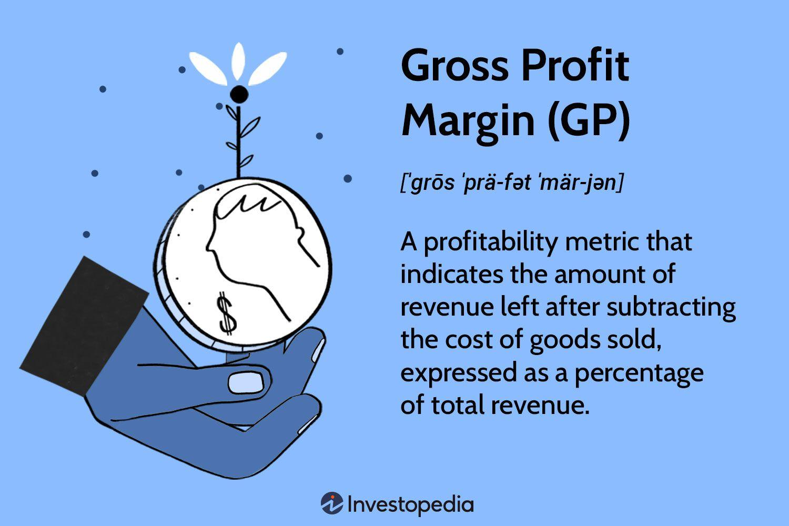

## Table of Contents

## What is Gross Processing Margin (GPM)?

Gross Processing Margin (GPM) is a financial metric used in the oil and gas industry to measure the profitability of refining crude oil into products like gasoline and diesel. It shows how much money a refinery makes from processing each barrel of crude oil, after subtracting the cost of the crude oil itself but before accounting for other operating expenses like labor and overhead.

GPM is calculated by taking the total revenue from the sale of refined products and subtracting the cost of the crude oil used to produce them. This number is then divided by the total number of barrels of crude oil processed. A higher GPM indicates that the refinery is more efficient or that it is benefiting from favorable market conditions, where the prices of refined products are high relative to the cost of crude oil.

## How is Gross Processing Margin calculated?

Gross Processing Margin (GPM) is figured out by taking the money made from selling the things like gasoline and diesel that come from crude oil, and then taking away the cost of the crude oil itself. This difference is the GPM. To make it clearer, you look at how much you sold the refined products for, and then you subtract what you paid for the crude oil that you turned into those products.

To get the GPM for each barrel of oil, you divide this difference by the total number of barrels of crude oil you used. So, if you made $100 from selling the refined products and spent $70 on the crude oil, your GPM would be $30. If you used 10,000 barrels of oil, then your GPM per barrel would be $30 divided by 10,000, which is $0.003 per barrel. This helps refineries understand how much profit they are making just from processing the oil, before other costs like workers' salaries and building expenses are considered.

## Why is Gross Processing Margin important for businesses?

Gross Processing Margin (GPM) is important for businesses because it shows how much money they make from turning crude oil into products like gasoline and diesel. It helps them see if they are doing a good job at making money from the oil they process. If the GPM is high, it means they are either very good at turning oil into valuable products or that the prices for these products are high compared to what they paid for the oil.

Knowing the GPM helps businesses make smart choices about how to run their refinery. They can decide if they should buy more oil, change how they make their products, or even think about expanding their business. It's like a report card that tells them if they are doing well or if they need to find ways to improve. This information is really helpful for planning and making sure the business stays profitable.

## Can you explain the difference between Gross Processing Margin and Gross Profit Margin?

Gross Processing Margin (GPM) and Gross Profit Margin are two different ways to look at how much money a business makes, but they are used in different situations. GPM is used mostly by companies in the oil and gas industry. It tells them how much money they make from turning crude oil into products like gasoline and diesel. To find GPM, you take the money made from selling the refined products and subtract the cost of the crude oil. This number shows how much profit the company makes just from processing the oil, before other costs like salaries and building expenses are taken into account.

On the other hand, Gross Profit Margin is used by all kinds of businesses and looks at the overall profitability of selling goods or services. It is calculated by taking the total revenue from sales and subtracting the cost of goods sold (COGS), which includes the direct costs of making or buying the products that are sold. This margin shows the percentage of total revenue that is left after paying for the costs directly related to producing the goods. Unlike GPM, Gross Profit Margin includes all sorts of products and services, not just oil, and it gives a broader picture of a company's profitability.

In simple terms, GPM is specific to the oil refining business and focuses only on the profit from processing crude oil, while Gross Profit Margin is a more general measure that applies to any business and considers the profit from all sales after accounting for the cost of goods sold.

## What industries commonly use Gross Processing Margin as a key metric?

The Gross Processing Margin (GPM) is a key metric mainly used by companies in the oil and gas industry. These companies use GPM to see how much money they make from turning crude oil into things like gasoline and diesel. It helps them understand if they are good at making money just from processing the oil, before they think about other costs like paying workers or keeping their buildings running.

Oil refineries use GPM a lot because it tells them if they are doing well at turning oil into valuable products. If their GPM is high, it means they are either very good at refining oil or that the prices for the products they make are high compared to what they paid for the oil. This information helps them decide if they should buy more oil, change how they make their products, or even think about growing their business.

## How does Gross Processing Margin affect a company's pricing strategy?

Gross Processing Margin (GPM) helps a company in the oil and gas industry figure out how to set prices for things like gasoline and diesel. If the GPM is high, it means the company is making a good profit from turning crude oil into these products. So, they might decide to keep their prices the same or even lower them a little to sell more and still make money. But if the GPM is low, it tells them that they are not making much money from processing the oil. They might need to raise their prices to make more money or find ways to cut the costs of buying crude oil.

Sometimes, the GPM can change because of things the company can't control, like the price of crude oil going up or down. If crude oil prices go up, the GPM might go down unless they can also raise the prices of their refined products. In this case, they might need to adjust their pricing strategy quickly to keep their profit margins healthy. By keeping an eye on their GPM, companies can make smart choices about pricing to make sure they stay profitable and competitive in the market.

## What are the common challenges in maintaining a healthy Gross Processing Margin?

Keeping a healthy Gross Processing Margin (GPM) can be tough for oil and gas companies because the price of crude oil can change a lot. If crude oil prices go up, it costs more to buy the oil they need to make gasoline and diesel. This can make their GPM go down unless they can also raise the prices of their products. But if they raise their prices too much, people might not buy as much, which can also hurt their profits. So, they have to be careful and watch the market closely to decide when to buy oil and how to set their prices.

Another challenge is that the cost of running a refinery, like paying workers and keeping the equipment working, can also affect the GPM. If these costs go up, it can eat into the profit they make from processing the oil. Companies need to find ways to keep these costs down, maybe by using new technology or making their processes more efficient. But even if they do this, they still have to deal with things like government rules and taxes that can change and make it harder to keep a good GPM.

Sometimes, the demand for products like gasoline and diesel can change too. If fewer people are buying these products, the company might have to lower their prices to sell what they made, which can lower their GPM. On the other hand, if demand goes up, they might be able to charge more and improve their GPM. So, understanding and predicting changes in demand is another big challenge for keeping a healthy GPM.

## How can a company improve its Gross Processing Margin?

A company can improve its Gross Processing Margin (GPM) by finding ways to buy crude oil at a lower price. They can do this by looking for the best deals from different suppliers or by buying oil when the price is low. Another way is to use their refinery more efficiently. This means using less energy or finding new ways to turn oil into products like gasoline and diesel that cost less. By doing this, the company can make more money from the oil they process, which helps improve their GPM.

Another important way to improve GPM is by adjusting the prices of their refined products. If the company can sell gasoline and diesel for more money without losing too many customers, their GPM will go up. They can also look at the market to see when it's a good time to sell more products at higher prices. Sometimes, they might need to change what kinds of products they make, choosing ones that are in higher demand or that they can sell for more money. By keeping a close eye on their costs and the market, a company can make smart choices to keep their GPM healthy.

## What role does Gross Processing Margin play in financial analysis and forecasting?

Gross Processing Margin (GPM) is a really important number for companies in the oil and gas industry when they are looking at their money and trying to guess what will happen next. It shows how much money they make from turning crude oil into things like gasoline and diesel, just looking at the cost of the oil itself. By knowing their GPM, these companies can see if they are doing well at making money from the oil they process. This helps them decide if they should buy more oil, change how they make their products, or think about growing their business. If the GPM is high, it means they are making good money, which can help them feel confident about the future.

When companies are trying to predict what will happen with their money, GPM is a big part of that. It helps them guess how much money they might make from processing oil in the future. If they see that their GPM is going up, they might think they will make more money, and if it's going down, they might worry about making less. This can affect big decisions like whether to spend money on new equipment or to save it for tough times. By watching their GPM closely, companies can make better plans and be ready for whatever might happen in the market.

## How does Gross Processing Margin vary across different sectors?

Gross Processing Margin (GPM) is mainly used in the oil and gas industry to see how much money a company makes from turning crude oil into products like gasoline and diesel. It shows the profit they make just from processing the oil, before they think about other costs like paying workers or keeping their buildings running. In this industry, GPM can change a lot because the price of crude oil can go up and down, and the demand for things like gasoline can also change. If the price of oil goes up, the GPM might go down unless the company can also raise the prices of their products. So, companies in the oil and gas sector need to watch their GPM closely to make smart choices about buying oil and setting prices.

In other industries, GPM is not used as much because it's specific to processing crude oil. Instead, other sectors use different ways to measure how much money they make, like Gross Profit Margin, which looks at the profit from selling all kinds of products after the cost of making or buying them. For example, in the manufacturing industry, companies might look at how much it costs to make their products and how much they can sell them for, but this is different from GPM because it includes all sorts of costs, not just the cost of raw materials like crude oil. So, while GPM is a key number for oil and gas companies, it's not really used or useful in the same way in other sectors.

## What advanced techniques can be used to analyze Gross Processing Margin trends over time?

To analyze Gross Processing Margin (GPM) trends over time, companies can use advanced techniques like time series analysis. This method helps them see how their GPM changes from one month or year to the next. By looking at these patterns, they can spot when their GPM goes up or down and try to figure out why. For example, they might see that their GPM is higher in the summer when more people are driving and buying gasoline. They can use special computer programs to make charts and graphs that show these trends clearly, making it easier to understand what's happening and plan for the future.

Another technique is regression analysis, which helps companies understand how different things affect their GPM. They can look at how changes in the price of crude oil, the cost of running their refinery, or even the weather might change their GPM. By studying these relationships, they can make better guesses about what might happen to their GPM in the future. This can help them decide when to buy more oil or change their prices to keep their profits healthy. Using these advanced techniques, companies can make smarter decisions and be ready for whatever the market throws at them.

## Can you discuss case studies where Gross Processing Margin was critical to a company's strategic decisions?

In one case, a big oil refining company was looking at their Gross Processing Margin (GPM) and saw that it was going down because the price of crude oil was going up. They decided to change their strategy by buying oil from different places where it was cheaper. They also started making more diesel because they found out that diesel was in higher demand and they could sell it for more money. By doing these things, they were able to improve their GPM and make more profit from processing oil.

Another case involved a refinery that noticed their GPM was not as high as they wanted it to be. They used special computer programs to study their GPM over time and saw that it was lower in the winter when people used less gasoline. So, they decided to save some of the money they made in the summer to help them through the winter. They also started making more products that people needed all year, like jet fuel, which helped them keep their GPM steady and make better plans for the future.

## What is Gross Processing Margin (GPM) and how is it understood?

The Gross Processing Margin (GPM) is defined as the spread between the cost incurred in acquiring and processing raw commodities and the revenue obtained from selling refined products. This metric is central to understanding profitability in various commodity sectors. It reflects the intricate balance of supply and demand dynamics and price fluctuations that pervade the markets.

The applicability of GPM spans a variety of commodities, significantly impacting industries from agriculture to oil. For example, in the oil industry, the GPM is commonly known as the "crack spread," a term describing the difference between the cost of crude oil and the selling price of refined products like gasoline and diesel. Crack spreads are indicators of refinery profit margins, essential for decision-making in the oil sector.

GPM serves as a critical measure of profitability, offering valuable insights into the sustainability of production and the efficiency of supply chains. For producers and traders, a thorough understanding of GPM is crucial. By analyzing GPM, producers can evaluate whether their current production processes are financially viable under existing market conditions. Similarly, traders can leverage GPM to inform decisions regarding production scales and investment strategies, ultimately optimizing profit margins.

The formula for calculating GPM can be expressed as:

$$
\text{GPM} = \frac{\text{Revenue from Processed Products} - \text{Cost of Raw Commodities}}{\text{Revenue from Processed Products}}
$$

This formula highlights the importance of both input costs and market prices in determining the margin. As such, GPM serves not only as a profitability benchmark but also as a strategic tool for adjusting production and supply strategies to better align with market conditions.

In summary, understanding GPM is indispensable for participants in the commodity market, enabling them to make informed decisions that enhance operational efficiency and financial performance. By adapting to the ever-changing factors affecting GPM, producers and traders can maintain and increase their competitive edge within the market.

## What are the components and how is the calculation of GPM done?

Calculating Gross Processing Margin (GPM) is essential for understanding the profitability dynamics in commodity trading. The GPM is determined by subtracting the sum of costs involved in processing raw commodities into finished products from the total sales revenue generated from these products. This simple yet powerful calculation provides insights into the cost-efficiency and profitability of commodity processing operations.

The fundamental components involved in GPM calculation include:

1. **Direct Processing Costs**: These are the explicit costs incurred in transforming raw commodities into finished goods. Key direct costs encompass labor expenses and energy consumption, which are integral to running processing facilities.

2. **Indirect Overheads**: These costs, while not directly tied to production, still impact the overall cost structure. Overheads might include administrative expenses, depreciation, and maintenance costs associated with maintaining and operating the processing infrastructure.

To exemplify, consider the processing of soybeans. In this scenario, the GPM calculation involves comparing the aggregate costs associated with soybean processing against the collective sales revenue from both soybean oil and soybean meal. The formula can be represented as:

$$
\text{GPM} = (\text{Revenue from Soybean Oil} + \text{Revenue from Soybean Meal}) - \text{Total Processing Costs}
$$

For computational illustration, assume:

- Revenue from soybean oil: $100,000
- Revenue from soybean meal: $50,000
- Total processing costs: $120,000

The GPM would be:

$$
\text{GPM} = (100,000 + 50,000) - 120,000 = 30,000
$$

Understanding these components allows traders to effectively assess and compare the profitability across different commodity sectors. Analyzing the GPM helps in identifying which commodities offer better margins and contributes to strategic decision-making regarding production scales and resource allocation.

## What are the advantages and disadvantages of high GPM?

A high Gross Processing Margin (GPM) often implies strong profitability potential for producers and traders within the commodity markets. This scenario can encourage capacity expansion, allowing firms to increase their output to maximize profits. The mathematical representation of GPM is:

$$
\text{GPM} = \text{Revenue from Processed Products} - \text{Cost of Raw Commodities and Processing}
$$

As the GPM increases, the profitability per unit of processed product rises, providing firms the financial leverage to invest in technology, infrastructure, and workforce expansion. Higher profitability, however, also brings the challenge of balanced production scaling to avoid oversupply in the market.

For traders, a high GPM can lead to lucrative arbitrage opportunities. The discrepancy between prices of raw and processed goods might allow traders to benefit from short-term market inefficiencies. However, this increased potential for profit comes with heightened market competition, as more participants seek to capitalize on favorable margins. Such competition can amplify market volatility and exert downward pressure on margins if too many players engage in expansion simultaneously.

The sustainability of a high GPM is intricately linked to maintaining a balance between input costs, market demand, and strategic positioning within the value chain. As processing costs fluctuate, driven by variables such as energy prices and labor costs, maintaining a favorable GPM becomes increasingly challenging. To sustain high margins, firms must optimize their operations to minimize costs and effectively respond to shifts in consumer demand and global market trends.

Moreover, high GPM can signal attractiveness to new entrants, which may saturate the market and drive down margins. Thus, companies need to employ strategic market positioning and innovation to maintain their competitive edge, ensuring the longevity of beneficial profit margins without succumbing to overproduction or a commoditized market scenario.

## References & Further Reading

[1]: McNew, K., & Fackler, P. L. (2019). ["Commodity Price Dynamics: A Structural Approach"](https://www.cambridge.org/core/books/commodity-price-dynamics/9C67EFBF989C2B5A8E9B8D8E12843476). Cambridge University Press.

[2]: Till, H., & Eagleeye, J. (2006). ["The Columbia Guide to Commodities Trading"](https://www.premiacap.com/publications/Wiley_2005.pdf). Columbia Business School Publishing.

[3]: Hull, J. C. (2018). ["Options, Futures, and Other Derivatives"](https://www.semanticscholar.org/paper/Options%2C-Futures%2C-and-Other-Derivatives-Hull/89bdee500c8623864fc9eb7a471546aa713acc44) (9th Edition). Pearson.

[4]: Geman, H. (2005). ["Commodities and Commodity Derivatives: Modeling and Pricing for Agriculturals, Metals and Energy"](https://download.e-bookshelf.de/download/0000/5675/90/L-G-0000567590-0015270354.pdf). Wiley Finance.

[5]: Adams, Z., & Glück, T. (2015). ["Financialization in Commodity Markets: A Passing Trend or the New Normal?"](https://www.sciencedirect.com/science/article/pii/S0378426615002022). Journal of Banking & Finance, 60, 93-111.