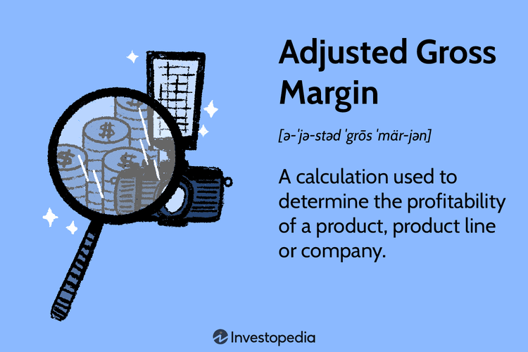

The Gross Processing Margin (GPM) is a fundamental concept in the field of commodity trading, representing the spread between the costs incurred for acquiring and processing raw commodities and the income generated from selling the resulting finished products. This metric serves as a critical benchmark for assessing profitability, enabling both producers and traders to make informed decisions regarding production levels, investment choices, and trading strategies.

GPM is crucial for evaluating the economic viability of commodity production and sale, influencing strategic decisions across various sectors, including agriculture, energy, and metals. By analyzing GPM, traders can identify optimal trading conditions and potential profit opportunities, particularly through the use of advanced techniques such as algorithmic trading, which capitalizes on even slight variations in price spreads.



The importance of GPM extends beyond just the numbers, as it is heavily impacted by external factors such as geopolitical events, regulatory shifts, and market dynamics. Changes in these areas can significantly alter the costs of raw materials or the prices of processed goods, thereby impacting the GPM and, consequently, the profitability outlook for involved parties. Understanding these influences enables traders and analysts to navigate the complexities of the commodities market more effectively, adapting their strategies to maximize profit potential while mitigating risks.

Throughout this article, we will explore the mechanisms for calculating GPM, highlight its role and significance in commodity trading, and examine how different market forces can affect this metric, offering insights into leveraging GPM data for better trading outcomes.

## Table of Contents

## Understanding Gross Processing Margin (GPM)

The Gross Processing Margin (GPM) is defined as the spread between the cost incurred in acquiring and processing raw commodities and the revenue obtained from selling refined products. This metric is central to understanding profitability in various commodity sectors. It reflects the intricate balance of supply and demand dynamics and price fluctuations that pervade the markets.

The applicability of GPM spans a variety of commodities, significantly impacting industries from agriculture to oil. For example, in the oil industry, the GPM is commonly known as the "crack spread," a term describing the difference between the cost of crude oil and the selling price of refined products like gasoline and diesel. Crack spreads are indicators of refinery profit margins, essential for decision-making in the oil sector.

GPM serves as a critical measure of profitability, offering valuable insights into the sustainability of production and the efficiency of supply chains. For producers and traders, a thorough understanding of GPM is crucial. By analyzing GPM, producers can evaluate whether their current production processes are financially viable under existing market conditions. Similarly, traders can leverage GPM to inform decisions regarding production scales and investment strategies, ultimately optimizing profit margins.

The formula for calculating GPM can be expressed as:

$$
\text{GPM} = \frac{\text{Revenue from Processed Products} - \text{Cost of Raw Commodities}}{\text{Revenue from Processed Products}}
$$

This formula highlights the importance of both input costs and market prices in determining the margin. As such, GPM serves not only as a profitability benchmark but also as a strategic tool for adjusting production and supply strategies to better align with market conditions.

In summary, understanding GPM is indispensable for participants in the commodity market, enabling them to make informed decisions that enhance operational efficiency and financial performance. By adapting to the ever-changing factors affecting GPM, producers and traders can maintain and increase their competitive edge within the market.

## Components and Calculation of GPM

Calculating Gross Processing Margin (GPM) is essential for understanding the profitability dynamics in commodity trading. The GPM is determined by subtracting the sum of costs involved in processing raw commodities into finished products from the total sales revenue generated from these products. This simple yet powerful calculation provides insights into the cost-efficiency and profitability of commodity processing operations.

The fundamental components involved in GPM calculation include:

1. **Direct Processing Costs**: These are the explicit costs incurred in transforming raw commodities into finished goods. Key direct costs encompass labor expenses and energy consumption, which are integral to running processing facilities.

2. **Indirect Overheads**: These costs, while not directly tied to production, still impact the overall cost structure. Overheads might include administrative expenses, depreciation, and maintenance costs associated with maintaining and operating the processing infrastructure.

To exemplify, consider the processing of soybeans. In this scenario, the GPM calculation involves comparing the aggregate costs associated with soybean processing against the collective sales revenue from both soybean oil and soybean meal. The formula can be represented as:

$$
\text{GPM} = (\text{Revenue from Soybean Oil} + \text{Revenue from Soybean Meal}) - \text{Total Processing Costs}
$$

For computational illustration, assume:

- Revenue from soybean oil: $100,000
- Revenue from soybean meal: $50,000
- Total processing costs: $120,000

The GPM would be:

$$
\text{GPM} = (100,000 + 50,000) - 120,000 = 30,000
$$

Understanding these components allows traders to effectively assess and compare the profitability across different commodity sectors. Analyzing the GPM helps in identifying which commodities offer better margins and contributes to strategic decision-making regarding production scales and resource allocation.

## Impact of Geopolitical Events on GPM

Geopolitical events play a pivotal role in influencing the Gross Processing Margin (GPM), primarily through their impact on the availability and pricing of raw materials and their processed products. The GPM is inherently sensitive to changes in the geopolitical landscape, as these events can disrupt supply chains, alter demand dynamics, and create price [volatility](/wiki/volatility-trading-strategies) in global markets. 

Political instability in key commodity-producing regions is a major [factor](/wiki/factor-investing) contributing to this volatility. For instance, tensions or conflicts in oil-rich regions can lead to fluctuations in the availability of [crude oil](/wiki/crude-oil), subsequently affecting the crack spread—a term used in the oil industry to describe the differential between the cost of crude oil and the price of refined products like gasoline and diesel. Such instability can cause supply shortages or surpluses, driving price changes that directly alter the GPM.

One notable example is the 2014 Ukrainian crisis, which had significant ramifications on the oil markets. The geopolitical tensions arising from the situation led to concerns over the security of oil supplies from Russia—one of the world's largest producers. This unrest contributed to fluctuations in oil prices, thereby impacting the crack spread. The uncertainties associated with such geopolitical events can cause traders to reassess their strategies, as the GPM becomes a moving target influenced by rapidly changing market conditions.

For traders, understanding and anticipating the impact of geopolitical events on GPM is crucial. Staying informed about geopolitical dynamics enables traders to make strategic decisions, such as adjusting hedging strategies or reallocating assets, to protect margins from potential downturns or capitalize on favorable market shifts. Analytical tools and market intelligence systems are often employed to monitor real-time developments and forecast potential impacts on GPM. By doing so, traders can optimize their positions and maintain profitability in a volatile market landscape.

## Algorithmic Trading and GPM

Algorithmic trading, a modern innovation in the financial markets, has revolutionized the way trades are conducted, particularly in sectors with high volatility such as commodity trading. One of the core strategies involves leveraging the Gross Processing Margin (GPM) as a key indicator within automated trading systems. By integrating GPM into algorithmic models, traders can effectively respond to market fluctuations and capitalize on potential profit opportunities more efficiently.

GPM, which determines the difference between the cost of raw commodities and the revenue generated from their processed forms, presents a dynamic landscape for traders. Algorithmic trading systems exploit these variations by executing trades based on pre-established conditions related to price spreads. These systems can scan vast datasets and market indicators, identifying patterns and anomalies that would be challenging for human traders to discern quickly.

The primary advantage of using algorithmic strategies is the enhanced speed and precision they offer. Algorithms can react to market changes in milliseconds, a critical factor in volatile markets where timing can significantly impact profitability. For instance, if the GPM widens due to a sudden drop in raw material costs or an increase in the price of processed goods, an [algorithmic trading](/wiki/algorithmic-trading) system can automatically execute buy or sell orders to take advantage of this temporary [arbitrage](/wiki/arbitrage) opportunity.

Traders can construct algorithmic models that integrate various financial indicators, including GPM, to systematically exploit short-lived market inefficiencies. Python, with libraries such as NumPy, pandas, and scikit-learn, provides robust tools for developing these algorithms. Below is a simple example of using Python to identify arbitrage opportunities based on GPM:

```python
import pandas as pd
import numpy as np

# Sample data for processing costs and selling prices
raw_costs = np.array([50, 55, 53, 58, 57])  # Costs of raw commodities
selling_prices = np.array([80, 85, 82, 90, 88])  # Revenue from processed goods

# Calculate GPM
gpm = selling_prices - raw_costs

# Set a threshold for arbitrage opportunity
threshold = 30

# Identify days with arbitrage opportunities
arbitrage_days = np.where(gpm > threshold)

print(f'Arbitrage opportunities found on days: {arbitrage_days[0]}')
```

This example calculates GPM for a set of data points and checks if it exceeds a predefined threshold, indicating potential arbitrage opportunities. Traders can deploy more sophisticated versions of such algorithms to evaluate complex datasets continuously, adjust for risk factors, and even predict future GPM shifts based on historical patterns and external indicators such as geopolitical events or economic reports.

In conclusion, the integration of GPM into algorithmic trading strategies empowers traders to optimize their market presence, streamline decision-making processes, and enhance overall profitability in commodity markets. As algorithmic trading technologies continue to evolve, they offer promising pathways for effectively managing the complexities and volatilities inherent in the trading environment.

## Advantages and Disadvantages of High GPM

A high Gross Processing Margin (GPM) often implies strong profitability potential for producers and traders within the commodity markets. This scenario can encourage capacity expansion, allowing firms to increase their output to maximize profits. The mathematical representation of GPM is:

$$
\text{GPM} = \text{Revenue from Processed Products} - \text{Cost of Raw Commodities and Processing}
$$

As the GPM increases, the profitability per unit of processed product rises, providing firms the financial leverage to invest in technology, infrastructure, and workforce expansion. Higher profitability, however, also brings the challenge of balanced production scaling to avoid oversupply in the market.

For traders, a high GPM can lead to lucrative arbitrage opportunities. The discrepancy between prices of raw and processed goods might allow traders to benefit from short-term market inefficiencies. However, this increased potential for profit comes with heightened market competition, as more participants seek to capitalize on favorable margins. Such competition can amplify market volatility and exert downward pressure on margins if too many players engage in expansion simultaneously.

The sustainability of a high GPM is intricately linked to maintaining a balance between input costs, market demand, and strategic positioning within the value chain. As processing costs fluctuate, driven by variables such as energy prices and labor costs, maintaining a favorable GPM becomes increasingly challenging. To sustain high margins, firms must optimize their operations to minimize costs and effectively respond to shifts in consumer demand and global market trends.

Moreover, high GPM can signal attractiveness to new entrants, which may saturate the market and drive down margins. Thus, companies need to employ strategic market positioning and innovation to maintain their competitive edge, ensuring the longevity of beneficial profit margins without succumbing to overproduction or a commoditized market scenario.

## Risk Management Strategies in Commodity Trading with GPM

In the context of managing the inherent risks associated with Gross Processing Margin (GPM) fluctuations, traders often utilize a range of strategies to safeguard their investments and optimize profitability. One of the primary techniques involves the use of derivatives, specifically futures and options. Futures contracts allow traders to lock in prices for future transactions, thereby mitigating the risk of unfavorable price movements in raw commodities or finished products. For instance, if a trader anticipates a decline in the price spread due to external factors, entering a futures contract can ensure a stable margin, preserving profits.

Options provide additional flexibility by granting the right, but not the obligation, to buy or sell at a predetermined price. This flexibility can be particularly advantageous in volatile markets where GPM may experience sharp fluctuations. By using options, traders can strategize around potential upside opportunities while limiting downside risks, effectively managing the volatility inherent to the commodity markets.

Diversification is another key strategy employed to manage risk in commodity trading. By spreading investments across a variety of commodities and geographic regions, traders can reduce the impact of a significant adverse event on any single market. This approach helps balance out risks, as different markets and commodities may not be simultaneously affected by the same factors. For example, a geopolitical event might disrupt the oil supply chain, affecting the GPM in the energy sector, but have little impact on agricultural commodities. Diversification ensures that the overall portfolio remains stable, cushioning against any losses in a particular sector.

Monitoring geopolitical events and economic indicators is crucial for dynamically adjusting risk management strategies. Geopolitical instability, such as conflicts or trade sanctions, can dramatically influence commodity availability and pricing, leading to significant shifts in GPM. Similarly, economic indicators, such as inflation rates and currency fluctuations, can affect the costs and revenues associated with commodity processing. Traders who stay informed about these variables can make timely adjustments to their strategies, such as altering hedge positions or reallocating resources, to better protect their margins.

To further illustrate the use of these strategies, consider the case of a soybean processor facing volatile GPM due to unpredictable weather affecting crop yields. The processor might use weather derivatives to hedge against adverse weather conditions, ensuring stable pricing and margin stability despite the uncertainty. Additionally, by keeping informed about global agricultural policies and tariffs, the processor can adapt its sourcing and pricing strategies to maintain favorable margins.

In summary, risk management in commodity trading with respect to GPM involves a multifaceted approach. Through the strategic use of derivatives, diversification of investments, and vigilant monitoring of external factors, traders can effectively mitigate risks and sustain profitability in a highly dynamic marketplace.

## Conclusion

Understanding the Gross Processing Margin (GPM) is crucial for commodity market participants, including producers, traders, and speculators. This metric serves as a vital indicator of profitability by detailing the spread between the cost of raw commodities and the revenue from processed products. Those who grasp the intricacies of GPM can develop more effective investment strategies, enabling them to hedge risks efficiently and enhance profitability.

GPM data allows traders to optimize decisions by identifying patterns related to supply and demand dynamics and price fluctuations. This data-driven approach not only facilitates better risk management but also aids in timing market entry and [exit](/wiki/exit-strategy) points for maximum financial benefit. For instance, by using historical GPM data, traders can distinguish between temporary market inefficiencies and trends indicating long-term market shifts.

Looking forward, several emerging trends will further influence how GPM affects the commodities market. Technological advancements, particularly in algorithmic trading and data analysis, are increasingly allowing traders to process large datasets swiftly and execute trades at optimal moments. This can lead to more precise exploitation of GPM variations, thus improving the competitive edge of traders who utilize advanced technologies.

Regulatory changes also hold significant sway over GPM. Stricter environmental regulations, geopolitical policies, and changes in trade agreements can substantially alter commodity prices and availability, thereby impacting GPM calculations. Market participants must remain vigilant to adjust their strategies in response to these external influences.

In conclusion, for stakeholders in commodity trading, a comprehensive understanding of GPM is indispensable. By utilizing GPM insights, traders can strategize more effectively, anticipate market changes, and secure a more robust financial position. As technological and regulatory landscapes evolve, the ability to adapt GPM analysis will remain a key driver for success in the commodities market.

## References & Further Reading

[1]: McNew, K., & Fackler, P. L. (2019). ["Commodity Price Dynamics: A Structural Approach"](https://www.cambridge.org/core/books/commodity-price-dynamics/9C67EFBF989C2B5A8E9B8D8E12843476). Cambridge University Press.

[2]: Till, H., & Eagleeye, J. (2006). ["The Columbia Guide to Commodities Trading"](https://www.premiacap.com/publications/Wiley_2005.pdf). Columbia Business School Publishing.

[3]: Hull, J. C. (2018). ["Options, Futures, and Other Derivatives"](https://www.semanticscholar.org/paper/Options%2C-Futures%2C-and-Other-Derivatives-Hull/89bdee500c8623864fc9eb7a471546aa713acc44) (9th Edition). Pearson.

[4]: Geman, H. (2005). ["Commodities and Commodity Derivatives: Modeling and Pricing for Agriculturals, Metals and Energy"](https://download.e-bookshelf.de/download/0000/5675/90/L-G-0000567590-0015270354.pdf). Wiley Finance.

[5]: Adams, Z., & Glück, T. (2015). ["Financialization in Commodity Markets: A Passing Trend or the New Normal?"](https://www.sciencedirect.com/science/article/pii/S0378426615002022). Journal of Banking & Finance, 60, 93-111.