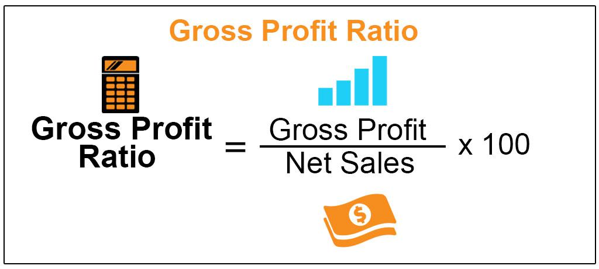

In today's fast-paced financial markets, calculating profit accurately is essential for success. One of the key metrics for understanding a company's financial position is gross profit, which serves as a primary indicator of financial health. Gross profit is the difference between a company's revenue and its cost of goods sold (COGS), and is a crucial element for investors and traders when making informed investment decisions. It provides insights into how efficiently a company is utilizing its resources to generate profits.

Algorithmic trading, often referred to as algo trading, has revolutionized the financial sector by automating the process of executing trades. It leverages complex algorithms and vast datasets to make trading decisions with precision and speed that surpass human capabilities. Such systems are designed to identify and exploit market inefficiencies and trading opportunities with minimal human intervention.



This article examines the importance of calculating gross profit and its influence on trading strategies within the context of algorithmic trading. By understanding how these elements interact, traders and investors can develop strategies that enhance profitability in the volatile financial markets. Accurate profit analysis is fundamental to algorithmic trading, enabling backtesting and optimization of strategies that adapt to varying market conditions. Through precise data analysis and automation, the future of finance and trading is increasingly shaped by these interwoven concepts.

## Table of Contents

## Understanding Gross Profit Calculation

Gross profit is a fundamental financial metric representing the difference between a company's revenue and the cost of goods sold (COGS). It provides insight into a company's efficiency in managing its production and sales processes to generate profit. The formula for calculating gross profit is straightforward:

$$
\text{Gross Profit} = \text{Revenue} - \text{COGS}
$$

Here, revenue refers to the total amount a company earns from its sales of goods or services, while COGS encompasses all expenses directly tied to the production of those goods or services. By focusing on this difference, gross profit highlights the basic profitability of product sales, before accounting for other expenses such as administrative, marketing, or financial costs.

For businesses, gross profit serves as a vital indicator of performance, helping managers and stakeholders assess how well a company is utilizing its resources. A higher gross profit implies better resource efficiency and potentially higher profitability margins. This measurement is essential for operational analysis, aiding in budgeting, pricing strategies, and cost management efforts.

In addition to its importance for internal business assessments, gross profit is also crucial for traders and investors who evaluate companies for potential investments. They often use gross profit as a benchmark to compare the operational efficiency of companies within the same industry. Since industries can differ widely in terms of production processes and cost structures, gross profit enables investors to conduct apples-to-apples comparisons of companies' core business capabilities.

For example, in industries with low profit margins, understanding how a firm manages its direct costs can provide insights into its competitive edge. This comparison helps identify industry leaders and potential investment opportunities within specific sectors, influencing investment decisions based on operational performance rather than just revenue or net income figures.

Overall, gross profit is a key component of financial analysis. Whether for internal management purposes or external investment evaluations, understanding this metric enables more informed decision-making and contributes to assessing a company’s potential for growth and success.

## Algorithmic Trading and Its Impact on Profitability

Algorithmic trading, also known as algo trading, leverages complex algorithms and high-speed data analysis to streamline the process of executing trades. This method has gained prominence due to its ability to process vast amounts of information at speeds unattainable by human traders. By analyzing historical data and market trends, algorithms can be programmed to execute trades based on predefined criteria, allowing them to capitalize on specific market conditions.

One of the most significant advantages of [algorithmic trading](/wiki/algorithmic-trading) is its capacity to eliminate human emotions from trading decisions. Emotional biases, such as fear and greed, can lead to impulsive and irrational decisions that negatively impact profitability. Algorithms operate purely on logic and data, thus minimizing the risk of such errors.

The goal of algo trading is to maximize profitability through improved efficiency and timing. By executing trades at optimal times and prices based on comprehensive data analysis, algorithms aim to achieve better returns than manual trading methods. For instance, algorithms can identify [arbitrage](/wiki/arbitrage) opportunities or execute high-frequency trades that take advantage of market microstructures.

Python, a prevalent language in algorithmic trading, provides various libraries for data analysis and [backtesting](/wiki/backtesting) trading strategies. An example Python script for a simple moving average crossover strategy might look like this:

```python
import pandas as pd
import numpy as np

# Load your market data into a DataFrame
data = pd.read_csv('market_data.csv')

# Calculate the short-term and long-term moving averages
short_window = 40
long_window = 100

data['Short_MAvg'] = data['Close'].rolling(window=short_window, min_periods=1).mean()
data['Long_MAvg'] = data['Close'].rolling(window=long_window, min_periods=1).mean()

# Create buy/sell signals
data['Signal'] = np.where(data['Short_MAvg'] > data['Long_MAvg'], 1, 0)
data['Position'] = data['Signal'].diff()

# Print the signals
print(data[['Close', 'Short_MAvg', 'Long_MAvg', 'Signal', 'Position']])
```

This script calculates the short-term and long-term moving averages of a stock's closing prices and generates buy/sell signals based on crossover points. Such algorithmic strategies can be tailored to specific market conditions and financial goals, enhancing trading efficiency.

In summary, algorithmic trading enhances the profitability potential by using advanced data analysis, reducing emotional bias in trading decisions, and executing trades with precision. As the finance industry continues to evolve, the role of technology in trading is expected to become even more critical.

## The Role of Profit Calculation in Algo Trading Strategies

Accurate profit calculation is a cornerstone in the development of effective algorithmic trading strategies. Algorithmic trading, a method that utilizes computer programs to execute trades at optimal times, relies heavily on precise profit metrics. Among these, gross profit is pivotal in evaluating the profitability of trading decisions and optimizing algorithms to enhance performance.

Traders employ gross profit calculations to backtest their algorithms. Backtesting involves running an algorithm on historical data to assess its potential effectiveness and profitability without the risk of financial loss. By analyzing the gross profit generated during backtesting, traders can gauge how well the algorithm performs in varying market conditions. This process allows for the fine-tuning of strategies, ensuring they can respond adeptly to different trading scenarios. 

Consider a simple Python script that calculates gross profit:

```python
def calculate_gross_profit(revenue, cogs):
    """Calculate gross profit given revenue and cost of goods sold."""
    return revenue - cogs

# Example usage
revenue = 100000  # example revenue
cogs = 75000  # example cost of goods sold
gross_profit = calculate_gross_profit(revenue, cogs)
print(f"Gross Profit: ${gross_profit}")
```

Moreover, algorithms adjust their strategies based on historical price data, trading volumes, and profit metrics. The integration of these elements ensures maximum trading efficiency. For example, an algorithm might identify patterns where high gross profit was achieved under specific market conditions. By recognizing these patterns, algorithms can be programmed to execute or adjust trades to capture similar conditions in the future.

Understanding different profit calculations and their impacts is crucial for refining trading strategy development. Gross profit, net profit, and operating profit all provide various insights into financial health and trading efficiency. Algorithms can be programmed to incorporate these different measures, allowing for a more holistic approach to strategy optimization.

Thorough profit analysis during the algorithm development phase is essential. This entails considering not just historical data but also potential future market changes that could affect profitability. By integrating comprehensive profit calculations, traders ensure their strategies remain competitive and viable, even as market conditions evolve. 

In summary, gross profit calculation is not just a metric but a powerful tool for enhancing algorithmic trading strategies. Analyzing this data allows traders to backtest, adjust, and optimize their algorithms effectively, ultimately leading to improved trading performance and profitability.

## Challenges and Considerations in Automated Profit Calculation

Automated profit calculation presents several challenges and considerations for traders, primarily due to the dynamic nature of financial markets and the need for precise data. One key challenge is ensuring the reliability and timeliness of data feeds. Inaccurate or outdated information can lead to erroneous profit calculations and misguided trading decisions. To mitigate this, traders must prioritize maintaining high-quality data sources and employ real-time data monitoring systems to ensure their algorithms are informed by the most recent market conditions.

Another significant consideration in automated profit calculation is the necessity for algorithmic systems to manage sudden market changes. Volatility is inherent in financial markets, and algorithms must be able to react and adapt swiftly to these fluctuations. This often involves implementing mechanisms such as stop-loss orders and adaptive algorithms that can recalibrate based on new inputs, ensuring that profitability is not severely impacted by unexpected market movements.

Integrating qualitative factors, such as market sentiment, into automated calculations presents additional complexity. While quantitative data is straightforward for algorithms to process, qualitative data, like news sentiment or geopolitical events, is less easily quantified and integrated into trading strategies. Sophisticated natural language processing (NLP) algorithms can assist in this area by analyzing large volumes of text data to gauge market sentiment, yet the challenge remains in translating this analysis into actionable trading insights.

Effective risk management is also crucial in the context of automated trading. Given the potential for significant losses in volatile markets, traders need to employ comprehensive risk management strategies. This might include diversification, hedging, and setting predefined risk thresholds within their algorithms. By managing risk effectively, traders can cushion themselves against potential losses and enhance the sustainability of their trading strategies.

In summary, automated profit calculation requires attention to data accuracy, responsiveness to market conditions, integration of qualitative insights, and robust risk management. Addressing these challenges ensures that automated trading systems remain efficient and profitable in the ever-evolving financial markets.

## Conclusion

Gross profit calculation serves as a critical metric for evaluating a company's performance and making informed trading decisions. It offers insights into a firm’s operational efficiency and resource utilization. As algorithmic trading evolves, it continually reshapes the landscape of financial markets by providing enhanced opportunities for profitability, particularly when integrated with accurate profit analysis. This evolution allows traders and investors to harness sophisticated tools that leverage precise calculations to optimize and refine trading strategies.

Understanding the intricate relationship between gross profit metrics and algorithmic trading is essential for developing effective trading strategies in today’s fast-evolving markets. These strategies often utilize historical data, [machine learning](/wiki/machine-learning) algorithms, and statistical models to predict market trends and outcomes, necessitating the accurate assimilation and analysis of financial data.

As technological advancements accelerate, the future of finance and trading will increasingly rely on the seamless integration of data analytics and automation. This integration not only enhances the speed and efficiency of trades but also enriches decision-making processes by reducing human error and reliance on pure instinct. The ability to algorithmically process copious amounts of data quickly and accurately transforms the landscape of trading, making it imperative for traders and investors to stay updated with these technological innovations.

To capitalize on these potential market opportunities, investors and traders must remain informed about the continuing dynamics between gross profit calculations and algorithmic trading. By staying attuned to these developments, they can better navigate the complexities of modern financial markets and leverage these tools for improved investment outcomes and competitive advantages.

## References & Further Reading

[1]: ["Advances in Financial Machine Learning"](https://www.amazon.com/Advances-Financial-Machine-Learning-Marcos/dp/1119482089) by Marcos Lopez de Prado

[2]: ["Evidence-Based Technical Analysis: Applying the Scientific Method and Statistical Inference to Trading Signals"](https://www.amazon.com/Evidence-Based-Technical-Analysis-Scientific-Statistical/dp/0470008741) by David Aronson

[3]: ["Machine Learning for Algorithmic Trading"](https://github.com/PacktPublishing/Machine-Learning-for-Algorithmic-Trading-Second-Edition) by Stefan Jansen

[4]: ["Quantitative Trading: How to Build Your Own Algorithmic Trading Business"](https://www.amazon.com/Quantitative-Trading-Build-Algorithmic-Business/dp/1119800064) by Ernest P. Chan

[5]: Bergstra, J., Bardenet, R., Bengio, Y., & Kégl, B. (2011). ["Algorithms for Hyper-Parameter Optimization."](https://dl.acm.org/doi/10.5555/2986459.2986743) Advances in Neural Information Processing Systems 24.