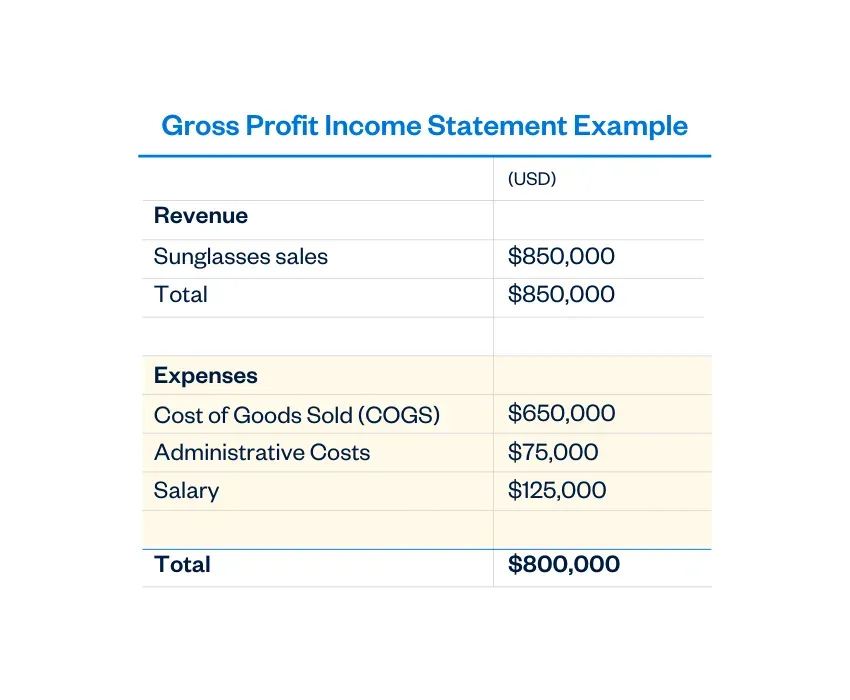

## Table of Contents

## What is gross profit?

Gross profit is the money a business makes after it subtracts the costs of making or buying its products. Imagine you sell cookies. If you spend $1 to make a cookie and sell it for $3, your gross profit for that cookie is $2. This number is important because it shows how well a business is doing at making money from its main activities, before other costs like rent or salaries are taken out.

To calculate gross profit, you take the total revenue, which is all the money coming in from sales, and subtract the cost of goods sold (COGS). COGS includes things like raw materials and direct labor costs. For example, if a company earns $100,000 from selling products and it cost them $60,000 to make those products, their gross profit would be $40,000. This figure helps business owners see if they are pricing their products correctly and if they can cover other expenses.

## How is gross profit different from net profit?

Gross profit and net profit are two important numbers that tell us how well a business is doing, but they show different things. Gross profit is what's left after a business subtracts the cost of making or buying its products from the money it gets from selling them. It's like if you sell cookies for $3 each and it costs you $1 to make each one, your gross profit per cookie is $2. This number helps business owners see if they are making enough money from selling their products to cover the costs of making them.

Net profit, on the other hand, is what's left after you take away all the other costs of running the business from the gross profit. These other costs can include things like rent, salaries, utilities, and taxes. So, if your gross profit from selling cookies is $2 per cookie, but you also have to pay $1,000 a month for rent and $500 for other expenses, you need to sell a lot of cookies to have any net profit left. Net profit gives you the full picture of how much money the business is really making after all expenses are paid.

## What is the formula for calculating gross profit?

Gross profit is calculated by subtracting the cost of goods sold (COGS) from the total revenue. Total revenue is all the money a business gets from selling its products or services. COGS includes the costs directly related to making or buying the products, like raw materials and direct labor.

For example, if a business makes $100,000 from selling its products and it cost them $60,000 to make those products, their gross profit would be $40,000. This calculation helps business owners see how much money they are making from their main activities before other costs like rent or salaries are taken out.

## Can you provide a simple example of gross profit calculation?

Let's say you run a lemonade stand. You sell each cup of lemonade for $2, and it costs you $0.50 to make each cup. If you sell 100 cups in a day, your total revenue is $200 (that's $2 times 100 cups). The cost to make those 100 cups is $50 (that's $0.50 times 100 cups). So, your gross profit for the day is $150. You get that by taking your total revenue of $200 and subtracting the cost of goods sold, which is $50.

This example shows how gross profit is calculated by taking the money you make from sales and subtracting the costs of making your product. It's a key number because it tells you if you're making enough money from selling your lemonade to cover the costs of making it, before you have to pay for other things like the stand's rent or your time.

## Why is gross profit important for a business?

Gross profit is important for a business because it shows how much money the business is making from its main activities, like selling products or services, before other costs are taken out. This number helps business owners see if they are pricing their products correctly and if they can cover the costs of making or buying what they sell. If the gross profit is high, it means the business is doing well at making money from its core activities.

Understanding gross profit also helps businesses make decisions about how to grow or improve. For example, if the gross profit is low, the business might need to find ways to reduce the costs of making its products or to increase the prices of what it sells. By keeping an eye on gross profit, business owners can spot problems early and take action to keep their business healthy and profitable.

## How does gross profit margin differ from gross profit?

Gross profit and gross profit margin are related but they show different things about a business. Gross profit is the actual money a business makes after subtracting the cost of making or buying its products from the total sales. For example, if a business sells cookies for $3 each and it costs $1 to make each cookie, the gross profit per cookie is $2. This number helps business owners see how much money they are making from their main activities before other costs like rent or salaries are taken out.

Gross profit margin, on the other hand, is a percentage that shows how much of each dollar of revenue is left after covering the cost of goods sold. To find the gross profit margin, you divide the gross profit by the total revenue and then multiply by 100 to get a percentage. Using the cookie example, if the gross profit per cookie is $2 and the selling price is $3, the gross profit margin would be about 67% (that's $2 divided by $3, times 100). This percentage helps business owners see how efficiently they are making money and compare their performance to other businesses or over time.

## What factors can affect the gross profit of a business?

Many things can change the gross profit of a business. One big [factor](/wiki/factor-investing) is the cost of making or buying the products. If the price of raw materials or labor goes up, it costs more to make each item, which means the gross profit goes down unless the business raises its prices. Another factor is how much a business can charge for its products. If there's a lot of competition, a business might have to lower its prices to keep selling, which can shrink the gross profit. Also, if a business can find cheaper ways to make its products, like using less expensive materials or finding a better supplier, it can increase its gross profit.

Another thing that can affect gross profit is how much of the product a business can sell. If sales go up, the gross profit goes up too, as long as the cost of making the products stays the same. But if sales go down, the gross profit will go down as well. Sometimes, a business might have to offer discounts or deals to sell more, which can lower the gross profit per item but might increase the total gross profit if it leads to more sales. Keeping an eye on all these things helps a business understand and manage its gross profit better.

## How can a business improve its gross profit?

A business can improve its gross profit by finding ways to lower the costs of making or buying its products. This could mean finding cheaper suppliers for raw materials, using less expensive materials, or figuring out how to make the products more efficiently. For example, if a business can reduce the cost of making a cookie from $1 to $0.80, and still sell it for $3, the gross profit per cookie goes up from $2 to $2.20. Another way is to negotiate better deals with suppliers or to buy materials in larger amounts to get a discount.

Another way to boost gross profit is by increasing the price of the products. If a business can raise the price without losing too many customers, it can make more money per item sold. For instance, if the business can sell the same cookie for $3.50 instead of $3, and it still costs $1 to make, the gross profit jumps to $2.50 per cookie. However, this has to be done carefully because if the price goes too high, people might stop buying the product, which would hurt sales and the overall gross profit.

Lastly, a business can work on increasing its sales [volume](/wiki/volume-trading-strategy). This means selling more products without increasing the cost of making them. If a business can sell more cookies at the same price and cost, the total gross profit will go up. For example, if the business sells 100 cookies a day and increases that to 120 cookies a day, the gross profit will be higher even if the profit per cookie stays the same. Sometimes, offering discounts or promotions can help increase sales, but the business needs to make sure the increase in sales makes up for any reduction in the profit per item.

## What are common mistakes to avoid when calculating gross profit?

One common mistake when calculating gross profit is mixing up different types of costs. Gross profit is found by subtracting only the cost of goods sold (COGS) from total revenue. COGS includes things like raw materials and direct labor costs. But sometimes, people might accidentally include other costs like rent, utilities, or salaries in the COGS, which makes the gross profit look smaller than it really is. To avoid this, make sure to only include the direct costs of making or buying the products in your calculation.

Another mistake is not keeping track of all the revenue. Gross profit is the difference between total revenue and COGS, so if you miss some of the sales, your gross profit will be wrong. For example, if you sell things in different places or through different ways, like online and in a store, you need to add up all the sales to get the total revenue right. Also, make sure to include any discounts or returns in your calculations because they affect the total revenue too. Keeping good records of all sales and costs helps you get the gross profit calculation right.

## How does industry type influence gross profit calculations?

Different industries have different ways of calculating gross profit because what counts as the cost of goods sold (COGS) can be different. In a manufacturing business, COGS includes the cost of raw materials, direct labor, and sometimes even factory overheads like electricity used in production. But in a retail business, COGS is usually just the cost of buying the products from suppliers. So, a manufacturer might have a more complex way of figuring out gross profit because they have to track many more costs, while a retailer might find it simpler since they mainly need to keep track of what they paid for the items they sell.

Also, some industries might have higher or lower gross profit margins because of how they work. For example, in the software industry, once the software is made, it costs very little to sell more copies, so the gross profit margin can be very high. But in the restaurant industry, the cost of food and labor is high, so the gross profit margin might be lower. Understanding these differences helps businesses in different industries know what to expect and how to manage their costs and prices to keep their gross profit healthy.

## What advanced techniques can be used to analyze gross profit trends over time?

To analyze gross profit trends over time, businesses can use advanced techniques like time series analysis. This method involves looking at gross profit data over different time periods, like months or years, to spot patterns and trends. By using time series analysis, a business can see if its gross profit is going up, down, or staying the same. It can also help predict future gross profit based on past data. For example, if a business sees that gross profit usually goes up in the summer because of higher sales, it can plan for that and make decisions about pricing or inventory accordingly.

Another technique is regression analysis, which helps understand how different factors affect gross profit. For instance, a business might use regression analysis to see how changes in the cost of raw materials or in the selling price of its products impact gross profit. By doing this, the business can figure out which factors are most important and focus on managing those to improve gross profit. Both time series and regression analysis can be done using special software that makes it easier to see and understand the numbers, helping businesses make smart decisions based on solid data.

## How do international accounting standards impact gross profit reporting?

International accounting standards, like the ones set by the International Financial Reporting Standards (IFRS), can change how businesses report their gross profit. These standards make sure that companies all over the world report their numbers in a similar way, so it's easier to compare them. For example, IFRS might say that businesses need to include certain costs in their cost of goods sold (COGS) that they might not have included before. This can make the gross profit number look different, but it helps everyone understand the business's performance in the same way.

These standards also affect how businesses handle things like inventory and depreciation, which can impact the gross profit. For instance, if a business uses a different method to value its inventory because of IFRS, it could change the COGS and, therefore, the gross profit. By following these rules, businesses make sure they are showing their gross profit in a way that is clear and fair to everyone looking at their financial reports. This helps investors, lenders, and other people make better decisions about the business.

## How do you calculate gross profit?

Gross profit is a fundamental financial metric representing the difference between a company's revenue and the cost of goods sold (COGS). It provides insight into a company's efficiency in managing its production and sales processes to generate profit. The formula for calculating gross profit is straightforward:

$$
\text{Gross Profit} = \text{Revenue} - \text{COGS}
$$

Here, revenue refers to the total amount a company earns from its sales of goods or services, while COGS encompasses all expenses directly tied to the production of those goods or services. By focusing on this difference, gross profit highlights the basic profitability of product sales, before accounting for other expenses such as administrative, marketing, or financial costs.

For businesses, gross profit serves as a vital indicator of performance, helping managers and stakeholders assess how well a company is utilizing its resources. A higher gross profit implies better resource efficiency and potentially higher profitability margins. This measurement is essential for operational analysis, aiding in budgeting, pricing strategies, and cost management efforts.

In addition to its importance for internal business assessments, gross profit is also crucial for traders and investors who evaluate companies for potential investments. They often use gross profit as a benchmark to compare the operational efficiency of companies within the same industry. Since industries can differ widely in terms of production processes and cost structures, gross profit enables investors to conduct apples-to-apples comparisons of companies' core business capabilities.

For example, in industries with low profit margins, understanding how a firm manages its direct costs can provide insights into its competitive edge. This comparison helps identify industry leaders and potential investment opportunities within specific sectors, influencing investment decisions based on operational performance rather than just revenue or net income figures.

Overall, gross profit is a key component of financial analysis. Whether for internal management purposes or external investment evaluations, understanding this metric enables more informed decision-making and contributes to assessing a company’s potential for growth and success.

## References & Further Reading

[1]: ["Advances in Financial Machine Learning"](https://www.amazon.com/Advances-Financial-Machine-Learning-Marcos/dp/1119482089) by Marcos Lopez de Prado

[2]: ["Evidence-Based Technical Analysis: Applying the Scientific Method and Statistical Inference to Trading Signals"](https://www.amazon.com/Evidence-Based-Technical-Analysis-Scientific-Statistical/dp/0470008741) by David Aronson

[3]: ["Machine Learning for Algorithmic Trading"](https://github.com/PacktPublishing/Machine-Learning-for-Algorithmic-Trading-Second-Edition) by Stefan Jansen

[4]: ["Quantitative Trading: How to Build Your Own Algorithmic Trading Business"](https://www.amazon.com/Quantitative-Trading-Build-Algorithmic-Business/dp/1119800064) by Ernest P. Chan

[5]: Bergstra, J., Bardenet, R., Bengio, Y., & Kégl, B. (2011). ["Algorithms for Hyper-Parameter Optimization."](https://dl.acm.org/doi/10.5555/2986459.2986743) Advances in Neural Information Processing Systems 24.