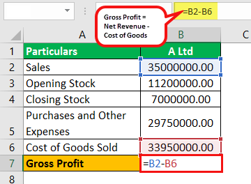

In the rapidly evolving financial landscape, understanding metrics such as gross profit margin is vital for effective financial analysis and decision-making. Gross profit margin is a crucial metric that provides insights into a company's financial health by measuring the percentage of revenue remaining after accounting for the cost of goods sold (COGS). It essentially indicates how efficiently a company is managing its production costs in relation to its revenue, offering a lens into potential areas for improving profitability.

This article explores the intersection of Excel calculations for gross profit margin and its application in financial analysis, particularly within the scope of algorithmic trading. Excel, a ubiquitous tool for analysts, serves as a practical platform to compute this metric efficiently. The gross profit margin is calculated using the formula: 



$$
\text{Gross Profit Margin} = \left( \frac{\text{Revenue} - \text{COGS}}{\text{Revenue}} \right) \times 100
$$

By integrating these Excel calculations into algorithmic trading strategies, traders and analysts can potentially enhance trading performance. Algorithmic trading, which involves using automated and pre-programmed trading instructions, can benefit from incorporating financial metrics like gross profit margin. Understanding and tracking these metrics allow for better refinement of trading models, enhancing cost management and profitability.

Whether you are a financial analyst, trader, or business owner, mastering these elements is crucial for optimizing profitability. By equipping oneself with the knowledge of computing and interpreting gross profit margin, stakeholders can make informed decisions and adjust strategies to adapt to fluid market conditions effectively.

## Table of Contents

## Understanding Gross Profit Margin

Gross profit margin is a significant financial metric that measures a company's financial efficiency by determining the percentage of revenue remaining after deducting the cost of goods sold (COGS). This key performance indicator reflects how effectively a company is managing its production costs in relation to its revenue.

To calculate the gross profit margin, use the following formula:

$$
\text{Gross Profit Margin (\%)} = \left( \frac{\text{Revenue} - \text{COGS}}{\text{Revenue}} \right) \times 100
$$

Here, "Revenue" refers to the total sales generated by the company over a specific period, while "COGS" encompasses all direct costs associated with the production of goods or services sold by the company during that period, including materials, labor, and manufacturing overhead.

Analyzing gross profit margin provides valuable insights for stakeholders, as it reveals how efficiently a company converts its production expenses into profits. A higher gross profit margin indicates a company is maintaining strong pricing strategies and managing production costs effectively. This can be particularly advantageous for making informed decisions regarding pricing, cost management, and identifying areas for improving operational efficiency.

For example, if a company consistently maintains a high gross profit margin, it suggests that the company has strong competitive advantages in production cost management and pricing power. Conversely, a declining gross profit margin might indicate rising production costs, increasing competition, or issues with pricing strategies that could undermine profitability. Understanding these trends allows stakeholders to take proactive measures to sustain or improve profit margins and overall business sustainability.

## Role of Financial Metrics in Trading

Financial metrics are pivotal in evaluating and optimizing trading strategies, providing a framework for assessing the effectiveness and efficiency of trading operations. Within the dynamic environment of [algorithmic trading](/wiki/algorithmic-trading), these metrics facilitate the continuous monitoring and improvement of strategies to ensure they are generating revenue efficiently.

Gross profit margin is a primary indicator of a company’s ability to manage its production costs relative to its revenue. In the context of trading, understanding this metric can help traders identify which securities or assets are likely to provide better profitability compared to others. By analyzing the gross profit margin, traders can make informed decisions on the allocation of resources and optimization of trading strategies, ensuring that they are focusing on securities that will enhance their profit margins.

Moreover, other financial metrics such as Return on Investment (ROI) and [volatility](/wiki/volatility-trading-strategies) are integral components of a comprehensive trading strategy assessment. ROI measures the profitability of an investment relative to its cost, providing valuable insights into the potential financial returns of a trading strategy. This metric is particularly useful for evaluating the efficiency of investments in generating profit, which is a core objective in trading strategies.

Volatility, on the other hand, indicates the degree of variation in the price of a trading instrument over time. It is crucial for assessing the risk associated with trading strategies. High volatility may present opportunities for profit through large price swings, but it also entails higher risk. Therefore, understanding volatility is essential for managing risk and ensuring that strategies align with the trader’s risk tolerance.

These financial metrics, when combined, offer a robust framework for evaluating and refining trading strategies. By regularly assessing these metrics, traders can adapt to changing market conditions, optimize their strategies for profitability, and manage risks effectively. Advanced trading platforms and programming tools such as Python can automate the calculation and analysis of these metrics, enhancing the trader’s ability to respond swiftly to market dynamics.

For instance, a Python script could be used to automate the calculation of ROI as follows:

```python
def calculate_roi(initial_investment, final_value):
    roi = (final_value - initial_investment) / initial_investment * 100
    return roi

# Example usage
initial_investment = 1000
final_value = 1200
roi = calculate_roi(initial_investment, final_value)
print(f"The ROI is {roi}%")
```

In summary, financial metrics such as gross profit margin, ROI, and volatility are indispensable tools for evaluating and optimizing trading strategies. Their integration into the analytical processes of algorithmic trading can significantly enhance cost efficiency and profitability.

## Calculating Gross Profit Margin in Excel

Excel is a powerful tool for calculating financial metrics, including gross profit margin. To derive the gross profit margin in Excel, one must first input historical revenue and Cost of Goods Sold (COGS) data into a spreadsheet. The gross profit margin, which measures the percentage of revenue remaining after accounting for COGS, is calculated using the formula:

$$
\text{Gross Profit Margin} = \left(\frac{\text{Revenue} - \text{COGS}}{\text{Revenue}}\right) \times 100
$$

### Step-by-Step Guide to Calculate Gross Profit Margin in Excel

1. **Input Data**: Start by entering the revenue and COGS data into separate cells. For example, place the revenue data in cell A1 and COGS in cell B1.

2. **Apply the Formula**: In cell C1, enter the formula to calculate the gross profit margin:
   ```excel
   =(A1 - B1) / A1
   ```
   Multiplying the result by 100 will convert the margin into a percentage.

3. **Formatting the Result**: To display the result as a percentage, adjust the cell's format in Excel by selecting the cell, right-clicking, choosing 'Format Cells,' and then selecting 'Percentage.'

4. **Interpreting the Results**: A higher gross profit margin indicates better efficiency in controlling production costs relative to revenue. This metric provides insights into a company's operational efficiency and financial health, assisting stakeholders in making informed financial decisions.

By leveraging Excel's computational features, users can efficiently track and analyze gross profit margins over time. This analysis is critical for evaluating operational performance, setting pricing strategies, and making strategic business decisions. Understanding and calculating the gross profit margin can inform how effectively a company is managing its core operations and maintaining profitability.

## Integrating Gross Margin into Algo Trading

Incorporating gross margin analysis into algorithmic trading enhances cost efficiency and profitability by providing a quantitative basis for optimizing strategies. Traders can employ these insights to establish target margins, ensuring that trade decisions align with financial objectives. By setting specific gross margin targets, traders can systematically adjust their strategies to minimize costs and maximize revenue, effectively enhancing their trading outcomes.

Excel and programming languages such as Python facilitate the automation of gross margin calculations, allowing traders to integrate these metrics into their trading algorithms seamlessly. Automation streamlines the process of data analysis, ensuring that trading strategies are continuously updated with the most current financial data. This continuous feedback loop is crucial for maintaining the profitability of trading operations, especially in dynamic market environments.

For instance, traders can adjust their algorithms to respond proactively to changes in gross margin trends. If a decline in gross margin is detected, the algorithm can trigger cost-reduction measures or adjust pricing strategies to sustain profitability. Python, with its powerful data analysis libraries such as Pandas and NumPy, offers robust tools for implementing these adjustments. Here is a simple example of how Python can be used to calculate gross profit margin and incorporate it into a trading strategy:

```python
import pandas as pd

# Sample revenue and COGS data
data = {'Revenue': [10000, 12000, 15000],
        'COGS': [6000, 7000, 9000]}

# Creating a DataFrame
df = pd.DataFrame(data)

# Calculating Gross Profit Margin
df['Gross Profit Margin'] = (df['Revenue'] - df['COGS']) / df['Revenue'] * 100

# Function to adjust strategies based on Gross Profit Margin
def adjust_strategy(row):
    if row['Gross Profit Margin'] < desired_margin:
        # Example of a strategy adjustment
        return 'Reduce Costs'
    else:
        return 'Maintain Strategy'

# Desired gross profit margin
desired_margin = 35

# Applying the adjustment strategy
df['Strategy Adjustment'] = df.apply(adjust_strategy, axis=1)

print(df)
```

In this code, a basic framework analyzes gross profit margin and suggests strategic adjustments to maintain desired profitability levels. Such automated systems ensure that trading strategies remain aligned with financial goals even as market conditions fluctuate.

By using these technologies, traders can create adaptive algorithms that effectively manage profitability against market dynamics. Emphasizing gross margin analysis as part of algorithmic trading not only supports cost efficiency but also proactively adjusts practices to sustain competitive advantages in the financial markets.

## Challenges and Considerations

Algorithmic trading, while offering high efficiency and speed, presents significant challenges that traders must navigate to maintain profitability. One primary concern is overfitting, a scenario where a trading model is excessively tailored to fit historical data. Overfitting can result in models that perform well in backtests but fail to generalize to new, unseen data, leading to suboptimal real-time performance. To mitigate overfitting, traders employ techniques such as cross-validation, a method used to assess how the results of a statistical analysis will generalize to an independent data set. It involves partitioning the data into subsets, performing the analysis on one subset (the training set), and validating the analysis on the other subset (the validation set).

High transaction costs pose another challenge, potentially eroding the profit margins of trading strategies. In high-frequency trading ([HFT](/wiki/high-frequency-trading-strategies)) environments, transaction costs—including brokerage fees, spreads, and market impact costs—can accumulate rapidly. The need for efficient execution strategies is paramount to minimize these costs. Traders often utilize algorithms designed to optimize order placement, such as those that balance the trade-off between market impact and opportunity cost.

Moreover, integrating cost analyses within trading algorithms can help address these challenges by providing real-time feedback and adjustments. By incorporating a dynamic model that factors in current transaction costs, traders can make informed decisions that preserve their profit margins. For example, a Python script could be employed to calculate and track transaction costs in real-time, adjusting the trading strategy parameters accordingly:

```python
def calculate_transaction_cost(order_size, bid_ask_spread, brokerage_fee):
    market_impact_cost = 0.1 * order_size  # Example calculation for market impact
    return (bid_ask_spread * order_size) + brokerage_fee + market_impact_cost

# Example usage
order_size = 1000  # Number of shares
bid_ask_spread = 0.05  # e.g., $0.05
brokerage_fee = 10  # Flat fee in dollars

transaction_cost = calculate_transaction_cost(order_size, bid_ask_spread, brokerage_fee)
print(f"Total Transaction Cost: ${transaction_cost}")
```

These challenges underline the importance of utilizing robust statistical techniques and taking operational costs into account to ensure trading models remain viable and profitable. Through strategic planning and technological integration, algorithmic trading can overcome these hurdles to capitalize on market opportunities efficiently.

## Conclusion

A deep understanding of financial metrics like gross profit margin is integral to formulating successful algorithmic trading strategies. Gross profit margin serves as a key performance indicator, helping traders evaluate a company's cost efficiency and profitability. By tailoring trading strategies based on this financial analysis, traders can effectively navigate fluctuating market conditions. Modern computational techniques, including programming languages like Python, facilitate the automation of gross margin calculations and enable the dynamic adjustment of trading algorithms. For instance, using Python libraries such as Pandas for data manipulation and NumPy for numerical operations allows traders to efficiently process and analyze large datasets.

Integrating traditional financial metrics with state-of-the-art computational tools not only enhances the robustness of trading strategies but also optimizes decision-making processes. This synergy ensures that traders remain agile, adjusting strategies promptly in response to new market information. Such adaptability is crucial for maintaining competitive edges and achieving sustained profitability in the intricate financial markets. Therefore, the strategic combination of a solid foundational understanding of financial metrics and advanced computational methods guarantees long-term success for traders in the financial landscape.

## References & Further Reading

[1]: ["Excel for Finance"](https://www.exceldemy.com/learn-excel/finance/formula/) by Jeffery W. Clark

[2]: ["Algorithmic Trading: Winning Strategies and Their Rationale"](https://www.amazon.com/Algorithmic-Trading-Winning-Strategies-Rationale-ebook/dp/B00CY5HC0U) by Ernest P. Chan

[3]: ["Financial Modelling in Python"](https://www.activestate.com/blog/top-10-python-packages-for-finance-and-financial-modeling/) by Shayne Fletcher and Christopher Gardner

[4]: Damodaran, A. (2012). ["Investment Valuation: Tools and Techniques for Determining the Value of Any Asset."](https://books.google.com/books/about/Investment_Valuation.html?id=5SRHAAAAQBAJ) Wiley Finance.

[5]: Hull, J. C. (2018). ["Options, Futures, and Other Derivatives."](https://www.semanticscholar.org/paper/Options%2C-Futures%2C-and-Other-Derivatives-Hull/89bdee500c8623864fc9eb7a471546aa713acc44) Pearson.