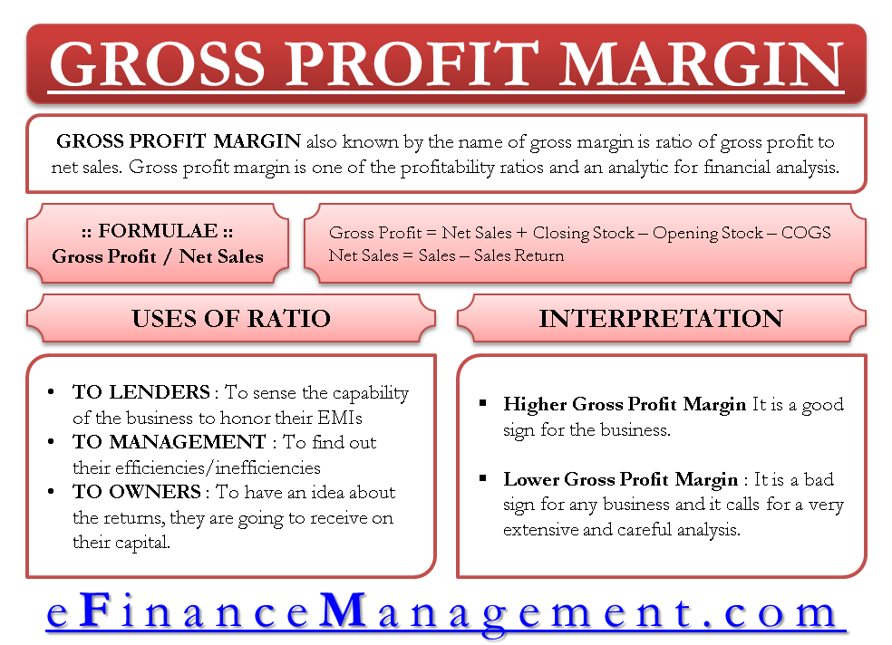

## Table of Contents

## What is gross profit margin?

Gross profit margin is a way to measure how much money a business makes from selling its products or services after paying for the costs to make or buy those products. It is calculated by taking the gross profit (which is the revenue minus the cost of goods sold) and dividing it by the total revenue, then multiplying by 100 to get a percentage. This percentage shows what portion of each dollar of revenue is left after covering the costs of goods sold.

Understanding the gross profit margin is important because it helps business owners and managers see how efficiently their business is operating. A higher gross profit margin means the business is keeping more money from each sale, which can be used to pay for other expenses like rent, salaries, and marketing. If the gross profit margin is low, it might mean the business needs to find ways to reduce the costs of goods sold or increase the prices of their products to improve profitability.

## How is the gross profit margin calculated?

Gross profit margin is calculated by first finding the gross profit. Gross profit is what you get when you take the total revenue (all the money made from sales) and subtract the cost of goods sold (the money spent to make or buy the products sold). Once you have the gross profit, you divide it by the total revenue. After that, you multiply the result by 100 to turn it into a percentage. This percentage is the gross profit margin.

For example, if a business makes $100,000 in sales and it costs them $60,000 to make or buy the products they sold, their gross profit is $40,000. To find the gross profit margin, you divide $40,000 by $100,000, which gives you 0.4. Multiply 0.4 by 100, and you get a gross profit margin of 40%. This means for every dollar of revenue, the business keeps 40 cents after paying for the cost of goods sold.

## Why is gross profit margin important for businesses?

Gross profit margin is important for businesses because it shows how well they are making money from selling their products or services. It tells business owners how much money is left from sales after paying for the things needed to make or buy those products. If the gross profit margin is high, it means the business is doing a good job at keeping more money from each sale. This extra money can be used to pay for other costs like rent, employee salaries, and marketing.

If the gross profit margin is low, it can be a warning sign that the business needs to make changes. It might need to find cheaper ways to make or buy products, or it might need to raise the prices of what it sells. By keeping an eye on the gross profit margin, business owners can make smart decisions to keep their business healthy and profitable.

## Can you provide an example of how to calculate gross profit margin?

Let's say a small bakery sells cakes and makes $50,000 in a year. The cost to make these cakes, including ingredients and other direct costs, is $30,000. To find the gross profit, we subtract the cost of goods sold from the total revenue. So, $50,000 minus $30,000 equals $20,000. This $20,000 is the gross profit.

Now, to calculate the gross profit margin, we divide the gross profit by the total revenue and then multiply by 100 to get a percentage. So, we take $20,000 and divide it by $50,000, which gives us 0.4. When we multiply 0.4 by 100, we get 40%. This means the bakery's gross profit margin is 40%. For every dollar the bakery makes, it keeps 40 cents after paying for the costs of making the cakes.

## How does gross profit margin differ from net profit margin?

Gross profit margin and net profit margin are both important numbers that show how well a business is doing, but they tell us different things. Gross profit margin looks at how much money is left after paying for the things needed to make or buy the products that are sold. It is calculated by taking the revenue, subtracting the cost of goods sold, and then dividing that number by the total revenue. For example, if a store makes $100,000 from selling items and it costs $60,000 to buy those items, the gross profit margin would be 40%.

Net profit margin, on the other hand, goes a step further. It shows how much money is left after paying for all the costs of running the business, not just the cost of goods sold. This includes things like rent, salaries, utilities, and taxes. To find the net profit margin, you subtract all these expenses from the revenue, and then divide by the total revenue. So, if that same store has other expenses totaling $20,000, the net profit would be $20,000 (from the $40,000 gross profit), and the net profit margin would be 20%. This gives a clearer picture of the overall profitability of the business.

## What is considered a good gross profit margin?

A good gross profit margin can vary a lot depending on the type of business and the industry it's in. For example, in retail, a good gross profit margin might be around 20% to 30%. But for manufacturing businesses, a good margin could be higher, often between 30% to 50%. It's important for a business to compare its gross profit margin with others in the same industry to see if it's doing well.

Even though industry standards are a good guide, a business should also look at its own goals and costs. If a business can keep its costs low and still make customers happy, it might be able to have a higher gross profit margin than the average in its industry. The key is to make sure the business is making enough money after paying for the products it sells to cover other costs and still make a profit.

## How can gross profit margin vary across different industries?

Gross profit margin can be very different from one industry to another because each type of business has its own way of making money and its own costs. For example, in the grocery business, the gross profit margin is usually low, around 10% to 15%, because the cost of buying food is high and the prices they can charge are limited. On the other hand, in the software industry, the gross profit margin can be much higher, often above 70%, because once the software is made, it doesn't cost much to sell more copies.

These differences happen because of things like how much it costs to make or buy the products, how much people are willing to pay for them, and how much competition there is in the industry. A restaurant might have a gross profit margin of about 30% to 40% because the cost of ingredients and cooking them is a big part of their total costs. But a jewelry store could have a margin of 50% or more because the price of the jewelry can be set much higher than the cost of the materials. Understanding these differences helps businesses know if they are doing well compared to others in their industry.

## What factors can affect a company's gross profit margin?

Many things can change a company's gross profit margin. One big thing is how much it costs to make or buy the things the company sells. If the cost of materials goes up, the gross profit margin can go down because the company has to pay more to make each item. Another thing is how much people are willing to pay for the product. If the company can't charge more, but the costs go up, the margin gets smaller. Competition can also affect the margin. If other companies sell similar things for less, a company might have to lower its prices, which can hurt the gross profit margin.

Also, how well a company manages its costs can make a difference. If a company finds a way to make things cheaper, like using less expensive materials or making things faster, it can keep more money from each sale. The size of the company matters too. Big companies can often buy things in bulk for less money, which can help them have a better gross profit margin. Lastly, changes in the economy, like inflation or a recession, can change how much people are willing to spend and how much things cost, which can affect the gross profit margin.

## How can a business improve its gross profit margin?

A business can improve its gross profit margin by finding ways to lower the cost of making or buying the things it sells. This might mean looking for cheaper materials, finding better deals with suppliers, or using technology to make things more efficiently. For example, if a bakery can buy flour at a lower price or use a machine to mix dough faster, it can save money on each cake it makes. This means more money is left over after paying for the ingredients, which improves the gross profit margin.

Another way to improve the gross profit margin is by raising the prices of the products or services, as long as customers are still willing to pay. A business needs to think about what its customers value and what the competition is doing. If the business can show that its products are better or different in some way, it might be able to charge more. For example, if a clothing store starts using high-quality materials and tells customers about it, it might be able to sell its clothes for more money. This can help improve the gross profit margin by bringing in more money from each sale.

## What are the limitations of using gross profit margin as a financial metric?

Gross profit margin is helpful, but it doesn't tell the whole story about a business's money situation. It only shows how much money is left after paying for the things that are sold, not all the other costs like rent, salaries, or taxes. So, a business might have a good gross profit margin but still not make any money overall if those other costs are too high. Also, gross profit margin can be different from one industry to another, so comparing a company's margin to one in a different industry might not be fair or useful.

Another problem with using gross profit margin is that it can be affected by things that don't really show how well a business is doing. For example, if a business starts selling cheaper products to bring in more customers, its gross profit margin might go down, but it might still be making more money overall. Or, if a company changes how it counts its costs, like including some costs that it didn't before, the gross profit margin can change without the business actually doing better or worse. So, while gross profit margin is a good starting point, it's important to look at other numbers too to really understand a business's health.

## How can gross profit margin be used in financial analysis and decision-making?

Gross profit margin is a key tool in financial analysis and decision-making because it shows how well a business is making money from what it sells. By looking at the gross profit margin, business owners and managers can see how much money is left after paying for the things needed to make or buy their products. This helps them understand if they are pricing their products right or if they need to find cheaper ways to make them. For example, if the gross profit margin is lower than what's normal in their industry, it might be a sign that they need to look at their costs or think about raising their prices.

In decision-making, gross profit margin can guide choices about new products, pricing strategies, and cost management. If a business is thinking about adding a new product, it can use the gross profit margin to see if it will be profitable. If the margin is high, it might be a good idea to go ahead with it. On the other hand, if the margin is low, the business might need to rethink the idea or find ways to make it work better. By keeping an eye on the gross profit margin over time, a business can make smart choices to stay healthy and grow.

## What advanced techniques can be used to interpret trends in gross profit margin over time?

To understand how gross profit margin changes over time, businesses can use a few advanced techniques. One way is to use trend analysis, which means looking at the gross profit margin over several periods to see if it's going up, down, or staying the same. By doing this, a business can see if there are any patterns or if something unusual is happening. For example, if the gross profit margin keeps going down every quarter, it might be a sign that costs are going up or that prices need to be changed. Businesses can also compare their gross profit margin trends with industry averages to see if they are doing better or worse than others in their field.

Another technique is to use ratio analysis, which involves looking at the gross profit margin alongside other financial ratios like operating margin or net profit margin. This helps to get a fuller picture of the business's financial health. For example, if the gross profit margin is going up but the net profit margin is going down, it might mean that other costs are increasing even though the business is doing well with its product sales. By using these advanced techniques, businesses can make smarter decisions about how to improve their profits and stay competitive.

## What is Gross Profit Margin and How is it Understood?

Gross profit margin is a fundamental financial metric that represents the percentage of sales revenue remaining after deducting the cost of goods sold (COGS). It effectively measures a company's ability to manage its production-related expenses while maintaining efficient pricing strategies. This metric equips investors and analysts with a means to gauge a company’s profitability and operational efficiency.

To calculate the gross profit margin, the following formula is used:

$$
\text{Gross Profit Margin} = \left( \frac{\text{Revenue} - \text{COGS}}{\text{Revenue}} \right) \times 100
$$

The result is expressed as a percentage, indicating the portion of revenue that exceeds the direct costs associated with the production of goods. A higher gross profit margin suggests that a company is proficient in controlling its production costs or has strong pricing power, positioning it as financially robust. Conversely, a lower margin might indicate inefficiencies or the need for improvement in cost management or pricing strategies.

In comparing companies within the same industry, the gross profit margin serves as a valuable benchmark. Industries vary significantly in their average gross profit margins due to differing business models and cost structures. For instance, technology companies often have higher gross profit margins compared to retail companies. Therefore, analyzing this metric allows investors and analysts to assess a company's performance relative to its peers, providing key insights into its competitive standing.

This metric's importance is underscored by its ability to reflect a company's operational strategy and market positioning. It highlights not only the management's effectiveness in cost control but also its strategic pricing capabilities, both of which are crucial in maintaining profitability. Thus, understanding the gross profit margin is essential for stakeholders aiming to evaluate a company's financial health and industry competitiveness.

## What are Financial Analysis and Profitability Metrics?

Financial analysis is the process of evaluating a company's financial statements to determine its stability and profitability. This assessment is critical for investors and stakeholders aiming to make informed decisions about investing or participating in the company's financial opportunities. Profitability metrics serve as key indicators in this analysis by providing a quantitative measure of a company's ability to generate profit relative to its income and expenses.

**Profitability Metrics**

There are several key profitability metrics that provide essential insights into different aspects of a company's financial health:

1. **Gross Profit Margin**: This metric measures the percentage of revenue that exceeds the cost of goods sold (COGS). It indicates how efficiently a company is managing its production costs relative to its revenue. The formula to calculate gross profit margin is:
$$
   \text{Gross Profit Margin} = \left(\frac{\text{Revenue} - \text{COGS}}{\text{Revenue}}\right) \times 100

$$

   A higher gross profit margin suggests that a company is effectively controlling production costs or has strong pricing power.

2. **Operating Margin**: Operating margin goes a step further by accounting for all operational expenses. It is calculated as:
$$
   \text{Operating Margin} = \left(\frac{\text{Operating Income}}{\text{Revenue}}\right) \times 100

$$

   This metric helps investors understand how much profit a company makes from its core business operations after covering variable and fixed operating costs.

3. **Net Profit Margin**: This is the most comprehensive profitability metric as it considers all types of expenses, including taxes and interest. The formula for net profit margin is:
$$
   \text{Net Profit Margin} = \left(\frac{\text{Net Income}}{\text{Revenue}}\right) \times 100

$$

   It reflects the overall profitability of a company and is useful in assessing long-term financial health.

These profitability metrics are critical for investors to determine whether a company is efficiently converting its revenues into actual profit while keeping costs in check. By comparing the profitability ratios of different companies, investors can identify market leaders and gain insights into which companies have competitive advantages.

**Application in Decision-Making**

A comprehensive understanding of these metrics is essential for making informed investment and trading decisions. Investors rely on these figures to gauge a company's operational efficiency, pricing strategy viability, and overall financial health. By analyzing trends in profitability both within a single company over time and across different companies within an industry, stakeholders can make predictions about future performance and potential investment risks.

Moreover, profitability ratios serve as benchmarks for comparing the financial performance of businesses across similar industries. In doing so, investors can identify which companies are performing at the top of their field and potentially offer better investment returns.

Overall, these metrics form the foundation of financial analysis, providing critical insights that facilitate strategic decision-making in investment and trading activities.

## References & Further Reading

[1]: ["Advances in Financial Machine Learning"](https://www.amazon.com/Advances-Financial-Machine-Learning-Marcos/dp/1119482089) by Marcos Lopez de Prado

[2]: ["Evidence-Based Technical Analysis: Applying the Scientific Method and Statistical Inference to Trading Signals"](https://www.wiley.com/en-us/Evidence+Based+Technical+Analysis%3A+Applying+the+Scientific+Method+and+Statistical+Inference+to+Trading+Signals-p-9780470008744) by David Aronson

[3]: ["Machine Learning for Algorithmic Trading"](https://github.com/PacktPublishing/Machine-Learning-for-Algorithmic-Trading-Second-Edition) by Stefan Jansen

[4]: ["Quantitative Trading: How to Build Your Own Algorithmic Trading Business"](https://www.amazon.com/Quantitative-Trading-Build-Algorithmic-Business/dp/0470284889) by Ernest P. Chan

[5]: ["Financial Statement Analysis and Security Valuation"](https://www.mheducation.com/highered/product/financial-statement-analysis-security-valuation-penman/M9780078025310.html) by Stephen Penman