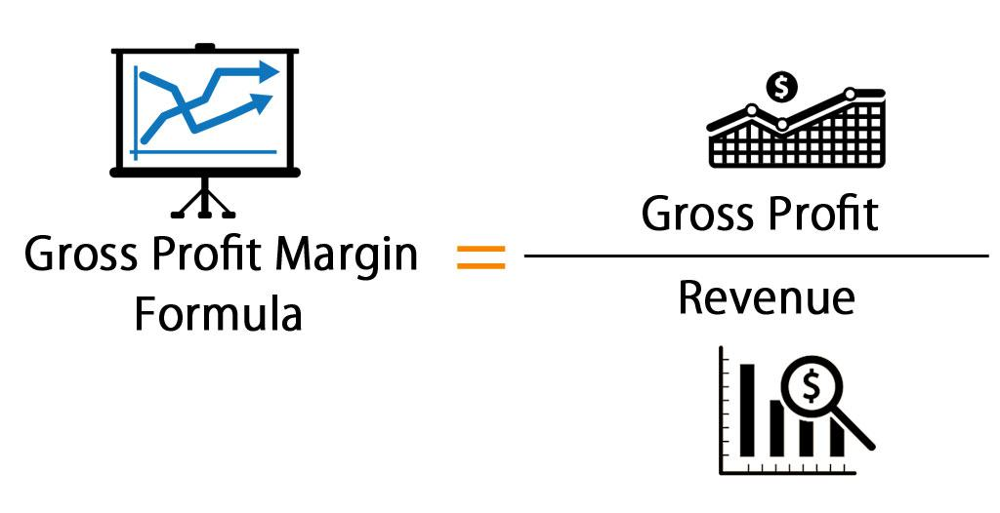

Understanding the financial health of a business is crucial for any investor or trader. Financial metrics serve as fundamental tools for evaluating a company's economic stability and potential for growth. Among these metrics, the gross profit margin stands out as a key indicator of a company's profitability. This metric reveals the proportion of revenue that remains after accounting for the cost of goods sold (COGS), providing insights into a company's efficiency in managing production costs and its pricing strategy.

Gross profit margin is not just a measure of past performance; it is instrumental in predicting future profitability. A high gross profit margin typically suggests effective cost control and strong market positioning, whereas a low margin could indicate potential issues with cost management or market competitiveness. For instance, the formula for calculating gross profit margin is:



$$
\text{Gross Profit Margin} = \frac{\text{Revenue} - \text{COGS}}{\text{Revenue}} \times 100
$$

In the context of algorithmic trading, profitability metrics like gross profit margin are integral to decision-making processes. Algorithmic trading, which involves the use of computer algorithms to execute trades at high speeds, relies heavily on financial data to identify potential trading opportunities and mitigate risks. Incorporating gross profit margin into trading algorithms can help in filtering stocks based on their profitability, thereby identifying potentially lucrative investment opportunities.

This article will explore the intricacies of gross profit margin, emphasizing its significance in financial analysis and its role in enhancing algorithmic trading strategies. By understanding how gross profit margin influences investment decisions, traders and investors can better navigate the complexities of financial markets and improve trading outcomes.

## Table of Contents

## Understanding Gross Profit Margin

Gross profit margin is a fundamental financial metric that represents the percentage of sales revenue remaining after deducting the cost of goods sold (COGS). It effectively measures a company's ability to manage its production-related expenses while maintaining efficient pricing strategies. This metric equips investors and analysts with a means to gauge a company’s profitability and operational efficiency.

To calculate the gross profit margin, the following formula is used:

$$
\text{Gross Profit Margin} = \left( \frac{\text{Revenue} - \text{COGS}}{\text{Revenue}} \right) \times 100
$$

The result is expressed as a percentage, indicating the portion of revenue that exceeds the direct costs associated with the production of goods. A higher gross profit margin suggests that a company is proficient in controlling its production costs or has strong pricing power, positioning it as financially robust. Conversely, a lower margin might indicate inefficiencies or the need for improvement in cost management or pricing strategies.

In comparing companies within the same industry, the gross profit margin serves as a valuable benchmark. Industries vary significantly in their average gross profit margins due to differing business models and cost structures. For instance, technology companies often have higher gross profit margins compared to retail companies. Therefore, analyzing this metric allows investors and analysts to assess a company's performance relative to its peers, providing key insights into its competitive standing.

This metric's importance is underscored by its ability to reflect a company's operational strategy and market positioning. It highlights not only the management's effectiveness in cost control but also its strategic pricing capabilities, both of which are crucial in maintaining profitability. Thus, understanding the gross profit margin is essential for stakeholders aiming to evaluate a company's financial health and industry competitiveness.

## Financial Analysis and Profitability Metrics

Financial analysis is the process of evaluating a company's financial statements to determine its stability and profitability. This assessment is critical for investors and stakeholders aiming to make informed decisions about investing or participating in the company's financial opportunities. Profitability metrics serve as key indicators in this analysis by providing a quantitative measure of a company's ability to generate profit relative to its income and expenses.

**Profitability Metrics**

There are several key profitability metrics that provide essential insights into different aspects of a company's financial health:

1. **Gross Profit Margin**: This metric measures the percentage of revenue that exceeds the cost of goods sold (COGS). It indicates how efficiently a company is managing its production costs relative to its revenue. The formula to calculate gross profit margin is:
$$
   \text{Gross Profit Margin} = \left(\frac{\text{Revenue} - \text{COGS}}{\text{Revenue}}\right) \times 100

$$

   A higher gross profit margin suggests that a company is effectively controlling production costs or has strong pricing power.

2. **Operating Margin**: Operating margin goes a step further by accounting for all operational expenses. It is calculated as:
$$
   \text{Operating Margin} = \left(\frac{\text{Operating Income}}{\text{Revenue}}\right) \times 100

$$

   This metric helps investors understand how much profit a company makes from its core business operations after covering variable and fixed operating costs.

3. **Net Profit Margin**: This is the most comprehensive profitability metric as it considers all types of expenses, including taxes and interest. The formula for net profit margin is:
$$
   \text{Net Profit Margin} = \left(\frac{\text{Net Income}}{\text{Revenue}}\right) \times 100

$$

   It reflects the overall profitability of a company and is useful in assessing long-term financial health.

These profitability metrics are critical for investors to determine whether a company is efficiently converting its revenues into actual profit while keeping costs in check. By comparing the profitability ratios of different companies, investors can identify market leaders and gain insights into which companies have competitive advantages.

**Application in Decision-Making**

A comprehensive understanding of these metrics is essential for making informed investment and trading decisions. Investors rely on these figures to gauge a company's operational efficiency, pricing strategy viability, and overall financial health. By analyzing trends in profitability both within a single company over time and across different companies within an industry, stakeholders can make predictions about future performance and potential investment risks.

Moreover, profitability ratios serve as benchmarks for comparing the financial performance of businesses across similar industries. In doing so, investors can identify which companies are performing at the top of their field and potentially offer better investment returns.

Overall, these metrics form the foundation of financial analysis, providing critical insights that facilitate strategic decision-making in investment and trading activities.

## The Role of Gross Profit Margin in Algo Trading

Algorithmic trading, or algo trading, employs sophisticated computer algorithms to execute trading strategies at high speeds, often capitalizing on minute market inefficiencies that human traders might miss. The integration of financial metrics such as the gross profit margin can significantly bolster the efficacy of these algorithms. 

A gross profit margin, calculated using the formula $(\text{Revenue} - \text{Cost of Goods Sold}) / \text{Revenue} \times 100$, is a measure that reflects a company's efficiency in producing goods and managing production costs. By incorporating this metric, [algorithmic trading](/wiki/algorithmic-trading) systems can enhance their decision-making processes. A robust gross profit margin serves as an indicator of a firm's competitive advantage and long-term viability. These attributes make the company an appealing target for algorithmic trading strategies. 

Traders utilize these profitability insights to filter stocks, thereby identifying potentially lucrative trading opportunities. For instance, a firm consistently posting high gross profit margins likely manages production costs efficiently and exhibits strong pricing strategies. Such attributes can imply a competitive edge in its industry, making it a candidate for algorithmic trading models focused on identifying stable investments.

By refining their models with profitability metrics like the gross profit margin, algo traders can amplify performance and profitability. Python, a common language in algorithmic trading, can be employed to integrate gross profit margin data seamlessly. Below is an example of how traders might incorporate this data:

```python
def calculate_gross_profit_margin(revenue, cogs):
    return ((revenue - cogs) / revenue) * 100

# Example data
companies = [
    {"name": "Company A", "revenue": 1000000, "cogs": 600000},
    {"name": "Company B", "revenue": 1500000, "cogs": 1100000},
]

# Filter for companies with high gross profit margins
profitable_companies = [
    company['name'] for company in companies
    if calculate_gross_profit_margin(company['revenue'], company['cogs']) > 30
]

print(profitable_companies)
```

This code snippet demonstrates a simplistic model where a trader filters for companies with a gross profit margin exceeding 30%, thus flagging them as potentially profitable trading targets. By leveraging such metrics, algorithmic traders can refine their strategies, enhancing their capacity to navigate complex market environments and deliver superior returns.

## Case Study: Applying Gross Profit Margin in Trading Strategies

Real-world examples illustrate how the gross profit margin can be applied effectively in trading strategies, particularly in algorithmic trading. Consider a hypothetical technology company, TechCo, which showcases a consistently high gross profit margin compared to its industry peers. This financial metric signifies TechCo's proficiency in managing production costs and implementing competitive pricing strategies, distinguishing it as a strong candidate for investment.

In algorithmic trading, traders utilize computer programs to automate trading decisions. By analyzing key profitability metrics, including gross profit margin, these algorithms can identify potentially lucrative stocks such as TechCo. A high gross profit margin suggests that the company maintains a comparative advantage, rendering it a promising option for stock acquisitions. Algorithmic traders may employ filters within their models to flag TechCo as a potential buy, based on its superior financial performance relative to competitors. 

This process often involves programming a set strategy, such as:

```python
def trading_signal(company_data):
    threshold_margin = 0.30  # Example threshold for gross profit margin
    if company_data['gross_profit_margin'] > threshold_margin:
        return "Buy"
    else:
        return "Hold"

# Example company data
techco_data = {
    'name': 'TechCo',
    'gross_profit_margin': 0.35
}

# Decision-making based on gross profit margin
signal = trading_signal(techco_data)
print(signal)  # Output would be "Buy"
```

This case study underscores the necessity of rigorous financial analysis when constructing trading strategies. By thoroughly evaluating TechCo's financial health, traders can make informed decisions that align with their objectives. Moreover, this analytical approach exemplifies how integrating profitability metrics such as gross profit margin within algorithmic trading models can significantly enhance performance and profitability.

The positive impact profitability metrics can have on algorithmic trading outcomes is evident in the improved decision-making processes and the ability to better predict market movements. Employing gross profit margin as a vital component in these strategies empowers traders to effectively capitalize on opportunities that secure long-term gains and sustainable growth.

## Challenges and Limitations of Using Profitability Metrics

Profitability metrics offer critical insights into a company's financial performance, yet they present certain limitations that investors and traders must consider. The gross profit margin, in particular, offers a focused view by calculating the percentage of revenue that surpasses the cost of goods sold (COGS). However, this metric does not account for other significant expenses such as administrative, marketing, and distribution costs. This exclusion can paint a narrow picture of a company's overall profitability. 

For instance, while gross profit margin evaluates how effectively a company manages its production costs relative to revenue, it may not reflect the total operational effectiveness if other costs are disproportionately high. To account for such expenses, investors may look towards other metrics like operating margin, which includes operating expenses, or net profit margin, which encompasses all expenses and taxes.

Moreover, profitability metrics are highly sensitive to external factors such as market fluctuations, industry-specific dynamics, and broader economic conditions. During economic downturns, even a company with a traditionally strong gross profit margin might experience declines due to reduced consumer spending or increased competition. Similarly, different industries have varying average gross profit margins, influenced by factors such as production costs and pricing strategies. Therefore, comparing companies across different sectors using gross profit margin alone might be misleading.

To mitigate the risk of over-reliance on a single financial ratio, traders and analysts are encouraged to combine the gross profit margin with other financial indicators. Utilizing a suite of metrics provides a more nuanced and comprehensive view of a company's financial health. For example, augmenting gross profit margin analysis with metrics like return on equity (ROE) or debt-to-equity ratio can offer a broader perspective on how well a company is using its resources and managing its financial obligations.

In conclusion, while the gross profit margin is a valuable tool for assessing profitability, acknowledging its limitations is crucial. By integrating multiple financial metrics, traders can achieve a balanced and informed approach to financial analysis, leading to more sound investment and trading decisions.

## Conclusion

Gross profit margin is a crucial metric that provides valuable insights into a company's financial health and operational efficiency. As a fundamental indicator, it helps investors and traders assess how well a company manages its production costs relative to its revenue. By incorporating gross profit margin into financial analysis and trading strategies, decision-makers can gain a deeper understanding of a company's profitability and competitive positioning. This enhanced clarity leads to more informed decision-making and potentially increased profitability.

Algorithmic traders stand to benefit significantly by integrating gross profit margin into their trading models. These metrics enable traders to identify companies with robust financial health and potentially higher investment returns. A strong gross profit margin often signals a company's effective cost management and ability to maintain pricing power, making it an attractive candidate for investment. Hence, incorporating such metrics can improve the selection process, leading to more strategic investments.

However, it is important to remain cognizant of the limitations inherent in relying solely on gross profit margin. This metric provides a narrow view, focusing only on the cost of goods sold and excluding other critical expenses, such as administrative or marketing costs. Additionally, market fluctuations, industry-specific variables, and broader economic conditions can impact profitability metrics, necessitating a cautious approach.

To mitigate these limitations, it is advisable to use gross profit margin in conjunction with other financial metrics. This comprehensive analysis enables a more holistic understanding of a company's financial situation. By adopting a well-rounded approach, traders and investors can develop better-informed trading strategies, ultimately leading to improved financial outcomes.

## References & Further Reading

[1]: ["Advances in Financial Machine Learning"](https://www.amazon.com/Advances-Financial-Machine-Learning-Marcos/dp/1119482089) by Marcos Lopez de Prado

[2]: ["Evidence-Based Technical Analysis: Applying the Scientific Method and Statistical Inference to Trading Signals"](https://www.wiley.com/en-us/Evidence+Based+Technical+Analysis%3A+Applying+the+Scientific+Method+and+Statistical+Inference+to+Trading+Signals-p-9780470008744) by David Aronson

[3]: ["Machine Learning for Algorithmic Trading"](https://github.com/PacktPublishing/Machine-Learning-for-Algorithmic-Trading-Second-Edition) by Stefan Jansen

[4]: ["Quantitative Trading: How to Build Your Own Algorithmic Trading Business"](https://www.amazon.com/Quantitative-Trading-Build-Algorithmic-Business/dp/0470284889) by Ernest P. Chan

[5]: ["Financial Statement Analysis and Security Valuation"](https://www.mheducation.com/highered/product/financial-statement-analysis-security-valuation-penman/M9780078025310.html) by Stephen Penman