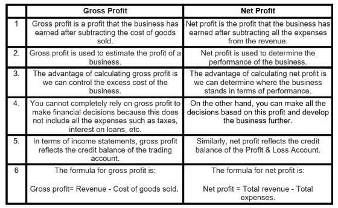

## Table of Contents

## What is gross profit?

Gross profit is the money a business makes from selling its products or services after subtracting the costs of making or buying those products. It's like if you sell a cake for $10 and it cost you $6 to make, your gross profit would be $4. This number is important because it shows how well a business is doing at making money from what it sells.

Business owners use gross profit to see if their prices are right and if they're spending too much on making their products. If the gross profit is high, it means the business is doing well at keeping costs low and selling at a good price. If it's low, the business might need to find ways to cut costs or raise prices. Gross profit helps businesses make smart decisions about how to grow and stay profitable.

## What is net income?

Net income is the money a business has left after paying all its costs. It's what you get when you take away all the expenses from the total money earned. Think of it like your allowance: if you get $20 and spend $15 on things you need, your net income is the $5 you have left.

This number is really important because it shows if a business is making money or losing it. If the net income is positive, the business is [earning](/wiki/earning-announcement) more than it's spending, which is good. If it's negative, the business is spending more than it's earning, and that's not good. Business owners look at net income to see how healthy their business is and to make plans for the future.

## How do you calculate gross profit?

To calculate gross profit, you need to know two things: the total money you made from selling things, and how much it cost to make or buy those things. The total money from sales is called revenue. The cost to make or buy the things you sell is called the cost of goods sold, or COGS for short. To find your gross profit, you subtract the cost of goods sold from your revenue. So, if you sold things for $100 and it cost you $60 to make or buy them, your gross profit would be $40.

Gross profit is important because it shows how much money you have left after paying for the things you sell. This money can be used to pay other bills like rent, salaries, and utilities. If your gross profit is high, it means you're doing a good job at keeping the costs of making or buying your products low compared to what you're selling them for. If it's low, you might need to look at ways to reduce those costs or increase your prices.

## How do you calculate net income?

Net income is the money you have left after you pay for everything your business needs. To find it, start with your total revenue, which is all the money you made from selling things. Then, subtract all your costs. These costs include the price of making or buying the things you sell, which is called the cost of goods sold, plus other expenses like rent, salaries, and utilities. The money left after you subtract all these costs is your net income.

If your net income is a positive number, it means your business is making more money than it's spending, which is good. But if it's a negative number, it means you're spending more than you're making, and that's not good. Business owners look at net income to see if their business is healthy and to make plans for the future. It's like checking your allowance to see if you can buy more things or if you need to save more.

## What are the main differences between gross profit and net income?

Gross profit and net income are both important numbers that show how well a business is doing, but they look at different things. Gross profit is what you get when you take away the cost of making or buying your products from the total money you made from selling them. It tells you how much money you have left after paying for the things you sell, but before you pay for other stuff like rent or salaries. So, if you sell a toy for $10 and it cost you $6 to make, your gross profit is $4.

Net income, on the other hand, is what's left after you pay for everything. It starts with your gross profit and then subtracts all the other costs your business has, like rent, salaries, and utilities. So, if your gross profit from the toy was $4 and you had other costs of $2, your net income would be $2. Net income shows if your business is making more money than it's spending overall, which is really important for understanding if your business is healthy or not.

## Why is it important to compare gross profit and net income?

Comparing gross profit and net income is important because it helps business owners understand different parts of their business. Gross profit shows how well a business is doing at making money from what it sells, after paying for the cost of making or buying those things. It's like checking if you're selling your lemonade at a good price after you've paid for the lemons and sugar. If the gross profit is high, it means you're doing a good job at keeping those costs low compared to what you're selling for.

Net income, on the other hand, tells you if the business is making money overall, after paying for everything. This includes not just the cost of the products, but also things like rent, salaries, and utilities. It's like looking at your allowance after you've bought all your snacks and school supplies. If the net income is positive, it means you're making more than you're spending, which is great. By comparing these two numbers, business owners can see where they might need to cut costs or increase prices to make their business healthier.

## How can gross profit and net income affect business decisions?

Gross profit and net income are important numbers that help business owners make decisions. Gross profit shows how much money a business makes from selling things after paying for what it took to make or buy them. If the gross profit is high, it means the business is doing well at keeping those costs low. This can help the owner decide if they should keep selling the same things or maybe even sell more of them. But if the gross profit is low, the owner might think about raising prices or finding cheaper ways to make their products.

Net income tells the business owner if they are making money overall, after paying for everything. This includes not just the cost of the products, but also things like rent, salaries, and utilities. If the net income is positive, it means the business is making more money than it's spending, which is good. This can help the owner feel confident about growing the business or investing in new things. But if the net income is negative, it's a warning sign that the business needs to cut costs or find ways to make more money. By looking at both gross profit and net income, business owners can make smart choices about how to run their business better.

## What factors can influence gross profit?

Gross profit can change because of many things. One big thing is how much it costs to make or buy the things you sell. If the cost of the stuff you need, like materials or parts, goes up, your gross profit might go down. Another thing is how much you charge for your products. If you can sell your things for more money without making them cost more, your gross profit can go up. Also, if you can find ways to make your products cheaper, like buying in bulk or using less expensive materials, that can help your gross profit too.

Another [factor](/wiki/factor-investing) is how well you sell your products. If you can sell more of your things, your gross profit can go up, even if the cost to make each one stays the same. But if you have to lower your prices to sell more, that might not help your gross profit. It's also important to think about what people want. If you're selling things that people really like, you might be able to charge more and make a bigger gross profit. But if you're selling things that aren't popular, you might have to lower your prices, which can hurt your gross profit.

## What factors can influence net income?

Net income is affected by many things. One big thing is how much money you make from selling your products, which is called revenue. If you can sell more things or charge more for them, your net income can go up. But if you have to lower your prices or if fewer people want to buy your products, your net income might go down. Another important thing is the cost of making or buying the things you sell, called the cost of goods sold. If these costs go up, like if the price of materials goes up, your net income can go down unless you can also raise your prices.

Other costs also play a big role in net income. These include things like rent, salaries, and utilities, which are called operating expenses. If these costs go up, like if you have to pay more for rent or if you need to hire more people, your net income can go down. But if you can find ways to make these costs lower, like moving to a cheaper place or using less electricity, your net income can go up. It's also important to think about taxes and interest on loans, because these can take away from your net income too.

Sometimes, things outside your business can affect your net income. For example, if the economy is doing well, people might have more money to spend, which can help your net income. But if the economy is not doing well, people might not buy as much, which can hurt your net income. Also, if there are new laws or rules that affect your business, like new taxes or regulations, these can change your net income too. By keeping an eye on all these things, you can make better decisions to help your business make more money.

## How do gross profit margins and net profit margins differ?

Gross profit margin and net profit margin are two ways to see how well a business is doing, but they look at different things. Gross profit margin is how much money you keep from selling your products after paying for what it cost to make or buy them. It's like if you sell a toy for $10 and it cost you $6 to make, your gross profit is $4. To find the gross profit margin, you divide the gross profit by the total money you made from selling and then multiply by 100 to get a percentage. A high gross profit margin means you're good at keeping the cost of making your products low compared to what you sell them for.

Net profit margin, on the other hand, shows how much money you have left after paying for everything your business needs. This includes not just the cost of the products, but also things like rent, salaries, and utilities. So, if your gross profit from the toy was $4 and you had other costs of $2, your net income would be $2. To find the net profit margin, you divide the net income by the total money you made from selling and then multiply by 100 to get a percentage. A high net profit margin means your business is making more money than it's spending overall, which is really important for understanding if your business is healthy or not.

## Can you provide an example of how a company might improve its gross profit and net income?

A company might improve its gross profit by finding ways to make or buy its products for less money. For example, if a company makes toys, they could buy the plastic they need in bigger amounts to get a lower price. This way, even if they sell the toys for the same price, their gross profit goes up because it costs less to make each toy. They could also look for new suppliers that offer better deals or use cheaper materials that still make a good toy. Another way is to raise the price of their toys if people are willing to pay more, which would increase the money they make from each sale and boost their gross profit.

To improve net income, the company needs to look at all its costs, not just the cost of making the toys. They could try to lower their rent by moving to a cheaper place or negotiate better deals with their landlord. They could also find ways to use less electricity or water to save on utilities. Another way is to see if they can do some jobs with fewer people or find ways to make their workers more efficient, which could lower salaries without hurting the business. By cutting these costs, the company can keep more of the money they make from selling toys, leading to a higher net income. If they can do both—lower the cost of making toys and cut other expenses—they can really boost their overall profits.

## What advanced financial ratios use gross profit and net income to assess business performance?

One advanced financial ratio that uses gross profit is the Gross Profit Margin Ratio. This ratio shows how much money a business keeps from selling its products after paying for the cost of making or buying them. To find it, you divide the gross profit by the total money made from sales and then multiply by 100 to get a percentage. A high gross profit margin means the business is good at keeping the costs of making products low compared to what they sell them for. This can help business owners see if they are pricing their products right or if they need to find cheaper ways to make them.

Another important ratio that uses net income is the Net Profit Margin Ratio. This ratio tells you how much money the business has left after paying for everything, including the cost of products and other expenses like rent and salaries. To calculate it, you divide the net income by the total money made from sales and then multiply by 100 to get a percentage. A high net profit margin means the business is making more money than it's spending overall, which is a sign of a healthy business. By looking at both the Gross Profit Margin and the Net Profit Margin, business owners can get a good picture of how well their business is doing and where they might need to make changes.

## What is the difference between Gross Profit and Net Income?

Gross profit and net income are two fundamental metrics used to assess a company's financial performance, each offering distinct insights into its operational and overall efficiency. Understanding these metrics is crucial for investors, analysts, and business managers.

### Gross Profit

Gross profit represents the income a company generates after subtracting the costs directly associated with the production of goods and services sold. These direct costs are termed as the cost of goods sold (COGS), which typically include expenses such as raw materials, direct labor, and manufacturing overhead.

Mathematically, gross profit can be expressed as:

$$
\text{Gross Profit} = \text{Revenue} - \text{Cost of Goods Sold (COGS)}
$$

Gross profit is a critical indicator of a company's core functional efficiency — how well it can turn resources into revenue. Higher gross profits suggest that a company can manage its production costs efficiently while still generating significant income from sales. Analyzing gross profit margins can thus reveal whether a company is competitive and whether its profit margins can sustain through cost fluctuations or increasing market competition.

### Net Income

Net income, often referred to as the "bottom line", is the profit remaining after all operating expenses, interest, taxes, and other expenses have been deducted from total revenue. It provides a comprehensive view of a company’s profitability, showcasing its ability to manage all expenses in relation to its revenue-generating operations.

The formula for net income is:

$$
\text{Net Income} = \text{Total Revenue} - \text{Total Expenses}
$$

Where total expenses include not only COGS but also operational expenses, interest paid on debt, and taxes.

Net income is a vital measure of a company’s financial success over a given period, reflecting its ability to increase its shareholders' value. It's what remains for reinvestment, payment of dividends, or reserved for future financial security. Investors and stakeholders use net income to assess how well the company is performing overall, beyond just its operational efficiencies.

### Insightful Comparisons

While gross profit and net income both evaluate different aspects of a company’s performance, they serve distinct purposes. Gross profit focuses on the efficiency of production and sales activities, providing insight into the cost structures and sales capabilities. In contrast, net income offers a broader perspective, encapsulating the company’s overall profitability after accounting for all expenses, thus reflecting the end-outcome of all company operations and financial activities.

Understanding these metrics in depth allows stakeholders to perform a nuanced analysis of the company’s financial health. Evaluating both alongside other financial indicators enables the development of informed business strategies, enhancing the capability to navigate economic challenges and capitalize on potential growth opportunities.

## What are the key differences between gross profit and net income?

Gross profit and net income are fundamental financial metrics used to assess different facets of a company's fiscal performance. These metrics, while related, offer distinct perspectives on a company’s profitability and efficiency.

Gross profit is calculated by subtracting the cost of goods sold (COGS) from total revenue. This metric highlights how efficiently a company can produce and sell its goods or services. It provides insights into production costs and pricing strategies and is crucial for understanding the direct costs associated with the production process. The formula for gross profit is:

$$
\text{Gross Profit} = \text{Revenue} - \text{COGS}
$$

Gross profit allows stakeholders to evaluate whether the core operations of the company are generating sufficient profit, excluding the indirect expenses. It is an essential measure for determining the efficiency of production and supply chain management.

In contrast, net income, often referred to as the "bottom line," offers a comprehensive overview of a company’s overall profitability. It is derived by subtracting all expenses from total revenue, including operating expenses, taxes, interest, and other non-operational costs. The formula for net income is:

$$
\text{Net Income} = \text{Revenue} - \text{Total Expenses}
$$

Here, total expenses encompass not only COGS but also selling, general, and administrative expenses (SG&A), interest, taxes, and any other financial obligations the company has. Net income offers insights into the overall financial stability and profitability of an organization. It is a critical metric for shareholders and potential investors as it reflects the residual earnings that can be distributed as dividends or reinvested in the business.

In summary, while gross profit examines the efficiency of production and the ability to manage direct costs, net income provides a complete picture of company profitability by accounting for all financial activities. Both gross profit and net income are essential for deciphering different aspects of business operations and making informed decisions regarding financial health and investment potential.

## What are the limitations of relying solely on gross profit and net income?

Gross profit and net income are critical financial metrics for assessing a company's performance. However, using these metrics in isolation can result in incomplete or misleading conclusions. A comprehensive financial analysis should incorporate additional metrics to provide a more accurate picture of a company's financial health.

Operating profit is an essential metric to consider alongside gross profit and net income. It accounts for the operating expenses a company incurs in maintaining its operations, excluding non-operating expenses like taxes and interest. This metric provides insight into the core operational efficiency and profitability:

$$
\text{Operating Profit} = \text{Gross Profit} - \text{Operating Expenses}
$$

Operating profit is crucial for understanding how well a company manages its core business activities, beyond just production costs or the bottom line.

Cash flow statements offer another layer of insight. They present a view of a company's cash inflows and outflows from operating, investing, and financing activities. Unlike net income, which is subject to non-cash items like depreciation, cash flow statements showcase real economic conditions and [liquidity](/wiki/liquidity-risk-premium):

$$
\text{Cash Flow from Operations} = \text{Net Income} + \text{Non-cash Expenses} - \text{Changes in Working Capital}
$$

Analyzing cash flows helps identify how effectively a company converts its revenue into actual cash, which is crucial for sustaining day-to-day operations.

Additionally, various profitability ratios should be considered. These ratios, such as return on assets (ROA) and return on equity (ROE), provide a comparative measure of a company's profitability relative to its assets or equity, respectively:

$$
\text{ROA} = \frac{\text{Net Income}}{\text{Total Assets}}
$$

$$
\text{ROE} = \frac{\text{Net Income}}{\text{Shareholder's Equity}}
$$

These ratios can give insights into how efficiently a company utilizes its resources to generate profits.

In conclusion, while gross profit and net income are important metrics for evaluating a company's profitability, they must be analyzed alongside operating profit, cash flow statements, and profitability ratios. This comprehensive approach ensures a more accurate and holistic understanding of a company’s financial status.

## How can financial metrics be implemented in an algorithmic trading strategy?

Algorithmic trading, often referred to as algo trading, leverages financial metrics to develop and refine trading strategies. One of the critical processes in this approach is [backtesting](/wiki/backtesting), which involves testing strategies against historical data to assess their potential future performance. Accurate backtesting is essential for validating the effectiveness of a trading strategy before implementing it in live markets.

In the context of backtesting, several key algorithmic performance indicators are utilized to enhance trading strategies. Among these, the Sharpe Ratio, Maximum Drawdown, and Profit Factor are fundamental. 

### Sharpe Ratio

The Sharpe Ratio is a widely used metric that measures the risk-adjusted return of an investment strategy. It is defined as:

$$

\text{Sharpe Ratio} = \frac{R_p - R_f}{\sigma_p} 
$$

Where:
- $R_p$ is the average return of the portfolio.
- $R_f$ is the risk-free rate.
- $\sigma_p$ is the standard deviation of the portfolio's excess return.

A higher Sharpe Ratio indicates that the strategy provides better risk-adjusted returns, making it a critical metric for evaluating the desirability of a trading strategy.

### Maximum Drawdown

Maximum Drawdown (MDD) is another vital performance indicator that represents the largest drop from a peak to a trough in the value of a portfolio before a new peak is attained. It is crucial for understanding the risk associated with a trading strategy as it highlights potential losses. The formula for Maximum Drawdown is:

$$

\text{MDD} = \frac{\text{Trough Value} - \text{Peak Value}}{\text{Peak Value}} 
$$

This metric is essential for risk management as it helps traders understand the worst-case scenario for a strategy.

### Profit Factor

The Profit Factor is the ratio of gross profits to gross losses, used to measure the financial performance of a trading strategy. It is calculated as:

$$

\text{Profit Factor} = \frac{\text{Total Gross Profit}}{\text{Total Gross Loss}} 
$$

A Profit Factor greater than one indicates that a strategy is profitable over time. This ratio helps in evaluating the efficiency of a trading strategy by comparing the total value generated over losses.

By incorporating these financial metrics, traders can fine-tune their [algorithmic trading](/wiki/algorithmic-trading) strategies to manage risk more effectively and optimize returns. Using historical data, algo traders can backtest and iterate their strategies, facilitating more informed decisions and increasing the likelihood of success in financial markets.

## References & Further Reading

[1]: ["Advances in Financial Machine Learning"](https://www.amazon.com/Advances-Financial-Machine-Learning-Marcos/dp/1119482089) by Marcos Lopez de Prado

[2]: ["Machine Learning for Algorithmic Trading"](https://github.com/stefan-jansen/machine-learning-for-trading) by Stefan Jansen

[3]: ["Quantitative Trading: How to Build Your Own Algorithmic Trading Business"](https://www.amazon.com/Quantitative-Trading-Build-Algorithmic-Business/dp/1119800064) by Ernest P. Chan

[4]: Bloomfield, R. J., Nelson, M. W., & Soltes, E. F. (2016). ["Gathering Data for Financial Trading: Sources and Techniques."](https://papers.ssrn.com/sol3/papers.cfm?abstract_id=2809325) Financial Analysts Journal.

[5]: Porter, A. (2008). ["Financial Management for Decision Making."](https://books.google.com/books/about/Financial_Management_for_Decision_Makers.html?id=Mn--DwAAQBAJ) Cyan Communications.