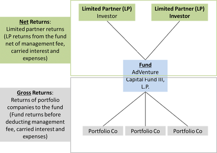

## Table of Contents

## What is the Gross Rate of Return?

The Gross Rate of Return is a way to measure how much money an investment makes before any costs or fees are taken out. It shows the total growth of your investment as a percentage. For example, if you put $100 into an investment and it grows to $110, the gross rate of return would be 10%. This number helps you see how well your investment is doing without considering any expenses.

However, the gross rate of return does not give you the full picture because it doesn't include things like taxes, management fees, or other costs. These expenses can make a big difference in how much money you actually keep. So, while the gross rate of return is useful for understanding the growth of your investment, you should also look at the net rate of return, which subtracts these costs, to get a clearer idea of your real earnings.

## What is the Net Rate of Return?

The Net Rate of Return is what you actually earn on an investment after all costs and fees are taken out. It shows you the real growth of your money, considering things like taxes, management fees, and other expenses. For example, if you invest $100 and it grows to $110 before fees, but you have to pay $5 in fees, your net rate of return would be 5% because you end up with $105.

This number is important because it tells you how much money you really keep at the end of the day. It's different from the gross rate of return, which doesn't account for these costs. Knowing the net rate of return helps you make better decisions about where to put your money, as it gives you a clearer picture of the true performance of your investments.

## How is the Gross Rate of Return calculated?

The Gross Rate of Return is calculated by figuring out how much more money you have after an investment grows, before taking away any fees or costs. You start by finding the difference between the ending value of your investment and the starting value. Then, you divide that difference by the starting value of your investment. Finally, you multiply the result by 100 to turn it into a percentage. For example, if you invest $100 and it grows to $110, the difference is $10. Divide $10 by $100 to get 0.1, then multiply by 100 to get a 10% gross rate of return.

This way of calculating the gross rate of return helps you see how well your investment did without thinking about any costs yet. It's like looking at the total growth of your money before any fees or taxes are taken out. Remember, though, this number doesn't show you the final amount you'll keep because it doesn't include expenses. That's why it's also important to look at the net rate of return, which does subtract these costs, to understand the real earnings from your investment.

## How is the Net Rate of Return calculated?

The Net Rate of Return is what you actually earn on your investment after all the costs and fees are taken out. To calculate it, you start with the ending value of your investment and subtract any fees, taxes, or other expenses. Then, you take this new number, which is the actual amount of money you have left, and subtract the starting value of your investment. The difference you get is how much your investment really grew. Divide this difference by the starting value of your investment, and then multiply by 100 to turn it into a percentage. This percentage is your net rate of return.

For example, if you invest $100 and it grows to $110 before fees, but you have to pay $5 in fees, your ending value after fees is $105. Subtract the starting value of $100 from $105 to get $5. Divide $5 by $100 to get 0.05, then multiply by 100 to get a 5% net rate of return. This number shows you the real growth of your money because it takes into account all the costs you had to pay. It's different from the gross rate of return, which doesn't include these costs, and it helps you understand how much money you actually keep at the end of the day.

## What are the key differences between Gross Rate of Return and Net Rate of Return?

The main difference between the Gross Rate of Return and the Net Rate of Return is what they include. The Gross Rate of Return looks at how much your investment grew before any costs are taken out. It's like checking how much more money you have after your investment grows, but without thinking about fees or taxes yet. For example, if you invest $100 and it grows to $110, the Gross Rate of Return would be 10%. This number helps you see how well your investment did before any expenses.

On the other hand, the Net Rate of Return shows you the actual money you keep after all the costs are subtracted. It takes into account things like fees, taxes, and other expenses that you have to pay. Using the same example, if you invest $100 and it grows to $110 but you have to pay $5 in fees, your ending value after fees is $105. The Net Rate of Return would then be 5%, because it shows the real growth of your money after all the costs. Knowing both rates helps you understand the full picture of your investment's performance.

## Why is it important to consider both Gross and Net Rates of Return when evaluating investments?

It's important to look at both the Gross and Net Rates of Return when you're thinking about investments because they tell you different things about how your money is doing. The Gross Rate of Return shows you how much your investment grew before any fees or taxes are taken out. This number helps you see the overall performance of your investment, like how much more money you have after it grows. It's good to know this because it gives you a sense of how well your investment did on its own, without any costs getting in the way.

But, the Net Rate of Return is what really matters at the end of the day because it tells you how much money you actually keep after all the costs are subtracted. This includes fees, taxes, and other expenses that can take a big chunk out of your earnings. By looking at the Net Rate of Return, you get a clear picture of the real growth of your money. Knowing both rates helps you make smarter choices about where to put your money, as you can see both the potential growth and the actual money you'll end up with after all costs.

## Can you provide an example of how Gross and Net Rates of Return might differ in a real-world scenario?

Imagine you invest $1,000 in a mutual fund. After a year, your investment grows to $1,100. The Gross Rate of Return would be 10% because you calculate it by taking the difference between the ending value ($1,100) and the starting value ($1,000), which is $100, and then dividing that by the starting value ($1,000). That gives you 0.1, and when you multiply by 100, you get 10%. This shows you how well the mutual fund did before any costs are taken out.

However, there are fees to consider. Let's say the mutual fund charges a 1% management fee, which is $11 on your $1,100. After paying this fee, you're left with $1,089. The Net Rate of Return would be calculated by taking the difference between this new ending value ($1,089) and the starting value ($1,000), which is $89, and then dividing by the starting value ($1,000). That gives you 0.089, and when you multiply by 100, you get 8.9%. This number shows you the real growth of your money after the fees are taken out, giving you a better idea of what you actually earned from your investment.

## How do taxes affect the Net Rate of Return?

Taxes can make a big difference in your Net Rate of Return because they take away some of the money you earn from your investments. When you make money from your investments, you usually have to pay taxes on that money. The amount of taxes you pay depends on things like how much money you made, what kind of investment it is, and where you live. For example, if you earn $100 from your investment and you have to pay $20 in taxes, the taxes lower the amount of money you actually keep.

This means that when you calculate your Net Rate of Return, you need to subtract the taxes along with any other fees. If you invested $1,000 and it grew to $1,100, but you had to pay $100 in taxes, your ending value after taxes would be $1,000. So, your Net Rate of Return would be 0%, because you ended up with the same amount of money you started with. Knowing how taxes affect your Net Rate of Return helps you see the real earnings from your investments and plan better for the future.

## What role do fees and expenses play in the difference between Gross and Net Rates of Return?

Fees and expenses are the main reasons why the Gross Rate of Return and the Net Rate of Return are different. The Gross Rate of Return shows you how much your investment grew before any costs are taken out. It's like looking at the total growth of your money without thinking about fees or taxes yet. But, in real life, you have to pay for things like management fees, transaction costs, and other expenses. These costs come out of the money you earn from your investment, so they make the actual amount you keep smaller.

The Net Rate of Return takes all these fees and expenses into account, showing you the real growth of your money after everything is paid. For example, if you invest $100 and it grows to $110, your Gross Rate of Return would be 10%. But if you have to pay $5 in fees, your ending value after fees would be $105, and your Net Rate of Return would be 5%. This difference is important because it tells you how much money you actually get to keep at the end of the day. Knowing both rates helps you understand how fees and expenses affect your investment's performance.

## How can inflation impact the real value of Gross and Net Rates of Return?

Inflation can make the Gross and Net Rates of Return less valuable because it reduces the buying power of money over time. If you earn a 5% return on your investment but inflation is at 3%, the real value of your return is only 2%. This means that even though your investment grew, the money you get back can buy less than before because prices for goods and services have gone up. So, when you look at your Gross Rate of Return, you need to think about how inflation might be eating away at that growth.

The same goes for the Net Rate of Return. After you take out all the fees and taxes, you still need to consider inflation to understand the real value of what you're left with. For example, if your Net Rate of Return is 4% but inflation is 3%, your real earnings are only 1%. This is important because it shows you how much your money is really growing in terms of what you can actually buy with it. Always keeping an eye on inflation helps you see the true impact of your investment returns.

## What are some advanced strategies to optimize the Net Rate of Return?

One way to optimize your Net Rate of Return is to keep an eye on the fees you're paying. You can do this by choosing investments that have lower fees, like index funds instead of actively managed funds. Another way is to use tax-advantaged accounts like IRAs or 401(k)s. These accounts can help you save on taxes, which means more of your investment earnings stay in your pocket. Also, think about diversifying your investments. By spreading your money across different types of investments, you can lower your risk and maybe even get a better return.

Another strategy is to reinvest your earnings. When you take the money you make from your investments and put it back into more investments, your money can grow even faster because of compound interest. You should also pay attention to the timing of your investments. Sometimes, it can be better to invest when the market is low, so you can buy at a lower price and sell when the market goes up. Finally, always keep learning about the market and new investment opportunities. The more you know, the better choices you can make to boost your Net Rate of Return.

## How do Gross and Net Rates of Return influence long-term investment planning and decision-making?

Gross and Net Rates of Return are important numbers to think about when you're planning your investments for the long term. The Gross Rate of Return shows you how much your investment grows before any costs are taken out. It's like looking at the total growth of your money without thinking about fees or taxes yet. This number helps you see how well your investment is doing by itself. When you're making long-term plans, knowing the Gross Rate of Return can help you decide which investments might grow the most over time. But remember, it's just part of the picture because it doesn't tell you how much money you'll actually keep.

The Net Rate of Return is what really matters at the end of the day because it shows you the actual money you keep after all the costs are subtracted. This includes fees, taxes, and other expenses that can take a big chunk out of your earnings. When you're making decisions about where to put your money for the long term, looking at the Net Rate of Return helps you understand the real growth of your money. It tells you how much you'll actually have left to use or reinvest. By considering both rates, you can make smarter choices about your investments, balancing the potential for growth with the real earnings you'll end up with after all costs.

## What is the Gross Rate of Return and How is it Understood?

Gross rate of return is a fundamental metric that evaluates the overall profitability of an investment before considering any associated costs such as expenses, fees, and taxes. It represents the raw growth of an investment over a specific period, providing investors with a preliminary understanding of how their capital has increased.

To calculate the gross rate of return, the following formula is used:

$$
\text{Gross Rate of Return} = \frac{\text{Ending Value of Investment} - \text{Beginning Value of Investment}}{\text{Beginning Value of Investment}} \times 100
$$

This formula essentially captures the percentage change in the value of the investment, offering a clear perspective on its performance.

### Example

Consider an investor who purchases shares in a company for $10,000. After one year, the value of these shares rises to $12,000. To determine the gross rate of return:

1. **Identify the ending value of the investment:** $12,000
2. **Identify the beginning value of the investment:** $10,000

Using the formula:

$$
\text{Gross Rate of Return} = \frac{12,000 - 10,000}{10,000} \times 100 = 20\%
$$

This indicates a 20% gross rate of return, reflecting the investment's growth over the year without accounting for any costs incurred during the investment period.

### Python Example

For those interested in automating this calculation, Python can be a useful tool. Below is a simple script to calculate the gross rate of return:

```python
def calculate_gross_return(beginning_value, ending_value):
    gross_return = ((ending_value - beginning_value) / beginning_value) * 100
    return gross_return

beginning_investment = 10000
ending_investment = 12000

gross_rate = calculate_gross_return(beginning_investment, ending_investment)
print(f"Gross Rate of Return: {gross_rate}%")
```

This code snippet illustrates how to programmatically calculate the gross rate of return, providing flexibility and automation for investors managing multiple investments. The gross rate of return remains a crucial concept as it offers an unadulterated view of an investment's performance, serving as a foundational metric before additional calculations for net returns are made.

## What is the process for decoding the net rate of return?

Net rate of return represents a comprehensive measure of an investment's profitability by factoring in all applicable expenses such as fees, taxes, and inflation. Unlike the gross rate of return, which provides a straightforward calculation of an investment's growth, the net rate of return reflects the actual economic benefit to the investor after these deductions.

**Calculating the Net Rate of Return**

The net rate of return can be calculated using the following formula:

$$
\text{Net Rate of Return} = \left( \frac{\text{Ending Value} - \text{Beginning Value} - \text{Expenses}}{\text{Beginning Value}} \right) \times 100
$$

where:
- **Ending Value** is the value of the investment at the end of the period.
- **Beginning Value** is the initial investment amount.
- **Expenses** include all costs associated with maintaining the investment, such as management fees, transaction costs, and taxes.

**Example Calculation**

Consider an investment with an initial value of $10,000. By the end of the year, the investment grows to $11,200. During the year, $150 in fees and taxes are incurred. To calculate the net rate of return:

1. Compute the gross gain: $11,200 - $10,000 = $1,200.
2. Subtract the expenses: $1,200 - $150 = $1,050.
3. Divide by the beginning value and multiply by 100 to calculate the percentage:

$$
\text{Net Rate of Return} = \left( \frac{1,050}{10,000} \right) \times 100 = 10.5\%
$$

**Comparison with Gross Rate of Return**

The gross rate of return in the above scenario would be:

$$
\text{Gross Rate of Return} = \left( \frac{1,200}{10,000} \right) \times 100 = 12\%
$$

Comparing these calculations illustrates the importance of the net rate, which at 10.5% provides a more realistic account of the investor's [earning](/wiki/earning-announcement) power after accounting for necessary expenses. This comparison helps investors ascertain the true economic return of their investments and make informed decisions.

**Considerations for Investors**

When evaluating investment opportunities, it is essential to consider both the net and gross rates of return. The net rate of return is particularly critical for understanding the actual financial impact of the investment, offering clarity on how costs and taxes can affect overall profitability. Understanding these differences assists investors in aligning their investment strategies with their financial goals and risk tolerance.

## What are the key differences between Gross and Net Rate of Return?

Gross and net rates of return are essential metrics used to evaluate the profitability of an investment. They provide distinct perspectives that help investors make informed decisions. Understanding these differences is crucial for accurate assessment and comparison of investment performance.

### Gross Rate of Return

The gross rate of return represents the total percentage increase in the value of an investment before accounting for any deductions such as fees, taxes, or inflation. It offers a broad view of an investment's profitability by highlighting the total income generated over a specific period.

The formula for the gross rate of return is:

$$
\text{Gross Rate of Return} = \left( \frac{\text{Ending Value} - \text{Beginning Value}}{\text{Beginning Value}} \right) \times 100
$$

For example, if an investor purchases a stock for $1,000 and sells it later for $1,200, the gross rate of return would be calculated as follows:

$$
\text{Gross Rate of Return} = \left( \frac{1200 - 1000}{1000} \right) \times 100 = 20\%
$$

### Net Rate of Return

In contrast, the net rate of return provides a more realistic measure of investment profitability by including all applicable costs such as management fees, transaction fees, taxes, and inflation. This adjustment offers investors a clearer picture of the actual economic return on their investments, allowing for more accurate evaluations and comparisons.

The formula for the net rate of return can be represented as:

$$
\text{Net Rate of Return} = \left( \frac{\text{Ending Value} - \text{Beginning Value} - \text{Costs}}{\text{Beginning Value}} \right) \times 100
$$

Consider the same investment scenario where there are $50 in fees and $10 in taxes. The net rate of return would then be:

$$
\text{Net Rate of Return} = \left( \frac{1200 - 1000 - 60}{1000} \right) \times 100 = 14\%
$$

### Key Differences

The primary distinction between gross and net rates of return is the exclusion or inclusion of fees, taxes, and other costs:

1. **Exclusion of Costs in Gross Rate**: The gross rate provides a high-level overview, useful for understanding the maximum potential of an investment. However, it may give a misleading impression if the additional costs are significant.

2. **Inclusion of Costs in Net Rate**: The net rate offers a practical measure of investment profitability by reflecting the true economic gains. It helps investors compare different opportunities on a like-for-like basis.

### Impact on Investment Decision-Making

The difference between gross and net rates of return can significantly impact decision-making. A high gross return may initially attract investors, but the true profitability can only be evaluated by considering net returns. For instance, a mutual fund may advertise a high gross return, but high management fees could reduce the net return to a level comparable to or even lower than other funds with more modest gross returns but lower costs.

In conclusion, while gross rates of return can be useful for initial assessments, net rates of return are crucial for making informed investment choices. Understanding these differences enables investors to align their strategies with their financial goals, ensuring a more comprehensive evaluation of potential investments.

## What is the Performance Evaluation of Algorithmic Strategies?

Algorithmic trading systems are increasingly vital in performance evaluation due to their ability to leverage gross rates of return for benchmarking. Gross rates of return provide an unadjusted view of profitability and serve as a preliminary measure of an algorithm's efficacy. By focusing on gross returns, [algorithmic trading](/wiki/algorithmic-trading) seeks to identify strategies that maximize investment growth prior to accounting for transaction costs, taxes, and other financial considerations.

Two critical metrics that complement gross rates of return in evaluating algorithmic trading strategies are the Sharpe Ratio and Alpha. The Sharpe Ratio measures the risk-adjusted return of an investment, providing insight into how much excess return is received for the extra [volatility](/wiki/volatility-trading-strategies) endured by holding a riskier asset. It is calculated as:

$$
\text{Sharpe Ratio} = \frac{R_p - R_f}{\sigma_p}
$$

where $R_p$ is the return of the portfolio, $R_f$ is the risk-free rate, and $\sigma_p$ is the standard deviation of the portfolio's excess return. A higher Sharpe Ratio signifies that a portfolio's returns are more robust relative to its risk, making it an essential tool in comparing the performance of algorithmic strategies.

Alpha, on the other hand, represents the excess return of an investment relative to a benchmark index, providing a clear measure of a portfolio's ability to yield returns beyond market movements. It is calculated using the formula:

$$
\alpha = R_p - [R_f + \beta \times (R_m - R_f)]
$$

where $R_p$ is the portfolio return, $\beta$ is the portfolio's beta relative to the market, $R_m$ is the market return, and $R_f$ is the risk-free rate. A positive Alpha indicates that the portfolio has performed better than its benchmark, after adjusting for market risk.

Incorporating these metrics is essential for long-term investment success as they enable investors to assess the efficiency and effectiveness of their trading strategies. They provide a nuanced understanding of performance that goes beyond simple gross returns. Through rigorous performance evaluation, investors can fine-tune their algorithmic approaches, optimizing them for both risk and return, ultimately improving the reliability and profitability of their investment portfolios. By persists in leveraging these quantitative methods, traders can enhance their strategic decision-making, aligning their approaches more closely with their financial objectives.

## References & Further Reading

[1]: Chan, E. (2009). ["Quantitative Trading: How to Build Your Own Algorithmic Trading Business"](https://github.com/ftvision/quant_trading_echan_book). Wiley.

[2]: Jansen, S. (2018). ["Machine Learning for Algorithmic Trading"](https://github.com/stefan-jansen/machine-learning-for-trading). Packt Publishing.

[3]: Lopez de Prado, M. (2018). ["Advances in Financial Machine Learning"](https://www.amazon.com/Advances-Financial-Machine-Learning-Marcos/dp/1119482089). Wiley.

[4]: Aronson, D. (2006). ["Evidence-Based Technical Analysis: Applying the Scientific Method and Statistical Inference to Trading Signals"](https://www.amazon.com/Evidence-Based-Technical-Analysis-Scientific-Statistical/dp/0470008741). Wiley.

[5]: Pardo, R. (2011). ["The Evaluation and Optimization of Trading Strategies"](https://onlinelibrary.wiley.com/doi/book/10.1002/9781119196969). Wiley.