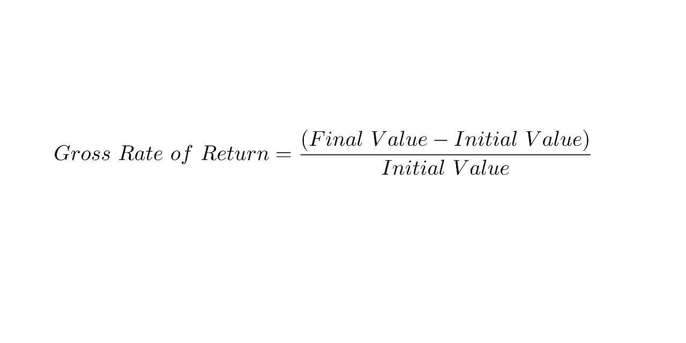

In today's rapidly evolving financial landscape, understanding investment returns is crucial for both novice and experienced investors. Investment returns can be broadly quantified through two primary metrics: the gross rate of return and the net rate of return. These metrics serve as essential tools for evaluating the profitability and viability of investment opportunities, each offering a unique perspective on the performance of investments.

The gross rate of return provides an overarching view of an investment's profitability before deductions for expenses, taxes, and fees. This metric highlights the total gain or loss experienced by an investment over a specific period, presenting a raw measure of growth that can guide initial investment assessments. Conversely, the net rate of return refines this picture by accounting for various deductions, offering a more realistic view of the investor's actual earnings. Understanding these distinctions is essential for investors aiming to make informed decisions that maximize their financial outcomes.



In recent years, algorithmic trading has emerged as a transformative force in the financial markets, bridging the gap between traditional investment metrics and new technological innovations. By leveraging advanced algorithms and computational power, algorithmic trading can optimize both gross and net returns. Through strategic decision-making and cost minimization, this trading approach enhances overall investment efficiency.

This article aims to explore the nuances of gross and net rates of return and the influential role of algorithmic trading in maximizing investment returns. By detailing each concept, comparing their implications, and examining their relevance within algorithmic trading, investors can gain comprehensive insights into optimizing their portfolios effectively.

## Table of Contents

## Understanding Gross Rate of Return

Gross rate of return is a fundamental metric that evaluates the overall profitability of an investment before considering any associated costs such as expenses, fees, and taxes. It represents the raw growth of an investment over a specific period, providing investors with a preliminary understanding of how their capital has increased.

To calculate the gross rate of return, the following formula is used:

$$
\text{Gross Rate of Return} = \frac{\text{Ending Value of Investment} - \text{Beginning Value of Investment}}{\text{Beginning Value of Investment}} \times 100
$$

This formula essentially captures the percentage change in the value of the investment, offering a clear perspective on its performance.

### Example

Consider an investor who purchases shares in a company for $10,000. After one year, the value of these shares rises to $12,000. To determine the gross rate of return:

1. **Identify the ending value of the investment:** $12,000
2. **Identify the beginning value of the investment:** $10,000

Using the formula:

$$
\text{Gross Rate of Return} = \frac{12,000 - 10,000}{10,000} \times 100 = 20\%
$$

This indicates a 20% gross rate of return, reflecting the investment's growth over the year without accounting for any costs incurred during the investment period.

### Python Example

For those interested in automating this calculation, Python can be a useful tool. Below is a simple script to calculate the gross rate of return:

```python
def calculate_gross_return(beginning_value, ending_value):
    gross_return = ((ending_value - beginning_value) / beginning_value) * 100
    return gross_return

beginning_investment = 10000
ending_investment = 12000

gross_rate = calculate_gross_return(beginning_investment, ending_investment)
print(f"Gross Rate of Return: {gross_rate}%")
```

This code snippet illustrates how to programmatically calculate the gross rate of return, providing flexibility and automation for investors managing multiple investments. The gross rate of return remains a crucial concept as it offers an unadulterated view of an investment's performance, serving as a foundational metric before additional calculations for net returns are made.

## Decoding the Net Rate of Return

Net rate of return represents a comprehensive measure of an investment's profitability by factoring in all applicable expenses such as fees, taxes, and inflation. Unlike the gross rate of return, which provides a straightforward calculation of an investment's growth, the net rate of return reflects the actual economic benefit to the investor after these deductions.

**Calculating the Net Rate of Return**

The net rate of return can be calculated using the following formula:

$$
\text{Net Rate of Return} = \left( \frac{\text{Ending Value} - \text{Beginning Value} - \text{Expenses}}{\text{Beginning Value}} \right) \times 100
$$

where:
- **Ending Value** is the value of the investment at the end of the period.
- **Beginning Value** is the initial investment amount.
- **Expenses** include all costs associated with maintaining the investment, such as management fees, transaction costs, and taxes.

**Example Calculation**

Consider an investment with an initial value of $10,000. By the end of the year, the investment grows to $11,200. During the year, $150 in fees and taxes are incurred. To calculate the net rate of return:

1. Compute the gross gain: $11,200 - $10,000 = $1,200.
2. Subtract the expenses: $1,200 - $150 = $1,050.
3. Divide by the beginning value and multiply by 100 to calculate the percentage:

$$
\text{Net Rate of Return} = \left( \frac{1,050}{10,000} \right) \times 100 = 10.5\%
$$

**Comparison with Gross Rate of Return**

The gross rate of return in the above scenario would be:

$$
\text{Gross Rate of Return} = \left( \frac{1,200}{10,000} \right) \times 100 = 12\%
$$

Comparing these calculations illustrates the importance of the net rate, which at 10.5% provides a more realistic account of the investor's [earning](/wiki/earning-announcement) power after accounting for necessary expenses. This comparison helps investors ascertain the true economic return of their investments and make informed decisions.

**Considerations for Investors**

When evaluating investment opportunities, it is essential to consider both the net and gross rates of return. The net rate of return is particularly critical for understanding the actual financial impact of the investment, offering clarity on how costs and taxes can affect overall profitability. Understanding these differences assists investors in aligning their investment strategies with their financial goals and risk tolerance.

## Gross vs. Net Rate of Return: Key Differences

Gross and net rates of return are essential metrics used to evaluate the profitability of an investment. They provide distinct perspectives that help investors make informed decisions. Understanding these differences is crucial for accurate assessment and comparison of investment performance.

### Gross Rate of Return

The gross rate of return represents the total percentage increase in the value of an investment before accounting for any deductions such as fees, taxes, or inflation. It offers a broad view of an investment's profitability by highlighting the total income generated over a specific period.

The formula for the gross rate of return is:

$$
\text{Gross Rate of Return} = \left( \frac{\text{Ending Value} - \text{Beginning Value}}{\text{Beginning Value}} \right) \times 100
$$

For example, if an investor purchases a stock for $1,000 and sells it later for $1,200, the gross rate of return would be calculated as follows:

$$
\text{Gross Rate of Return} = \left( \frac{1200 - 1000}{1000} \right) \times 100 = 20\%
$$

### Net Rate of Return

In contrast, the net rate of return provides a more realistic measure of investment profitability by including all applicable costs such as management fees, transaction fees, taxes, and inflation. This adjustment offers investors a clearer picture of the actual economic return on their investments, allowing for more accurate evaluations and comparisons.

The formula for the net rate of return can be represented as:

$$
\text{Net Rate of Return} = \left( \frac{\text{Ending Value} - \text{Beginning Value} - \text{Costs}}{\text{Beginning Value}} \right) \times 100
$$

Consider the same investment scenario where there are $50 in fees and $10 in taxes. The net rate of return would then be:

$$
\text{Net Rate of Return} = \left( \frac{1200 - 1000 - 60}{1000} \right) \times 100 = 14\%
$$

### Key Differences

The primary distinction between gross and net rates of return is the exclusion or inclusion of fees, taxes, and other costs:

1. **Exclusion of Costs in Gross Rate**: The gross rate provides a high-level overview, useful for understanding the maximum potential of an investment. However, it may give a misleading impression if the additional costs are significant.

2. **Inclusion of Costs in Net Rate**: The net rate offers a practical measure of investment profitability by reflecting the true economic gains. It helps investors compare different opportunities on a like-for-like basis.

### Impact on Investment Decision-Making

The difference between gross and net rates of return can significantly impact decision-making. A high gross return may initially attract investors, but the true profitability can only be evaluated by considering net returns. For instance, a mutual fund may advertise a high gross return, but high management fees could reduce the net return to a level comparable to or even lower than other funds with more modest gross returns but lower costs.

In conclusion, while gross rates of return can be useful for initial assessments, net rates of return are crucial for making informed investment choices. Understanding these differences enables investors to align their strategies with their financial goals, ensuring a more comprehensive evaluation of potential investments.

## The Role of Algorithmic Trading in Optimizing Returns

Algorithmic trading employs advanced mathematical models and computing systems to execute trades with minimal human intervention. This approach leverages algorithms—precise sets of instructions for calculations or data-processing tasks—to make rapid and efficient trading decisions. The primary advantage of [algorithmic trading](/wiki/algorithmic-trading) lies in its potential to enhance both gross and net returns by reducing trading costs and increasing operational efficiency.

The core objective of algorithmic trading is to capitalize on computational power and speed. Algorithms are designed to analyze multiple market variables simultaneously, identifying profitable trading opportunities at a speed incomprehensible to any single human. This capability allows the execution of trades at optimal prices and times, thereby potentially improving the gross rate of return, which represents the investment's profitability before incurring costs such as fees and taxes.

Moreover, algorithmic trading can significantly reduce transaction costs, thereby optimizing the net rate of return. The net rate of return, which accounts for costs, taxes, and inflation, provides a clearer picture of true investment profitability. By minimizing transaction costs through efficient trade executions, slippage, and [arbitrage](/wiki/arbitrage) opportunities, algorithmic trading helps enhance this metric.

Integration of algorithmic trading in financial markets has transformed traditional trading methods. High-frequency trading ([HFT](/wiki/high-frequency-trading-strategies)), a subset of algorithmic trading, exemplifies the extent of its dominance. HFT systems execute thousands of trades per second, optimizing profit margins by capitalizing on minute price deviations that would be invisible or unreachable to slower, manual trading processes.

The influence of algorithmic trading extends to the modification of rate of return metrics. As algorithms adapt to market fluctuations, they employ [backtesting](/wiki/backtesting)—a process that assesses the algorithm's effectiveness against historical data—to refine strategies. This continuous feedback loop enables constant optimization of both gross and net returns by improving algorithm accuracy and functionality.

In summary, algorithmic trading offers robust opportunities to optimize investment returns through cost minimization and efficiency maximization. By integrating these systems into financial markets, investors and firms can refine their approaches to achieve enhanced profitability, reflected in improved gross and net return metrics.

## Performance Evaluation of Algorithmic Strategies

Algorithmic trading systems are increasingly vital in performance evaluation due to their ability to leverage gross rates of return for benchmarking. Gross rates of return provide an unadjusted view of profitability and serve as a preliminary measure of an algorithm's efficacy. By focusing on gross returns, algorithmic trading seeks to identify strategies that maximize investment growth prior to accounting for transaction costs, taxes, and other financial considerations.

Two critical metrics that complement gross rates of return in evaluating algorithmic trading strategies are the Sharpe Ratio and Alpha. The Sharpe Ratio measures the risk-adjusted return of an investment, providing insight into how much excess return is received for the extra [volatility](/wiki/volatility-trading-strategies) endured by holding a riskier asset. It is calculated as:

$$
\text{Sharpe Ratio} = \frac{R_p - R_f}{\sigma_p}
$$

where $R_p$ is the return of the portfolio, $R_f$ is the risk-free rate, and $\sigma_p$ is the standard deviation of the portfolio's excess return. A higher Sharpe Ratio signifies that a portfolio's returns are more robust relative to its risk, making it an essential tool in comparing the performance of algorithmic strategies.

Alpha, on the other hand, represents the excess return of an investment relative to a benchmark index, providing a clear measure of a portfolio's ability to yield returns beyond market movements. It is calculated using the formula:

$$
\alpha = R_p - [R_f + \beta \times (R_m - R_f)]
$$

where $R_p$ is the portfolio return, $\beta$ is the portfolio's beta relative to the market, $R_m$ is the market return, and $R_f$ is the risk-free rate. A positive Alpha indicates that the portfolio has performed better than its benchmark, after adjusting for market risk.

Incorporating these metrics is essential for long-term investment success as they enable investors to assess the efficiency and effectiveness of their trading strategies. They provide a nuanced understanding of performance that goes beyond simple gross returns. Through rigorous performance evaluation, investors can fine-tune their algorithmic approaches, optimizing them for both risk and return, ultimately improving the reliability and profitability of their investment portfolios. By persists in leveraging these quantitative methods, traders can enhance their strategic decision-making, aligning their approaches more closely with their financial objectives.

## Practical Applications and Limitations

Gross and net rates of return are essential metrics in diverse investment scenarios, providing insights into an investment's performance. Their utility extends across various asset classes and investment strategies, offering investors tools to assess profitability and make informed decisions.

In real-world applications, understanding the distinction between gross and net rates of return is crucial for accurately gauging investment performance. The gross rate of return measures the overall appreciation of an investment, considering the rise in value over a specific period. This unfiltered view is critical when comparing different investments or market indices. For example, a mutual fund manager might use the gross rate of return to assess the fund's performance relative to a benchmark index, disregarding the impact of fees or taxes in the initial stage of evaluation.

However, the net rate of return provides a more realistic picture by factoring in expenses such as management fees, transaction costs, taxes, and inflation. This metric is indispensable for individual investors who need to understand the actual gain or loss on their investments after all costs are considered. A practical example is an investor comparing two mutual funds: while one may show a higher gross return, its higher fees might lead to a lower net return, making the other fund a more lucrative option.

Despite their usefulness, gross and net rates of return have limitations when used in isolation. The gross rate tends to overstate profitability by ignoring costs, leading to misleading conclusions about an investment's performance. On the other hand, while the net rate of return provides a clearer picture after expenses, it may not capture the underlying risk associated with the investment, which can lead to an incomplete understanding of its viability.

To incorporate these metrics effectively into a holistic investment strategy, investors should consider additional factors. One approach is to use the net rate of return in conjunction with risk-adjusted performance metrics, such as the Sharpe Ratio or the Sortino Ratio. The Sharpe Ratio, $\frac{R_p - R_f}{\sigma_p}$, where $R_p$ is the portfolio return, $R_f$ is the risk-free rate, and $\sigma_p$ is the standard deviation of the portfolio's excess return, evaluates how well the return of an asset compensates for the risk taken.

Moreover, algorithmic trading can further enhance investment strategies by leveraging these metrics. Algorithmic systems can optimize trades to minimize costs, thus potentially improving net returns. By integrating these metrics into an automated decision-making process, traders can more efficiently balance the risks and rewards of their strategies, maintaining a competitive edge in the financial markets.

In summary, while gross and net rates of return are foundational to assessing investment performance, their limitations underscore the importance of a multi-dimensional analysis of investments. By combining these rates with risk assessments and advanced trading strategies, investors can develop a more comprehensive approach to maximizing their financial outcomes.

## Conclusion

Understanding both the gross and net rates of return is essential for making informed investment decisions. By grasping these concepts, investors can assess their investments' overall profitability and the actual economic return after expenses such as fees, taxes, and inflation. The gross rate of return provides a preliminary view of investment growth, while the net rate offers a more realistic picture by reflecting the true gains after necessary deductions.

Algorithmic trading presents significant potential to enhance portfolio returns. Through the use of advanced mathematical models and systems, algorithmic trading can optimize the timing and execution of trades, reducing transaction costs and capitalizing on market inefficiencies. This optimization is instrumental in improving both gross and net rates of return, as it allows for increased efficiency and cost-effectiveness in trading strategies.

It is crucial for investors to incorporate both the gross and net rates of return as part of a comprehensive evaluation of their investment strategies. By understanding these metrics, investors can make better comparisons between different investments and strategies, leading to more informed and strategic decision-making. Moreover, algorithmic trading can be a powerful tool within this framework, further optimizing returns by leveraging technology to refine execution and enhance overall profitability. The integration of these elements supports the pursuit of long-term investment success and financial growth.

## FAQs

### Address common questions about gross and net rates of return and their calculation.

#### What is the difference between the gross rate of return and the net rate of return?

The gross rate of return refers to the total return on investment before accounting for any deductions such as fees, taxes, or other expenses. It provides an unadjusted view of an investment's overall performance. The formula for the gross rate of return is:
$$
\text{Gross Rate of Return} = \frac{\text{Final Value} - \text{Initial Value}}{\text{Initial Value}}
$$

In contrast, the net rate of return includes deductions for fees, taxes, and inflation, offering a more realistic assessment of the investment's profitability. This is calculated as:
$$
\text{Net Rate of Return} = \frac{\text{Final Value} - \text{Initial Value} - \text{Expenses}}{\text{Initial Value}}
$$

#### Why is it important to consider both rates?

Considering both the gross and net rates of return provides a fuller understanding of an investment's profitability. While the gross rate offers a snapshot of total returns unencumbered by costs, the net rate reflects the actual gains, considering real-world financial factors. This dual perspective assists investors in comparing different investments on a like-for-like basis and in assessing the cost-effectiveness of their investment strategies.

### Clarify misconceptions about algorithmic trading and its role in investment returns.

#### Does algorithmic trading guarantee better investment returns?

While algorithmic trading can optimize decision-making using sophisticated models and reduce transaction costs, it does not guarantee superior investment returns. Instead, its effectiveness depends on the quality of the algorithms used, market conditions, and how well these algorithms are integrated into a broader investment strategy. Successful algorithmic trading necessitates rigorous testing and performance evaluation against established benchmarks like the Sharpe Ratio and Alpha.

#### Is algorithmic trading only for large financial institutions?

Algorithmic trading was once predominantly used by large institutions due to its demand for computational power and access to data. However, advancements in technology have democratized access, allowing individual investors and smaller firms to utilize algorithmic strategies through trading platforms and software. Despite this, successful implementation still requires a deep understanding of both finance and technology.

### Provide additional resources for readers to further explore these topics.

To further understand gross and net rates of return, and algorithmic trading, consider the following resources:

- **Books**: 
  - "A Random Walk Down Wall Street" by Burton Malkiel for foundational investment knowledge.
  - "Algorithmic Trading: Winning Strategies and Their Rationale" by Ernest Chan for insights into trading algorithms.

- **Online Courses**:
  - "Investment and Portfolio Management" on Coursera offers a comprehensive introduction to investment principles.
  - "Algorithmic Trading and Machine Learning" on Udemy provides practical guidance on building trading algorithms.

- **Websites**:
  - Investopedia (www.investopedia.com) for articles and tutorials on investment terminology and strategies.
  - Quantitative Finance Stack Exchange (https://quant.stackexchange.com) for community-driven Q&A on quantitative trading topics.

## References & Further Reading

[1]: Chan, E. (2009). ["Quantitative Trading: How to Build Your Own Algorithmic Trading Business"](https://github.com/ftvision/quant_trading_echan_book). Wiley.

[2]: Jansen, S. (2018). ["Machine Learning for Algorithmic Trading"](https://github.com/stefan-jansen/machine-learning-for-trading). Packt Publishing.

[3]: Lopez de Prado, M. (2018). ["Advances in Financial Machine Learning"](https://www.amazon.com/Advances-Financial-Machine-Learning-Marcos/dp/1119482089). Wiley.

[4]: Aronson, D. (2006). ["Evidence-Based Technical Analysis: Applying the Scientific Method and Statistical Inference to Trading Signals"](https://www.amazon.com/Evidence-Based-Technical-Analysis-Scientific-Statistical/dp/0470008741). Wiley.

[5]: Pardo, R. (2011). ["The Evaluation and Optimization of Trading Strategies"](https://onlinelibrary.wiley.com/doi/book/10.1002/9781119196969). Wiley.