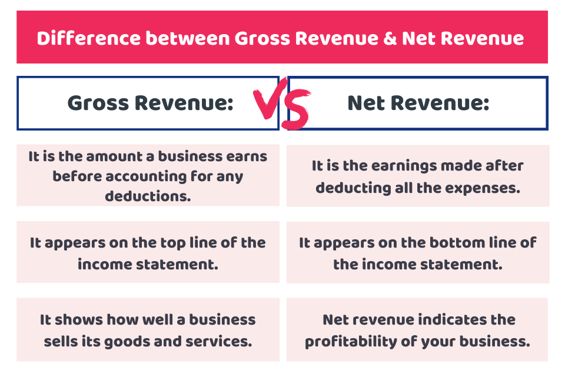

## Table of Contents

## What is gross revenue?

Gross revenue is the total amount of money a business makes from selling its products or services before any costs or expenses are taken out. It's like the starting point of a business's income, showing how much money comes in from customers before anything else is considered. For example, if a store sells 100 items at $10 each, its gross revenue would be $1,000.

This number is important because it gives a clear picture of a company's sales performance. Businesses use gross revenue to see how well they are doing in the market and to compare their performance over time or against other companies. However, it doesn't tell the whole story because it doesn't include costs like rent, salaries, or materials, which are subtracted later to find out the net profit.

## What is net revenue?

Net revenue is what a business has left after taking away certain costs from its gross revenue. These costs are usually things like discounts, returns, or allowances that customers get. So, if a store sells $1,000 worth of items but gives $100 in discounts, the net revenue would be $900. It's like the money a business really keeps from sales after giving customers some breaks.

This number is important because it shows a more accurate picture of how much money a business is actually making from sales. It helps business owners understand how effective their sales strategies are, after considering customer satisfaction through discounts and returns. While gross revenue tells you the total sales, net revenue gives you a clearer idea of the money that stays with the business after immediate customer-related expenses.

## How do gross revenue and net revenue differ?

Gross revenue and net revenue are two important numbers that businesses look at, but they show different things. Gross revenue is the total amount of money a business makes from selling its products or services before taking away any costs. It's like the starting point of a business's income, showing all the money that comes in from customers. For example, if a store sells 100 items at $10 each, its gross revenue would be $1,000.

Net revenue, on the other hand, is what's left after taking away certain costs from the gross revenue. These costs are usually things like discounts, returns, or allowances that customers get. So, if that same store gives $100 in discounts, the net revenue would be $900. Net revenue shows the money a business really keeps from sales after giving customers some breaks. It's a more accurate picture of how much money a business is actually making from sales, after considering customer satisfaction through discounts and returns.

## Why is it important to report both gross and net revenue?

Reporting both gross and net revenue is important because they give different but useful information about a business. Gross revenue tells you the total amount of money coming in from sales before any costs are taken out. This number shows how well a business is doing in terms of selling its products or services. It's like the big picture of sales performance, which can be used to compare against other businesses or to see how sales are growing over time.

Net revenue, on the other hand, gives a more detailed look at what the business is actually keeping after giving customers discounts, returns, or allowances. This number is important because it shows the real money a business has after these immediate costs. It helps business owners understand how effective their sales strategies are and how much they are really earning from sales. By looking at both gross and net revenue, a business can get a complete picture of its financial health and make better decisions.

## What are common deductions from gross revenue to arrive at net revenue?

When a business wants to find out its net revenue, it starts with the gross revenue and then takes away some common costs. The most common deduction is discounts. This is when a business gives customers a lower price on their products or services. For example, if a store sells an item for $100 but gives a $10 discount, that $10 comes off the gross revenue. Another common deduction is returns, which happen when customers bring back items they bought and get their money back. If a customer returns a $50 item, that $50 is taken away from the gross revenue.

Allowances are another deduction that businesses often make. These are reductions in the price of goods because they might be damaged or not what the customer expected. For instance, if a customer buys a shirt for $30 but it has a small tear, the store might give a $5 allowance, reducing the revenue by that amount. All these deductions—discounts, returns, and allowances—are subtracted from the gross revenue to get the net revenue. This gives a clearer picture of the money the business really keeps from sales after giving customers these benefits.

## How do businesses calculate gross revenue?

To calculate gross revenue, a business adds up all the money it makes from selling its products or services. This means they look at every sale they make, no matter how big or small, and add all those amounts together. For example, if a store sells 100 items at $10 each, the gross revenue would be $1,000. It's like counting all the cash that comes into the business from customers before anything else is taken out.

Gross revenue is important because it shows how much money a business is bringing in from sales before any costs are subtracted. It's the starting point for figuring out how well a business is doing. Businesses use this number to see how their sales are doing over time or to compare themselves with other companies. But remember, gross revenue doesn't tell the whole story because it doesn't include any costs like rent, salaries, or materials, which are taken out later to find the net profit.

## How do businesses calculate net revenue?

To calculate net revenue, a business starts with its gross revenue and then subtracts certain costs. These costs usually include discounts, returns, and allowances that customers get. For example, if a store sells $1,000 worth of items but gives $100 in discounts, the net revenue would be $900. It's like taking the total money from sales and then taking away the money given back to customers for different reasons.

Net revenue is important because it shows the real money a business keeps after giving customers some breaks. It helps business owners understand how much they are actually making from sales, after considering customer satisfaction through discounts and returns. By looking at net revenue, a business can get a clearer picture of its financial health and make better decisions about its sales strategies.

## What are the typical accounting standards for reporting gross and net revenue?

When businesses report their gross and net revenue, they usually follow certain rules called accounting standards. These standards help make sure that the numbers are clear and the same for everyone. Two common standards are Generally Accepted Accounting Principles (GAAP) in the United States and International Financial Reporting Standards (IFRS) used in many other countries. Both sets of rules tell businesses how to count their money correctly. For gross revenue, they say to add up all the money from sales before taking anything away. For net revenue, they say to take away costs like discounts, returns, and allowances from the gross revenue.

These standards are important because they help people who look at the business's numbers, like investors or banks, understand them better. If everyone uses the same rules, it's easier to compare one business with another. Gross revenue shows how much money a business makes from sales before any costs, which is useful for seeing the big picture of sales. Net revenue shows what the business really keeps after giving customers some money back, which gives a clearer idea of how much the business is actually earning. By following these standards, businesses can make sure their reports are accurate and helpful.

## How does the presentation of gross vs. net revenue affect financial analysis?

The way a business shows its gross and net revenue can change how people understand its money situation. Gross revenue is like the starting point, showing all the money that comes in from sales before any costs are taken away. It's useful for seeing how well a business is doing at selling stuff. But it doesn't tell the whole story because it doesn't include costs like discounts or returns. If someone only looks at gross revenue, they might think a business is doing better than it really is, because they aren't seeing the money the business gives back to customers.

Net revenue, on the other hand, is what's left after taking away costs like discounts, returns, and allowances from the gross revenue. It gives a clearer picture of the money a business really keeps from sales. When people do financial analysis, they often look at net revenue to understand how much a business is actually earning. If a business only shows gross revenue, it might look like it's making more money than it really is. But by looking at both gross and net revenue, people can get a full understanding of the business's financial health and make better decisions.

## What are the tax implications of gross vs. net revenue reporting?

When a business reports its revenue, it can affect how much taxes it has to pay. Gross revenue is all the money a business makes from sales before taking away any costs. The tax people, like the IRS in the U.S., look at gross revenue to figure out how much a business should pay in taxes. But, businesses usually don't pay taxes on their gross revenue. Instead, they pay taxes on their net income, which is what's left after taking away all costs, not just the ones that make up net revenue.

Net revenue is what a business has after taking away costs like discounts, returns, and allowances from the gross revenue. It's a closer look at the money a business really keeps from sales. While net revenue is important for understanding how much money a business is making, it's not directly used for tax purposes. The business still needs to subtract other costs like rent, salaries, and materials from the net revenue to find the net income, which is what they pay taxes on. So, while both gross and net revenue are important numbers, it's the net income that matters most for taxes.

## How do different industries report gross and net revenue differently?

Different industries might report gross and net revenue in their own ways because their businesses are different. For example, in retail, gross revenue is all the money from selling things before any discounts or returns. But they might have a lot of returns and discounts, so their net revenue can be a lot less than their gross revenue. In a restaurant, gross revenue is all the money from selling food and drinks, but they might not have as many returns, so the difference between gross and net revenue might not be as big.

In the software industry, things can be different again. Gross revenue might include money from selling software licenses and subscriptions, but they often give discounts or refunds, so net revenue can be lower. Also, some software companies might count money from support services as part of their gross revenue, which can make their numbers look different from a retail store or restaurant. Each industry has its own way of doing business, so how they report gross and net revenue can change to fit what they do.

## What are the potential pitfalls in misreporting gross and net revenue?

Misreporting gross and net revenue can cause big problems for a business. If a company says its gross revenue is higher than it really is, it might look like it's doing better than it actually is. This can fool investors or banks into thinking the business is more successful, which can lead to bad decisions like giving the company more money or buying its stock. But when the truth comes out, it can hurt the business's reputation and make people lose trust in it. Also, if the company is caught misreporting, it might have to pay fines or even face legal trouble.

On the other hand, if a business reports its net revenue wrong, it can also cause issues. If a company says its net revenue is higher than it should be, it might seem like it's keeping more money from sales than it really is. This can make the business look healthier than it is, which can lead to problems when people start looking closer at the numbers. If the net revenue is reported too low, it might make the business look like it's not doing well, which can scare away investors or make it hard to get loans. Either way, misreporting can lead to wrong decisions and harm the business in the long run.

## What is Gross Revenue and How Can We Understand It?

Gross revenue, sometimes referred to as gross sales, is defined as the total income generated from the sale of goods or services before any deductions such as returns, allowances, or discounts are applied. This financial metric is essential as it provides an initial view of a company's sales efficiency and helps assess market demand.

In the context of financial assessments, gross revenue serves as a primary indicator of how effectively a company can sell its products or services. This metric is particularly important for companies in the retail sector. Retailers rely significantly on gross revenue to measure their top-line performance, which represents the total revenue earned before accounting for any costs, thus providing a clear picture of the company's sales capabilities and market presence.

The calculation of gross revenue is relatively straightforward. It involves summing up all sales transactions during a given period without subtracting the cost of goods sold. In mathematical terms, if "TR" represents total revenue and "D" represents the deductions (like discounts and returns), then gross revenue (GR) is expressed simply as:

$$
GR = TR
$$

For stakeholders like investors and financial analysts, gross revenue is a pivotal part of a company’s financial statements. Analyzing this figure allows them to assess a company's market position and operational scale. It is a clear-cut representation of a company's capacity to generate sales and a vital component in evaluating the health and growth prospects of a business.

Regular scrutiny of gross revenue assists in understanding a company's revenue-generating potential without biases introduced by concessions or expenses, thus offering a foundational metric for developing investment theses and business strategies. As such, gross revenue is indispensable in crafting a transparent and precise financial overview, forming the basis for further financial analysis and strategic planning.

## What is the analysis of net revenue?

Net revenue is defined as gross revenue minus costs incurred from discounts, returns, and allowances. This metric serves as a more accurate representation of a company's financial performance by incorporating sales-related expenses that directly impact revenue. The formula for calculating net revenue can be expressed as:

$$
\text{Net Revenue} = \text{Gross Revenue} - \text{Discounts} - \text{Returns} - \text{Allowances}
$$

This deduction is essential for capturing the true financial health and operational effectiveness of a company, as it reflects the actual amount a company earns from its sales activities after adjusting for these factors. Unlike gross revenue, which shows total sales without any deductions, net revenue provides insights into a company's pricing strategy. It highlights how discounts and allowances impact the overall profitability and helps in understanding customer satisfaction through return rates.

In the context of operational efficiency, net revenue is critical. It allows businesses to evaluate how well they are managing their costs associated with sales and whether they are maintaining a competitive pricing strategy that attracts and retains customers while ensuring profitability. High net revenue implies that a company is effectively minimizing unnecessary discounts and returns, possibly indicating strong market demand and customer loyalty.

Moreover, businesses utilize net revenue as a key metric for assessing financial health. It acts as a guide for strategic decision-making, aiding in the evaluation of current pricing models and promotional strategies and their impact on overall profitability. By examining trends in net revenue, companies can better predict future revenue streams and make informed choices regarding cost management and investment in growth opportunities.

In summary, net revenue is a pivotal financial metric that provides a nuanced understanding of a company's economic landscape. By accounting for necessary deductions from gross revenue, it offers a realistic view of a company's [earning](/wiki/earning-announcement) potential and operational capability, thereby serving as a valuable tool for strategic business planning.

## References & Further Reading

[1]: ["Revenue Recognition (ASC 606): A Guide for Finance Professionals."](https://kpmg.com/us/en/frv/reference-library/2024/handbook-revenue-recognition.html) CFA Institute.

[2]: ["Gross vs. Net Revenue: What’s the Difference?"](https://www.investopedia.com/ask/answers/102714/what-are-difference-between-gross-revenue-reporting-and-net-revenue-reporting.asp) Investopedia.

[3]: ["Advances in Financial Machine Learning"](https://www.amazon.com/Advances-Financial-Machine-Learning-Marcos/dp/1119482089) by Marcos Lopez de Prado.

[4]: ["Algorithmic Trading: Winning Strategies and Their Rationale"](https://www.wiley.com/en-us/Algorithmic+Trading%3A+Winning+Strategies+and+Their+Rationale-p-9781118460146) by Ernest P. Chan.

[5]: ["GAAP Guide: Comprehensive Analysis of Current GAAP"](https://www.forbes.com/advisor/business/generally-accepted-accounting-principles-gaap-guide/) by Jan R. Williams, and Joseph V. Carcello.

[6]: ["Machine Learning for Algorithmic Trading"](https://github.com/stefan-jansen/machine-learning-for-trading) by Stefan Jansen.

[7]: ["Revenue Recognition Under ASC 606: The Retail Industry Perspective."](https://kpmg.com/us/en/frv/reference-library/2016/revenue-for-retailers.html) PricewaterhouseCoopers.

[8]: ["ASC 606, Revenue from Contracts with Customers"](https://fasb.org/page/PageContent?pageId=/projects/recentlycompleted/revenue-from-contracts-with-customers-topic-606-and-leases-topic-842effective-dates-postissuance-summary.html&isstaticpage=true) Financial Accounting Standards Board.