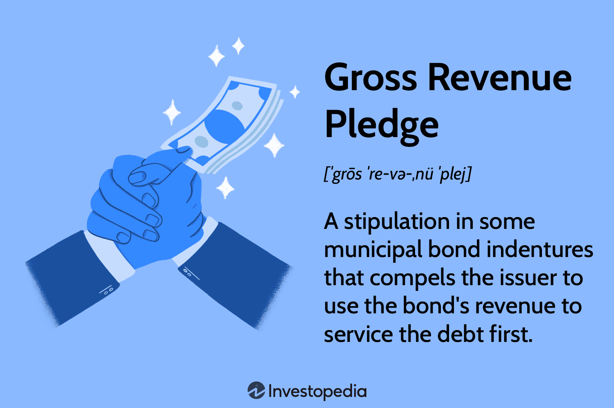

## Table of Contents

## What is Gross Revenue Pledge?

Gross Revenue Pledge is a way for a company or organization to promise to use all of its income to pay back a loan or bond. When a company takes out a loan or issues bonds, it might agree to use all the money it earns to make sure it can pay back what it owes. This means that before the company spends money on anything else, like salaries or other expenses, it first uses its total income to pay off the loan or bond.

This type of pledge is often used by public entities like cities or school districts when they need to borrow money for big projects. By promising to use all their income to repay the debt, these organizations can make lenders feel more secure about lending them money. This can help them get better loan terms or lower interest rates, making it easier for them to finance important projects like building new schools or improving public services.

## How does Gross Revenue Pledge differ from other types of pledges?

Gross Revenue Pledge is different from other pledges because it uses all the money a company or organization earns to pay back a loan or bond. Other types of pledges might only use a part of the income or focus on specific sources of revenue. For example, a Net Revenue Pledge might let the organization pay its expenses first and then use what's left to pay back the loan. This makes Gross Revenue Pledge stronger and more secure for lenders because they know they will get paid back before anything else.

Another type of pledge is the Special Revenue Pledge, which only uses income from certain activities or projects to pay back the debt. For instance, a city might use money from a new parking garage to pay back a loan used to build it. Unlike Gross Revenue Pledge, this type of pledge doesn't use all the organization's income, which can be riskier for lenders if the specific revenue source doesn't perform well. Gross Revenue Pledge, on the other hand, gives lenders a broader and more reliable source of repayment, making it a safer option for them.

## What are the key components of a Gross Revenue Pledge?

A Gross Revenue Pledge has a few key parts that make it work. The first part is the promise to use all the money earned to pay back a loan or bond. This means before spending on anything else, like salaries or other costs, the money goes towards paying off what is owed. This promise is important because it makes lenders feel more secure about giving money to the company or organization.

The second part is the agreement that outlines how the pledge will work. This includes details like how much money needs to be paid back, when payments are due, and what happens if the payments are not made on time. This agreement helps both the borrower and the lender know exactly what to expect, making the whole process clear and fair. By having these key parts, a Gross Revenue Pledge helps organizations borrow money more easily and at better rates.

## Who typically uses Gross Revenue Pledge and why?

Gross Revenue Pledge is often used by public organizations like cities, towns, and school districts. These groups use it when they need to borrow money for big projects, like building new schools, fixing roads, or improving public services. By promising to use all their income to pay back the loan, they can make lenders feel safer about lending them money. This helps them get better loan terms and lower interest rates, making it easier to finance important projects that help their communities.

The reason these public organizations choose Gross Revenue Pledge is because it's a strong way to show lenders they are serious about paying back the money. Lenders like it because it means they will get paid back before the organization spends money on anything else. This makes the loan less risky for the lender, so they are more willing to lend the money needed for important public projects.

## What are the advantages of using Gross Revenue Pledge for funding?

Using a Gross Revenue Pledge to get funding has big advantages. It makes lenders feel safer because they know they will get paid back first, before the organization spends money on anything else. This means the organization can often get better loan terms and lower interest rates. This is really helpful for public groups like cities or schools because it makes it easier for them to borrow money for important projects like building new schools or fixing roads.

Another big advantage is that it helps these groups show they are serious about paying back the money they borrow. By promising to use all their income to pay back the loan, they can build trust with lenders. This trust can lead to more funding options in the future, which is important for keeping their communities strong and improving public services.

## What are the potential risks or disadvantages of Gross Revenue Pledge?

Using a Gross Revenue Pledge can be risky for the organization borrowing the money. Since they have to use all their income to pay back the loan before spending on anything else, it can be hard to manage their money. If they don't earn enough, they might not have money left for important things like salaries or other bills. This can make it tough to keep running their operations smoothly and could even lead to financial trouble if they can't meet their other needs.

Another disadvantage is that it can limit the organization's flexibility. Because they have to pay back the loan first, they might not be able to use their money for new projects or unexpected costs. This can make it harder to respond to changes or take advantage of new opportunities. While Gross Revenue Pledge can help get better loan terms, it also comes with these challenges that the organization needs to think about carefully.

## How is the Gross Revenue Pledge structured in financial agreements?

In financial agreements, a Gross Revenue Pledge is set up as a promise by the borrower to use all their income to pay back a loan or bond before spending on anything else. This promise is written into the agreement, which includes details like how much money needs to be paid back, when payments are due, and what happens if payments are late. The agreement makes it clear that the lender will get paid first, which helps the lender feel more secure about giving money to the borrower.

The structure of the Gross Revenue Pledge also includes rules about how the borrower can use their money. Since all income must go towards paying back the loan first, the borrower needs to be careful about managing their finances. This means they have to plan well to make sure they have enough money left for other important costs like salaries and bills. By having these rules in place, the Gross Revenue Pledge helps the borrower get better loan terms, but it also means they need to be very careful with their money.

## What legal considerations should be taken into account with a Gross Revenue Pledge?

When using a Gross Revenue Pledge, it's important to think about the legal rules that come with it. The pledge needs to be written in a way that follows the laws of the place where the borrower is. This means the agreement has to be clear and fair, and it needs to say exactly how the money will be used to pay back the loan. If the agreement isn't written right, it could cause problems later, like disagreements between the borrower and the lender.

Another legal thing to think about is what happens if the borrower can't pay back the loan. The agreement should explain what steps the lender can take, like taking over the borrower's money or assets. It's also important to make sure the pledge doesn't break any other rules or laws, like those about how public money can be used. By thinking about these legal points carefully, the borrower can avoid big problems and make sure the Gross Revenue Pledge works well for everyone involved.

## Can you provide a case study or example where Gross Revenue Pledge was successfully implemented?

In 2010, the city of Denver, Colorado, used a Gross Revenue Pledge to borrow money for a big project to fix and improve their water system. They promised to use all the money they made from water bills to pay back the loan before spending on anything else. This made lenders feel safe about lending them the money because they knew they would get paid back first. Because of this, Denver got good loan terms with a low [interest rate](/wiki/interest-rate-trading-strategies), which helped them save money while they worked on making their water system better.

The project was a success because Denver was able to use the money to fix old pipes and build new water treatment plants. This made the water system work better and helped keep the water clean for people in the city. By using the Gross Revenue Pledge, Denver showed they were serious about paying back the loan, and this helped them get the money they needed for a project that was important for their community.

## How do you calculate the amount pledged under a Gross Revenue Pledge?

To calculate the amount pledged under a Gross Revenue Pledge, you start by looking at all the money the organization earns. This includes everything they make from selling things, services, or any other sources of income. The total amount of this income is what they promise to use to pay back the loan or bond. So, if a city makes $10 million from water bills in a year, that's the amount they would pledge to pay back their loan.

The next step is to figure out how much of this pledged amount needs to go towards the loan payments each time they are due. This depends on the terms of the loan, like how much they borrowed and the interest rate. For example, if they need to pay $1 million every month, they would use $1 million from the $10 million they earned from water bills to make that payment. This way, they make sure they are using all their income to pay back the loan before spending on anything else.

## What impact does Gross Revenue Pledge have on an organization's financial reporting and auditing?

When an organization uses a Gross Revenue Pledge, it changes how they report their money. They have to show in their financial reports that all their income is being used to pay back a loan or bond before anything else. This means they need to keep good records of all the money they make and how much of it goes towards the loan. It's important for them to be clear and honest in their reports so lenders and others can see that they are following the pledge.

This pledge also affects how the organization is audited. Auditors will look closely at the organization's money to make sure they are using all their income to pay back the loan first. They will check the records to see if the organization is doing what they promised in the pledge. If the auditors find any problems, it could cause trouble for the organization, so it's important for them to keep everything in order and be ready for the audit.

## How might future trends affect the use of Gross Revenue Pledge in financial strategies?

Future trends might change how organizations use Gross Revenue Pledge. As more businesses and public groups focus on being sustainable and responsible, they might use Gross Revenue Pledge to show they are serious about paying back their loans. This can help them get money for projects that help the environment or improve their communities. Also, with new technology, it might be easier to keep track of all the money coming in and going out, making it simpler to use Gross Revenue Pledge.

On the other hand, if interest rates go up or the economy changes a lot, organizations might be more careful about using Gross Revenue Pledge. They might worry about having enough money left over for other important things after paying back the loan. But if they can still get good loan terms with Gross Revenue Pledge, they might keep using it, especially for big projects that need a lot of money. Overall, future trends will likely affect how often and why organizations choose to use Gross Revenue Pledge in their financial plans.

## References & Further Reading

[1]: Bergstra, J., Bardenet, R., Bengio, Y., & Kégl, B. (2011). ["Algorithms for Hyper-Parameter Optimization."](https://dl.acm.org/doi/10.5555/2986459.2986743) Advances in Neural Information Processing Systems 24.

[2]: ["Advances in Financial Machine Learning"](https://www.amazon.com/Advances-Financial-Machine-Learning-Marcos/dp/1119482089) by Marcos Lopez de Prado.

[3]: ["Evidence-Based Technical Analysis: Applying the Scientific Method and Statistical Inference to Trading Signals"](https://www.amazon.com/Evidence-Based-Technical-Analysis-Scientific-Statistical/dp/0470008741) by David Aronson.

[4]: ["Machine Learning for Algorithmic Trading"](https://github.com/stefan-jansen/machine-learning-for-trading) by Stefan Jansen.

[5]: ["Quantitative Trading: How to Build Your Own Algorithmic Trading Business"](https://www.amazon.com/Quantitative-Trading-Build-Algorithmic-Business/dp/1119800064) by Ernest P. Chan.